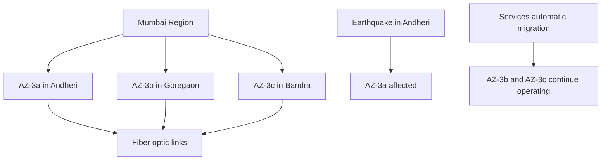

# Session 09: AWS Quick Revision

| Section | Description |
|---------|-------------|
| [Overview](#overview) | Brief review of the revision session covering core AWS concepts from previous sessions |
| [Learning Portal Access](#learning-portal-access) | How to access AWS training materials, summaries, and recordings |
| [Session 1 Revision: Cloud Computing Fundamentals](#session-1-revision-cloud-computing-fundamentals) | India Cloud First Policy, Benefits of cloud computing, and Global Infrastructure |
| [Session 2 Revision: EC2 Instance Launch](#session-2-revision-ec2-instance-launch) | Different ways to launch operating systems and step-by-step EC2 deployment |
| [Session 3 Revision: Working with EC2](#session-3-revision-working-with-ec2) | Connecting to EC2 instances, SOCKS proxy configuration, and AWS Global Infrastructure |
| [Summary](#summary) | Key takeaways, code references, and expert insights |

## Overview

This revision session provides a comprehensive review of core AWS concepts covered in Sessions 1-3 of the cloud enablement training. The instructor starts with guidance on accessing learning materials through the portal, then systematically reviews fundamental cloud computing concepts, EC2 instance deployment, and practical applications including SOCKS proxy setup for network proxying.

## Learning Portal Access

### Portal Structure
Access the learning portal at learning.hirt.com using your registered email ID from course purchase.

### Available Content
- **Session Summaries**: Download detailed PDF documents for each session
- **Video Recordings**: Access complete class recordings (limited availability: 1-2 recordings per month for makeups)
- **Screenshots**: Step-by-step visual guides for practical demonstrations
- **Program Access**: Search for "AWS Cloud Enablement Course" in courses section

### Content Coverage
- All sessions covered in these summaries are uploaded to the portal
- Serverless module recordings are actively being added
- Summaries assisted in practical implementation during learning

## Session 1 Revision: Cloud Computing Fundamentals

### India Cloud First Policy
Initiated as part of India's 5 trillion USD economy goal during COVID pandemic era.


**Evolution Triggers:**
- Work-from-home culture due to COVID pandemic
- Exponential growth in online services (e-commerce, streaming, delivery apps)
- Mandatory data storage requirements
- Sudden demand spikes requiring scalable infrastructure

### Cloud Computing Benefits

> [!IMPORTANT]
> Cloud computing enables pay-as-you-go resource utilization without upfront capital investment.

**Cost Optimization:**
```diff
- Traditional Approach: Buy 1 server for ₹100,000 + maintenance + monitoring
+ Cloud Approach: Access unlimited resources, pay only for usage
```

**Pay-Per-Use Model:**
```diff
+ Resource Consumption: 10GB RAM × 24 hours = Calculate & charge exactly what you used
- Traditional: Pay for 100GB capacity even when using 10GB
```

### Data Centers vs. Cloud

| Aspect | Traditional Data Centers | AWS Cloud |
|--------|------------------------|-----------|
| Location | Company-owned infrastructure | Globally distributed (65+ regions) |
| Scaling | Limited by physical hardware | Unlimited scaling via API calls |
| Management | Full operational responsibility | AWS handles all infrastructure |
| Access Control | Physical security + network policies | IAM roles, security groups, VPCs |

### Availability Zones Design

**Critical Design Principles:**
- **Physical Separation**: AZs are geographically dispersed within a region to prevent single-point failures
- **Fault Isolation**: Natural disasters affecting one AZ don't impact others in the same region
- **Redundant Connectivity**: Multiple fiber optic connections between AZs

**Mumbai Region Example:**


**Disaster Recovery Assurance:**
- **SLA**: Up to 99.999% uptime through multi-AZ replication
- **Data Protection**: Critical data automatically replicated across AZs
- **Zero Downtime**: No service interruption even during disasters

## Session 2 Revision: EC2 Instance Launch

### Operating System Launch Methods

**Traditional Approaches:**

1. **Bare Metal Deployment**
```bash
# Physical hardware allocation
CPU: 4 cores
RAM: 16GB
Storage: 500GB SSD
OS Installation: Manual setup
```

2. **Virtualization**
```bash
# VMware Workstation example
VM Name: UbuntuServer
RAM: 4GB
Storage: 50GB
Network: VirutalBox network adapter
```

**Cloud Advantages:**
```diff
+ Instant deployment (seconds vs hours)
+ Unlimited scaling capabilities
+ Pre-configured defaults
+ Pay-per-usage billing
```

### AMI Configuration

**Amazon Linux Benefits:**
```diff
+ Pre-optimized for AWS services
+ Additional capabilities (EC2 Instance Connect)
+ Faster startup times
+ Enhanced security features
```

**Available Options:**
- Amazon Linux 2/2023 (recommended)
- Ubuntu 22.04 LTS
- Red Hat Enterprise Linux
- Windows Server 2022
- SUSE Linux Enterprise Server

### Instance Type Selection

**Common Categories:**

| Category | Use Case | Example Instance |
|----------|----------|------------------|
| General Purpose | Balanced resources for web apps, databases | t3.medium |
| Compute Optimized | CPU-intensive tasks | c6i.large |
| Memory Optimized | RAM-intensive applications | r6i.xlarge |
| Storage Optimized | High I/O requirements | i4i.large |
| GPU Instances | ML training, graphics rendering | g5.xlarge |

**Pricing Example:**
```bash
t3.micro: $0.0104/hour (Free tier eligible)
c6i.32xlarge: $4.352/hour
```

### Key Pair Management

**Creation Steps:**
```bash
# Generate SSH key pair
ssh-keygen -t rsa -b 2048 -f my-aws-key -C "user@aws-account"
```

**Naming Convention (Best Practice):**
```diff
+ Recommended: newkeypair-mumbai-region.pem
- Avoid: key1.pem (confusing when working across regions)
```

**Storage Security:**
- Download `.pem` file immediately
- Store securely with restricted permissions
- Use per-region key pairs

**Secure Permissions:**
```bash
chmod 400 newkeypair-mumbai-region.pem
```

### Security Group Configuration

**Initial Settings:**
| Property | Default Value | Purpose |
|----------|---------------|---------|
| Name | launch-wizard-X | Auto-generated identifier |
| Description | Security Group created by EC2 launch wizard | Purpose documentation |
| Inbound Rules | SSH (22) from 0.0.0.0/0 | Unrestricted SSH access |

**Access Control Strategies:**

1. **Restrictive Access:**
```diff
- Protocol: SSH (22)
- Source Type: Anywhere-IPv4 → Custom
- Source IP: 203.0.113.25/32
+ Result: Only your IP can connect
```

2. **CIDR Block Access:**
```diff
+ Protocol: HTTP (80), HTTPS (443)
+ Source: 192.168.0.0/24
+ Result: Office network access only
```

### Connection Methods

**Browser-Based Connection:**
```diff
+ Advantages: No local SSH setup required
+ Use case: Learning environments, quick access
- Limitations: Amazon Linux only (2023 images)
+ Method: EC2 Console → Actions → Connect → EC2 Instance Connect
```

**SSH Command Format:**
```bash
ssh -i "newkeypair-mumbai-region.pem" ec2-user@ec2-54-123-45-67.ap-south-1.compute.amazonaws.com
```

**Key Components:**
- `-i`: Specifies private key file path
- `ec2-user`: Default Amazon Linux username
- Public IPv4 address from EC2 console
- Domain automatically generated by AWS

## Session 3 Revision: Working with EC2

### Connection Protocols

**Web Browser Access:**
```diff
+ User Interface: GUI available via EC2 Instance Connect
+ Authentication: Automatic via AWS IAM credentials
+ Limitations: Amazon Linux only (as of 2023)
```

**SSH Terminal Access:**
```diff
+ Universal Support: Works with all Linux instances
+ Authentication Method: SSH key pairs
+ Required Tools: SSH client or Git Bash on Windows
```

### SOCKS Proxy Configuration

**Purpose:**
- Route internet traffic through remote EC2 instance
- Hide original IP address
- Access geo-restricted content
- Maintain privacy for browsing activities

**Step-by-Step Setup:**

1. **Launch SSH Tunnel:**
```bash
# Create local SOCKS proxy on port 9090
ssh -D 9090 -i "key.pem" ec2-user@<EC2-PUBLIC-IP>

# Command breakdown:
# -D: Dynamic tunnel (SOCKS proxy) on local port 9090
# -i: Private key file for authentication
# ec2-user@<IP>: Instance connection details
```

2. **Configure Browser:**
```bash
# Chrome launch command with SOCKS proxy
"C:\Program Files\Google\Chrome\Application\chrome.exe" --proxy-server="socks5://127.0.0.1:9090"

# Alternative Firefox configuration:
# Preferences → Network Settings → Manual proxy
# SOCKS Host: 127.0.0.1
# Port: 9090
```

**Traffic Flow:**
```diff
! Your Browser → SOCKS Proxy (Local 9090) → SSH Tunnel → EC2 Instance → Target Website
! Original IP: Hidden → Public IP: EC2 Instance IP
```

**Verification:**
```diff
+ WhatIsMyIP check: Shows EC2 instance location
- Original IP location: Hidden from services
+ Geo-blocking bypass: Access region-restricted content
```

### AWS Global Infrastructure

**Regional Organization:**
- **Regions**: Geographic areas (Mumbai, Singapore, Oregon)
- **Availability Zones**: Physical data centers within regions
- **Edge Locations**: Global CDN points for low-latency delivery

**Inter-Regional Connectivity:**
```diff
+ AWS Backend Network: High-speed dedicated fibers
+ Private Links: Region-to-region secure connections
+ Billing Impact: Data transfer charges for cross-region traffic
```

## Lab Demos

### EC2 Instance Launch Process

```bash
# 1. Access EC2 Dashboard
console.aws.amazon.com/ec2

# 2. Launch Instance Wizard
Launch Instance → AMI Selection → Instance Type →
Key Pair → Security Group → Launch Settings
```

### SSH Connection Setup

```bash
# Linux/Mac
chmod 400 key.pem
ssh -i "key.pem" ec2-user@ec2-xxx-xxx-xxx.compute.amazonaws.com

# Windows (Git Bash)
# Install Git Bash first
ssh -i "key.pem" ec2-user@ec2-xxx-xxx-xxx.compute.amazonaws.com
```

### SOCKS Proxy Demonstration

```bash
# Terminal Command Sequence
ssh -D 9090 -i "mumbai-key.pem" ec2-user@ec2-13-234-56-78.ap-south-1.compute.amazonaws.com
# Keep terminal open (tunnel active)

# New Terminal/Command Prompt - Launch Chrome with proxy
"C:\Program Files\Google\Chrome\Application\chrome.exe" --proxy-server="socks5://127.0.0.1:9090"
```

## Summary

### Key Takeaways

```diff
+ Cloud computing eliminates upfront infrastructure costs and provides unlimited scaling
+ AWS availability zones prevent single points of failure through geographic distribution
+ EC2 instances can be launched in seconds with pre-configured AMIs
+ Security groups control access using IP addresses and protocols
+ SOCKS proxy enables routing internet traffic through remote EC2 instances
+ AWS global infrastructure provides worldwide service delivery with regional redundancy
```

### Quick Reference

**Essential Commands:**
```bash
# SSH Connection (Linux/Mac/Windows)
ssh -i "your-key.pem" ec2-user@ec2-public-ip

# SOCKS Proxy Tunnel
ssh -D 9090 -i "key.pem" ec2-user@ec2-public-ip

# Browser with SOCKS Proxy
chrome.exe --proxy-server="socks5://127.0.0.1:9090"

# Key Pair Permissions
chmod 400 your-key.pem
```

**Instance Types Cheat Sheet:**
- `t3.micro`: Free tier, 1 vCPU, 1GB RAM, testing/learning
- `t3.medium`: 2 vCPU, 4GB RAM, small web applications
- `c6i.large`: 2 vCPU, 4GB RAM, compute-intensive tasks

**Region Abbreviations:**
- US East: us-east-1, us-east-2
- US West: us-west-1, us-west-2
- Asia Pacific: ap-south-1 (Mumbai), ap-southeast-1 (Singapore)

**Security Group Rules:**
```yaml
Inbound Rules:
  - ipProtocol: tcp
    fromPort: 22
    toPort: 22
    cidrIpv4: 0.0.0.0/0    # SSH access
  - ipProtocol: tcp
    fromPort: 80
    toPort: 80
    cidrIpv4: 0.0.0.0/0    # HTTP web access
  - ipProtocol: tcp
    fromPort: 443
    toPort: 443
    cidrIpv4: 0.0.0.0/0    # HTTPS web access
```

### Expert Insight

#### Real-world Application

**Multi-AZ Production Deployment:**
When deploying critical applications like e-commerce platforms, always configure resources across multiple availability zones using Elastic Load Balancers. This ensures 99.999% uptime even during regional infrastructure outages.

**Cost Optimization Strategy:**
Use reserved instances for predictable workloads and spot instances for batch processing. Implement auto-scaling groups to adjust instance counts based on traffic patterns, reducing costs during low-usage periods.

**Security Best Practices:**
Implement principle of least privilege by creating separate security groups per application tier. Use network ACLs for additional layer of protection, and enable VPC flow logs for comprehensive network monitoring.

#### Expert Path

**AWS Infrastructure Skills Development:**
- Master CloudFormation templates for infrastructure as code
- Learn Terraform for multi-cloud deployments
- Deep dive into VPC design patterns and hybrid cloud architectures
- Explore Route 53 for global traffic management

**Monitoring and Optimization:**
- Implement CloudWatch dashboards for operational visibility
- Use AWS Trusted Advisor for cost, security, and performance recommendations
- Master AWS Config for configuration compliance
- Learn X-Ray for distributed application tracing

#### Common Pitfalls

**Security Misconfigurations:**
- Avoid opening SSH (port 22) to 0.0.0.0/0 in production
- Never store credentials in EC2 instance storage
- Regularly rotate IAM access keys and passwords

**Availability Zone Assumptions:**
- Don't launch all resources in single availability zone
- Plan for regional disasters by replicating critical data
- Test failover procedures regularly

**Cost Management Issues:**
- Monitor resource usage to prevent unexpected bills
- Use tagging strategies for cost allocation
- Set up billing alerts before running test workloads

#### Lesser-Known Facts

**AWS Network Architecture:**
AWS builds its own custom networking equipment and has deployed the world's largest fiber optic network. The AWS backbone uses 100 Gbps connections between regions, faster than most internet connections.

**EC2 Instance Root Cause:**
EC2 instances run on Xen hypervisor but AWS developed their own "Nitro" hypervisor for better performance and security, though externally it appears identical to regular Xen instances.

**Region Selection Impact:**
The `us-east-1` region (Northern Virginia) is the first AWS region and contains most AWS services. However, it lacks certain specialized services only available in newer regions.

**SOCKS5 Protocol Details:**
The SOCKS proxy discussed uses SOCKS5 (RFC 1928), which supports IPv6, authentication, and UDP traffic - features that make it protocol-independent unlike HTTP proxies.

---

| Advantages | Disadvantages |
|------------|----------------|
| Zero upfront capital investment | Complex learning curve initially |
| Unlimited scaling capabilities | Vendor lock-in potential |
| Pay-per-usage billing model | Security responsibility shared |
| 24/7 global availability | Internet dependency |
| Built-in redundancy | Requires network skills for optimization |
