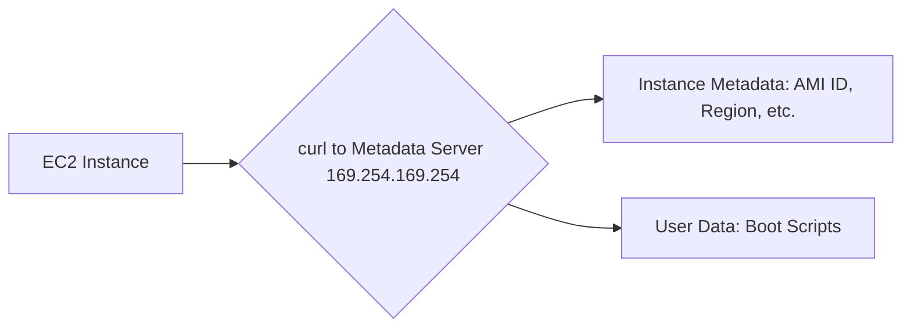

# Session 011: EC2 Automation with Cloud-Init and User Data

## Table of Contents
- [Overview](#overview)
- [Why Automate EC2 Configurations](#why-automate-ec2-configurations)
- [Configuration Management Approaches](#configuration-management-approaches)
- [Cloud-Init Service](#cloud-init-service)
- [AMI and Cloud Images](#ami-and-cloud-images)
- [Metadata Server](#metadata-server)
- [User Data for Boot-Time Setup](#user-data-for-boot-time-setup)
- [Retrieving Metadata from Inside EC2](#retrieving-metadata-from-inside-ec2)
- [Modifying User Data](#modifying-user-data)
- [Challenges and Solutions with User Data](#challenges-and-solutions-with-user-data)
- [Demos and Practical Examples](#demos-and-practical-examples)
- [Lab Demos](#lab-demos)
- [Troubleshooting Cloud-Init](#troubleshooting-cloud-init)
- [Advanced User Data with Multi-Part Scripts](#advanced-user-data-with-multi-part-scripts)
- [Q&A Summary](#qa-summary)
- [Summary](#summary)

## Overview
This session focuses on automating configurations within EC2 instances using AWS services like System Manager (briefly referenced from previous session) and the cloud-native concept of Cloud-Init. We explore boot-time setup through user data, metadata retrieval, and the architectural details behind metadata servers. The session demonstrates practical scenarios, troubleshooting, and advanced scripting for consistent EC2 automation in production environments.

## Why Automate EC2 Configurations
EC2 provides virtual machines (instances) for running services. However, after launching an OS, configuration is required (e.g., installing software, creating files, setting up web pages). Configuration management is essential for:
- Installing packages
- Creating directories and files
- Setting up services (databases, web apps, etc.)
- Ensuring services are running before proceeding

Manual configuration via SSH works for single instances but scales poorly for hundreds of systems. This session builds on System Manager from the last class, introducing Cloud-Init for automated, boot-time setup.

## Configuration Management Approaches
### Manual Configuration
- Login via SSH after OS launch and boot
- Suitable for occasional or single-instance changes
- Example: SSH into EC2, create folder `/etc/newfolder`

### Centralized Management (System Manager)
- Use AWS System Manager for fleet management
- Connect to running instances remotely
- Scale to hundreds of systems via SSM Agent
- Example: Use SSM to run commands across multiple EC2 instances

### Cloud-Init for Boot-Time Automation
- Configures OS during boot process (before full login)
- Performed pre-launch via user data
- Ideal when configurations depend on boot order or must occur before OS fully starts

## Cloud-Init Service
Cloud-Init is an open-source tool for multi-cloud OS initialization. In AWS:
- Runs automatically during EC2 boot
- Contacts metadata server for scripts/commands
- Executes downloaded instructions (shell, Python, etc.)
- Platform-agnostic, supporting AWS, Azure, OpenStack, etc.

> [!IMPORTANT]  
> Cloud-Init runs during boot (OS starting up), not after login.

## AMI and Cloud Images
AMI (Amazon Machine Image) is a bootable OS image, similar to a DVD for physical hardware.
- Contains base OS + pre-installed software
- Launch EC2 instances from AMIs (e.g., Amazon Linux, Red Hat)
- Cloud-Init is pre-installed in cloud-compatible AMIs ("cloud images")

Without a software in AMI, manual installation is required. AMIs ensure consistent starting points.

## Metadata Server
AWS maintains per-instance metadata servers:
- IP: `169.254.169.254` (link-local, accessible only from instance)
- Stores instance-specific data (e.g., region, instance type, AMI ID, public IP)
- Houses user data (boot scripts)
- Accessible via HTTP using `curl` from inside the instance

Purpose: Provide self-describing information to running instances, avoiding external dependencies.



## User Data for Boot-Time Setup
User data is a section in EC2 launch configuration for boot-time scripts.
- Accessible during launch or post-launch (requires instance stop)
- Stored in metadata server under `/user-data` path
- Executed once by default (first boot only)
- Supports scripts in Bash, Python, etc.

Example: Launch EC2 with user data to create a folder.

## Retrieving Metadata from Inside EC2
From within EC2, use `curl` to query metadata:
- Public IP: `curl http://169.254.169.254/latest/meta-data/public-ipv4`
- Private IP: `curl http://169.254.169.254/latest/meta-data/local-ipv4`
- Region: `curl http://169.254.169.254/latest/meta-data/placement/availability-zone | sed 's/[a-z]$//'`
- Instance ID: `curl http://169.254.169.254/latest/meta-data/instance-id`

User data retrieval: `curl http://169.254.169.254/latest/user-data`

This enables applications to adapt (e.g., regionalize content, retrieve network info).

## Modifying User Data
User data can be edited post-launch via EC2 console:
1. Stop instance
2. Navigate: Actions > Instance Settings > Edit User Data
3. Update scripts
4. Start instance (retriggers boot and Cloud-Init)

However, changes require reboot, and Cloud-Init runs scripts only on first boot unless specified.

## Challenges and Solutions with User Data
### Once-Only Execution
Cloud-Init downloads and executes user data only on first boot. Subsequent boots skip this unless configured for "always" mode.

**Solution:** Use multi-part Cloud-Init scripts with `cloud-config` and `#cloud-config` modules to specify `runcmd` with `frequency: always`.

### Data Type Headers
Direct commands without headers are treated as plain text, causing failures. Add MIME-like headers:
- `#cloud-config` for Cloud-Config YAML
- `#!/bin/bash` for shell scripts

For multi-language or complex scripts, combine sections.

### Debugging Failures
- Check `/var/log/cloud-init.log` for errors
- Examples: Invalid syntax, missing interpreters
- Restart instance after fixes (if needed)

## Lab Demos
1. **Launch EC2 with Basic User Data**
   - Create folder `/newfolder` via user data
   - Verify creation post-launch

2. **Retrieve Metadata**
   - SSH into instance
   - Use `curl` commands to fetch instance details

3. **Modify User Data for Second Boot**
   - Stop instance, edit user data, restart
   - Note: Scripts run only on first boot unless configured

4. **Tro ubleshooting Script Failures**
   - Launch with plain text commands (no headers)
   - Observe errors in Cloud-Init logs

## Troubleshooting Cloud-Init
- **Logs:** `/var/log/cloud-init-output.log` (detailed execution)
- **Errors:** Syntax issues, permission denies (e.g., `sudo su` in scripts)
- **Best Practices:** Use proper script syntax, test scripts locally first
- **Comparison to rc.local:** Cloud-Init runs at boot (pre-login), supports advanced features beyond rc.local

## Advanced User Data with Multi-Part Scripts
For complex setups allowing execution on every boot:

```yaml
#cloud-config
#cloud-config

runcmd:
  - mkdir -p /updated_folder  # Example command
  - echo "Config applied" > /config.log
```

This uses Cloud-Config (YAML) + shell scripts, enabling:
- Frequency control (always, once)
- Module loading (e.g., package installation)
- Multi-language execution

Available at: [Cloud-Init Official Docs](https://cloudinit.readthedocs.io/)

## Q&A Summary
- **User Data Execution Timing:** Only during boot (while OS starts), not pre-launch or post-login.
- **Boot/Stop Delays:** OS-dependent; AWS hardware is fast, but scripts vary.
- **Metadata/User Data Difference:** Metadata = AWS-managed instance info; User Data = customer-provided scripts.
- **Cloud-Init vs. Bash RC:** Cloud-Init supports advanced features and runs pre-login; bashrc post-login.
- **Always Execution:** Use `frequency: always` in Cloud-Config for every-boot runs.
- **Batch Services:** May discuss in future sessions if relevant.
- **Kafka/OpenStack Training:** Refer to dedicated courses or team for links.

## Summary
### Key Takeaways
```diff
+ Cloud-Init enables boot-time automation across multi-cloud environments.
+ User data stores scripts executed only on first boot unless configured otherwise.
+ Metadata server (169.254.169.254) provides instance metadata and user data via HTTP.
! Metadata and user data are per-instance and inaccessible externally.
- Direct commands without headers fail; use proper script syntax.
! Always test scripts and verify Cloud-Init logs for debugging.
```

### Quick Reference
- **Metadata Server IP:** `169.254.169.254`
- **Fetch Public IP:** `curl http://169.254.169.254/latest/meta-data/public-ipv4`
- **Fetch User Data:** `curl http://169.254.169.254/latest/user-data`
- **Cloud-Init Logs:** `/var/log/cloud-init.log`, `/var/log/cloud-init-output.log`
- **Always-Run Script Example:**
  ```yaml
  #cloud-config
  runcmd:
    - mkdir /always_run_folder
  ```
- **Bash User Data Header:** `#!/bin/bash`

### Expert Insight
**Real-world Application:**  
In enterprises, user data automates security hardening (e.g., installing antivirus, downloading policies on boot). Metadata enables region-specific app behavior, like tailored greetings or compliance checks based on AZ/region.

**Expert Path:**  
Master Cloud-Init by exploring its module ecosystem (packages, users, files). Integrate with automation tools like Ansible or Terraform for IaC-based EC2 provisioning. Practice multi-part scripts for complex stacks.

**Common Pitfalls:**  
- Forgetting headers: Always specify `#cloud-config` or `#!/bin/bash` to avoid text-treatment failures.  
- Assuming persistent execution: Remember default once-only behavior—use `runcmd` with frequency settings.  
- Permissions in scripts: Avoid `sudo su`; use direct commands or ensure proper user contexts.  

**Lesser-Known Facts:**  
- Cloud images include Cloud-Init pre-installed, unlike generic OS images.  
- Metadata is cached locally post-first boot for faster access.  
- Cloud-Init supports cloud-specific modules (e.g., AWS IAM role attachment via user data).  

Advantage: Eliminates manual post-launch config, reducing errors in autoscaling groups.  
Disadvantage: Errors in user data halt boot; limited debugging post-launch without instance stop/restart.
