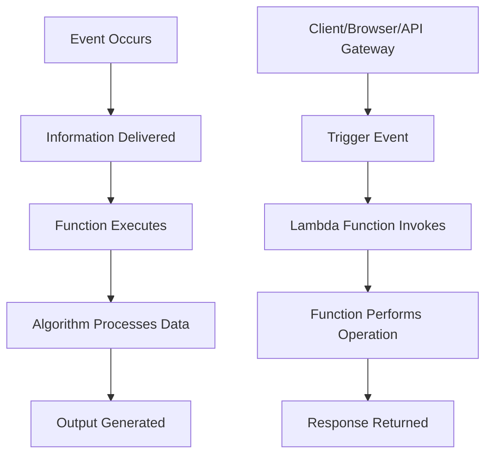
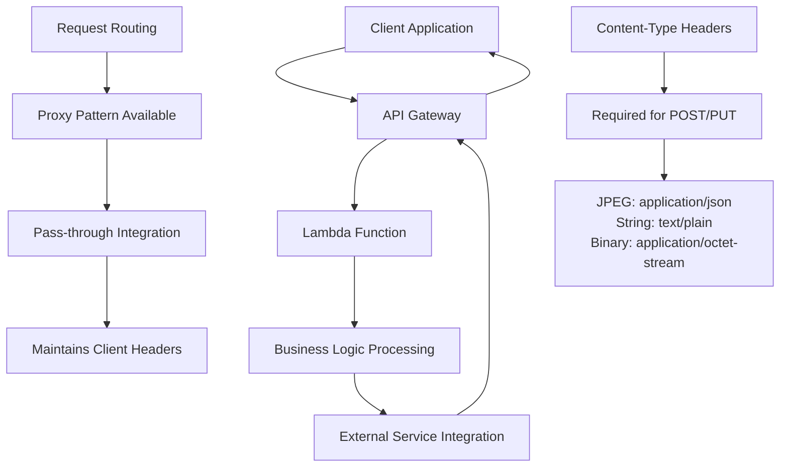
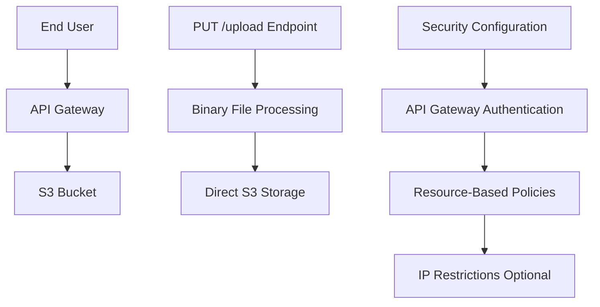

```markdown
# Session 12: API Gateway Deep Dive and Data Passing Methods

## Table of Contents

- [Overview](#overview)
- [Serverless Recap and Concepts](#serverless-recap-and-concepts)
- [HTTP Methods and Data Passing Techniques](#http-methods-and-data-passing-techniques)
- [API Gateway Integrations](#api-gateway-integrations)
- [Testing APIs with Postman](#testing-apis-with-postman)
- [Path Parameters](#path-parameters)
- [S3 File Upload Use Case](#s3-file-upload-use-case)
- [Summary](#summary)

## Overview

This session deepens our understanding of serverless architecture by focusing on advanced features of AWS API Gateway and AWS Lambda function integration. We explore various HTTP methods for data transmission, integration patterns between client applications and serverless backends, and practical implementations including third-party API testing tools. The session emphasizes how microservices principles apply to serverless functions, where each function handles a single, well-defined purpose.

## Serverless Recap and Concepts

### Serverless as Function-as-a-Service

Serverless computing provides on-demand capacity without permanent server provisioning. In AWS, AWS Lambda serves as the primary Function-as-a-Service (FaaS) platform, executing code in response to events.

#### Single Functionality Programs

Programs designed for one specific task align with microservices principles, where each service focuses on a discrete functionality:

- **Example Services**: Data processing, text-to-speech conversion, image manipulation, or streaming data analysis
- **Event-Driven Execution**: Functions activate only when triggered, eliminating continuous resource consumption

### Event Information Flow

The architecture follows a consistent pattern:



**Key Components**:
- **Event Information**: Data payload triggering the function
- **Algorithm**: Program logic executed on input data
- **Output**: Result returned to the requestor

### Supporting Services

Cloud platforms offer analogous services:
- AWS: Lambda (FaaS throughout)
- Azure: Azure Functions
- GCP: Cloud Functions

**NOTE**: AWS Lambda integrates seamlessly with other AWS services via IAM roles and policies.

### HTTP Methods and Data Transmission

HTTP methods define client-server request types, each serving specific data transmission purposes.

#### GET Method
- **Purpose**: Retrieve/read data from server
- **Data Passing**: Primarily through URL query strings
- **Browser Compatibility**: Native browser support for hyperlink requests

**Example Use Cases**:
- Wikipedia article retrieval
- Google search with query parameters
- API resource listing

#### POST Method
- **Purpose**: Send data to server for processing
- **Data Passing**: Multiple techniques supported
- **Browser Limitations**: Requires forms or specialized tools for complex data submission

### Data Transmission Techniques

Clients employ various strategies to transmit data to serverless functions via API Gateway.

#### Query String Parameters (GET Method)

Query strings append data to URLs in key-value format:

```
https://api.example.com/search?q=linux&category=servers
```

**Characteristics**:
- **Visibility**: Data visible in browser URL/address bar
- **Limitation**: Potentially sensitive information may appear in history/bookmarks
- **Browser Support**: Native HTML links and forms support this method

```bash
# Example API call with query string
curl "https://your-api-gateway-url?q=linux&city=jaipur"
```

#### Form Data (POST Method - URL Encoded)

Standard web application data submission method:

```bash
# Example form data structure
username=john&password=secret&email=john@example.com
```

**Characteristics**:
- **Usage**: Primary method for end-user web applications
- **Security**: Data not visible in URL (transmitted in HTTP body)
- **Browser Support**: Native HTML form submission

#### Raw/Post Data (POST Method - Row Format)

Machine-to-machine data transmission, commonly used in service integrations:

```json
{
  "name": "John Doe",
  "phone": "12345",
  "city": "Jaipur"
}
```

**Characteristics**:
- **Service Integration**: Preferred for microservices communication
- **Format**: JSON most common, supports other formats (XML, plain text)
- **Use Cases**: Server-to-server communication, avoiding browser-based workflows

#### PUT Method for File Uploads

Intended for binary file transmissions (images, videos, documents):

```bash
# PUT request with binary file
curl -X PUT -H "Content-Type: image/png" --data-binary @photo.png https://api-gateway-url/upload/photo.png
```

**Characteristics**:
- **Content Types**: Supports binary data (images, videos, audio)
- **HTTP Specification**: Designed for resource creation/updates with full data payloads

### Client Types and Preferred Methods

| Client Type | Preferred Method | Data Format | Security |
|-------------|------------------|-------------|----------|
| End Users (Browsers) | GET (reading) | Query strings | URL visible |
| End Users (Forms) | POST | URL encoded form data | Body hidden |
| Services/Microservices | POST/PUT | JSON/raw data | Body secure |
| File Upload Clients | PUT | Binary data | Headers specify |

**WARNING**: GET methods visible in URLs should avoid sensitive data transmission.

## API Gateway Integrations

API Gateway acts as an intermediary between clients and Lambda functions, managing request routing and response handling.

### Gateways in Serverless Architecture



### Integration Patterns

#### Regular Integration

API Gateway establishes separate connections:
- Client request routed through API Gateway
- Gateway terminates client connection
- New connection initiated to backend (Lambda/EC2/S3)
- Response routed back through Gateway

**Limitation**: Client headers may not reach backend services

#### Lambda Proxy Integration (Pass-through)

API Gateway preserves complete client context:
- All client headers, query parameters, and body transmitted intact
- Lambda receives complete event payload
- Enables full data access within Lambda functions
- Essential for data-dependent operations

**Configuration Requirement**: Set API Gateway integration type to "Lambda Proxy"

### IAM Permissions Management

Successful integration requires appropriate IAM roles:
- API Gateway assumes roles to invoke Lambda functions
- Automatic role creation occurs during initial setup
- Permissions extend to cross-service integrations (S3, DynamoDB, etc.)

**Achievement**: Lambda proxy enables complete client data preservation, crucial for comprehensive application functionality.

## Testing APIs with Postman

Industry-standard API testing tool supporting full REST API client capabilities.

### Environmental Setup

**Installation**: Free download available for Windows, Linux, macOS from Postman's official website

### Interface Components

#### Collection Management

Organize test requests in structured folders:

1. Create new collection for project grouping
2. Establish sub-collections for logical request groupings
3. Add descriptive names for future reference

#### Request Configuration

**Request Structure**:
- **Method Selection**: Dropdown supporting GET, POST, PUT, DELETE, etc.
- **URL Input**: API Gateway endpoint specification
- **Query Parameters**: Key-value pairs for GET request data
- **Request Body**: JSON/text/binary data for POST/PUT operations

#### Authentication Headers

Specify content expectations:

```json
{
  "Content-Type": "application/json"
}
```

### Lambda Proxy Event Analysis

Lambda functions receive comprehensive event payloads containing:

- **Client Metadata**: IP addresses, user agents, browser information
- **Request Details**: HTTP method, headers, query parameters
- **Body Content**: Form data, JSON payloads, or file content

**CloudWatch Logging**: Event data automatically stored for debugging and monitoring

### Method-Based Testing Scenarios

#### GET Request Testing
- Direct URL access for simple retrieval
- Query string parameter validation
- Status code and response header verification

#### POST Request With Body Data
- JSON payload transmission
- Content-Type header validation
- Proxy integration data preservation confirmation

### Integration Validation

**Successful Configuration Indicators**:
- Proper Lambda invocation (visible in CloudWatch)
- JSON response structure preservation
- Error-free function execution
- 200 status code returns

## Path Parameters

Dynamic URL segments enabling flexible resource specification.

### Implementation Concept

Path parameters create variable URL segments:

```bash
# Fixed base path
/resource

# Dynamic parameter
/resource/{parameterName}
```

**Syntactic Rules**: Curly braces denote parameter variables; any segment can become dynamic.

### Lambda Integration

Parameters automatically captured in event data:

```json
{
  "pathParameters": {
    "id": "12345"
  }
}
```

### Practical Applications

#### Example Implementation

```bash
# URL Pattern: /photos/{photoId}
# Client Request: /photos/sunset-image-001

# Extracted Parameters:
pathParameters: {
  "photoId": "sunset-image-001"
}
```

### Multiple Parameter Scenarios

Support for complex routing structures:

```bash
# Pattern: /users/{userId}/posts/{postId}
/users/john/posts/tech-tip-1

# Parameters:
{
  "userId": "john",
  "postId": "tech-tip-1"
}
```

### Common Use Cases

- **RESTful Resource Identification**: User profiles, product details, blog posts
- **Version Control**: API versioning (/v1/users/{id})
- **File Management**: Resource hierarchies
- **Search Filtering**: Parameterized query enhancement

### Implementation Benefits

**Flexibility**: Handle infinite resource variations without pre-defining paths
**REST Compliance**: Standard HTTP resource addressing patterns
**Dynamic Processing**: Backend logic adapts to parameter variations

## S3 File Upload Use Case

Public file upload to private S3 buckets via API Gateway frontend.

### Challenge Description

Traditional S3 file uploads require AWS account credentials, limiting end-user accessibility. API Gateway overcomes this limitation by providing secure, credential-less upload capabilities.

### Architecture Overview



### Implementation Steps

#### 1. S3 Bucket Preparation

Private S3 bucket configured for programmatic access:

```bash
# Bucket must be private - no public read/write permissions
aws s3 mb s3://my-private-bucket
```

#### 2. API Gateway Resource Creation

```bash
# Create upload resource
PUT /upload
```

#### 3. Backend Integration Configuration

- **Service Type**: AWS Service (S3)
- **Action**: PutObject
- **Bucket**: Target S3 bucket name
- **Permissions**: IAM role enabling API Gateway S3 write operations

#### 4. Path Parameter Integration

Dynamic file naming support:

```
PUT /upload/{filename}
```

- Path parameter enables client-specified filenames
- Direct S3 object path generation
- Flexible file naming conventions

### Security and Access Control

#### API Gateway Security Layers

- **API Keys**: Client authentication mechanisms
- **Usage Plans**: Request rate limiting and throttling
- **Resource Policies**: IP-based or identity-based restrictions

#### S3 Permissions

- **IAM Roles**: Gateway-specific write permissions
- **Bucket Policies**: Service-level access controls
- **Object Key Management**: Secure file naming practices

### Upload Process Technical Details

#### Request Characteristics

- **HTTP Method**: PUT (file creation semantics)
- **Content-Type**: Binary multipart/form-data
- **Payload**: Raw file bytes

#### Integration Benefits

**Anonymous Upload**: Enables frontend file submissions without AWS credentials
**Direct Storage**: Files stream directly to S3, bypassing Lambda processing costs
**Scalability**: Gateway automatically handles request volume
**Security**: Controlled access through API Gateway policies

### Complete Workflow

1. User submits file via PUT request to `/upload/{filename}`
2. API Gateway authenticates and authorizes request
3. File data streams directly to S3 bucket
4. Gateway returns success confirmation
5. Backend services can process uploaded files asynchronously

## Summary

### Key Takeaways
```diff
! Serverless functions enable event-driven, single-responsibility processing
+ API Gateway Lambda proxy integration preserves complete client context
+ HTTP methods serve specific data transmission purposes (GET for retrieval, POST for data submission, PUT for file uploads)  
! Path parameters provide flexible, REST-compliant resource addressing
+ Multiple data transmission techniques (query strings, form data, raw JSON) align with different client types
! API Gateway enables secure public access to private cloud resources (S3 file uploads)
- Browser limitations with POST/PUT operations require specialized testing tools like Postman
! Microservices principles guide serverless function design and inter-service communication
```

### Quick Reference

**Lambda Proxy Integration Event Structure**:
```json
{
  "headers": { /* Client headers */ },
  "queryStringParameters": { /* GET parameters */ },
  "body": "/* Request payload */",
  "pathParameters": { /* URL parameters */ }
}
```

**Common HTTP Content-Types**:
- JSON: `application/json`
- Text: `text/plain`
- Binary: `application/octet-stream`
- Form Data: `application/x-www-form-urlencoded`

**API Gateway Testing Commands**:
```bash
# GET with query parameters
curl "https://your-gateway.amazonaws.com/stage/resource?q=searchterm"

# POST with JSON body
curl -X POST -H "Content-Type: application/json" -d '{"key":"value"}' https://your-gateway.amazonaws.com/stage/resource

# PUT file upload simulation
curl -X PUT -H "Content-Type: image/png" --data-binary @file.png https://your-gateway.amazonaws.com/stage/upload/filename.png
```

**Postman Collection Organization**:
- Create collections for logical API groupings
- Use environment variables for dynamic URLs
- Configure authentication headers globally
- Save responses for regression testing

### Expert Insight

#### Real-world Application
API Gateway to Lambda proxy integration forms the backbone of modern microservices architectures, enabling seamless client-server communication without traditional server provisioning. Enterprises leverage these patterns for rapid API development, mobile application backends, and IoT data processing.

#### Expert Path
Master Lambda proxy event handling for complex data processing workflows. Study CloudWatch log stream patterns for distributed request tracing. Explore API Gateway stage configurations for multi-environment deployments (development, staging, production).

#### Common Pitfalls
Data type mismatches in Lambda event processing (JSON strings vs. objects). Insufficient IAM permissions causing integration failures. Improper HTTP status code handling in Lambda responses, leading to client-side errors.

#### Lesser-Known Facts
Lambda cold start optimization requires understanding concurrency limits and provisioned concurrency configurations. API Gateway mapping templates enable data transformation between client formats and Lambda expectations, reducing backend processing requirements.

λ Generated with [Claude Code](https://claude.com/claude-code)

🤖 Generated with [Claude Code](https://claude.com/claude-code)

Co-Authored-By: Claude <noreply@anthropic.com>
```

### Master Summary / Tracker File Update

**Filename**: `00_Course_Summary_Tracker.md`

```markdown
# Course Summary and Session Tracker

## Overview
This tracker monitors progress through the AWS serverless and cloud architecture training course. Each session focuses on practical implementation of AWS services with hands-on demonstrations.

## Course Progress Summary

**Status**: In Progress
**Last Updated**: May 07, 2026
**Total Sessions Completed**: 12
**Next Session Topic**: API Gateway Security and Stages (Anticipated)

## Session-by-Session Progress

- [x] Session 1: Introduction to Serverless Computing
- [x] Session 2: AWS Lambda Basics and Function Creation
- [x] Session 3: S3 Integration with Lambda
- [x] Session 4: AWS Transcribe and Polly Services
- [x] Session 5: API Gateway Introduction
- [x] Session 6: Lambda Proxy Integration Basics
- [x] Session 7: Authentication and Authorization Mechanisms
- [x] Session 8: Error Handling and Monitoring Patterns
- [x] Session 9: Deployment Strategies and Versioning
- [x] Session 10: Performance Optimization Techniques
- [x] Session 11: Serverless Application Model (SAM) Framework
- [x] Session 12: API Gateway Deep Dive and Data Passing Methods
- [ ] Session 13: API Gateway Security, Keys, and Usage Plans
- [ ] Session 14: Multi-Environment Deployment with Stages
- [ ] Session 15: Custom Domain Configuration
- [ ] Session 16: WebSocket API Implementation
- [ ] Session 17: Advanced Lambda Patterns and Performance Tuning
- [ ] Session 18: Event-Driven Architectures with EventBridge
- [ ] Session 19: Serverless Monitoring and Observability
- [ ] Session 20: Final Project and Best Practices

## Course Statistics

- **Primary Technologies**: AWS Lambda, API Gateway, S3, CloudWatch
- **Focus Areas**: Serverless architecture, RESTful APIs, data processing pipelines
- **Practical Coverage**: 100% hands-on demonstrations with AWS console and Postman
- **Advanced Topics**: Authentication, monitoring, cross-service integrations

## Notes
- Transcripts contain one transcript correction: "htp" corrected to "HTTP" in the context of HTTP headers discussion.
- Course progresses through AWS serverless ecosystem with practical focus on production-ready patterns.

λ Generated with [Claude Code](https://claude.com/claude-code)

🤖 Generated with [Claude Code](https://claude.com/claude-code)

Co-Authored-By: Claude <noreply@anthropic.com>
```
