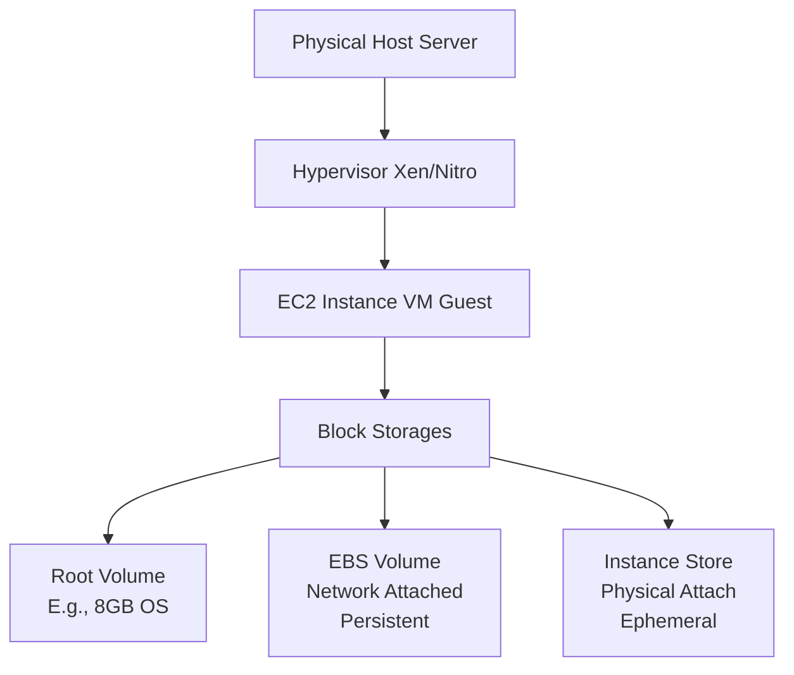
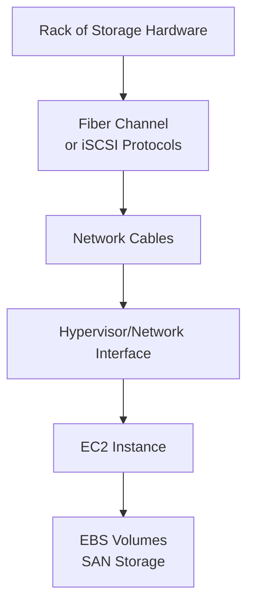
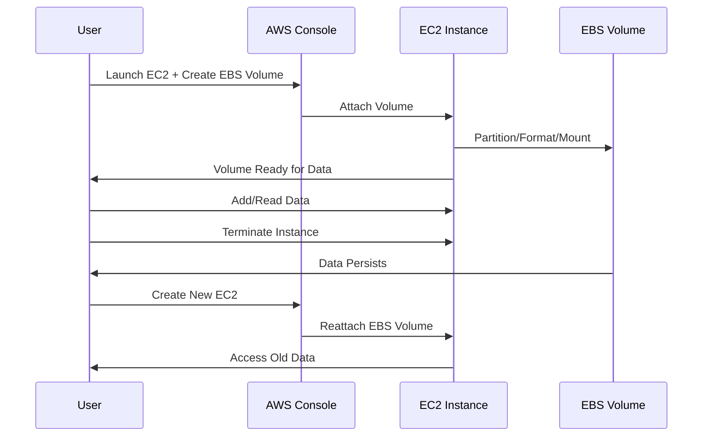

# Session 17: AWS EBS and Storage Concepts

## Table of Contents
- [Revising Previous Session](#revising-previous-session)
- [Storage Services Overview](#storage-services-overview)
- [Block Storage Deep Dive](#block-storage-deep-dive)
- [Battle of Storage: EBS, Instance Store, Root Volume](#battle-of-storage-ebs-instance-store-root-volume)
- [Practical Labs: EBS Volume Creation and Management](#practical-labs-ebs-volume-creation-and-management)

## Revising Previous Session

### Overview
In Session 16, we explored multi-tier applications and AWS managed databases. A multi-tier application divides functionality across layers: presentation, application/business, and data/storage. As an example, we used WordPress with an Apache HTTPD web server (business layer) and MySQL (data layer).

### Key Concepts
AWS offers multiple ways to deploy websites or applications:
- EC2 instances with self-managed infrastructure
- Serverless lambdas
- Kubernetes clusters (EKS)

For a three-tier WordPress setup:
1. **Database Service**: Deploy using Amazon RDS (Relational Database Service), an AWS-managed service.
   - Benefits: AWS handles monitoring and scaling vs. self-managed.
2. **Web Tier**: Deploy WordPress on EC2 with Apache HTTPD.
   - Steps: Install and enable HTTPD (`yum install httpd -y`, `systemctl enable httpd`), download/create WordPress, extract, configure.
3. **Disabling Public Access**: Enable inbound rules for RDS and restart HTTPD.
4. **Final Deployment**: Access the EC2 IP, log in with RDS credentials, complete WordPress setup.

This setup provides a fully functional blog application on AWS.

## Storage Services Overview

### Overview
Storage is critical for data persistence. In AWS, three primary storage types: block storage (EBS), object storage (S3), and file storage (EFS). Block storage uses raw disk volumes forswap se systems (e.g., OS installation), while object/file handle files directly.

### Key Concepts
- **Block Storage**: Raw disks requiring partitioning, formatting, and mounting (e.g., hard drives, pen drives). Used for OS roots or extra space.
- **Object Storage**: Manages files/objects with metadata; no directories needed.
- **File Storage**: NFS-like shared filesystems.

AWS equivalents:
- Block: EBS (Elastic Block Store)
- Object: S3 (Simple Storage Service)
- File: EFS (Elastic File System)

> [!NOTE]
> Block storage attaches to EC2 as virtual drives. EBS connects via network; instance store physically attaches.

### Deep Dive
- **Use Cases for Block Storage**:
  - OS installation (needs partitioned drives).
  - Data persistence beyond RAM.
  - Creating partitions, formatting (e.g., ext4), and mounting drives.
- **AWS Implementation**: Block storage volumes attach to EC2 instances, providing raw diskspace.

```bash
lsblk  # List block devices
lsblk -a  # Detailed view
```

Tables for comparison:

| Feature          | Block Storage | Object Storage | File Storage |
|------------------|---------------|----------------|--------------|
| Hierarchy       | Partitions/disks | No hierarchy | Directories |
| Access         | Raw drives    | API/metadata | Paths       |
| Examples       | EBS           | S3            | EFS         |

## Block Storage Deep Dive

### Overview
Block storage provides raw disks for direct attachment. In AWS, three types: root volume (for OS), EBS volume (network-attached), and instance store (physically attached).

### Key Concepts
- **Root Volume**: Primary OS drive, e.g., C: on Windows or / on Linux. Created automatically with EC2 launches (e.g., 8GB AWS Linux AMI).
- **EBS Volume**: Network-attached block storage via SAN (Storage Area Network). Persistent, survives instance failures, attachable across instances in the same Availability Zone.
- **Instance Store**: Physically attached to host hardware. Ephemeral (temporary); ultra-high performance but data lost on shutdown/restart.

### Architectural Diagrams




### Differences: EBS vs. Instance Store
- **Persistence**: EBS - Permanent; Instance Store - Ephemeral (lost on shutdown).
- **Attachment**: EBS - Network (SAN), multi-region/zone via snapshots/AZs; Instance Store - Locally attached (pen drive-like).

| Aspect | EBS Volume | Instance Store |
|--------|------------|----------------|
| Location | Network (SAN) | Physical Host |
| Persistence | Yes | No (ephemeral) |
| Performance | Variable (depends on type) | Ultra-high (SSD/flash) |
| Cost | Moderate | Higher |
| Use Cases | Databases, apps needing durability | Caches, temporary data |

```diff
+ EBS: Persistent, network-attached; survives reboots.
- Instance Store: High-speed, ephemeral; for volatile data.
+ Choose based on data importance vs. performance needs.
```

- **Why Limits?**
  - EBS: Cross-zone attachment restricted for performance (network latency). Limited to same zone/region.
  - Instance Store: Pre-attached to specific instance types (e.g., C5D); not creatable manually.

### Command Examples for AWS CLI
Describe instance types supporting instance store:
```bash
aws ec2 describe-instance-types --filters Name=instance-storage-supported,Eq=true
aws ec2 describe-instance-types --filters Name=instance-type,Eq=* --query 'InstanceTypes[?InstanceStorageInfo.TotalSizeInGB > `0`].{Type:InstanceType,Storage:InstanceStorageInfo.TotalSizeInGB}'
```

Output with table format:
```bash
aws ec2 describe-instance-types ... --output table
```

## Practical Labs: EBS Volume Creation and Management

### Overview
Demonstrated EBS volume attachment to EC2, partitioning, mounting, and data persistence tests.

### Key Concepts
- **Creating EBS Volume**: Via EC2 console or CLI. Supports up to 16TB; resides in one Availability Zone.
- **Attachment Steps**: Launch EC2 → Create EBS volume → Attach to instance → Partition/format/mount inside OS.
- **Partitioning**: Use `fdisk` for Linux; create partitions on raw disks.
- **Formatting**: Use `mkfs.ext4` for ext4 filesystem.

### Config/Code Blocks
1. **Create Partition** (Raw Disk: e.g., /dev/xvdf):
   ```bash
   fdisk /dev/xvdf
   n  # New partition
   p  # Primary
   1  # Partition 1
   [enter]  # Default start
   +100M  # Size
   w  # Write changes
   ```

2. **Format Partition**:
   ```bash
   mkfs.ext4 /dev/xvdf1
   ```

3. **Create Mount Point**:
   ```bash
   mkdir /my-drive
   ```

4. **Mount and Add Data**:
   ```bash
   mount /dev/xvdf1 /my-drive
   echo "Data in EBS volume" > /my-drive/data.txt
   ```

5. **Verify**: Check with `lsblk`, `df -h`, data persists across instance terminations/reattachments.

- **Termination Test**: Data in EBS survives instance deletion; root volume data does not.
- **Reattachment**: Attach EBS to new EC2; mount and access old data.

> [!IMPORTANT]
> EBS volumes are per-zone; copy via snapshots for cross-zone/region transfers.

### Tables: Volume Types
AWS EBS volume types (detailed in docs):
| Type | Description | IOPS | Use Case |
|------|-------------|------|---------|
| gp2/gp3 | General Purpose | Up to 16k | General workloads |
| io1/io2 | Provisioned IOPS | Up to 64k | High I/O databases |

### Visualization


## Summary

### Key Takeaways
```diff
+ Block storage provides raw disks for EC2: root (OS), EBS (persistent), instance store (ephemeral).
+ EBS: Network-attached SAN, high persistence, moderate performance; survives instances in same zone.
+ Instance Store: Physically attached, ultra-fast, but ephemeral; for temporary/high-I/O data.
- Avoid cross-zone attachments for performance; use snapshots for cross-zone/region movement.
+ Labs: Create, attach, partition/format/mount EBS volumes; test data persistence on termination.
```

### Quick Reference
- **Commands**: `lsblk` (list blocks), `fdisk` (partition), `mkfs.ext4` (format), `mount` (attach).
- **CLI**: `aws ec2 describe-instance-types` for instance store support.
- **Volume Size**: 1GB-16TB; newer types: gp2/gp3, io1/io2.
- **AZ Restriction**: EBS limited to one parent zone; snapshots enable cross-region.

### Expert Insight

#### Real-world Application
EBS volumes power persistent databases (e.g., EC2 + EBS for WordPress MySQL). Instance stores accelerate caching in high-traffic apps (e.g., Redis on ephemeral storage).

#### Expert Path
Master EBS snapshots for backups and disaster recovery. Learn IOPS provisioning and EBS-optimized instances for performance tuning.

#### Common Pitfalls
- **Cross-Zone Attempts**: Forget AZ limits; use snapshots to copy volumes across zones/regions.
- **Data Loss**: Relying on instance store for critical data; always back up.
- **Performance Issues**: Mischoosing volume types (e.g., gp2 for I/O-heavy workloads).
- Avoid mixing volume types without need; test mount points post-reattachment.

#### Lesser-Known Facts
- EBS volumes use NVMe drivers; kernel reasssigns device names (e.g., /dev/nvme1n1).
- Instance stores pre-sized per instance type; no manual creation.
- Historical: AWS evolved from fixed storage to elastic EBS for flexibility.
