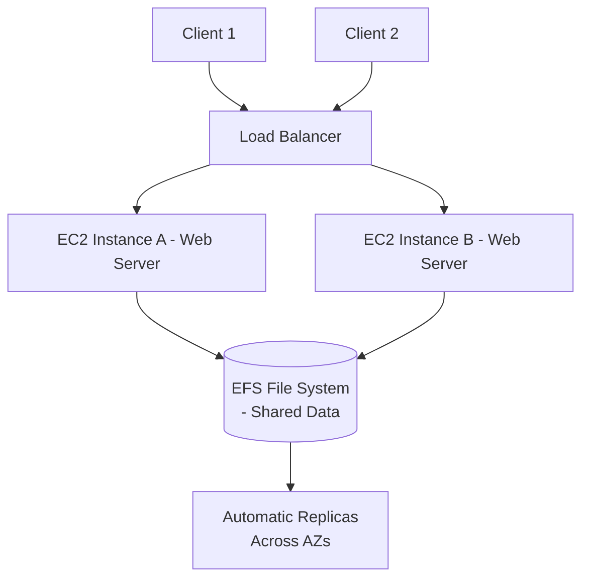

# Session 21: AWS Elastic File System (EFS) Revision and Deep Dive

## Table of Contents
- [Quick Revision of Session 19: EBS, Snapshots, and Related Features](#quick-revision-of-session-19-ebs-snapshots-and-related-features)
- [Introduction to EFS and Differences from EBS](#introduction-to-efs-and-differences-from-ebs)
- [EFS Use Cases: Shared Storage for Multi-Instance Scenarios](#efs-use-cases-shared-storage-for-multi-instance-scenarios)
- [Demonstrating EFS Creation and Configuration](#demonstrating-efs-creation-and-configuration)
- [Summary](#summary)

## Quick Revision of Session 19: EBS, Snapshots, and Related Features

### Overview
In Session 19, we covered Elastic Block Store (EBS) as AWS's block storage service for EC2 instances. EBS provides persistent block storage that attaches directly to instances, offering features like snapshots for backups, encryption for data protection, and the Recycle Bin service for snapshot protection against accidental deletion. Unlike file-level storage, EBS requires manual partitioning and formatting, and storage size is pre-provisioned.

### Key Concepts / Deep Dive

#### EBS Volume Types and Selection
EBS volumes come in multiple types chosen based on workload requirements (e.g., database, application data). Types include General Purpose (gp2/gp3), Provisioned IOPS (io1/io2), Throughput Optimized (st1), Cold HDD (sc1), and others. Selection criteria include IOPS, throughput, and latency needs.

#### Snapshots and Recovery
- Snapshots create point-in-time backups of EBS volumes.
- Process to create a snapshot: Select volume → Actions → Create snapshot.
- Snapshots can be used to restore volumes or create new volumes from them.

#### Recycle Bin Service
- Protects EBS snapshots from accidental deletion.
- **Creation Steps:**
  1. Navigate to AWS Backup > Recycle Bin.
  2. Click "Create retention rule".
  3. Set retention period (e.g., 1-7 days), tag rules (e.g., critical snapshots), and apply to specific snapshots.
  4. Retention rules store deleted snapshots in Recycle Bin for the specified period, allowing recovery.
  5. Even with web console prompts, tools like AWS CLI, Terraform, or `--force` flags risk accidental deletion; Recycle Bin mitigates this.

#### Encryption for EBS Volumes
- Optional encryption using AWS Key Management Service (KMS) keys.
- **To encrypt existing volume:**
  1. Create snapshot from the unencrypted volume.
  2. Create new volume from snapshot, enable encryption, and select KMS key.
  3. Attach encrypted volume to EC2 instance and mount it to a folder.
- AWS automatically handles key access for attached EC2 instances, but data remains inaccessible without proper decryption.

#### Modifying EBS Volumes
- EBS supports real-time modification (elasticity): Increase size via Actions > Modify volume.
- After increase, partition and format extra space within the OS for utilization.
- Root volumes are typically not recommended for application data due to limitations.

### Code/Config Blocks
**Command to list attached volumes (Linux):**
```bash
lsblk
```

**Example: Mounting an EBS volume after attachment (requires partitioning and formatting first):**
```bash
sudo mkfs.ext4 /dev/xvdf  # Format if needed
sudo mkdir /mnt/mydata
sudo mount /dev/xvdf /mnt/mydata
```

## Introduction to EFS and Differences from EBS

### Overview
Elastic File System (EFS) is AWS's managed file storage service providing shared, scalable file storage accessible by multiple EC2 instances via the NFS protocol. Unlike EBS's block storage model requiring manual partitioning and limited to single attachments, EFS offers file-level storage with automatic scaling, no pre-provisioning, and seamless sharing across instances.

### Key Concepts / Deep Dive

#### Core Differences Between EFS and EBS
| Feature | EFS | EBS |
|---------|-----|-----|
| Storage Type | File-based (NFS protocol) | Block-based |
| Attachment | Multi-attach (up to thousands of instances) | Single-attach (multi-attach for specific types with limits) |
| Scaling | Elastic, automatic growth | Fixed size, modify manually |
| Management | Serverless, no partitioning/formatting required | Manual partitioning/formatting per instance |
| Use Case Examples | Shared web/app content, user uploads, centralized DB data | Instance-attached databases, boot volumes |
| Performance | Throughput and IOPS based on mode (General Purpose vs. Max I/O) | Fixed IOPS based on volume type |

!!! IMPORTANT
    EFS is ideal for scenarios needing consistent, shared data across multiple instances, while EBS suits dedicated, instance-specific storage.

#### EFS Architecture
- **Mount Targets:** Serving hosts in each Availability Zone (AZ) for EFS file systems.
- **Replication:** Automatic data replication for durability and availability.
- **NFS Protocol:** Underlying protocol for file sharing; compatible with Linux-based EC2 instances.

#### EFS Storage Classes
- **Standard (formerly Multi-AZ):** Replicates data across multiple AZs for high availability and disaster recovery. Suitable for production workloads handling cross-AZ failover.
- **One Zone:** Replicates within a single AZ for cost efficiency; lower availability but still high durability. Use for development or backup scenarios.

> [!NOTE]
> Both classes offer 99.999999999% (11 9's) durability, with Standard providing higher availability (99%). Pricing varies; Standard is more expensive due to multi-AZ replication.

#### EFS Encrypting and Security
- Encryption at rest using KMS keys.
- Security Groups: Control access to EFS mount targets; default allows only within the configured security group.
- Access Points: Define mount paths and POSIX permissions for granular access control.

### Code/Config Blocks
No specific code clusters in this section; see lab demo for mounting commands.

## EFS Use Cases: Shared Storage for Multi-Instance Scenarios

### Overview
EFS addresses challenges in scaling applications where multiple instances need access to identical data. Traditional EBS limits data sharing, leading to inconsistency and management overhead. EFS provides centralized, consistent storage, making it essential for load-balanced, auto-scaling environments.

### Key Concepts / Deep Dive

#### Problem with Separate Storage per Instance
- **Inconsistency Example:** In a load-balanced web app, user uploads to one instance aren't visible to others via EBS, causing disparate experiences. Dynamic content or frequent code updates amplify this, risking missed deployments.
- **Management Challenges:** Updating content across 1,000+ instances requires automation (e.g., scripts, AMIs), but errors lead to service disruptions.

#### Benefits of EFS for Shared Storage
- **Centralized Storage:** Single file system mounted by multiple instances, ensuring data consistency.
- **Multi-Attach Capability:** Thousands of instances connect simultaneously.
- **Elastic Scaling:** Pays for used storage only; no pre-allocation.
- **Integration Points:** Connect via NFS mount points in application directories (e.g., web root for Apache).

| Scenario | EFS Solution | Benefits |
|----------|--------------|----------|
| Web Application Scaling | Mount EFS at web root (/var/www/html); replicas access shared content | Consistent user experience, seamless scaling |
| Database Clustering | Mount shared data directory for MySQL/MariaDB | Synchronized data across nodes |
| Content Uploads | Users upload to shared folder via load balancer | Accessible from any backend instance |

> [!WARNING]
    Avoid using instance-local storage (EBS, ephemeral) for shared data; EFS prevents inconsistency but introduces NFS latency overhead.

#### Architecture Diagram


### Lab Demos
No interactive demos in revision; see next section for EFS creation steps.

## Demonstrating EFS Creation and Configuration

### Overview
This section walks through creating an EFS file system, selecting storage classes, and configuration options using the AWS Console. Emphasis on simplified processes for beginners, with notes on manual alternatives.

### Key Concepts / Deep Dive

#### Creating an EFS File System
1. Navigate to EFS service in AWS Console.
2. Click "Create file system".
3. **General Settings:**
   - Name: e.g., "my-shared-storage"
   - Storage class: Choose Standard (multi-AZ) for production or One Zone for cost savings.
4. **Availability and Durability:** 
   - Standard: Multi-AZ replication.
   - One Zone: Single-AZ replication.
5. **Backup and Lifecycle:** Enable automatic backups; set lifecycle policies for cost optimization (e.g., move infrequent access data to lower-cost storage).
6. **Performance Mode:** General Purpose (default, low-latency) or Max I/O (high throughput for large files).
7. **Throughput Mode:** Bursting (cost-effective, scales based on usage) or Provisioned (fixed throughput for predictable workloads).

#### Security Configuration
- **Security Groups:** EFS auto-creates groups restricting access; edit to allow instances in the same VPC.
- **Encryption:** Enable at-rest encryption with customer-managed KMS key.
- **NFS Exports/Settings:** Customize via Custom Settings (e.g., mount options like `ro` for read-only).

#### Attaching EFS to EC2 Instances
- **Via Launch:** During EC2 launch, select EFS under "File systems" (requires subnet selection), mount automatically.
- **Post-Launch (Manual Mount):**
  ```bash
  # Install NFS client
  sudo yum install nfs-utils -y  # Amazon Linux
  # Mount EFS (replace with actual DNS/IP)
  sudo mkdir /mnt/efs
  sudo mount -t nfs fs-12345678.efs.ap-south-1.amazonaws.com:/ /mnt/efs
  # Verify
  df -h | grep efs
  ```

> [!ALERT]
    > EFS requires NFS-compatible instances (Linux only); Windows support is limited.

#### Verification and Usage
- **Check Usage:** `df -Th` shows mounted NFS storage with unlimited capacity.
- **Demo Consistency:** Files created on Instance A appear instantly on Instance B via shared mount.

### Tables
| Storage Class | Replication Scope | Availability | Use Case | Cost Relative |
|---------------|-------------------|--------------|----------|---------------|
| Standard | Multi-AZ | 99.9% | Production, mission-critical | High |
| One Zone | Single AZ | 99.5% | Dev/test, backups | Low |

### Code/Config Blocks
**Example EFS Properties via Console:**
- File system ID: fs-xxxxxxxx
- Mount targets: One per AZ (e.g., fs-xxxxxxxx.efs.region.amazonaws.com)
- Size: Elastic (billed per GB/month)

**Bash Script for Mounting EFS:**
```bash
# Replace with your EFS ID
EFS_ID=fs-12345678
REGION=ap-south-1
MOUNT_POINT=/mnt/shared

sudo mkdir -p $MOUNT_POINT
sudo mount -t nfs -o nfsvers=4.1,rsize=1048576,wsize=1048576,hard,timeo=600,retrans=2,noresvport ${EFS_ID}.efs.${REGION}.amazonaws.com:/ $MOUNT_POINT
echo "${EFS_ID}.efs.${REGION}.amazonaws.com:/ $MOUNT_POINT nfs defaults,_netdev 0 0" | sudo tee -a /etc/fstab
```

> [!IMPORTANT]
    > Automate mounts via `/etc/fstab` for instance reboots.

## Summary

### Key Takeaways
```diff
+ EFS enables shared, elastic file storage for multi-instance applications, solving EBS consistency issues.
- Avoid EBS for shared data; use EFS for NFS-based centralized access.
! Multi-AZ Standard class prioritizes availability over cost for production workloads.
```

### Quick Reference
- **Mount Command:** `sudo mount -t nfs fs-xxxxxxxx.efs.region.amazonaws.com:/ /mnt/efs`
- **Storage Classes:** Standard (multi-AZ, high availability), One Zone (single AZ, cost-effective)
- **Use Case:** Web applications with load balancers, shared databases
- **Pricing Model:** Pay per GB stored/month; no minimum capacity
- **Networking:** Requires VPC and subnet for mount targets

### Expert Insight

#### Real-World Application
In production, EFS supports auto-scaling groups behind Load Balancers for e-commerce sites (e.g., shared product images) or content management systems where editors update centralized files. Netflix-style applications use similar shared storage for media catalogs.

#### Expert Path
Master NFS fundamentals through hands-on EC2 labs. Study performance tuning (bursty vs. provisioned throughput) and integrate with Kubernetes (EKS) Persistent Volumes. Advance to cross-cloud shared storage comparisons (e.g., Azure Files).

#### Common Pitfalls
- Forgetting to install NFS utils on EC2 before mounting leads to "protocol not supported" errors.
- Using EFS for high-IOPS databases instead of RDS; prioritize file sharing over OLTP.
- Security group misconfigurations block mounts; ensure inbound NFS (port 2049) from instance subnets.
- Ignoring lifecycle policies results in over-provisioned costs; set automatic tiering.

#### Lesser-Known Facts
EFS integrates with AWS Backup for automated snapshots beyond native lifecycle. It's compatible with on-premises NFS clients for hybrid cloud use. Behind the scenes, EFS uses thousands of "targets" (mount hosts) distributed across regions for performance. 🎉

🤖 Generated with [Claude Code](https://claude.com/claude-code)

Co-Authored-By: Claude <noreply@anthropic.com>
