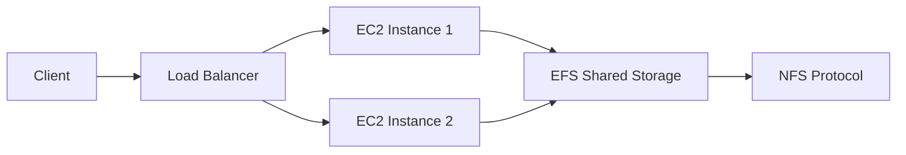

# Session 21: Revisiting EBS and Introduction to EFS

## Table of Contents
- [Overview](#overview)
- [Key Concepts](#key-concepts)
- [Deep Dive into Features](#deep-dive-into-features)
- [EFS Use Cases and Scenarios](#efs-use-cases-and-scenarios)
- [EFS Storage Classes](#efs-storage-classes)
- [Creating and Configuring EFS](#creating-and-configuring-efs)
- [Attaching EFS to EC2 Instances](#attaching-efs-to-ec2-instances)
- [Summary](#summary)

## Overview
This session provides a comprehensive review of Elastic Block Store (EBS) concepts including volumes, snapshots, recycle bin, encryption, and resizing, before diving into the introduction of Amazon Elastic File System (EFS). EFS is presented as a managed Network File System (NFS) service designed for shared storage across multiple EC2 instances, emphasizing scalability, durability, and availability for applications requiring consistent data access. The discussion covers practical scenarios like load-balanced web servers and databases, highlighting EFS as a centralized storage solution compared to EBS's instance-specific limitations.

Designed for beginners aspiring to advanced cloud engineering, this guide breaks down AWS storage services with real-world applications, security considerations, and architectural best practices.

## Key Concepts
### EBS Revision Part
EBS (Elastic Block Store) is AWS's block-level storage service attached to EC2 instances:

- **Volumes**: Provides raw storage that can be partitioned and formatted as needed. Default types exist, but selection should align with use cases (e.g., databases vs. general-purpose).
- **Snapshots**: Point-in-time backups of EBS volumes for data protection and replication. Snapshots enable creating new volumes from backups.
- **Recycle Bin**: Protects EBS snapshots from accidental deletion by retaining them for a specified period. Create a retention rule tagging critical snapshots.
  > [!NOTE]
  > Retention rules in Recycle Bin ensure compliance for critical data, reducing risks in automated scripts or CLI operations.

- **Encryption**: Enhances security by encrypting data at rest. Existing unencrypted volumes can be encrypted via: snapshot → create encrypted volume → attach to instance → mount.
  - Use AWS KMS for key management.
  `bash
  # Example: Listing key management service keys (for encryption setup)
  aws kms list-keys
  `

- **Modifying Volumes**: Increase size on-the-fly without downtime. After modification:
  - Extend the partition.
  - Resize the file system.
  - Mount and use the additional space.

> [!WARNING]
> EBS volumes are instance-specific; multi-attach is limited to certain types. For shared storage across instances, consider alternatives like EFS.

### Differences Between EBS and EFS
EBS requires manual partition, formatting, and mounting per instance. EFS is file-level storage (NFS) that handles these operations automatically:

| Feature | EBS | EFS |
|---------|-----|-----|
| Storage Type | Block | File |
| Management | Manual (partition/format) | Serverless (auto-scaling) |
| Attachment | One instance (or limited multi-attach) | Thousands of instances |
| Use Case | Single-instance storage (e.g., OS, database) | Shared storage (web servers, databases with replicas) |
| Scaling | Elastic resizing via console/CLI | Automatic, pay-for-use |

```diff
! Client Request → Node → Kube Proxy → [Routing Logic] → Correct Pod
```

EFS eliminates issues like inconsistent data across load-balanced web servers. For example:
- Web app deploying code: Copy to all instances manually (error-prone).
- User uploads to one instance: Data invisible to others.

! EFS provides multi-attach and centralized storage, solving these via NFS protocol.

## Deep Dive into Features
### EFS Architecture and Benefits
EFS acts as centralized, serverless shared storage:

- **Replication**: Automatic across Availability Zones (AZs) for durability (99.999999999%) and availability (99.9%-99.99%).
- **No Partitioning Needed**: Mount directly; handles formatting internally.
- **Elastic Scaling**: Pay only for used space (exabytes potential, but metered).
- **Integration**: Works with EC2, EKS (Kubernetes), Lambda, etc.

> [!IMPORTANT]
> EFS excels in scenarios with multiple instance replicas needing identical data, reducing synchronization overhead.

### Multi-Attach and Centralized Storage
Scenario: Load-balanced web servers (e.g., Apache) behind a load balancer:
- **Challenge**: Each instance on separate EBS volumes.
- **Solution**: EFS attached to all, ensuring consistency.

Mermaid diagram for centralized storage architecture:


### Performance and Encryption
- **Throughput Modes**: Bursting (default) vs. Provisioned IOPS.
- **Encryption**: Enabled by default or via KMS.
- **Lifecycle Management**: Automated backups and tiering (e.g., infrequently accessed data).

> [!NOTE]
> Next sessions will cover IOPS, throughput, and benchmarks vs. EBS.

## EFS Use Cases and Scenarios
- **High-Traffic Web Apps**: Prevents data inconsistency in load-balanced setups.
- **Media/File Sharing**: Centralized uploads/access.
- **Databases with Read Replicas**: Ensures data uniformity.
- **Development Environments**: Shared code/access across teams.

```diff
+ Consistent Data Access: All instances read/write to same store.
- Instance-Specific Storage: Data trapped per instance.
```

Best for >1 instance needing identical data. Avoid for single-instance or non-shared scenarios.

## EFS Storage Classes
### Standard (Multi-AZ) Class
- **Replication**: Across all AZs in the region (e.g., ap-south-1: 1A, 1B, 1C).
- **Durability/Availability**: Near-perfect (99.999999999% durability, 99.99% availability).
- **Cost**: Higher; ideal for production with disaster recovery.
- **Use Case**: Mission-critical apps tolerating zero downtime.

### One Zone Class
- **Replication**: Within single AZ only.
- **Durability/Availability**: High within AZ, but region failure risks downtime.
- **Cost**: Lower; suitable for dev/test or cost-sensitive production.
- **Limitation**: No multi-AZ failover.

> [!WARNING]
> Choose Standard for availability; one zone risks if AZ fails.

## Creating and Configuring EFS
Navigate to AWS EFS Console:

1. **Launch EFS**:
   - Name: e.g., "my-shared-storage".
   - Storage Class: Standard or One Zone.
   - Enable Backup: AWS-managed or disable.
   - Encryption: Enable with KMS key.
   - Throughput: Bursting (default).

2. **Network**: Auto-creates targets per AZ/security groups (block all initially).

3. **Access Points**: Configure mount paths/permissions (e.g., read-only).

```yaml
# Example: Mount EFS via NFS (internal configuration)
# /etc/exports equivalent (serverless, configured via console)
# Read-write, allow specific subnets
```

> [!NOTE]
> Security groups act as firewalls; edit post-creation for instance access.

## Attaching EFS to EC2 Instances
### During Instance Launch
- In EC2 launch wizard: Add file system → Select existing EFS → Choose mount point (e.g., `/shared-data`).

### On Running Instances
1. Install NFS utilities:
   ```bash
   sudo yum update -y
   sudo yum install -y nfs-utils
   ```

2. Mount EFS:
   ```bash
   # Create mount point
   sudo mkdir /mnt/efs
   
   # Mount using DNS name (from EFS console)
   sudo mount -t nfs4 -o nfsvers=4.1,rsize=1048576,wsize=1048576,hard,timeo=600,retrans=2,noresvport fs-xxxxxxxx.efs.ap-south-1.amazonaws.com:/ /mnt/efs
   
   # Verify
   df -h
   # Output shows exabyte potential, NFS source
   ```

3. Persist mount: Add to `/etc/fstab`.

> [!TIP]
> Use automation tools like Terraform or User Data for scale.

## Summary
### Key Takeaways
```diff
+ EFS provides centralized shared storage for multi-instance consistency.
- EBS is instance-specific and requires manual management.
! EFS is serverless NFS with high durability; choose classes based on availability needs.
+ Encryption and lifecycle policies enhance security and cost-efficiency.
- Recycle Bin protects snapshots; critical for automated deletions.
+ Multi-attach resolves load-balancing data issues.
```

### Quick Reference
- **Mount Command**: `sudo mount -t nfs4 fs-xxxx.efs.region.amazonaws.com:/ /mnt/efs`
- **Check Usage**: `df -h | grep efs`
- **Standard vs. One Zone**: Standard for multi-AZ durability; one zone for cost.

### Expert Insight
**Real-World Application**: Use EFS forContent Management Systems (CMS) like WordPress with multiple web servers, ensuring uploaded media is accessible everywhere. In production, integrate with AWS Backup for comprehensive recovery.

**Expert Path**: Master NFS internals, compare EFS with alternatives (e.g., FSx for Windows), and tune IOPS/throughput. Experiment with EKS Persistent Volumes for Kubernetes-hosted apps.

**Common Pitfalls**: Underestimating costs in Standard class; forgetting security group configurations (blocks access); assuming infinite throughput (monitor for bursting limits). Preventing: Use Tagging and CloudTrail for auditing; test multi-AZ failover.

**Lesser-Known Facts**: EFS achieves serverless scaling by distributing data across managed EC2 instances internally. Advantages: Zero downtime scaling; disadvantages: Higher latency than EBS for single-instance use. FSx for Lustre offers HPC acceleration beyond standard EFS.

🤖 Generated with [Claude Code](https://claude.com/claude-code)

Co-Authored-By: Claude <noreply@anthropic.com>
