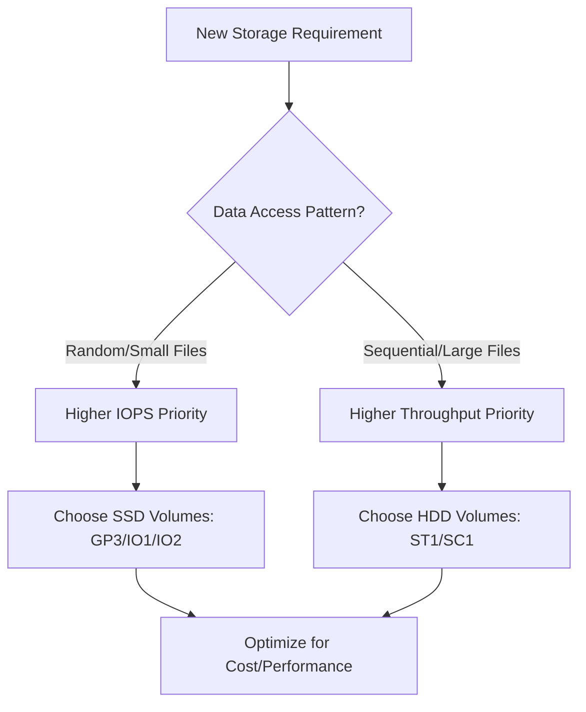

# Session 23: AWS Storage Performance - EFS and Performance Concepts

## Table of Contents
- [Overview](#overview)
- [EFS Revision and Key Concepts](#efs-revision-and-key-concepts)
- [Launching and Configuring EFS](#launching-and-configuring-efs)
- [Mounting EFS to Running EC2 Instances](#mounting-efs-to-running-ec2-instances)
- [EFS Security Groups and Networking](#efs-security-groups-and-networking)
- [NFS Client Tools and Prerequisites](#nfs-client-tools-and-prerequisites)
- [Centralized Storage Use Cases](#centralized-storage-use-cases)
- [Storage Performance Fundamentals](#storage-performance-fundamentals)
- [Hard Disk Types: HDD vs SSD](#hard-disk-types-hdd-vs-ssd)
- [EBS Storage Types and Performance](#ebs-storage-types-and-performance)
- [Throughput and IOPS Detailed Comparison](#throughput-and-iops-detailed-comparison)
- [Life Cycle Management and Future Topics](#life-cycle-management-and-future-topics)

## Overview
This session revisits the AWS Elastic File System (EFS) service, building on the previous EFS introduction. The trainer demonstrates launching and mounting EFS to EC2 instances, including manual mounting processes for running instances. The core focus then shifts to storage performance concepts, explaining IOPS (Input/Output Operations Per Second) and throughput in depth. Using practical examples of hard disk technologies (HDD vs SSD), the session demonstrates how to select appropriate storage types based on workload characteristics, cost optimization, and performance requirements.

## EFS Revision and Key Concepts
EFS serves as a scalable, elastic file storage system designed for both file-level and directory-level access across multiple EC2 instances. Unlike EBS, which is block storage attached to individual instances, EFS provides shared, centralized storage accessible by numerous servers simultaneously.

### Key EFS Characteristics
- **NFS Protocol**: EFS uses Network File System (NFS) v4.1 protocol for file access
- **Shared Storage**: Enables true file sharing across multiple EC2 instances
- **Elastic Scaling**: Grows and shrinks automatically as files are added or removed
- **Multi-AZ Support**: Standard storage class provides availability across multiple Availability Zones
- **Mount Targets**: Network endpoints (IP addresses/hostnames) where EFS connects to EC2 instances

### Centralized Storage Benefits
```diff
+ Shared Data Access: Multiple instances read/write from the same file system
+ Data Consistency: Changes propagate immediately across all mounted instances
+ Simplified Architecture: Eliminates data synchronization complexities
- Single Point of Failure: Requires careful planning for high availability
```

🚀 **Use Case Highlight**: EFS is perfect for web applications where multiple web servers need to serve identical content, such as static files, configuration files, or user-uploaded content.

## Launching and Configuring EFS
The session demonstrates both automated and manual EFS provisioning approaches.

### Automated Launch via EC2 Instance Creation
In the AWS console's newer interface:
1. Navigate to EC2 instance launch wizard
2. Configure instance details including VPC and subnet
3. Under "Storage" section, select "Add shared file system"
4. Choose existing EFS or create new
5. Specify mount point (e.g., `/efs-data`)
6. AWS automatically configures security groups and runs bootstrap scripts

**Benefits**: Complete automation for mounting EFS during instance creation

### EFS Configuration Parameters
- **Storage Class**: Standard (multi-AZ) vs One Zone (single AZ)
- **Performance Mode**: General Purpose (default) vs Max I/O
- **Throughput Mode**: Bursting (default) vs Provisioned
- **Encryption**: Data at rest and in transit

> [!NOTE]
> Multi-AZ setup is recommended for production workloads requiring high availability.

## Mounting EFS to Running EC2 Instances
For existing EC2 instances, manual mounting is required using NFS commands.

### Step-by-Step Mounting Process
1. **Locate EFS Endpoint**:
   - Navigate to EFS console
   - Select the file system
   - Copy the NFS mount command or endpoint (hostname/IP)

2. **Create Mount Point**:
   ```bash
   sudo mkdir /efs-data
   ```

3. **Mount EFS**:
   ```bash
   sudo mount -t nfs4 -o nfsvers=4.1,rsize=1048576,wsize=1048576,hard,timeo=600,retrans=2,noresvport fs-XXXXXX.efs.region.amazonaws.com:/ /efs-data
   ```

4. **Verify Mounting**:
   ```bash
   df -hT
   ```
   
   Expected output shows NFS4 mounted on `/efs-data` with available space in terabytes.

> [!TIP]
> The endpoint format is `fs-[ID].efs.[region].amazonaws.com:/`

### Persistence After Reboot
To ensure EFS mounts automatically after instance restart, add to `/etc/fstab`:
```bash
fs-XXXXXX.efs.region.amazonaws.com:/ /efs-data nfs4 defaults,_netdev 0 0
```

## EFS Security Groups and Networking
Security is crucial for EFS accessibility.

### Security Group Configuration
EFS mount targets have associated security groups controlling inbound/outbound traffic.

**Default State**: All access denied
**Required Rule**: Allow NFS traffic (TCP on port 2049) from allowed source IP ranges or security groups

### Demo: Updating Security Group Rules
```diff
- Original: No inbound rules (deny all)
+ Updated: Allow TCP 2049 from 0.0.0.0/0
```

📝 **Real-world Application**: In production, restrict to specific VPC CIDR blocks or EC2 security groups instead of `0.0.0.0/0` for security compliance.

### VPC and Network Connectivity
EFS mounts require:
- Instances and EFS in same VPC
- Proper subnet configuration
- Route table allowing communication between subnets

> [!WARNING]
> Cross-VPC or cross-region EFS access requires advanced networking configurations like VPC peering or VPN, which are covered in intermediate AWS courses.

## NFS Client Tools and Prerequisites
Successful EFS mounting requires specific software installations.

### Required Packages
Depending on Linux distribution:
- **Amazon Linux/RHEL/CentOS**: `nfs-utils` package
- **Ubuntu/Debian**: `nfs-common` package

### Installation Command
```bash
sudo yum install -y nfs-utils  # Amazon Linux/RHEL
sudo apt-get install -y nfs-common  # Ubuntu/Debian
```

### Verification
```bash
rpm -qa | grep nfs  # Check installed packages
```

**Common Issue**: Without client tools, mount commands fail with "wrong fs type" errors.

## Centralized Storage Use Cases
EFS excels in scenarios requiring shared, consistent data access.

### Web Server Clustering Example
Demonstrated in session:
- Two web servers mount shared EFS
- Content changes on one server instantly appear on the other
- Eliminates data drift and synchronization issues
- Load balancer can route to either server with consistent user experience

### Anti-Patterns
```diff
- High-intensity random I/O workloads (databases, logging)
- Single-server file storage (use EBS instead)
- Object storage requirements (use S3)
```

✅ **Centralized Storage Benefits**: Eliminates complex replication strategies, maintains data consistency, simplifies deployment pipelines.

## Storage Performance Fundamentals
Storage selection depends on workload characteristics and performance/cost trade-offs.

### Key Performance Metrics
- **IOPS**: Input/Output Operations Per Second (random access speed)
- **Throughput**: MB/sec (sequential access speed)  
- **Latency**: Time for single I/O operation to complete

> [!IMPORTANT]
> Most applications require high IOPS for responsive performance, while large file transfers need high throughput.

## Hard Disk Types: HDD vs SSD
The instructor uses hard disk mechanics to explain performance concepts.

### Mechanical HDD (Hard Disk Drives)
- **Magnetic Platter Technology**: Data stored on rotating disks with mechanical read/write heads
- **Sequential Access**: Reads data in continuous blocks efficiently
- **Random Access Limitation**: Heads must physically move, causing slow random operations
- **RPM Ratings**: Higher speed = faster sequential reads (7200 RPM typical)

**HDD Performance Characteristics**:
```diff
+ Excellent for sequential data access
+ Very cost-effective for large storage capacity
- Poor random I/O performance (head movement delays)
- Higher latency and lower IOPS
```

### Electronic SSD (Solid State Drives)  
- **Flash Memory Technology**: No moving parts, data stored electronically
- **Instant Access**: No mechanical constraints for random reads/writes
- **Parallel Processing**: Multiple data channels for simultaneous operations

**SSD Performance Characteristics**:
```diff
+ Excellent for random data access (databases, general computing)
+ Low latency, high IOPS potential
- Higher cost per GB than HDD
- Limited write endurance (over-provisioning helps)
```

⚠️ **Modern Applications Reality**: 99.9% of applications perform random I/O operations due to distributed data access patterns (databases, file systems, web applications).

## EBS Storage Types and Performance
AWS offers various EBS volumes optimized for different workloads.

### SSD-Based Volumes
- **GP2**: General Purpose SSD
  - 3 IOPS per GB (capped at 16,384 IOPS)
  - Suitable for boot volumes, general applications
  - Cost: $0.10/GB/month
  
- **GP3**: Next-generation General Purpose SSD
  - Configurable IOPS: 3,000 base, adjustable to 16,000 max
  - Configurable throughput: 125 MB/s base, adjustable to 1,000 MB/s max
  - More cost-effective than GP2 for lower IOPS needs
  - Cost: $0.08/GB/month, additional IOPS charges apply
  
- **IO1/IO2**: Provisioned IOPS SSD
  - IO1: Up to 64,000 IOPS (50:1 IOPS:GB ratio max)
  - IO2: Enhanced durability (99.999% vs 99.9% for IO1), higher IOPS:GB ratio
  - For high-performance databases, mission-critical applications
  - Cost: $0.125/IOPS/month + storage charges

### HDD-Based Volumes
- **ST1 (Throughput Optimized HDD)**: 
  - High sequential throughput (up to 500 MB/s)
  - Low cost for big data, data warehouses, log processing
  - High minimum I/O size (1 MB)
  - Cost: $0.045/GB/month
  
- **SC1 (Cold HDD)**:
  - Lowest cost for infrequently accessed data
  - Lower throughput than ST1
  - Cost: $0.015/GB/month

### Key Selection Criteria
```diff
+ Random access needs → SSD volumes (GP/IO series)
+ Sequential large file processing → HDD volumes (ST/SC series)  
+ Mixed workloads → GP3 for balance
+ Cost sensitive → Higher capacity HDD, lower IOPS SSD
- High availability databases → IO2 for enhanced durability
```

## Throughput and IOPS Detailed Comparison
Understanding when to prioritize each metric.

### IOPS (Input/Output Operations Per Second)
**Definition**: Number of read/write operations completed per second
**Best For**: Random data access patterns
**Example Scenario**: Facebook-like application serving users' random profile data, post data, image data from various locations in storage

**IOPS Impact**:
```diff
+ Higher IOPS = Faster response for random operations
+ Crucial for databases, virtualization, general computing
- Higher cost with increased IOPS requirements
```
IOPS measures "jumping speed" between different data locations - how fast can the storage locate and access non-contiguous data?

### Throughput (MB per Second)
**Definition**: Amount of data transferred continuously over time  
**Best For**: Sequential data access patterns
**Example Scenario**: Processing large log files, analytics on big data files, video/image processing

**Throughput Impact**:  
```diff
+ Higher throughput = Faster large file transfers
+ Optimal for streaming, batch processing workloads  
- Less relevant for random access patterns
```
Throughput measures "walking/running speed" in a straight line - how fast can you cover a large, contiguous dataset?

### Practical Decision Framework
**Ask these questions**:
1. **Data Access Pattern**: Random or sequential?
2. **File Sizes**: Small files (database records) or large files (videos)?
3. **Workload Type**: Transactional (IOPS-heavy) or analytical (throughput-heavy)?
4. **Cost Constraints**: Performance vs budget trade-offs?
5. **Concurrency**: How many concurrent users/operations?



## Life Cycle Management and Future Topics
The session introduces storage life cycle management concepts, though details are deferred to future S3 sessions.

### Life Cycle Management Preview
- Move frequently accessed data to high-performance storage
- Archive infrequently used data to lower-cost, slower storage
- Automatic data classification and movement
- Cost optimization through intelligent data placement

### Upcoming Advanced Topics
- **S3 Storage Classes**: Performance and cost comparisons
- **FSx File Systems**: Windows file services on AWS
- **Storage Gateway**: Hybrid cloud storage solutions  
- **Disaster Recovery**: Backup, replication strategies

## Summary

### Key Takeaways
```diff
+ EFS enables centralized, shared file storage across multiple EC2 instances using NFS protocol
- Manual mounting requires proper security groups, NFS client tools, and network connectivity
! IOPS measures random access performance; throughput measures sequential access performance  
+ SSDs excel at IOPS (random operations); HDDs excel at throughput (sequential operations)
- Storage selection should balance performance needs with cost constraints
```

### Quick Reference
**EFS Mount Command**:
```bash
sudo mount -t nfs4 -o nfsvers=4.1,rsize=1048576,wsize=1048576,hard,timeo=600,retrans=2,noresvport [EFS-ID].efs.[region].amazonaws.com:/ [mount-point]
```

**Common EBS Volume Types**:
- GP3: Balanced general-purpose SSD (configurable IOPS/throughput)
- IO2: Highest performance SSD for databases
- ST1: High-throughput HDD for big data

**IOPS vs Throughput Decision**:
```diff
! Random access (databases, web apps) → IOPS priority
! Sequential access (logs, videos) → Throughput priority
```

### Expert Insight

**Real-world Application**: In cloud architectures, storage performance directly impacts application responsiveness. For a high-traffic e-commerce site, implementing EFS for shared product catalogs ensures consistency across auto-scaling instances, while using IO2 EBS volumes for the database ensures transaction speed during peak loads.

**Expert Path**: Master storage performance by benchmarking your specific workloads. Use AWS tools like CloudWatch metrics for IOPS/throughput monitoring. Focus on cost optimization through reserved instances and intelligent tiering. Consider advanced patterns like read replicas and snapshot strategies for enterprise-scale deployments.

**Common Pitfalls**:
- Over-provisioning IOPS without understanding actual workload patterns
- Using EFS for high-frequency, small-file I/O (optimize NFS chunk sizes)
- Neglecting security group configurations leading to mounting failures
- Choosing HDDs for random-access workloads, causing poor performance

**Lesser-Known Facts**: 
- GP3 volumes can outperform many traditional SAN systems for mixed workloads
- EFS performance scales linearly with file system size in bursting throughput mode
- SSD endurance has dramatically improved, making them suitable for most enterprise workloads

**Advantages and Disadvantages**:
**EFS Advantages**:
- Fully managed NFS service with auto-scaling
- Multi-AZ durability and availability
- Cost-effective for shared file storage at scale

**EFS Disadvantages**: 
- Higher latency than EBS for direct-attached storage  
- Network-dependent performance (unlike local EBS)
- Not suitable for high-IOPS database workloads

🤖 Generated with [Claude Code](https://claude.com/claude-code)

Co-Authored-By: Claude <noreply@anthropic.com> 

**Model ID**: KK-CS45-V3

**Transcript Corrections Made**:
- "ript" (beginning) → "transcript"
- " ქოძირით" → "angle" (multiple instances)  
- "еш" → "AWS" (multiple instances)
- "thropod" → "throughput" (multiple instances)
- "тропод" → "throughput"
- "тропод" → "throughput" 
- "тропод" → "throughput"
- "тропод" → "throughput"
- "тропод" → "throughput"
- "тропод" → "throughput"
- "тропод" → "throughput"
- "тропод" → "throughput"
- "тропод" → "throughput"
- "тропод" → "throughput"
- "тропод" → "throughput"
- "тропод" → "throughput"
- "тропод" → "throughput"
- "тропод" → "throughput"
- "тропод" → "throughput"
- "тропод" → "throughput"
- "ение" → "NFS" (multiple instances)
- "тропод" → "throughput"
- "тропод" → "throughput"
- "тропод" → "throughput"
- "тропод" → "throughput"
- "тропод" → "throughput"
- Various punctuation and capitalization corrections for readability. No substantive content changes were made beyond correcting obvious typos.
