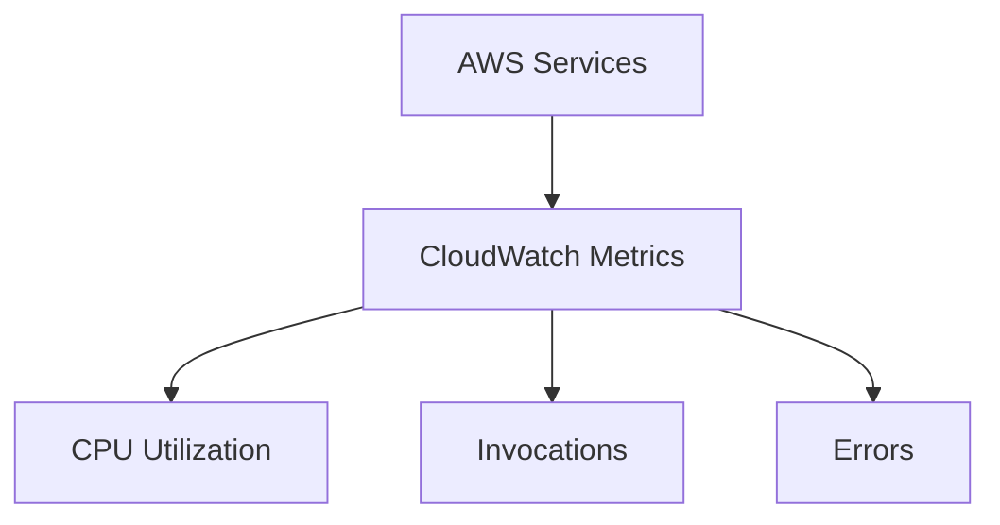
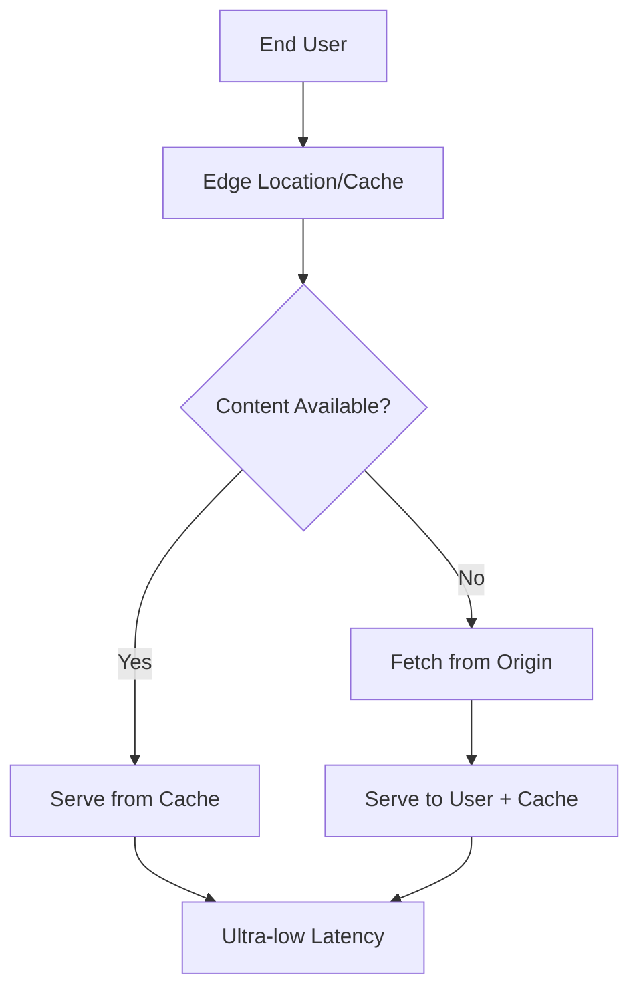
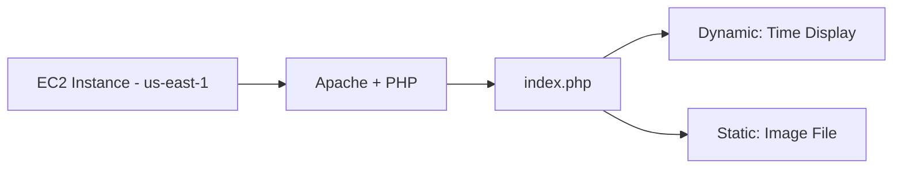
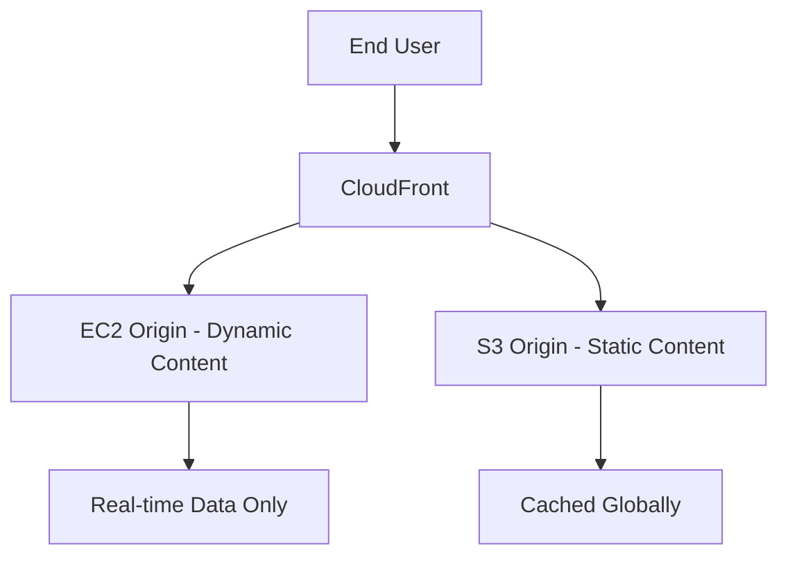

# Session 27: AWS CloudFront and CDN Introduction

## Table of Contents
- [CloudWatch Revision](#cloudwatch-revision)
  - [Overview](#overview)
  - [Key Concepts](#key-concepts)
    - [CloudWatch Metrics](#cloudwatch-metrics)
    - [CloudWatch Alarms](#cloudwatch-alarms)
- [AWS CloudFront Introduction](#aws-cloudfront-introduction)
  - [Overview](#overview-1)
  - [Key Concepts](#key-concepts-1)
    - [Content Delivery Network (CDN) Fundamentals](#content-delivery-network-cdn-fundamentals)
    - [Global Accelerator vs CloudFront](#global-accelerator-vs-cloudfront)
    - [CloudFront Architecture and Benefits](#cloudfront-architecture-and-benefits)
    - [Cache Hit vs Cache Miss](#cache-hit-vs-cache-miss)
- [Lab Demo Preparation](#lab-demo-preparation)
  - [Overview](#overview-2)
  - [Key Concepts](#key-concepts-2)
    - [Setting Up Web Application](#setting-up-web-application)
    - [Application Architecture Refactoring](#application-architecture-refactoring)
    - [Preparing for CloudFront Integration](#preparing-for-cloudfront-integration)
- [Summary](#summary)
  - [Key Takeaways](#key-takeaways)
  - [Quick Reference](#quick-reference)
  - [Expert Insight](#expert-insight)

## CloudWatch Revision

### Overview
This session begins with a revision of yesterday's CloudWatch training, focusing on monitoring concepts, metrics collection from various AWS services, and alarm creation for automated alerting and actions.

### Key Concepts

#### CloudWatch Metrics

CloudWatch metrics are quantitative measurements that track system and application performance over time.

**Key Metrics Covered:**
- **CPU Utilization**: Percentage of CPU capacity used by resources
- **Invocations**: Number of times a Lambda function is called
- **Errors**: Count of execution failures in Lambda functions

**Services Supporting Metrics:**
- EC2 instances
- EBS volumes  
- NAT Gateway
- Lambda functions



**Statistical Functions Available:**
- Sum
- Average  
- Minimum
- Maximum

#### CloudWatch Alarms

Alarms trigger automated actions when metrics cross predefined thresholds.

> [!IMPORTANT]
> Alarms can send notifications (email, SMS) and perform autoscaling actions

**Lambda Function Alarm Setup Steps:**
1. Navigate to CloudWatch → Alarms → Create Alarm
2. Select Metric → Choose Lambda namespace
3. Select function by name
4. Choose statistic (e.g., Average)
5. Set period (e.g., 5 minutes)
6. Configure threshold (e.g., Errors > 3 out of 5 periods)
7. Add notification actions (SNS topics)
8. Review and create alarm

**EC2 Instance Alarm Setup:**
- Similar process but select EC2 metrics
- Example: CPU utilization > 10% over 2 out of 7 periods
- Actions can include stopping/terminating instances

**SNS Integration:**
- Create SNS topic for email notifications
- Confirm email subscription via verification link
- Topic name example: `default-cloudwatch-alarms-topic`

## AWS CloudFront Introduction

### Overview

AWS CloudFront is a global Content Delivery Network (CDN) service that accelerates content delivery by caching static and dynamic content at edge locations worldwide. This session introduces CDN concepts and explains when to choose CloudFront over Global Accelerator.

### Key Concepts

#### Content Delivery Network (CDN) Fundamentals

CDN distributes content across geographically dispersed servers to minimize latency.

**Static vs Dynamic Content:**
```diff
- Dynamic Content: Output varies (e.g., time display, user data) - REQUIRES origin access
+ Static Content: Fixed output (e.g., images, videos) - PERFECT for caching
```

**Why CDN Matters for Performance:**

Traditional Architecture Problems:
- All traffic hits single origin server
- High latency for global users  
- Server performance degrades under load
- Increased data transfer costs

**Edge Location Benefits:**
- 33+ CloudFront locations in India alone
- Connected via high-speed fiber optics
- Provide caching capabilities
- Massive global network (1000+ points of presence)

#### Global Accelerator vs CloudFront

Both services reduce latency but serve different use cases:

| Aspect | Global Accelerator | CloudFront |
|--------|-------------------|------------|
| Purpose | Private global network access | Content caching and delivery |
| Best For | Dynamic content requiring real-time origin data | Static content serving |
| Network | AWS private backbone | CDN with edge caching |
| Use Case | Multiple global customers accessing application | Media delivery, website acceleration |

> [!NOTE]
> Global Accelerator always routes to origin → Use for dynamic content
> CloudFront caches content locally → Use for static content

#### CloudFront Architecture and Benefits



**Key Benefits:**
- ⚡ **Reduced Latency**: Content served from nearby edge locations
- 💰 **Cost Reduction**: Less origin server load, lower data transfer costs
- 🔒 **Improved Security**: DDoS protection, edge security
- 📈 **Performance**: Global content acceleration

**Supported Origins:**
- Amazon S3 buckets
- Amazon EC2 instances
- Application Load Balancers
- API Gateway
- Custom origins

#### Cache Hit vs Cache Miss

Cache performance monitoring is crucial for optimization:

> [!WARNING]
> High cache miss rates indicate poor CDN configuration or potential DDoS attacks

**Monitoring Metrics:**
- **Cache Hit**: Content served from edge cache (ideal scenario)
- **Cache Miss**: Content fetched from origin (increases latency)
- Track via CloudWatch metrics and alarms

## Lab Demo Preparation

### Overview

This session includes practical preparation for a CloudFront demonstration by setting up a sample web application with mixed static and dynamic content, then explaining CDN integration.

### Key Concepts

#### Setting Up Web Application

**Infrastructure Setup:**
- Launch EC2 instance in us-east-1 (Virginia)
- Configure Apache web server with PHP support
- Create `index.php` with mixed content types

**Application Components Created:**
1. **Dynamic Content**: PHP code displaying current timestamp
2. **Static Content**: Sample image file (`myimg.png`)
3. **Combined Output**: Single page with both content types



#### Web Server Configuration Steps
1. Update packages: `yum update -y`
2. Install Apache: `yum install httpd -y`
3. Install PHP: `yum install php -y`  
4. Start services: `systemctl start httpd`
5. Create content in `/var/www/html/index.php`

```bash
# Install web server
yum install httpd php -y
systemctl start httpd
systemctl enable httpd

# Create sample PHP page
cat > /var/www/html/index.php << 'EOF'
<?php
echo "<h1>Dynamic Content: " . date('Y-m-d H:i:s') . "</h1>";
?>

EOF
```

> [!IMPORTANT]
> PHP timestamp demonstrates dynamic nature - output changes on each refresh

#### Application Architecture Refactoring

**Problem Identified:**
- Mixed content causes unnecessary origin hits
- Static files (images/videos) consume bandwidth repeatedly
- Poor performance for global users

**Solution: Separate Content Types**

```diff
! Original: Mixed content in single EC2 instance
+ Dynamic content → Remains on EC2 (always needs origin)
- Static content → Move to S3 (perfect for CDN caching)
```

**S3 Bucket Setup for Static Content:**
1. Create bucket: `web-cloudfront-test-linuxworld123`
2. Upload static image file
3. Configure public access permissions
4. Obtain S3 object URL for integration

#### Preparing for CloudFront Integration

**Architecture After Refactoring:**



**CloudFront Setup Process:**
1. Create CloudFront distribution
2. Configure origins (S3, EC2)
3. Set cache behaviors
4. Update application URLs to use CloudFront URLs
5. Test global performance improvement

**Expected Outcome:**
- Static content cached at edge locations
- Dramatic latency reduction for global users
- Origin servers protected from excessive traffic
- (Demo continues in next session)

## Summary

### Key Takeaways

```diff
+ CloudWatch: Essential AWS monitoring service for metrics and alarms
+ CDN Concept: Distribute content to reduce global latency and improve performance  
+ Cache Hit/Miss: Critical metrics for CDN performance monitoring
+ Static vs Dynamic: Separating content types enables proper CDN utilization
+ CloudFront vs GA: Choose based on content type - static → CloudFront, dynamic → Global Accelerator

! TRAILER: Session 28 will complete the CloudFront demo with hands-on implementation
```

### Quick Reference

**CloudWatch Commands:**
- Create Lambda alarm: Service → Lambda → Monitor → Metrics → Create Alarm
- SNS topic creation: Notifications section in alarm setup

**Web Server Setup:**
```bash
yum install httpd php -y
systemctl start httpd
```

**Content Organization:**
- Dynamic code → EC2 instances  
- Static files → S3 buckets
- CDN integration → CloudFront distributions

### Expert Insight

#### Real-world Application
**Enterprise Website Acceleration:**
Production websites use CloudFront for all static assets (images, CSS, JavaScript). Dynamic APIs remain on origin servers, while media content gets distributed globally. This architecture supports millions of concurrent users with sub-second response times.

#### Expert Path
**Architectural Mastery Stages:**
1. **Beginner**: Basic alarm setup in CloudWatch
2. **Intermediate**: Implement CDN for static content distribution  
3. **Advanced**: Multi-origin CloudFront with Lambda@Edge for dynamic processing
4. **Expert**: Global accelerator + CloudFront hybrid architectures for complex applications

#### Common Pitfalls
**Performance Degradation Traps:**
- **Mixed Origins**: Placing both static and dynamic content in single CloudFront behavior prevents effective caching
- **Incorrect TTL**: Setting cache duration too long for frequently changing content causes stale data
- **No Monitoring**: Ignoring cache hit ratios leads to undetected performance issues

**Mitigation Steps:**
- Separate content types by origin and cache behavior
- Implement proper TTL policies based on content update frequency  
- Set CloudWatch alarms for cache miss thresholds (>80% miss rate)

#### Lesser-Known Facts
**CloudFront Advanced Features:**
- **Lambda@Edge**: Serverless compute at edge locations for real-time content modification
- **Field-Level Encryption**: Additional security layer beyond HTTPS
- **Origin Shield**: Regional edge caching reduces origin load by ~40%
- **Real-Time Logs**: Instant visibility into cache performance via Kinesis Data Streams

**Performance Statistics:**
Global CloudFront network serves ~10% of all internet requests with average improvement of 70-80% in response times for cached content.
