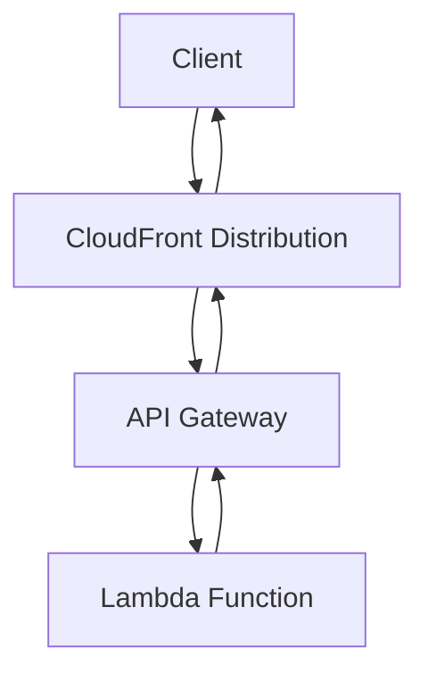

# Session 31: CloudFront and API Gateway Integration

- [CloudFront Overview](#cloudfront-overview)
- [TTL and Cache Behavior in CloudFront](#ttl-and-cache-behavior-in-cloudfront)
- [Query Strings in CloudFront](#query-strings-in-cloudfront)
- [Cache Policy](#cache-policy)
- [Distribution Creation in CloudFront](#distribution-creation-in-cloudfront)
- [Lambda Function Creation](#lambda-function-creation)
- [API Gateway Integration](#api-gateway-integration)
- [Testing Integrations](#testing-integrations)
- [WAF and Shield Protection](#waf-and-shield-protection)
- [Query Strings Deep Dive](#query-strings-deep-dive)
- [Embedding Data](#embedding-data)
- [Pass Through Setup](#pass-through-setup)
- [Advanced Lambda and API Gateway Practices](#advanced-lambda-and-api-gateway-practices)
- [Postman for API Testing](#postman-for-api-testing)
- [Summary](#summary)

## CloudFront Overview

CloudFront is a Content Delivery Network (CDN) service provided by AWS. It improves user experience by delivering content from edge locations closer to the client, rather than from a single region. In this session, CloudFront was integrated with API Gateway and Lambda to demonstrate seamless data delivery.

CloudFront acts as an intermediary between the client and backend services. When a client makes a request, CloudFront checks its cache. On a cache hit, it serves content directly from the edge location. On a cache miss, it forwards the request to the origin (e.g., API Gateway).

The integration shown used CloudFront as a front-end proxy, calling API Gateway, which then triggers Lambda functions. This setup ensures that responses are cached at the edge for faster subsequent requests, reducing load on the origin.

### Example Integration Flow


## TTL and Cache Behavior in CloudFront

TTL (Time to Live) determines how long content is cached in CloudFront before it's considered stale and a fresh request is made to the origin. By default, TTL is set to 1 day (86400 seconds), but it can be customized.

- **Custom TTL**: Set to 0 days to disable caching for quick changes. This forces CloudFront to fetch data from the origin on every request.
- **Purpose**: Balances performance with data freshness. Higher TTL reduces origin load but may serve outdated content; lower TTL ensures updates are reflected quickly.

In the demonstration, TTL was adjusted to 0 for immediate visibility of Lambda code changes.

## Query Strings in CloudFront

Query strings are parameters appended to a URL after a question mark (`?`), allowing customization of content requests. By default, query strings are disabled in CloudFront but can be enabled.

Query strings modify the behavior of the request, such as passing user-specific data. In CloudFront, enabling query strings ensures they are forwarded to the origin (e.g., API Gateway).

Example URL with query string: `https://example.com/api?param=value`

Parameters are separated by ampersands (`&`). In the session, query strings were used to pass data like `name=Vimal` to Lambda via API Gateway.

## Cache Policy

A cache policy defines rules for caching content at CloudFront's edge locations. It includes settings for TTL, headers, and cookies.

- **Creation Steps**:
  - Go to CloudFront service.
  - Click "Create Policy" under Policies tab.
  - Set TTL values (minimum, maximum, default).
  - Enable query strings if needed.
  - Add include/forward headers or cookies.
  - Name the policy (e.g., "My Cache Policy").

In the session, a cache policy was created with TTL set to 0 (minimum, default, maximum adjustable) to ensure no caching for demonstrations. This policy was applied to a distribution for query string handling.

## Distribution Creation in CloudFront

A CloudFront distribution delivers content globally using edge locations. To integrate with API Gateway:

1. Go to CloudFront service and click "Create Distribution".
2. Select "Web" or "API Gateway" as origin if available; otherwise, use custom origin.
   - **Origin Domain**: Use API Gateway invoke URL.
   - **Origin Path**: Leave blank.
   - **Protocol**: HTTP (or HTTPS if configured).
   - **Port**: 80 for HTTP.
3. Configure caching:
   - Use a custom cache policy or optimized caching.
4. Set TTL and enable query strings in behaviors.
5. Name the distribution.

In the demo, the invoke URL from API Gateway was used as the origin, with HTTP on port 80. After creation, test the distribution URL in a browser to verify it returns Lambda output (e.g., "hello from lambda").

## Lambda Function Creation

AWS Lambda runs serverless functions. To create a function:

1. Navigate to AWS Lambda console.
2. Click "Create Function".
3. Choose "Author from scratch".
4. Enter function name (e.g., "MyPythonInput1").
5. Select runtime: Python 3.9.
6. Choose architecture: x86_64 or ARM64.
7. Create a new execution role with basic permissions.

After creation:
- Add code in the Code tab (e.g., return {"statusCode": 200, "body": "Hello from Lambda!"}).
- Deploy the code.
- Test with a test event: Create a new event, save, and run.

In the session, Lambda was updated with custom responses, and logs were monitored via CloudWatch.

## API Gateway Integration

API Gateway manages and exposes APIs. To create and integrate with Lambda:

1. Go to API Gateway service.
2. Click "Create API" and select "REST API".
3. Provide API name (e.g., "MyAPI").
4. Create resources (e.g., /mypath).
5. Add methods (e.g., GET, POST).
   - For Lambda integration: Select Lambda Function, specify region and function name (e.g., "MyPythonInput1").
6. Deploy the API to a stage (e.g., "test").
7. Note the invoke URL for testing.

Routes use HTTP methods and resource paths. Integration targets point to Lambda. CORS can be configured if needed.

## Testing Integrations

- **Browser Testing**: Use the CloudFront distribution or API Gateway invoke URL to verify Lambda responses.
- **Lambda Tests**: Create test events in AWS console or CLI.
- **Cache Verification**: Check for cache hits/misses in CloudFront metrics.

In the demo, testing confirmed end-to-end flow: Client → CloudFront → API Gateway → Lambda → Response.

## WAF and Shield Protection

- **AWS WAF (Web Application Firewall)**: Protects against common web exploits like SQL injection and cross-site scripting.
- **AWS Shield**: Provides DDoS protection in two tiers.
  - **Standard**: Automatic mitigation via CloudFront integration.
  - **Advanced**: More features with costs (~$3000/month).

In the session, WAF rules were added via Web ACL (e.g., regional ACL for API Gateway). Web ACL metrics were monitored in CloudWatch.

## Query Strings Deep Dive

Query strings pass data visible in the URL, typically using GET requests. They follow the format: `URL?var1=value1&var2=value2`.

- **Use Case**: User preferences or filters.
- **Default Method**: GET.

In Lambda, query strings are accessed via event['queryStringParameters'].

## Embedding Data

Embedding data uses HTTP headers or body, not visible in URL. Methods like POST send data in the request body.

- **POST Method**: Sends form data or JSON in the payload (e.g., via Postman).
- **Comparison to Query Strings**: Safer for sensitive data; supports larger payloads.

In the session, POST was contrasted with GET, using API Gateway and Postman for testing.

## Pass Through Setup

Pass through setup sends client data directly to Lambda via API Gateway without transformation.

- **Lambda Proxy**: A specific integration type where API Gateway forwards the entire request to Lambda.
- **Event Structure**: Includes headers, body, query strings, etc.

Benefits: Full control in Lambda for complex logic.

## Advanced Lambda and API Gateway Practices

- **Methods in REST API**: GET (retrieve), POST (create), PUT (update), DELETE (remove).
- **Code Updates**: Change Lambda code (e.g., add dynamic responses), redeploy, and redeploy API Gateway.
- **Roles and Permissions**: Ensure IAM roles allow Lambda execution.

In the demo, methods were added to API Gateway, and code was modified for method-specific responses (e.g., "I am GET method").

## Postman for API Testing

Postman is a tool for API testing beyond browser capabilities (e.g., POST/PUT requests).

- **Installation**: Download from website (e.g., Windows 64-bit).
- **Usage**: Create collections, select methods (GET/POST), enter URL, add headers/body, send requests.
- **Integration**: Test API Gateway and Lambda with query parameters or JSON payloads.

In the session, Postman verified GET responses and sent POST data to Lambda via API Gateway.

## Summary

### Key Takeaways
```diff
+ CloudFront's global edge network reduces latency by caching content locally.
+ TTL controls cache longevity; set to 0 for no caching in dynamic scenarios.
+ Query strings must be enabled in CloudFront to forward parameters to origins.
+ Lambda integrates seamlessly with API Gateway for serverless backends.
+ WAF protects against DDoS and exploits, with Shield offering automated mitigations.
+ Postman enables testing of non-GET requests for full API validation.
+ Pass-through setup in API Gateway allows direct data flow to Lambda proxy.
```

### Quick Reference
- **Create Lambda Function**:
  ```bash
  # Via AWS CLI (alternative to console)
  aws lambda create-function --function-name MyFunction --runtime python3.9 --role arn:aws:iam::123456789012:role/lambda-role --handler lambda_function.lambda_handler --code S3Bucket=mybucket,S3Key=lambda.zip
  ```
- **API Gateway Invoke URL Example**: `https://api-id.execute-api.region.amazonaws.com/stage/path`
- **Postman GET Request**:
  ```
  GET https://api-url?param=value
  Headers: Content-Type: application/json
  Body: (None for GET)
  ```

### Expert Insight

#### Real-world Application
In production, CloudFront + API Gateway + Lambda powers APIs for global apps, e.g., media streaming where edge caching ensures fast content delivery, reducing EC2 load.

#### Expert Path
Master CloudFront behaviors by experimenting with cache policies, origins, and edge functions (Lambda@Edge). Study AWS documentation on optimizing for specific use cases like video streaming or static websites.

#### Common Pitfalls
- Forgetting to redeploy API Gateway after changes, leading to outdated behavior.
- Misconfiguring query string forwarding, causing missing parameters in Lambda.
- Ignored CORS, blocking frontend requests.
- Overly short TTL increasing origin costs without bankruptcy benefits.

#### Lesser-Known Facts
- CloudFront supports server-side encryption for secure distributions.
- Lambda proxy events include custom headers; use for advanced routing.
- Shield's advanced tier includes $1M DDoS attack coverage.

#### Advantages and Disadvantages
**Advantages**:
- Scalability: Auto-scaling without server management.
- Cost-effective: Pay-per-use model.
- Global reach: Edge locations for low latency.

**Disadvantages**:
- Cold start latency in Lambda for infrequent requests.
- Debugging complexity in distributed systems.
- Costs escalate with high request volumes or premium Shield.
