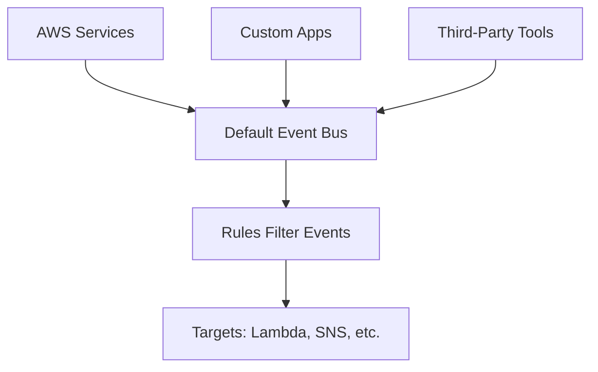

# Session 34: AWS EventBridge

<!-- Table of Contents -->
- [Overview](#overview)
- [Key Concepts / Deep Dive](#key-concepts--deep-dive)
  - [What is an Event?](#what-is-an-event)
  - [Event Management](#event-management)
  - [CloudWatch Events](#cloudwatch-events)
  - [Event Bus](#event-bus)
  - [Publish-Subscribe (Pub/Sub) Model](#publish-subscribe-pubsub-model)
  - [Evolution to EventBridge](#evolution-to-eventbridge)
  - [Event-Driven Applications](#event-driven-applications)
- [Lab Demo: Setting up Event Rules and Targets](#lab-demo-setting-up-event-rules-and-targets)
- [Summary](#summary)

## Overview

Session 34 delves into AWS EventBridge, a powerful serverless service for building event-driven applications in the AWS cloud. This service is crucial for complex architectures, enabling automation, monitoring, and integration across AWS services and beyond. The instructor emphasizes its importance for deployments and introduces concepts like events, event buses, and the evolution from CloudWatch Events. By the end of the session, you'll understand how EventBridge manages events using rules and targets, with a practical demo.

## Key Concepts / Deep Dive

### What is an Event?

An event is any change or occurrence in an AWS service that AWS captures and records. It represents state changes, actions, or API calls performed on resources.

> [!NOTE]
> Events are generated by AWS services themselves; they occur whenever something changes, like EC2 instance state transitions (e.g., running to stopped) or S3 object operations (upload, delete).

- **Examples of AWS Events**:
  - EC2: Instance launch, termination, reboot, metadata change.
  - S3: Bucket creation, object upload, deletion, access.
  - General: Any API call or state change is an event known to AWS internally.

> [!IMPORTANT]
> Events are like data or information about what transpired. AWS tracks this for every interaction, but this data isn't visible to users unless managed.

### Event Management

Event management involves capturing events and using them to make decisions. Without tools like EventBridge, you can't effectively react to changes in complex setups.

- **Why Manage Events?** 📝
  - Not all events are relevant; you need to filter and act on critical ones.
  - Enables automation: Trigger actions when specific conditions match.

- **Basic Flow**:
  1. Services send events (publish).
  2. Filter events using rules.
  3. Trigger targets (e.g., notifications, functions) based on matching rules.

```diff
! Event Occurs → Captured → Filtered by Rule → Target Triggered
```

### CloudWatch Events

CloudWatch Events (now part of EventBridge) is the service for managing AWS-centric events. It's integrated into CloudWatch as a sub-service.

- **Key Components**:
  - **Events**: Data captured from AWS services (metrics, logs, and events).
  - **Rules**: Filters to match specific events (e.g., EC2 state changes).
  - **Targets**: Actions to take, such as invoking Lambda, sending SNS notifications, or logging to CloudWatch.

- **How It Works**:
  - Data is pushed to CloudWatch by sources like EC2 or S3.
  - You create rules to scan for patterns (e.g., state: stopped for a specific instance).
  - Matching triggers targets (e.g., run a Lambda function to restart the instance).

> [!WARNING]
> CloudWatch Events has limitations; it primarily supports AWS services only. Custom apps or third-party tools require workarounds.

### Event Bus

The event bus acts as a centralized store for events, enabling communication between producers and consumers.

- **Default Event Bus**:
  - Pre-created by AWS per region.
  - Stores events from all AWS services.
  - Supports the pub/sub model.

- **Producers (Sources)**: Services sending events (e.g., EC2 publishing state changes).
- **Consumers (Targets)**: Services subscribing to events (e.g., Lambda listening for rules).

### Publish-Subscribe (Pub/Sub) Model

EventBridge uses a pub/sub architecture where:
- **Publishers (Producers)** send events to the bus.
- **Subscribers (Consumers)** listen to filtered events via rules.

```diff
+ Publisher: Sends event (e.g., EC2 stops instance)
- Subscriber: Gets notified via rule match
! Bus: Transfers data between producers and consumers
```

This model is common in event-driven systems, allowing decoupling between services.

> [!NOTE]
> In AWS, default bus handles regional events; custom buses can be created for specific needs (advanced topic).

### Evolution to EventBridge

AWS evolved CloudWatch Events into EventBridge to support broader use cases, making it a standalone service.

- **Limitations of CloudWatch Events**:
  - Only AWS events.
  - Limited querying and custom integrations.

- **Enhancements in EventBridge** (post-2019):
  - Support for third-party events (e.g., Salesforce, Datadog, PagerDuty) via partner integrations.
  - Additional features: Archives (store events), Replays (reprocess past events), Pipes (transform data).
  - Better for event-driven apps beyond AWS.



- **Use Cases**:
  - Disaster recovery: Auto-launch instances in another region.
  - Custom notifications: Email on S3 uploads.
  - Integration: React to security incidents from third-party tools.

> [!WARNING]
> EventBridge is essential for microservices and serverless architectures; ignoring it limits automation potential.

### Event-Driven Applications

Applications designed to react to events rather than polling for changes. Most modern apps (e.g., Netflix, e-commerce) use this model.

- **Examples**:
  - Payment success triggers shipping update.
  - User subscription triggers email and analytics updates.

- **Benefits**:
  - Scalable, decoupled components.
  - Real-time responses.

> [!TIP]
> EventBridge enables building such apps on AWS by handling events from any source.

## Lab Demo: Setting up Event Rules and Targets

The instructor demonstrates EventBridge setup (called CloudWatch Events in the demo). Goal: Notify when an EC2 instance stops.

1. Create a Lambda function (`linux_world_function_one.py`):
   ```python
   import json

   def lambda_handler(event, context):
       print(event)
       return {
           'statusCode': 200,
           'body': json.dumps('Event processed')
       }
   ```

2. In EventBridge (CloudWatch Events console):
   - Create a rule: `myEC2RuleOne`.
   - Event Pattern: Service = EC2, Event = EC2 Instance State-change Notification, State = stopped, Instance ID = [your-instance-id].
   ```json
   {
     "source": ["aws.ec2"],
     "detail-type": ["EC2 Instance State-change Notification"],
     "detail": {
       "state": ["stopped"],
       "instance-id": ["i-xxxxxxxxxxxxxxxxx"]
     }
   }
   ```

3. Add Targets:
   - Lambda function: Invokes on match, logs event data.
   - CloudWatch Logs Group: `myEC2Log` – Captures event JSON.

4. Enable the rule.

5. Test: Stop the EC2 instance → Rule triggers → Lambda runs → Logs show event details and custom prints.

- **Outcome**: Metrics in CloudWatch show rule invocations; demonstrates automated responses.

> [!NOTE]
> Rules can be disabled/enabled; multiple targets per rule supported.

## Summary

```diff
+ Key Takeaways
+ EventBridge manages AWS and third-party events via buses and rules.
+ Rules filter events to trigger targets like Lambda or SNS.
+ Pub/sub model decouples producers (e.g., EC2) from consumers (e.g., Lambda).
+ Essential for event-driven apps, automation, and integrations.
- Avoid misusing CloudWatch for non-event data (use metrics/logs separately).
! EventBridge evolved from CloudWatch Events for broader support.
```

### Quick Reference

- **Event Sources**: EC2, S3, API calls.
- **Rules**: JSON patterns (e.g., `{ "source": "aws.ec2", "detail": { "state": ["stopped"] } }`).
- **Common Targets**: Lambda, SNS, CloudWatch Logs.
- **Commands**: No CLI in demo; use AWS SDK for custom events (e.g., `put-events`).

### Expert Insight

**Real-World Application**: Use EventBridge for auto-scaling responses, cross-region failover, or integrating SaaS tools (e.g., Zendesk triggering Lambda for ticket handling).

**Expert Path**: Master JSON rule crafting for complex filters; explore partner events, archives for compliance, and EventBridge Pipes for data transformation. Pursue AWS Serverless certifications.

**Common Pitfalls**: Misconfigure rules leading to false positives/spam; ignore event bus limits; fail to monitor metrics for rule invocations.

**Lesser-Known Facts**: EventBridge supports 50+ partners; archives store events for up to 7 years; replays enable testing with historical data.

**Advantages**: Serverless, scalable; supports polling third-parties.

**Disadvantages**: Complex JSON rules; potential latency in event delivery.
