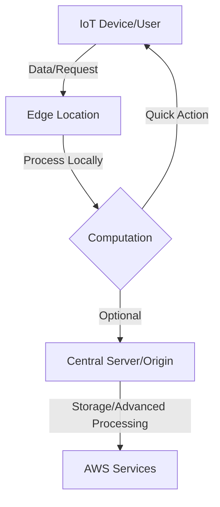

# Session 37: Real-Time Fraud Detection and Edge Computing

**Table of Contents**
- [Revision of Previous Session: Real-Time Fraud Detection](#revision-of-previous-session-real-time-fraud-detection)
- [New Topic Overview](#new-topic-overview)
- [Introduction to Edge Computing](#introduction-to-edge-computing)
- [AWS Services for Edge: Lambda@Edge and CloudFront Functions](#aws-services-for-edge-lambdaedge-and-cloudfront-functions)
- [Comparison: Lambda@Edge vs. CloudFront Functions](#comparison-lambdaedge-vs-cloudfront-functions)
- [Use Cases and Demonstration](#use-cases-and-demonstration)
- [Summary](#summary)

## Revision of Previous Session: Real-Time Fraud Detection

### Overview
Real-time fraud detection is the process of identifying fraudulent activities as they occur, using machine learning algorithms and tools to analyze data streams instantly. This prevents financial losses by stopping transactions at the point of detection, rather than after the fact. Key industries include banking, e-commerce, insurance, and telecommunications. AWS provides a suite of managed, serverless services to build such systems without managing infrastructure.

### Key Concepts
Traditional fraud detection relies on databases and manual logic, but real-time systems require scalable, fast data processing and integration across tools. Core requirements include:
- **Big Data Handling**: Process high-volume transactions in real time without overloading storage.
- **Machine Learning Integration**: Train algorithms on historical data to flag anomalies, such as repeated wrong PIN entries or unusual account behavior.
- **Data Flow Management**: Use messaging queues like Apache Kafka for buffering and processing data streams.

AWS enables this through serverless integration, avoiding deployment complexities. Services include:
- **AWS Lambda**: Generates synthetic transactions and tags fraud accounts for simulation.
- **AWS Kinesis**: Processes real-time data from sources like Kafka.
- **Amazon MSK (Managed Streaming for Apache Kafka)**: Fully managed Kafka service for handling streams without infrastructure management.
- **AWS DynamoDB**: Stores flagged transactions and results.
- **AWS EC2**: Hosts a frontend UI for monitoring fraud detections.

The system works by receiving transactions into Kafka, analyzing them via Kinesis to detect fraud patterns, and triggering actions like notifications or blocks. It's serverless, so scaling and deployment are handled automatically.

### Lab Demo: Building the System with CloudFormation
1. **Setup Requirements**: Create a GitHub repository with project code, including CloudFormation templates, Python scripts, and S3 bucket configurations.
2. **Key Components**:
   - Lambda functions: Simulate banking transactions and tag fraud accounts.
   - MSK: Ingests transaction data from multiple sources.
   - Kinesis: Analyzes streams to flag fraud based on rules or ML models.
   - DynamoDB: Logs detected fraud transactions.
3. **Deployment Steps**:
   - Upload repository files to an S3 bucket.
   - Create a key pair for EC2 access.
   - Launch CloudFormation stack with parameters: bucket name, image ID, and key name.
   - The stack integrates services, deploys Lambda, sets up MSK/Kinesis, and provisions DynamoDB/EC2.
4. **Post-Deployment**:
   - Access EC2 instance (frontend UI) via port 9090.
   - Monitor data: Transactions, fraud detections, and logs via the UI.
   - Lambda generates fake data for testing; in production, integrate real sources.

## New Topic Overview
Moving from fraud detection, the session introduces edge computing concepts, focusing on AWS Lambda@Edge and CloudFront Functions. These services execute code at edge locations (nearby global data centers) for low-latency processing, enabling scenarios like dynamic content manipulation and IoT data handling without reaching central servers.

## Introduction to Edge Computing
Edge computing decentralizes processing by running computations closer to data sources or users, reducing latency. Unlike traditional cloud setups where data travels to a central data center for processing, edge systems analyze and act on data at distributed edge locations.

### Key Concepts
- **Traditional vs. Edge**: In non-edge systems (e.g., IoT devices), data is sent to a centralized cloud for heavy processing, causing delays. Edge computing processes data locally or at nearby nodes.
- **Use Case Example**: A smartwatch sends data to nearby edge servers for quick analysis (e.g., real-time health alerts), followed by optional forwarding to a central cloud for storage.
- **Benefits**: Lower latency, reduced bandwidth use, improved responsiveness, and support for millions of connected devices.
- **Roles in AWS**: Lambda@Edge and CloudFront Functions deploy code to edge locations, executing logic on user requests/responses.

### Diagram


## AWS Services for Edge: Lambda@Edge and CloudFront Functions
AWS provides two main services to run code at edge locations via CloudFront CDN:
- **CloudFront Functions**: Lightweight, JavaScript-based functions for high-speed tasks.
- **Lambda@Edge**: Supports Node.js and Python, offering more processing power and capabilities.

### Lambda@Edge Overview
Lambda@Edge extends Lambda to CloudFront's global edge locations, allowing code execution on requests/responses. It integrates directly with CloudFront for custom routing, content modification, and security.

### CloudFront Functions Overview
A newer option within CloudFront, using JavaScript for quick header modifications and routing. It's designed for low-latency operations within milliseconds.

## Comparison: Lambda@Edge vs. CloudFront Functions

| Feature                  | CloudFront Functions              | Lambda@Edge                      |
|--------------------------|-----------------------------------|---------------------------------|
| Programming Languages   | JavaScript only                  | Node.js, Python                 |
| Execution Time          | <1 ms (milliseconds)             | 5-10 seconds                   |
| Memory                  | ~2 MB                            | 128 MB to 10 GB                 |
| Event Types Supported   | Viewer Request/Response          | All: Viewer/Origin Request/Response |
| Use for Content Data    | No (headers only)                | Yes (full HTTP payload)         |
| Latency | Very low | Higher but more powerful |
| Best For | High-performance header mods, authentication | Complex logic, data processing |

### Key Differences
- CloudFront Functions handle viewer events only; Lambda@Edge supports all request/response types.
- CloudFront Functions prioritize speed for lightweight tasks (e.g., redirects).
- Lambda@Edge scales for heavier workloads, like content filtering or transformations.

> [!IMPORTANT]  
> Choose based on workload: Use CloudFront Functions for sub-millisecond tasks; Lambda@Edge for feature-rich edge processing.

## Use Cases and Demonstration
Use cases include:
- **Content Customization**: Modify content based on user location (e.g., A/B testing for websites).
- **Security**: Add authentication headers or filter malicious requests.
- **Dynamic Routing**: Redirect based on conditions without hitting origins.
- **Real-Time Processing**: Edge computing for IoT or live data analysis.

### Lab Demo: CloudFront Function for URL Redirection
1. **Setup**: Create a CloudFront distribution (e.g., with S3 origin).
2. **Create Function**: In CloudFront console, create a CloudFront Function using JavaScript.
   - Sample Code:
     ```javascript
     function handler(event) {
       var response = {
         statusCode: 302,
         statusDescription: 'Found',
         headers: {
           'location': { 'value': 'https://www.youtube.com/@example' },
           'cloudfront-functions': { 'value': 'generated-by-CloudFront-Functions' }
         }
       };
       return response;
     }
     ```
3. **Associate**: Link function to distribution behavior, trigger on viewer request.
4. **Test**: Access CloudFront URL; it redirects to specified URL (e.g., YouTube) with custom headers, bypassing the origin.
5. **Outcome**: Demonstrates header manipulation and redirection at edge, visible via browser developer tools.

## Summary

### Key Takeaways
```diff
+ Real-time fraud detection saves losses by stopping threats instantly using AWS serverless tools like Lambda, Kinesis, and MSK.
+ Edge computing reduces latency by processing data near users, enabled by Lambda@Edge and CloudFront Functions.
- CloudFront Functions excel in ultra-fast, simple tasks; Lambda@Edge handles complex workloads.
+ Integration via CloudFront allows custom logic on global requests without central processing.

! Use edge services for IoT, security, and personalized content to enhance performance and user experience.
```

### Quick Reference
- **Services for Fraud Detection**: Lambda (transaction sim), MSK/Kinesis (streaming), DynamoDB (storage), CloudFormation (deployment).
- **Deploy Project**: Upload files to S3, launch CloudFormation stack, access EC2 UI on port 9090.
- **Edge Computing Commands**: Create CloudFront function via console; associate with distribution behavior.
- **Redirect Code Snippet**: Use JavaScript to return 302 status with location header.

### Expert Insight

#### Real-World Application
In e-commerce, edge computing processes user carts instantly at nearby locations, offering localized recommendations without server round-trips. Banks use it for instant transaction scoring, integrating with fraud detection systems to block suspicious activities globally.

#### Expert Path
Master by experimenting with CloudFront integrations: Start with simple redirects using CloudFront Functions, then scale to data transformations with Lambda@Edge. Learn HTTP protocols deeply, as edge logic revolves around request/response manipulation. Pursue certifications in AWS networking/CDN to build full edge architectures.

#### Common Pitfalls
- **Latency Overhead**: Using Lambda@Edge for lightweight tasks increases delay compared to CloudFront Functions—match tool to workload.
- **Memory Limits**: CloudFront Functions cap at 2MB; exceeding causes failures in IoT data processing scenarios.
- **Configuration Errors**: Mismatched event triggers (e.g., origin request in CloudFront) lead to bypassed logic—always test thoroughly.
- **Over-Reliance on Edge**: For compute-heavy tasks, ensure edge processing doesn't overwhelm locations; fall back to origins.

#### Lesser-Known Facts
- CloudFront Functions run in JavaScript runtime but integrate seamlessly with CloudFront's global PoPs, enabling instant, worldwide deployments without regional Lambda constraints.
- Lambda@Edge origins in CloudFront broadening AWS's edge ecosystem from caching to full computation, setting a standard for multi-cloud edge strategies.
- Edge locations enable real-time ML inference, like fraud anomaly detection on device data before transmission, reducing data breaches.
- AWS edge services support integration with third-party CDNs (e.g., Akamai) for hybrid setups, blending custom and managed resources.

#### Advantages and Disadvantages
**Advantages**:
- Reduces latency through localized processing.
- Serverless scaling minimizes management overhead.
- Supports flexible, dynamic web experiences.

**Disadvantages**:
- Higher complexity in debugging edge logic compared to centralized apps.
- Potential higher costs for compute-intensive workloads.
- Security risks if edge code exposes sensitive data during processing.
