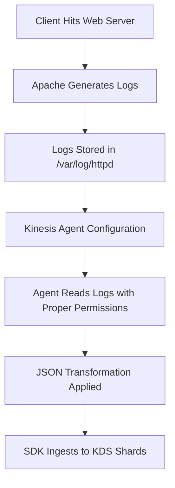
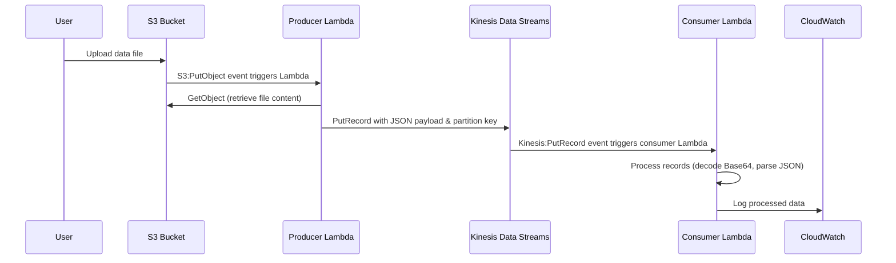

# Session 44: Data Ingestion Using SDK into Kinesis Data Streams

| Table of Contents |
|------------------|
| [Overview](#overview) |
| [Key Concepts and Deep Dive](#key-concepts-and-deep-dive) |
| [Lab Demos](#lab-demos) |
| [Summary](#summary) |

## Data Ingestion Using SDK into Kinesis Data Streams

### Overview
This session builds on previous Kinesis training by transitioning from agent-based data ingestion to SDK-based approaches for real-time data processing. In the last session, Kinesis Agent was used to ingest structured data (like CSV) from files into Kinesis Data Streams (KDS). Here, we explore using AWS SDK for programmatic data ingestion, particularly focusing on processing web server logs and implementing producer-consumer patterns using serverless components like Lambda. The key innovation is moving from batch-oriented agent processing to near-real-time SDK-driven ingestion, enabling automated pipelining with event-driven architectures.

### Key Concepts and Deep Dive

#### SDK vs Agent Data Ingestion

- **SDK Approach**: Direct programmatic ingestion using AWS SDK in languages like Node.js/JavaScript or Python
  - Real-time processing capability 🔥
  - Full control over data transformation and routing
  - Immediate ingestion without configuration delays
  - Supports complex ETL operations

- **Agent Approach** (Previous Class): Configuration-driven ingestion
  - Periodic polling mechanism (often 10-20 seconds delay)
  - Automatic format conversion and forwarding
  - Easier setup for standard file formats
  - Demands file permissions and directory access

```diff
+ SDK: Near-instantaneous, programmable, real-time
- Agent: Configurable but introduces polling delays
```

#### Kinesis Data Streams Architecture for SDK Ingestion

KDS operates as a persistent, ordered collection distributed across shards. Each shard contains records with partition keys that determine distribution via hash functions.

**Key Architecture Components:**

- **Producer**: Sends data using PutRecord API (single record) or PutRecords API (batch)
- **Partition Key**: String that shard distribution algorithms use for routing
- **Shard Distribution**: Hash-based from MD5 sum of partition key (not user-controlled directly)
- **Sequence Number**: Unique identifier within a shard (glossary: "Poison" in transcript was likely "position")

> [!IMPORTANT]
> Partition keys categorize data - same key ensures same shard, enabling ordered processing

#### Data Flow: Web Server Logs to KDS via SDK



#### IAM Role Configuration for Multi-Service Integration

For serverless data pipelines, IAM roles must grant appropriate permissions across services. Typical setup:

- **Lambda producer role**: `kinesis:PutRecord`, `s3:GetObject`, `logs:CreateLogGroup/LogStream`
- **S3 bucket policy**: Allow Lambda execution role to access objects
- **CloudWatch integration**: Mandated for Lambda monitoring and error handling

#### Event-Driven Architecture with Triggers

KDS supports event generation for new records, integrating with:
- Lambda functions as consumers
- CloudWatch Events/Alarms for monitoring
- Batch size configuration (number of records per trigger)

### Lab Demos

#### Demo 1: Kinesis Agent Configuration for Log Ingestion

##### Prerequisites
- Installed Apache web server
- Kinesis Agent service running

##### Steps
1. **Start Apache Server**
   ```bash
   sudo systemctl start httpd  # Start Apache service
   sudo systemctl status httpd # Verify running status
   ```

2. **Agent Configuration Setup**
   - Edit agent configuration file (location: `/opt/aws-kinesis-agent/config/aws-kinesis-agent.json`)
   - Update local file system path to Kinesis stream reference:
     ```yaml
     {
       "flows": [
         {
           "filePattern": "/var/log/httpd/access_log*",  # Source log location
           "kinesisStream": "your-kinesis-stream-name",  # Target stream
           "partitionKeyOption": "RANDOM",  # Or specific key
           "dataFormatConversion": "JSON"  # Convert logs to JSON
         }
       ]
     }
     ```

3. **File Permission Updates**
   ```bash
   # Grant read access for agent process
   sudo chown -R ec2-user:ec2-user /var/log/httpd/
   sudo chmod o+rx /var/log/httpd/access_log  # Add read/execute for others
   ```

4. **Log Format Conversion**
   - Regular expressions can extract structured data from unstructured logs
   - Example regex: `^*(\d+)` - extract timestamps or specific patterns
   - Transform line-delimited logs to JSON array format

5. **Restart Agent and Monitor**
   ```bash
   sudo systemctl restart aws-kinesis-agent  # Apply config changes
   tail -f /var/log/aws-kinesis-agent/aws-kinesis-agent.log  # Monitor for errors
   ```

6. **Test Data Flow**
   - Generate web traffic (curl or browser requests)
   - Verify log generation in Kinesis Data Viewer
   - Check shard distribution and sequence numbers

#### Demo 2: Serverless Producer-Consumer Pipeline with SDK

##### Architecture Overview
S3 + Lambda (Producer) → Kinesis Data Streams → Lambda (Consumer) with EventBridge triggers



##### Producer Lambda Setup (Node.js 14)

1. **Create Lambda Function**
   ```bash
   # AWS CLI - create function
   aws lambda create-function --function-name linux-world-project-producer \
     --runtime nodejs14.x \
     --role arn:aws:iam::123456789012:role/lambda-kinesis-s3-role \
     --handler index.handler \
     --code S3Bucket=my-bucket-name,S3Key=lambda-code.zip
   ```

2. **IAM Role Creation**
   ```yaml
   # Trust policy
   {
     "Version": "2012-10-17",
     "Statement": [
       {
         "Effect": "Allow",
         "Principal": {"Service": "lambda.amazonaws.com"},
         "Action": "sts:AssumeRole"
       }
     ]
   }

   # Permissions policy
   {
     "Version": "2012-10-17",
     "Statement": [
       {
         "Effect": "Allow",
         "Action": [
           "kinesis:PutRecord",
           "s3:GetObject",
           "logs:CreateLogGroup",
           "logs:CreateLogStream",
           "logs:PutLogEvents"
         ],
         "Resource": "*"
       }
     ]
   }
   ```

3. **Create S3 Bucket with Event Notification**
   ```bash
   # Create bucket
   aws s3 mb s3://linux-world-project-bucket

   # Event notification for object creation
   aws s3api put-bucket-notification-configuration \
     --bucket linux-world-project-bucket \
     --notification-configuration '{
       "LambdaConfigurations": [
         {
           "Id": "S3PutObjectTrigger",
           "LambdaFunctionArn": "arn:aws:lambda:region:account:function:linux-world-project-producer",
           "Events": ["s3:ObjectCreated:*"]
         }
       ]
     }'
   ```

4. **Producer Code (index.js)**
   ```javascript
   const AWS = require('aws-sdk');

   // Initialize services
   const S3 = new AWS.S3();
   const Kinesis = new AWS.Kinesis();

   exports.handler = async (event) => {
     try {
       // Extract file details from S3 event
       const bucketName = event.Records[0].s3.bucket.name;
       const keyName = decodeURIComponent(event.Records[0].s3.object.key.replace(/\+/g, ' '));

       console.log(`Processing file: ${keyName} from bucket: ${bucketName}`);

       // Retrieve object from S3
       const s3Params = {
         Bucket: bucketName,
         Key: keyName
       };

       const s3Object = await S3.getObject(s3Params).promise();
       const dataString = s3Object.Body.toString('utf-8');

       console.log(`Retrieved data: ${dataString}`);

       // Function to send data to Kinesis
       const sendToKinesis = async (payload, partitionKey) => {
         // Convert to JSON format
         const jsonPayload = { data: JSON.parse(payload) };

         const kinesisParams = {
           Data: JSON.stringify(jsonPayload),
           PartitionKey: partitionKey,
           StreamName: 'my-kinesis-stream-name'
         };

         const result = await Kinesis.putRecord(kinesisParams).promise();
         console.log(`Kinesis response: ${JSON.stringify(result)}`);
       };

       // Send data (example partition key)
       await sendToKinesis(JSON.stringify(dataString), 'May-2023');

     } catch (error) {
       console.error(`Error: ${error}`);
       throw error;
     }
   };
   ```

##### Kinesis Data Stream Setup

1. **Create Stream**
   ```bash
   aws kinesis create-stream --stream-name linux-world-project-kds --shard-count 2
   ```

2. **Verify Shard Details**
   ```bash
   aws kinesis describe-stream --stream-name linux-world-project-kds
   ```

##### Consumer Lambda Setup

1. **Create Consumer Lambda**
   ```bash
   aws lambda create-function --function-name linux-world-project-consumer \
     --runtime nodejs14.x \
     --role arn:aws:iam::123456789012:role/lambda-consumer-role \
     --handler index.handler \
     --code S3Bucket=my-bucket-name,S3Key=consumer-lambda-code.zip
   ```

2. **Add Kinesis Event Source Mapping**
   ```bash
   aws lambda create-event-source-mapping \
     --function-name linux-world-project-consumer \
     --event-source-arn arn:aws:kinesis:region:account:stream/linux-world-project-kds \
     --batch-size 100 \
     --starting-position LATEST
   ```

3. **Consumer Code (index.js)**
   ```javascript
   exports.handler = async (event) => {
     console.log(`Consumer triggered with event: ${JSON.stringify(event)}`);

     for (const record of event.Records) {
       // Decode Base64 data
       const dataBuffer = Buffer.from(record.kinesis.data, 'base64');
       const dataString = dataBuffer.toString('utf-8');

       // Parse JSON
       const parsedData = JSON.parse(dataString);

       console.log(`Consumer processed: ${JSON.stringify(parsedData)}`);

       // Future: Add processing logic (send to DynamoDB, SNS, etc.)
     }
   };
   ```

##### Testing the Pipeline

1. **Upload Test Data to S3**
   ```bash
   echo '{"customer_id": "123", "name": "John Doe", "mobile": "555-1234", "remark": "VIP"}' > test-data.json
   aws s3 cp test-data.json s3://linux-world-project-bucket/
   ```

2. **Monitor Logs**
   ```bash
   aws logs tail /aws/lambda/linux-world-project-producer --follow
   aws logs tail /aws/lambda/linux-world-project-consumer --follow
   ```

3. **Verify Kinesis Data**
   ```bash
   aws kinesis get-shard-iterator --stream-name linux-world-project-kds \
     --shard-id shardId-000000000000 --shard-iterator-type LATEST
   # Use returned iterator to fetch records
   ```

## Summary

### Key Takeaways
```diff
+ SDK enables real-time data ingestion without agent polling delays
+ Partition keys control shard distribution for ordered processing
+ Serverless architecture (S3+Lambda+KDS) provides event-driven pipelines
+ Base64 encoding/decoding required for binary data transmission in KDS events
+ IAM roles coordinate permissions across multiple AWS services
- Agent configuration changes require service restarts
- Large payloads may exceed Lambda memory/runtime limits
```

### Quick Reference

#### Common Commands
```bash
# Restart Kinesis Agent
sudo systemctl restart aws-kinesis-agent

# View Agent Logs
tail -f /var/log/aws-kinesis-agent/aws-kinesis-agent.log

# Check Lambda Logs
aws logs tail /aws/lambda/function-name --follow

# File Permissions
sudo chown -R ec2-user:ec2-user /var/log/httpd/
sudo chmod o+rx /var/log/httpd/access_log
```

#### Configuration Snippets
**Agent JSON Config:**
```json
{
  "flows": [{
    "filePattern": "/var/log/httpd/*",
    "kinesisStream": "stream-name",
    "dataFormatConversion": "JSON"
  }]
}
```

**Lambda Partition Key Logic:**
```javascript
// Fixed partition key (same shard)
await sendToKinesis(data, 'fixed-partition-key');

// Dynamic key (distribution)
await sendToKinesis(data, `${customerId}-${timestamp}`);
```

### Expert Insight

#### Real-world Application
In production analytics pipelines, this SDK approach powers real-time dashboards where web server logs trigger immediate data processing. Use cases include fraud detection systems where incoming transaction logs are ingested instantly, triggering Lambda functions for anomaly detection before storage.

#### Expert Path
Master partition key design by analyzing data access patterns - consistent keys for user-specific ordering, random/distributed keys for load balancing. Study Kinesis Producer Library (KPL) for high-throughput scenarios. Implement error handling with dead letter queues and batch retry logic.

#### Common Pitfalls
- **Memory Limits**: Large files retrieved from S3 can exceed Lambda's 3GB memory limit - implement streaming or chunking.
- **Regional Latency**: Cross-region S3-to-Kinesis can introduce unexpected delays; keep components in same region.
- **Duplication**: Batch failures may cause reprocessing - use sequence numbers as idempotency keys.
- **Cost Scaling**: Shard count directly impacts costs at $0.015/shard/hr - start with 1-2 shards and auto-scale.

#### Lesser-Known Facts
KDS uses MD5 hashing internally but exposes partition keys, enabling deterministic shard assignment. The "sequence number" exposed after PutRecord is actually the shard position within the time horizon, enabling cursor-based consumer implementations. Kinesis events include approximate arrival timestamps, enabling temporal query capabilities even before consumer processing. Slack tends to perform 15-20% better than Python in Lambda cold starts due to its inherent async nature and lower initialization overhead.
