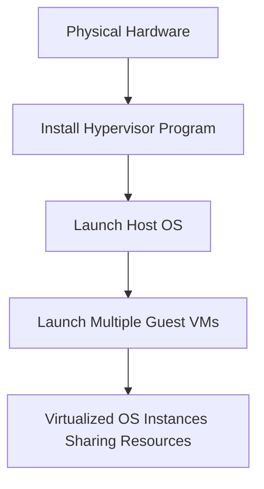
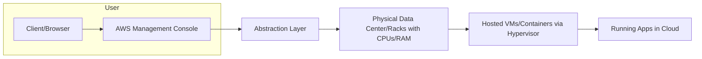

# Session 02: AWS Fundamentals and EC2 Launch Tutorial

## Table of Contents
- [Overview](#overview)
- [Key Concepts](#key-concepts)
- [Deep Dive](#deep-dive)
- [Lab Demo: Launching an EC2 Instance](#lab-demo-launching-an-ec2-instance)
- [Summary](#summary)

## Overview
Session 2 builds on the introduction to the AWS learning journey, emphasizing the core purpose of operating systems (OS) as platforms for running applications. The instructor explains fundamental concepts underlying cloud computing, including three primary methods for launching OS (bare metal, virtualization, and containerization), and how cloud providers like AWS abstract complexity to deliver services on-demand. The session transitions into practical aspects of AWS, covering cloud pricing models, regions/availability zones, and a step-by-step demo of launching an EC2 instance—a virtual server in the AWS cloud. This tutorial-style session sets the foundation for understanding infrastructure-as-a-service (IaaS) concepts and prepares learners for real-world AWS usage.

## Key Concepts

### OS Launching Methods
To run applications (referred to as programs), computers require an operating system (OS) like Windows, Linux, or macOS. There are three primary ways to install and launch an OS:
- **Bare Metal**: Direct installation on physical hardware (e.g., a laptop or server). This provides full hardware control but limits usage to one OS per machine at a time, making it resource-intensive and non-scalable.
- **Virtualization**: Using a hypervisor (a program like VirtualBox, VMware ESXi, or KVM) to run multiple virtual OS instances on shared physical hardware. This enables efficient resource sharing and parallel OS execution.
- **Containerization**: Employing container engines (e.g., Docker, Podman, or Rocket) to launch OS immediately (seconds vs. minutes/hours). Ideal for fast scaling and agility in modern applications.

These methods form the backbone of cloud services, allowing providers to deliver on-demand computing power without users managing physical resources.

### Virtualization Technology
Virtualization solves limitations of bare metal by allowing multiple OS to run on a single physical server:
- A hypervisor abstracts physical resources (CPU, RAM, storage) into virtual environments.
- Common hypervisors include:
  - Oracle VirtualBox (for personal use).
  - VMware ESXi (enterprise-grade).
  - KVM or Xen (open-source).
- In cloud contexts:
  - Host machine: The physical server running the base OS and hypervisor.
  - Guest machines or VMs: Virtual OS instances launched via the hypervisor.
- Benefits: Cost savings, shared resources, quick prototyping of environments.
- AWS uses open-source hypervisors like Xen (traditionally) or Nitro (custom-developed for higher performance and speed). Nitro reduces launch times from minutes to seconds, critical for high-traffic apps.



### Cloud Computing Model
Cloud computing abstracts infrastructure management from users:
- **Abstraction**: Hides complexities of hardware, OS installation, and scaling behind user-friendly web interfaces.
- **Service Models** (e.g., AWS offerings):
  - **Container-as-a-Service (CaaS)**: ECS (Elastic Container Service) for managing containers without user intervention.
  - **Bare Metal-as-a-Service**: Direct physical hardware access (e.g., EC2 Metal).
  - **Compute-as-a-Service (Virtualization)**: EC2 for virtual servers.
- **Pricing**: Pay-as-you-go (hourly, per-minute for some services). Avoids upfront hardware costs; stop instances to halt billing.
  - Free Tier: T2 Micro (1 CPU, 1 GB RAM) offers 750 free hours/month for new accounts.
- **Why Cloud?** Enables quick scaling, reduces costs via shared infrastructure, supports agile development (e.g., Netflix can spin up thousands of servers in seconds for peak demand).

```diff
+ Benefits: Instant access, no hardware maintenance, global reach
- Challenges: Vendor lock-in, learning curve for advanced features
! Key: Cloud charges only for active usage (e.g., running EC2 instances)
```

> [!IMPORTANT]
> Always monitor billing in the AWS Console to avoid unexpected charges—stop unused instances immediately.

### AWS General Services
AWS provides services via its Management Console (web UI):
- **EC2 (Elastic Compute Cloud)**: Virtual servers in the cloud; supports virtualization/container launch.
- **ECS**: Container orchestration (beyond basics).
- Other services referenced: S3 (storage), VPC (networking), CloudWatch (monitoring).
- **Regions and Availability Zones (AZ)**:
  - Regions: Geographic areas (e.g., "ap-south-1" for Mumbai) with isolated data centers.
  - AZs: Subdivisions within regions (e.g., ap-south-1a, -b, -c) for redundancy/fault tolerance.
  - Select regions based on latency (closer = faster) and compliance needs.

> [!NOTE]
> Mumbai region (ap-south-1) used in demo; regions affect pricing and performance.

### AMI, Instance Types, and Networking Basics
- **AMI (Amazon Machine Image)**: Pre-configured OS templates (e.g., Amazon Linux, Ubuntu, Windows) from AWS catalog. Acts like installation DVDs.
- **Instance Types**: Hardware configurations (e.g., T2 Micro: 1 CPU, 1 GB RAM; C5 Metal: bare metal 96 CPUs). Choose based on workload.
- **Key Pairs**: Authentication via downloaded .pem files (secure, passwordless access).
- **Storage**: Default EBS volumes; can be configured.
- **Tenancy** (Shared by default): Share physical hosts with others for cost savings.
- **Security Groups/Firewalls**: contrôle inbound/outbound traffic (advanced topic for future sessions).

> [!WARNING]
> Losing key pair prevents instance access—store securely. EC2 launch configurations are irreversible post-launch (terminate to change).

## Deep Dive

### Cloud Business Model
AWS leverages shared infrastructure for efficiency:
- Physical data centers house racks of servers.
- Hypervisors partition hardware for multiple customers.
- Pricing reflects resource sharing: Free tiers encourage trials; premium for dedicated/metal setups.
- Real-world apps (e.g., Hotstar scaling for cricket matches) rely on quick launches—traditional setups can't match.



### EC2 Instance Lifecycle
1. Select AMI, instance type, region/AZ.
2. Configure key pair, network (defaults suffice for starters).
3. Launch: AWS allocates resources auto.
4. Access via connect (browser/SSH terminal).
5. Use for apps; charges accrue while running.
6. Stop/Terminate: Pauses/stops charging (but data may be lost on termination—use backups).

### Common Pitfalls
- Over-provisioning: Choosing large instances wastes money.
- Forgetting to stop: Accumulates bills (monitor via Billing Dashboard).
- Region selection: Mumbai is cheaper but global users might need closer regions.
- Security: Default security groups may be open; future sessions cover hardening.

### Lesser-Known Facts
- AWS Nitro is custom-developed, outperforming standard hypervisors (inspired by real-world needs).
- Tenancy options (dedicated/host) allow compliance for shared-phobia industries.
- Bunny: VMs aren't "real" but virtual—apps run identically as on physical hardware.

## Lab Demo: Launching an EC2 Instance

Follow these steps to launch a free-tier Linux instance. Use Mumbai region for the demo. Requires active AWS account.

1. **Log Into AWS Console**: Visit console.aws.amazon.com, select Mumbai (ap-south-1).

2. **Navigate to EC2**: Search "EC2" and enter the EC2 Dashboard.

3. **Launch Instance**:
   - Click "Launch Instance".
   - Name: "my-test-linux" (e.g., for identification).
   - AMI: Select "Amazon Linux" (free, minimal OS).
   - Instance Type: Choose "t2.micro" (free tier eligible, 1 CPU, 1 GB RAM).

4. **Configure Key Pair**:
   - Create a new key pair (e.g., name "aws-mumbai-training").
   - Download `.pem` file (secure it—lost key = locked out).
   - File auto-downloads for authentication.

5. **Settings (Defaults)**:
   - Network: Default VPC.
   - Security: Default security group (associate public IP for access).
   - Storage: Default 8 GB (EBS).

6. **Launch**: Review and click "Launch Instance". Status: Pending → Running (1-2 minutes).

7. **Monitor**:
   - Back in EC2 Dashboard, view running instances.
   - Note: Public IP assigned auto.

8. **Connect**:
   - Select instance, click "Connect".
   - Choose "EC2 Instance Connect" (browser-based for simplicity).
   - Open terminal; you're in the Linux OS.

9. **Run Commands** (Test Installation)**:
   - Command: `pwd` (current directory).
   - Command: `ls -l` (list files).
   - Command: `whoami` (user name).
   - Verify virtualization: `lspci | grep -i virt` or in details view (shows hypervisor type).

10. **Post-Usage**:
    - Disconnect.
    - Stop Instance: Check box, "Instance State" → "Stop Instance" (pauses charges; data persists).
    - Terminate: When done permanently (deletes instance/data—backup first).

> [!TIP]
> Practice this tab-free; refer to AWS docs for screenshots.

## Summary

### Key Takeaways
```diff
+ Cloud enables agility: Launch OS in seconds via services like EC2
- Avoid bare metal for cloud learning: Focus on managed services
! Virtualization/containers drive efficiency and speed in AWS
+ Charge only for usage: Free Tier for starters, monitor billing always
```

### Quick Reference
- **Free Tier Instance**: T2 Micro (750 hours/month).
- **Command to Verify Hypervisor**: `lscpu` (shows virtual info).
- **Stop Instance Command (via CLI)**: `aws ec2 stop-instances --instance-ids i-xxxxxxxxxxxxxxxxx`.
- **Billing Dashboard**: console.aws.amazon.com/billing/home.
- **Connect Via SSH Alternative**: `ssh -i key.pem ec2-user@public-ip`.
- **Pricing Calculator**: aws.amazon.com/tco-calculator (estimate costs).

### Expert Insight

#### Real-World Application
In production, EC2 powers scalable architectures (e.g., auto-scaling groups for traffic spikes). Companies like Netflix use Nitro-based EC2 for instant MediaStream containers, handling millions of users. Integrate with monitoring (CloudWatch) for cost/performance optimization.

#### Expert Path
Master advanced EC2 features: Spot Instances for 90% cost savings, Auto Scaling policies, and ECS for containerized apps. Experiment with multi-region deployments for global apps. Pursue certifications like AWS Certified Cloud Practitioner (covers basics) then Solutions Architect (deep dives).

#### Common Pitfalls
- Instance Termination Without Backup: Lost data irreversible (use EBS snapshots).
- Ignoring Regions: High latency can degrade user experience (e.g., US-based users in Mumbai AZ).
- Security Oversights: Weak keys or open ports lead to breaches (learn IAM roles/least privilege).
- Cost Creep: Running unused instances—set alarms in CloudWatch for budgets.

#### Lesser-Known Facts
- AWS started with bare-metal offerings but pivoted to heavy virtualization due to demand.
- Nitro isn't just faster—it's more secure, offloading hypervisor duties to dedicated hardware.
- Tenancy options mimic on-prem setups; shared is default but dedicated host ensures compliance (e.g., for HIPAA).
