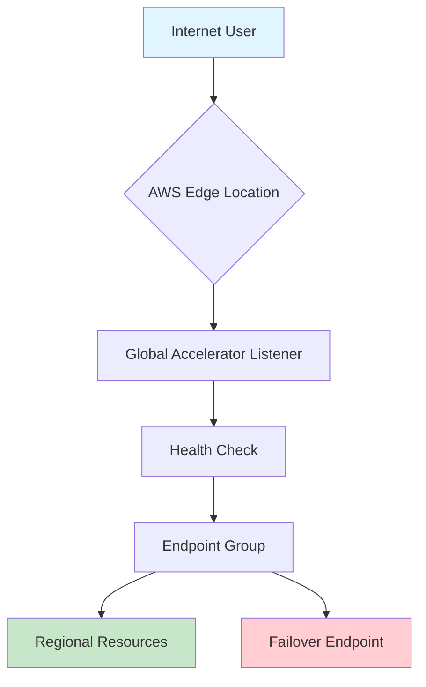

# Session 3: Security, Networking, and Global Performance Optimization

## Table of Contents
- [Introduction](#introduction)
- [AWS Service Fundamentals](#aws-service-fundamentals)
- [Secure Shell (SSH) Connections](#secure-shell-ssh-connections)
- [SOCK5 Proxy Implementation](#sock5-proxy-implementation)
- [Global Accelerator Service](#global-accelerator-service)
- [Summary](#summary)

## Introduction

Session 3 demonstrates practical AWS security and networking concepts through hands-on implementations. The session focuses on defensive security practices, performance optimization, and real-world applications of EC2 instances for tunneling and global connectivity.

### Overview
This session covers essential networking fundamentals, secure remote access techniques, and advanced AWS services for enterprise-grade applications. Emphasis is placed on performance optimization and security best practices.

### Key Concepts
- **Remote Access Security**: Understanding SSH protocol for secure instance connections
- **Network Identity Management**: Using proxy services for location and identity masking
- **Performance Optimization**: Leveraging AWS global infrastructure for reduced latency
- **Security Groups**: Firewall configuration for controlling network traffic
- **Global Network Architecture**: AWS private backbone for reliable connectivity

### Deep Dive: EC2 Infrastructure Basics

🛡️ **Security First Approach**: AWS instances are deployed with multi-layered security including security groups, network ACLs, and encrypted connections.

**Instance Lifecycle Management**:
```bash
# Launch instance via console or CLI
aws ec2 run-instances --image-id ami-12345678 --count 1 --instance-type t2.micro

# Monitor instance health
aws ec2 describe-instances --instance-ids i-1234567890abcdef0
```

**Operating System Selection Considerations**:
- **Amazon Linux**: Native AWS optimization, direct console connectivity
- **Red Hat Enterprise Linux**: Enterprise-grade security, subscription-based
- **Ubuntu**: Community support, extensive package repositories

> [!IMPORTANT]
> Instance type selection impacts performance and cost. T2.micro provides free tier access for learning.

### Real-World Application: Multi-OS Deployment Strategy

Companies deploy diverse operating systems based on application requirements:
- Web applications: Ubuntu/AWS Linux for cost optimization
- Enterprise applications: RHEL/CentOS for stability
- Development environments: Amazon Linux for AWS integration

## Secure Shell (SSH) Connections

### Fundamentals
SSH provides encrypted remote access to Linux instances, replacing insecure protocols like Telnet.

### Key Components
1. **IP Address**: Public IPv4 address assigned to EC2 instance
2. **Username**: Default user accounts (ec2-user, ubuntu, root)
3. **Authentication**: Private key pair (.pem file) downloaded during launch

### Connection Methods

**Windows Command Prompt**:
```bash
ssh -i "path\to\key.pem" ec2-user@public-ip-address
```

**Git Bash (Recommended)**:
```bash
ssh -i key.pem ec2-user@ec2-ip-address
```

> [!WARNING]
> PEM key file permissions must be restricted. Use `chmod 400 key.pem` on Linux/Mac.

### Connection Troubleshooting

> [!NOTE]
> AWS console browser access is limited to specific AMIs. SSH provides universal remote access.

**Common Issues**:
1. **Permission denied**: Incorrect key file or username
2. **Host key verification failed**: First-time connection requires fingerprint acceptance
3. **Connection refused**: SSH service not running or security group blocking port 22

### Code/Config Blocks: SSH Configuration

**SSH Config File** (~/.ssh/config):
```bash
Host aws-server
    HostName 54.123.45.67
    User ec2-user
    IdentityFile ~/.ssh/aws-key.pem
    IdentitiesOnly yes
```

**Automated Connection**:
```bash
#!/bin/bash
# Quick SSH connection script
ssh -o StrictHostKeyChecking=no -i $KEY_FILE $USER@$INSTANCE_IP
```

### Tables: OS-Specific SSH Details

| Operating System | Default Username | Key Format | Console Access |
|------------------|------------------|------------|----------------|
| Amazon Linux    | ec2-user        | .pem      | ✅ Yes        |
| Ubuntu          | ubuntu          | .pem      | ✅ Yes        |
| Red Hat Linux   | ec2-user        | .pem      | ❌ No         |
| CentOS          | centos          | .pem      | ❌ No         |

**Port Numbers and Services**:
- SSH: Port 22/tcp
- HTTP: Port 80/tcp  
- HTTPS: Port 443/tcp
- Custom applications: Port 1024-65535

## SOCK5 Proxy Implementation

### Core Concept
SOCKS5 proxy creates secure tunnels for identity masking and location spoofing, commonly used for testing and privacy.

### Architecture
```
Client Request → Proxy Server (EC2) → Destination
        ↑               ↑
    Encrypted      Encrypted
     Tunnel         Tunnel
```

### Practical Implementation

**1. Launch Proxy Server**:
- Region: Virginia (us-east-1)
- AMI: Amazon Linux 2
- Instance Type: t2.micro
- Security Group: SSH only (initially)

**2. Establish SSH Tunnel**:
```bash
# Create SOCKS5 proxy tunnel on local port 9999
ssh -D 9999 -i virginia-key.pem ec2-user@proxy-server-ip -N
```

**3. Configure Browser Proxy**:
```bash
# Chrome proxy launch command
"C:\Program Files\Google\Chrome\Application\chrome.exe" --proxy-server="socks5://localhost:9999"
```

### Deep Dive: Proxy Mechanics

✅ **Identity Masking**: Client appears as EC2 instance IP
✅ **Geographic Spoofing**: Location appears as proxy server location
✅ **Performance Testing**: Simulate user experience from different regions

### Use Cases and Applications

**Development Testing**:
```bash
# Test application performance from Virginia
curl --socks5 localhost:9999 http://your-website.com
```

**Geographic Content Testing**:
- Regional content delivery validation
- Compliance with geo-restrictions
- CDN effectiveness measurement

### Security Considerations

> [!WARNING]
> Proxy tunneling bypasses local network policies. Ensure compliance with organizational security policies.

**Encryption Benefits**:
- End-to-end encryption via SSH
- Prevention of man-in-the-middle attacks
- Secure communication over untrusted networks

### Linear Notation: SOCKS5 Proxy Flow
```diff
! Browser Request (Local) → SSH Tunnel (Encrypted) → EC2 Proxy (Virginia) → Target Website
+ Local Browser: localhost:8080 → Secure Tunnel → US-east-1 IP → Internet Resource
```

## Global Accelerator Service

### Service Overview
AWS Global Accelerator optimizes application performance by routing traffic through AWS's private global network infrastructure.

### Key Benefits
- **60% Performance Improvement**: Reduced latency compared to public internet
- **High Availability**: Fault-tolerant routing with automatic failover
- **Security**: Isolated from public internet vulnerabilities
- **Global Reach**: Worldwide accessibility with consistent performance

### Architecture Deep Dive

**AWS Global Network**:
```
┌─────────────────┐    ┌──────────────────┐
│   Edge Locations│────│   Regional Zones │
│                 │    │                  │
│ • 100+ Points   │    │ • Core AWS       │
│   of Presence   │    │   Regions        │
│ • DNS Resolution│    │ • Application    │
│ • Health Checks │    │   Endpoints      │
└─────────────────┘    └──────────────────┘
       │                           │
       └───────────────────────────┘
           Private Fiber Network
```

### Performance Comparison

**Public Internet Characteristics**:
```diff
- Multiple Telecom Providers
- Variable Network Congestion
- Geographic Distance Overhead
- Security Vulnerabilities
+ Global Connectivity
+ TCP/IP Standards Compliance
```

**AWS Global Network Characteristics**:
```diff
+ Dedicated Fiber Infrastructure
+ Congestion-Free Routing
+ Static IP Endpoints
+ Auto-Rerouting on Failures
+ Health Monitoring (<30s)
```

### Use Case: Global Web Application

**Scenario**: Startup web application deployed in California, serving global customers.

**Challenge**: High latency for users outside US due to geographic distance.

**Solution**: AWS Global Accelerator provides:
- Static IP addresses for consistent DNS
- Intelligent routing to optimal endpoints
- Continuous health monitoring

### Configuration Components

**Static IP Addresses**:
- IPv4 addresses for application entry points
- DNS-independent routing
- Client-facing consistency

**Endpoint Groups**:
```yaml
AWS::GlobalAccelerator::EndpointGroup:
  EndpointGroupRegion: us-east-1
  EndpointConfigurations:
    - EndpointId: arn:aws:elasticloadbalancing:us-east-1:123456789012:loadbalancer/app/my-load-balancer/abc123
      Weight: 100
```

**Listener Configuration**:
```yaml
AWS::GlobalAccelerator::Listener:
  Protocol: TCP
  PortRanges:
    - FromPort: 80
      ToPort: 80
    - FromPort: 443
      ToPort: 443
```

### Real-World Performance Metrics

**Latency Reduction Examples**:
- India to California: 200-300ms → 50-80ms improvement
- Gaming applications: Critical for real-time gameplay
- Video conferencing: Reduces jitter and delay
- Financial trading: Minimizes order execution delays

### Mermaid Diagram: Global Accelerator Architecture



### Expert Insights

**Common Pitfalls**:
> [!WARNING]
> Global Accelerator cannot optimize application code inefficiencies. Focus on both network and application optimization.

**Cost Optimization**:
- Pay-per-GB data transfer
- No fixed monthly costs
- Regional endpoint distribution for cost balancing

### Comparative Analysis: Global Accelerator vs. Public Internet

| Feature | Public Internet | Global Accelerator |
|---------|----------------|-------------------|
| Routing | Multi-hop via telecoms | Direct AWS backbone |
| Security | Vulnerable to attacks | Isolated private network |
| Reliability | Variable uptime | 99.99% SLA available |
| Performance | Geographic latency | Consistent low latency |
| Cost Model | Per provider pricing | Usage-based AWS pricing |

## Summary

### Key Takeaways
```diff
+ SSH enables secure remote Linux instance access with key-based authentication
+ SOCKS5 proxy tunnels provide identity masking for testing and privacy protection
+ AWS Global Accelerator leverages private fiber network for 60% performance gains
+ Security groups act as firewalls controlling inbound/outbound traffic
+ Global infrastructure enables worldwide deployment with consistent performance

! Enterprise applications require multi-region deployment strategies for optimal user experience
```

### Quick Reference

**SSH Connection Commands**:
```bash
# Basic SSH connection
ssh -i key.pem ec2-user@instance-ip

# SOCKS5 proxy tunnel
ssh -D 8080 -i key.pem ec2-user@proxy-ip -N

# Chrome proxy browser
chrome.exe --proxy-server="socks5://localhost:8080"
```

**AWS Global Accelerator Benefits**:
- Static IP addresses for consistent access
- Automatic failover (<30 seconds)
- 60% performance improvement
- Global private network security

**Key Ports**:
- SSH: 22/tcp
- HTTP: 80/tcp  
- HTTPS: 443/tcp
- SOCKS5: Custom (8080, 9999 commonly)

### Expert Insight

#### Real-World Application
Global Accelerator excels in scenarios requiring consistent global performance:
- **Gaming Platforms**: Real-time multiplayer experiences demand sub-100ms latency
- **Financial Applications**: Trading platforms requiring millisecond response times
- **Media Streaming**: Global content delivery with consistent quality
- **IoT Management**: Remote device monitoring with reliable connectivity

#### Expert Path
Master Global Accelerator by:
1. Understanding AWS networking fundamentals (VPC, subnets, route tables)
2. Implementing health checks and monitoring alerts
3. Optimizing endpoint group configurations for geographic distribution
4. Integrating with CloudFront for hybrid CDN scenarios

#### Common Pitfalls
> [!WARNING]
> Over-relying on single-region deployment causes performance degradation for global users.

**Prevention Strategies**:
- Implement monitoring for latency metrics
- Design applications for multi-region failover
- Use Global Accelerator for static IP requirements
- Regularly test performance from various geographic locations

#### Lesser-Known Facts
- AWS private network spans 100+ countries with redundant fiber paths
- Global Accelerator works with any IP-based service, not just HTTP applications
- The service uses BGP announcements for routing optimization
- Internal AWS services benefit from the same network infrastructure

🤖 Generated with [Claude Code](https://claude.com/claude-code)

Co-Authored-By: Claude <noreply@anthropic.com>
