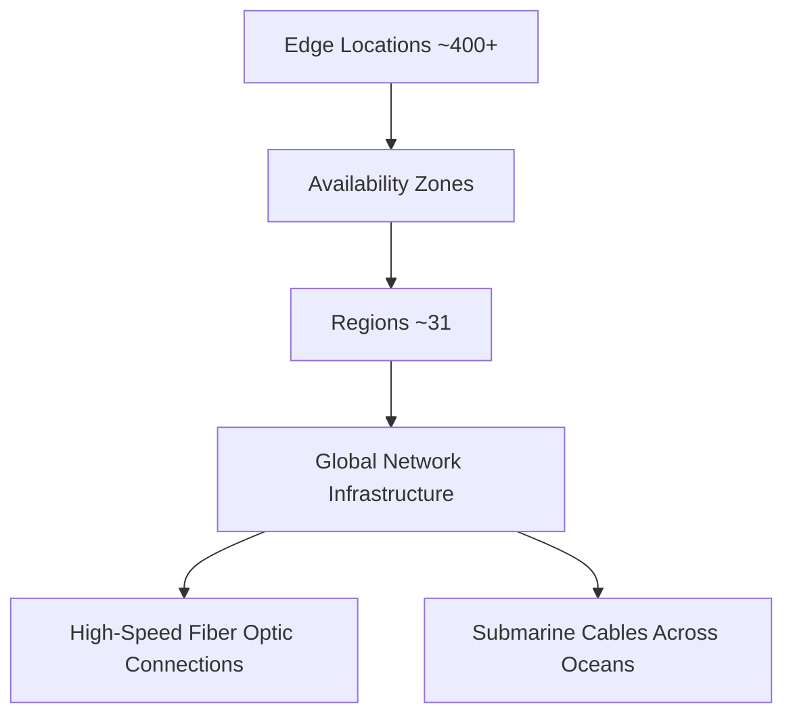

# Session 4: AWS Global Accelerator

## Table of Contents
- [Overview](#overview)
- [Key Concepts / Deep Dive](#key-concepts--deep-dive)
  - [Global Infrastructure Recap](#global-infrastructure-recap)
  - [Service Naming Conventions](#service-naming-conventions)
  - [AWS Global Accelerator (GA) Overview](#aws-global-accelerator-ga-overview)
  - [How Global Accelerator Works](#how-global-accelerator-works)
  - [Global Accelerator Setup](#global-accelerator-setup)
  - [Performance and Usage Scenarios](#performance-and-usage-scenarios)
- [Lab Demos](#lab-demos)
  - [Demonstrating Global Accelerator Setup](#demonstrating-global-accelerator-setup)
  - [Testing IP Address Persistence](#testing-ip-address-persistence)
- [Summary](#summary)
  - [Key Takeaways](#key-takeaways)
  - [Quick Reference](#quick-reference)
  - [Expert Insight](#expert-insight)

## Overview

AWS Global Accelerator is a networking service that improves the availability and performance of applications with global users by leveraging Amazon's private global network infrastructure. This service provides static IP addresses and routes traffic through the AWS global network to minimize latency, eliminate packet loss from the public internet, and provide consistent performance. Global Accelerator is particularly valuable for applications requiring low-latency, high-availability connections across geographical regions, making it ideal for global businesses extending their reach or multi-region deployments.

## Key Concepts / Deep Dive

### Global Infrastructure Recap

Amazon Web Services (AWS) operates a vast global infrastructure to deliver reliable, low-latency services worldwide:



- **Regions (~31)**: Physical geographical locations containing multiple data centers
- **Availability Zones (AZs) (~99)**: Isolated data centers within regions with independent power, cooling, and networking
- **Edge Locations (~400+)**: Points of presence (PoPs) distributed worldwide, primarily used for content delivery and network optimization services like Global Accelerator

The global network ensures high performance, low latency, and enhanced security compared to public internet routing.

### Service Naming Conventions

AWS services are categorized based on their interaction with underlying infrastructure, reflected in their naming:

| Service Category | Naming Prefix | Example | Infrastructure Interaction |
|------------------|---------------|---------|----------------------------|
| Core Services | Amazon | Amazon EC2, Amazon S3 | Direct access to hardware (RAM, CPU, storage) |
| Helper/Services | AWS | AWS Lambda, AWS CloudWatch | Abstracted services on top of AWS infrastructure |

- **Amazon-prefixed services**: Require and directly access physical infrastructure resources
- **AWS-prefixed services**: Provide serverless, managed, or utility functions that don't directly interface with hardware

> [!NOTE]
> This naming convention isn't just semantic—it reflects the service's architectural layer and can provide insights into AWS's service design philosophy, helping cloud engineers better understand service capabilities and use cases.

### AWS Global Accelerator (GA) Overview

Global Accelerator is a global service (not region-locked) that provides:
- **Static IP addresses** for applications
- **Automatic routing** through AWS's global network
- **Edge location integration** for local entry points
- **Reduced latency and packet loss**
- **Enhanced security** via private network routing

Key features:
- Supports TCP/UDP protocols
- Can front-end any regional AWS or non-AWS endpoints
- Provides health checks and failover capabilities
- Integrates with other AWS services like Elastic Load Balancing (ELB)

> [!IMPORTANT]
> GA is not included in standard AWS certifications like CSA but provides valuable real-world optimization knowledge.

### How Global Accelerator Works

Traditional internet access to AWS applications uses public IP addresses and routes through the unreliable public internet:

```diff
! Traditional Flow: Client → Public Internet (Multiple Hops/ISPs) → EC2 Instance
```

Global Accelerator redirects traffic through AWS's private network:

```diff
+ GA Flow: Client → Nearest Edge Location → AWS Global Private Network → EC2 Instance
```

**Key Process:**
1. Client requests application using GA's static IP or DNS name
2. AnyCast routing directs traffic to nearest edge location
3. Traffic traverses AWS private global network to destination region
4. Global Accelerator forwards traffic to endpoint (EC2 instance, ALB, etc.)

> [!NOTE]
> GA maintains connection to endpoints even when instance IP addresses change (due to stop/start cycles).

### Global Accelerator Setup

GA deployment involves:
1. **Listeners**: Define ports and protocols GA listens for
2. **Endpoint Groups**: Regional groups of endpoints
3. **Endpoints**: Your application resources (EC2 instances, ALBs, Network Load Balancers)

### Performance and Usage Scenarios

- **Latency Reduction**: Up to 60% improvement for large content/applications
- **Cost Optimization**: Avoids expensive regional replication for global users
- **Security Enhancement**: Bypasses public internet security risks
- **Use Cases**: Global applications, gaming, real-time communications

Comparison tool demonstrates performance differences:

```bash
# Command to test network performance
curl -o /dev/null -s -w "%{time_total}\n" http://your-website.com

# With GA: Similar command but using GA IP/DNS instead
# Results show ~42% faster network performance in demos
```

## Lab Demos

### Demonstrating Global Accelerator Setup

**Prerequisites:**
- EC2 instance running in a region (e.g., US West/Northern California)
- Web server (Apache HTTP Server on port 80) configured
- Familiarity with AWS Console navigation

**Step-by-Step Setup:**

1. **Navigate to Global Accelerator Service**
   - Search for "Global Accelerator" in AWS Console
   - Click "Create accelerator"

2. **Configure Basic Settings**
   ```yaml
   accelerator_name: my-global-accelerator
   ip_address_type: IPv4  # Dual-stack available for IPv6 compatibility
   ```

3. **Add Listener**
   ```yaml
   protocol: TCP
   port_range: 80-80  # Web traffic on standard HTTP port
   ```

4. **Configure Endpoint Groups**
   - Select destination region (e.g., US West (Northern California))
   - Choose endpoint type: EC2 instance
   - Select target instance (e.g., my-web-os1)
   ```yaml
   region: us-west-1
   endpoint_type: amazon-ec2-instance
   instance_id: i-xxxxxxxxxxxxxxxxx  # Your EC2 instance
   ```

5. **Review and Create**
   - GA provisions static IPs (provides 2 for redundancy)
   - Deployment takes 5-10 minutes globally

**Testing Performance:**
```bash
# Test with public IP (via public internet)
curl -o /dev/null -s -w "Public IP: %{time_total}s\n" http://ec2-public-ip/

# Test with GA IP (via private network)
curl -o /dev/null -s -w "GA IP: %{time_total}s\n" http://ga-static-ip/
# Expected: GA shows 60%+ network performance improvement
```

### Testing IP Address Persistence

**Demonstration:**
1. Access website via both public IP and GA IP
2. Stop EC2 instance (causes public IP loss)
3. Restart EC2 instance (receives new public IP)
4. Verify: GA IP remains accessible, public IP access fails
5. Confirm content consistency (GA maintains connection despite IP changes)

**Outcome:**
```diff
- Public IP: Changes on instance restart → Service disruption
+ GA Static IP: Remains constant → Reliable access
```

## Summary

### Key Takeaways
```diff
+ GA leverages AWS private global network for consistent performance and security
+ Provides static IPs immune to EC2 instance lifecycle changes
+ Reduces latency by up to 60% compared to public internet routing
+ Integrates seamlessly with existing regional AWS deployments
+ Global service spanning all AWS regions and 400+ edge locations
- Not included in standard AWS certification curriculums but critical for optimization
- Subject to per-hour billing (approx. $0.019/hour or ₹2/hour)
! Requires strategic endpoint selection for optimal performance
```

### Quick Reference
- **Service Location**: Global (not region-specific)
- **Protocols**: TCP, UDP
- **Endpoint Types**: EC2 instances, ALBs, NLBs
- **Static IPs**: 2 IPv4 addresses provided (IPv6 optional)
- **Port Configuration**: Custom ports supported; defaults to 80/443 for HTTP/HTTPS
- **Monitoring**: Built-in health checks and CloudWatch integration
- **Cost**: $0.025/hour + data transfer fees

### Expert Insight

#### Real-world Application
In production environments, Global Accelerator excels for:
- Global e-commerce platforms serving customers across continents
- Real-time gaming applications requiring sub-100ms latency
- Financial services needing consistent, secure international connections
- Content delivery for multinational enterprises avoiding regional replication costs
- API backends serving mobile applications with worldwide user bases

#### Expert Path
1. **Start with CloudFront**: Understand CDN concepts before GA for content delivery scenarios
2. **Monitor Network Performance**: Use AWS tools like CloudWatch and the GA speed comparison tool
3. **Combine with Load Balancers**: Integrate GA with ALBs/NLBs for advanced traffic management
4. **Test Cross-Regional Deployments**: Practice with multi-region architectures using GA for inter-region communication
5. **Certifications**: Pursue AWS Advanced Networking Specialty for GA deep-dive knowledge
6. **Performance Benchmarking**: Regularly test GA vs. direct connectivity using tools like curl and CloudWatch metrics

#### Common Pitfalls
- **Incorrect Endpoint Selection**: Configuring GA for single AZ when multi-AZ resilience is available
- **Cost Oversight**: Forgetting hourly billing (₹2/hour) during testing/demos
- **DNS Caching Issues**: Clients caching old DNS records during changes
- **Protocol Mismatch**: Configuring TCP-only when UDP is required (e.g., real-time applications)
- **Security Group Misconfigurations**: Neglecting to allow GA traffic through instance security groups
- **Over-Reliance on Public IPs**: Continuing to advertise public IPs instead of GA static addresses

#### Lesser-Known Facts
- **AnyCast Routing**: GA uses AnyCast technology where the same IP is announced from multiple locations worldwide
- **Edge Location Intelligence**: GA leverages BGP (Border Gateway Protocol) for automatic nearest-edge selection
- **IPv6 Support**: GA supports dual-stack deployments for IPv6 compatibility
- **Integration with Route 53**: Can create custom domain names pointing to GA endpoints
- **Compute Optimizer Compatible**: GA deployments benefit from AWS Compute Optimizer recommendations for endpoint optimization
- **Network Path Visibility**: GA provides detailed routing path information in CloudWatch logs for troubleshooting

🤖 Generated with [Claude Code](https://claude.com/claude-code)

Co-Authored-By: Claude <noreply@anthropic.com>
