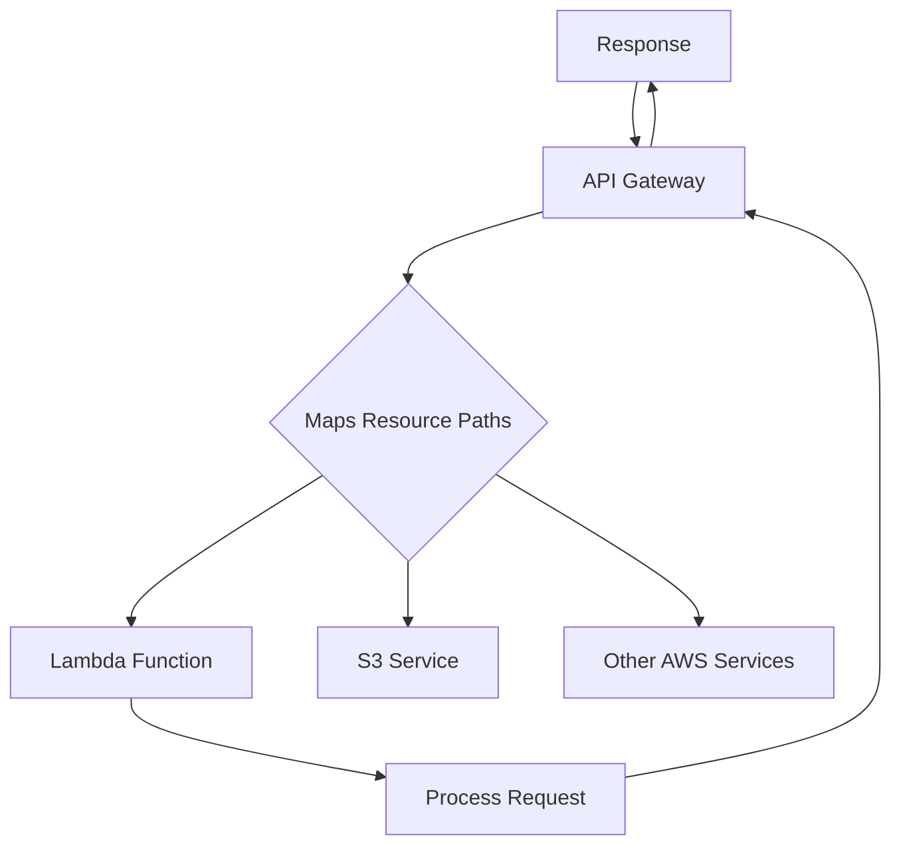

# Session 8: API Gateway Introduction

## Table of Contents
- [API Gateway Introduction](#api-gateway-introduction)
  - [Overview](#overview)
  - [Key Concepts](#key-concepts)
  - [REST API Concepts](#rest-api-concepts)
  - [HTTP Methods and Routing](#http-methods-and-routing)
  - [API Gateway Setup](#api-gateway-setup)
  - [Integration Types](#integration-types)
  - [Lambda Proxy Integration](#lambda-proxy-integration)
  - [Deployment and Testing](#deployment-and-testing)
  - [Security and API Keys](#security-and-api-keys)
  - [Use Cases and Real-world Applications](#use-cases-and-real-world-applications)
  - [Lab Demo: API Gateway with Lambda](#lab-demo-api-gateway-with-lambda)
- [Summary](#summary)
  - [Key Takeaways](#key-takeaways)
  - [Quick Reference](#quick-reference)
  - [Expert Insight](#expert-insight)

## API Gateway Introduction

### Overview
This session introduces Amazon API Gateway as a fully managed serverless service that acts as a gateway between client applications and backend services. It covers core concepts of APIs, REST architecture, HTTP methods, integration with AWS Lambda for serverless computing, and practical demonstrations of creating public endpoints. The focus is on enabling secure, scalable, and cost-effective communication between internet clients and AWS services without managing infrastructure.

### Key Concepts
- **API Gateway**: A serverless service that manages, secures, and scales APIs, providing a single entry point for applications to access backend services.
- **Serverless Architecture**: Services that run without server management, automatically scaling based on demand.
- **API (Application Programming Interface)**: An interface that allows different applications to communicate with each other.
- **REST API**: A set of architectural principles for designing web services using standard HTTP methods.
- **Backend Services**: AWS services like Lambda, S3, DynamoDB that API Gateway routes requests to.
- **Integration**: The connection between API Gateway and backend services (Lambda, HTTP endpoints, AWS services).
- **Resources and Methods**: Resources represent API paths while methods represent HTTP verbs (GET, POST, etc.).

> [!IMPORTANT]
> API Gateway enables public access to private AWS services through secure, managed endpoints without exposing infrastructure.

### REST API Concepts



- **API as Interface**: Functions or applications need interfaces to be accessible from external systems.
- **HTTP Protocol**: Standard communication protocol for client-server interactions.
- **URL Components**:
  - Host Name: The domain (e.g., google.com)
  - Resource Path: The specific endpoint (e.g., /search, /mail)
- **Client-Server Communication**: Request-Response model using HTTP methods.

> [!NOTE]
> Microservices architecture heavily relies on APIs for inter-service communication, making API Gateway essential for modern application design.

### HTTP Methods and Routing
HTTP methods define the action a client wants to perform:

| Method | Purpose | Example |
|--------|---------|---------|
| GET | Retrieve data | Fetching user profiles |
| POST | Create new resources | Uploading files |
| PUT | Update existing resources | Modifying user data |
| DELETE | Remove resources | Deleting records |
| PATCH | Partial updates | Updating specific fields |

```diff
! Client Request Flow: Client → API Gateway → Resource Path Mapping → Backend Service
```

- **Resource Paths**: URL segments after the host (e.g., `/mail` routes to email service).
- **Routing Logic**: API Gateway uses resource paths to determine which backend service to invoke.
- **Request Processing**: Headers contain method information, body contains data.

### API Gateway Setup
- **Service Creation**: Use AWS Management Console to create REST API type.
- **Resources**: Create resource paths (e.g., /search, /mail) under root (/).
- **Methods**: Add HTTP methods to resources and configure backend integrations.
- **Integration Types**: Choose how API Gateway connects to backend services.
  - Lambda Function
  - HTTP Endpoint
  - AWS Service
  - Mock Integration

```bash
# Example API Gateway URL structure
https://<api-id>.execute-api.<region>.amazonaws.com/<stage>/<resource-path>
```

### Integration Types
Two main integration approaches:

#### Normal Integration
```
Client Request → API Gateway → New Request Created → Backend Service → Response Back → API Gateway → Client
```
- API Gateway acts as a proxy, creating new requests to backend services.
- Lambda receives only processed data, not full client information.
- API Gateway manages status codes and headers.

#### Lambda Proxy Integration
```
Client Request → API Gateway (Pass-through) → Backend Service → Direct Response → Client
```
- All client information (headers, IP, browser info) passed directly to Lambda.
- Lambda must return complete HTTP response including status codes.
- Better for applications needing full client context.

### Lambda Proxy Integration

```diff
+ Advantage: Backend receives complete client information (IP, headers, browser data)
+ Use Case: Applications requiring client logging, authentication, or geolocation decisions
- Challenge: Lambda must return both body and HTTP status code in response
```

- **Event Structure**: API Gateway sends complete request data as JSON event to Lambda.
- **Response Format**: Lambda returns object with `statusCode`, `body`, and optional `headers`.
- **Information Available**:
  - Request method and path
  - Query parameters
  - Headers (User-Agent, IP address)
  - Request body
  - Client IP and browser information

### Deployment and Testing
- **Stages**: Deployment environments (dev, test, prod) for API versioning.
- **Deployment Process**: Create deployment stage and invoke URL becomes available.
- **Testing**: API Gateway console provides test capability for each resource method.
- **Public Access**: Once deployed, APIs are accessible via public URLs.
- **Client Tools**:
  - Web browsers (for GET requests)
  - curl command for HTTP testing
  - Postman for API testing

### Security and API Keys
- **Default Behavior**: APIs are publicly accessible.
- **API Key Protection**: Require API keys for access control.
- **Usage Plans**: Limit requests per time period, track usage.
- **Advanced Security**: IAM authentication, Lambda authorizers, Cognito integration.

> [!WARNING]
> Without proper security configuration, deployed APIs can be accessed by anyone with the URL.

### Use Cases and Real-world Applications

#### S3 Upload Through API Gateway
```
Internet Client → API Gateway → Lambda → S3 Bucket Upload
```
- Enables public file uploads to private S3 buckets.
- Lambda handles preprocessing, validation, and S3 interactions.

#### Lambda Function Invocation
```
Internet Client → API Gateway → Lambda Function → Response
```
- Run serverless functions via HTTP requests.
- Useful for image processing, data validation, notifications.

#### Usage-Based Applications
```
Client → API Gateway → Usage Plan (Premium/Free Tiers) → Backend Services
```
- Different access levels based on subscription tiers.
- Rate limiting and throttling per client.

#### Data Filtering and Validation
```
Client Request → API Gateway → Filter/Middleware → Backend Service
```
- Pre-process requests before reaching backend.
- Validate input data and reject malicious content.

### Lab Demo: API Gateway with Lambda

#### Setting Up Lambda Functions
1. Create Lambda function "my-app-one" with Python runtime:
```python
def lambda_handler(event, context):
    return {
        'statusCode': 200,
        'body': json.dumps('I am Linux World')
    }
```

2. Create second function "my-app-two" for mail endpoint.

#### Creating API Gateway
1. **Create REST API**:
   - API name: "my-api-test"
   - Create resources: `/search` and `/mail`

2. **Add Methods**:
   - Add GET method to `/search` and `/mail` resources
   - Integration type: Lambda function

3. **Configure Lambda Proxy**:
   - Enable "Use Lambda Proxy integration" for full client data access

#### Deployment Steps
1. **Deploy API**:
   - Create deployment stage: "test"
   - Note the invoke URL

2. **Access URLs**:
   ```
   https://<api-id>.execute-api.us-west-2.amazonaws.com/test/search
   https://<api-id>.execute-api.us-west-2.amazonaws.com/test/mail
   ```

3. **Testing from Browser**:
   - Access URLs directly (GET requests)
   - View responses in browser

4. **Testing with curl**:
```bash
curl -X GET https://<api-id>.execute-api.us-west-2.amazonaws.com/test/search
```

#### Lambda Function with Client Information
```python
import json

def lambda_handler(event, context):
    # Access client information
    client_ip = event['requestContext']['identity']['sourceIp']
    browser = event['headers']['User-Agent']

    return {
        'statusCode': 200,
        'body': json.dumps(f'I know your IP: {client_ip}, Browser: {browser}')
    }
```

#### Monitoring and Logs
- **CloudWatch Logs**: View Lambda execution logs
- **API Gateway Metrics**: Track request counts and errors
- **Kinesis Integration**: Forward logs to data streams for analysis

## Summary

### Key Takeaways
```diff
+ API Gateway enables public access to serverless backends without infrastructure management
+ Lambda Proxy integration provides full client context to backend services
- HTTP responses require proper status codes and content-type headers
! REST APIs form the foundation of modern microservices architecture
```

### Quick Reference
- **HTTP Methods**: GET (read), POST (create), PUT (update), DELETE (remove), PATCH (modify)
- **Integration Types**: Lambda Function, HTTP Endpoint, AWS Service, Mock
- **API Gateway URL**: `https://<api-id>.execute-api.<region>.amazonaws.com/<stage>/<resource>`
- **Lambda Response Format**: `{'statusCode': 200, 'body': json.dumps('response')}`
- **Client Data Access**: `event['requestContext']['identity']` for IP/browser info
- **Commands**: `curl -X GET <api-url>`, browser direct access
- **Security**: Enable API keys, configure usage plans

### Expert Insight

#### Real-world Application
API Gateway powers serverless web applications, mobile backends, and IoT data ingestion. In production, implement caching layers, rate limiting, and authentication to handle millions of requests efficiently while maintaining security.

#### Expert Path
Deepen understanding by implementing custom Lambda authorizers, mastering API Gateway mapping templates for data transformation, and exploring WebSocket APIs for real-time applications. Study design patterns for microservices communication and optimize for cost using usage plans.

#### Common Pitfalls
- **Missing Status Codes**: Lambda proxy integration requires explicit status codes in responses.
- **Header Case Sensitivity**: HTTP headers are case-sensitive; use proper casing.
- **CORS Configuration**: Enable CORS for web applications accessing APIs from different domains.
- **Cold Start Delays**: Implement provisioned concurrency for latency-sensitive applications.
- **API Limits**: Monitor account-level API Gateway limits (calls per second, connections).

#### Lesser-Known Facts
API Gateway supports request/response transformation through mapping templates, enabling data format conversion (e.g., XML to JSON). The service automatically handles SSL/TLS termination and can integrate with AWS WAF for advanced security. Binary payloads are supported alongside JSON, enabling image/file processing through Lambda integrations.
