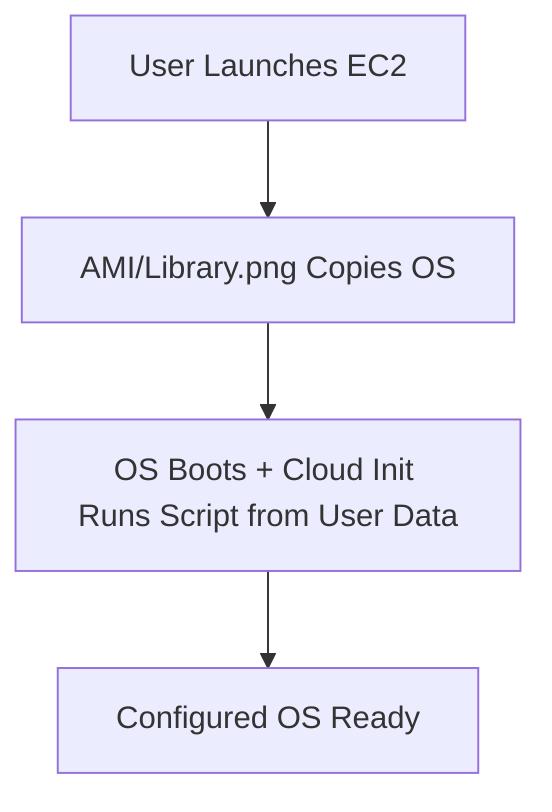

# Session 11: EC2 Automation with User Data and Cloud Init

## Table of Contents
- [Overview](#overview)
- [Configuration Management](#configuration-management)
- [Cloud Init Overview](#cloud-init-overview)
- [AMI and Cloud Images](#ami-and-cloud-images)
- [Cloud Init Boot Process](#cloud-init-boot-process)
- [Metadata Server and User Data](#metadata-server-and-user-data)
- [Retrieving Instance Metadata](#retrieving-instance-metadata)
- [Modifying User Data](#modifying-user-data)
- [Script Headers and Multi-Language Support](#script-headers-and-multi-language-support)
- [Running User Data on Every Boot](#running-user-data-on-every-boot)
- [Lab Demos](#lab-demos)
- [Troubleshooting Cloud Init](#troubleshooting-cloud-init)
- [Summary](#summary)

## Overview
This session explores automating configurations in EC2 instances using AWS services like System Manager (reviewed from Session 10) and introduces Cloud Init for boot-time setup. It covers use cases where manual or centralized management via System Manager isn't ideal, emphasizing scripting for OS configuration during launch. Beginners learn why EC2's compute service (CPU/RAM for running OSes) requires careful management, and practical demos show real-world automation scenarios.

```diff
! Key concept: EC2 instances need OS configurations for running services like databases or web apps. Automation prevents repetitive manual setups.
```

## Configuration Management
EC2 instances run on installed operating systems, where services like web servers or databases require pre-launch configurations (e.g., software installation, file creation). Traditional methods include:
- **Manual Configuration**: SSH into the instance post-launch and run commands/scripts. Suitable for few instances but scales poorly.
- **Centralized Management**: Use AWS System Manager for managing multiple instances via sessions, agents, or commands. Ideal when controlling numerous systems uniformly.

Drawbacks: Both occur after OS launch/boot; boot-time configs need different tools.

```bash
# Example manual setup via SSH:
ssh -i key.pem ec2-user@instance-ip
sudo yum install httpd  # Install Apache on Amazon Linux
sudo systemctl start httpd
```

Best for: One-off changes or small-scale ops.

## Cloud Init Overview
Cloud Init is an industry-standard, open-source service (hosted at cloudinit.org) for multi-cloud boot-time OS configuration. In AWS, it's pre-installed in most AMIs, running scripts from User Data during boot, before login prompt.

- Supports cross-cloud platforms (AWS, Azure, OpenStack).
- Handles complex setups like dependencies, downloads, or service checks.
- Default: Runs User Data only on first boot unless configured otherwise.

Use case: Run scripts automatically during OS boot for initial setups, avoiding post-launch manual work.

```diff
+ Advantage: Boot-time automation eliminates login steps for config-dependent services.
- Limitation: Only works pre-login; for ongoing changes, use System Manager.
```

## AMI and Cloud Images
AMIs (Amazon Machine Images) are bootable OS templates containing pre-installed software, software inter preters, and configs. When launching an EC2 instance, the AMI copies its contents.

- Cloud images include Cloud Init by default, enabling boot scripting.
- Custom AMIs can embed Cloud Init or scripts.
- Format: Specific to providers (AMI for AWS, others for Azure/OpenStack).

Example use: Amazon Linux AMI includes bash shell support for User Data scripts.



This ensures consistent instance setups across launches.

## Cloud Init Boot Process
During EC2 launch:
1. AMI installs OS.
2. OS powers on (boot begins).
3. Cloud Init program (in AMI) starts automatically.
4. Contacts metadata server at IP 169.254.169.254 (AWS-internal).
5. Downloads and executes User Data scripts.
6. Completes only after scripts finish; then login becomes available.

If no User Data, Cloud Init logs completion with no actions.

Boot logs (e.g., `/var/log/cloud-init.log`) track execution for troubleshooting.

```diff
! Process Flow: Launch → Install OS → Boot → Cloud Init Fetch/Run User Data → Login Ready
```

## Metadata Server and User Data
- **Metadata Server**: AWS-managed service per instance, storing instance-specific info (e.g., instance ID, region, AMI) and User Data (scripts/commands).
- **User Data**: Customer-provided scripts in metadata server; Cloud Init retrieves and runs them.
- Accessible only from within the instance (not externally) via HTTP at 169.254.169.254.

User Data enables boot-time configs like directory creation or software installs, stored securely in metadata.

```diff
+ Benefit: Metadata provides instance context (e.g., region) for dynamic configs.
- Risk: Mishandle scripts (e.g., syntax errors) can fail boot.
```

Access path: `http://169.254.169.254/latest/meta-data/` or `/user-data/`.

## Retrieving Instance Metadata
From inside an instance, use `curl` to fetch metadata without leaving the OS.

- **Public IP**: `curl http://169.254.169.254/latest/meta-data/public-ipv4`
- **Private IP**: `curl http://169.254.169.254/latest/meta-data/local-ipv4` (or `ifconfig`)
- **Instance ID**: `curl http://169.254.169.254/latest/meta-data/instance-id`
- **Region**: `curl http://169.254.169.254/latest/meta-data/placement/availability-zone` (remove last char for region)
- **User Data**: `curl http://169.254.169.254/latest/user-data`

Why useful? Apps can adapt based on data center (e.g., greet in local language via region).

## Modifying User Data
User Data changes require:
1. Stop the instance.
2. From EC2 Console > Actions > Instance Settings > Edit User Data.
3. Update scripts and save.
4. Start instance; applies on next boot.

Changes don't affect running instances—only future boots.

> [!WARNING]
> Scripts run without user intervention; test thoroughly as failures may break boot.

## Script Headers and Multi-Language Support
User Data supports multiple scripting languages (bash, Python, PowerShell) in one block via headers (e.g., `#!/bin/bash`). Without headers, content treats as plain text, causing failures.

Example:
```
#!/bin/bash
mkdir /tmp/test-dir
yum update -y
```

Direct commands without shebangs fail as plain text.

Headers enable multi-language mixing (e.g., bash + Python).

## Running User Data on Every Boot
By default, Cloud Init runs User Data only once (first boot). For every-boot execution, use cloud-config YAML with keyword `always`.

Example structure:
```yaml
#cloud-config
cloud_final_modules:
- [scripts-user, always]

# Here goes your script
runcmd:
- mkdir /tmp/every-boot-dir
- echo "Updated on boot" >> /tmp/log.txt
```

Save in User Data; Cloud Init enforces repetition.

## Lab Demos
### Demo 1: Basic User Data Setup
1. Launch EC2 instance.
2. In Advanced Details > User Data, add: `#!/bin/bash` \n `mkdir /tmp/demo-dir`.
3. Launch; connect and verify directory created.
4. View boot log: `cat /var/log/cloud-init.log` for execution details.

### Demo 2: Modifying User Data for Next Boot
1. Stop instance.
2. Edit User Data to add another dir: `mkdir /tmp/new-dir`.
3. Start instance; verify both dirs exist (older via always config if applied).
4. Retrieve User Data: `curl http://169.254.169.254/latest/user-data` to confirm.

### Demo 3: Metadata Retrieval
1. Inside instance: `curl http://169.254.169.254/latest/meta-data/instance-id`
2. Compare with console to validate.
3. Use for dynamic scripts, e.g., logging region.

## Troubleshooting Cloud Init
- **Logs**: Primary source: `/var/log/cloud-init.log` and `/var/log/cloud-init-output.log`.
- **Errors**: Check for syntax issues (e.g., missing shebang), network failures, or incorrect IP access.
- **If Fails**: Review User Data format; test scripts manually.
- **Advanced**: Cloud Init docs (cloudinit.org) for modules like `always`.

> [!NOTE]
> Cloud Init runs pre-login; failures delay system availability.

## Summary
### Key Takeaways
```diff
+ EC2 automation spans System Manager (post-launch) and Cloud Init/User Data (boot-time).
+ Metadata server centralizes instance info and User Data for secure retrieval.
- Cloud Init defaults to once-per-instance; use 'always' for repetition.
! Always script with headers; plain text fails execution.
+ Real-world: Boot configs for web servers or app dependencies.
```

### Quick Reference
- Launch with User Data: `#!/bin/bash` \n `mkdir /dir`
- Retrieve metadata: `curl http://169.254.169.254/latest/meta-data/instance-id`
- Always boot script:
  ```yaml
  #cloud-config
  cloud_final_modules:
  - [scripts-user, always]
  runcmd:
  - your-command
  ```
- Boot logs: `/var/log/cloud-init.log`

### Expert Insight
#### Real-World Application
Use User Data for automated app deployments (e.g., install Docker, pull images, start services) on launch. Scales with auto-scaling; ensures consistent configs across fleets.

#### Expert Path
Master Cloud Init modules (e.g., package installation, filesystem mounts); integrate with tools like Terraform for infra-as-code. Study AWS docs for metadata use in high-availability apps.

#### Common Pitfalls
- Forgetting shebangs: Scripts treat as text, no execution—check logs.
- Not stopping instance for edits: Changes don't apply until next boot cycle.
- Over-relying on User Data for runtime changes: Switch to System Manager for dynamic adjustments.
- Ignoring permissions: Scripts run as root; ensure safe commands to avoid system breaks.

#### Lesser-Known Facts
Cloud Init packs double metadata/userdata; metadata auto-populates instance details Cloud Init fetches. Historical: Originally for Ubuntu, now multi-cloud universal.

🤖 Generated with [Claude Code](https://claude.com/claude-code)

Co-Authored-By: Claude <noreply@anthropic.com>
