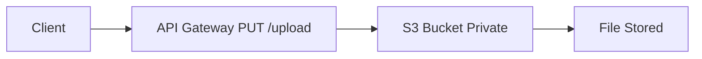

# Session 12: AWS Serverless - API Gateway and Lambda Data Integration

## Table of Contents
- [Serverless and Microservices Overview](#serverless-and-microservices-overview)
- [Lambda Proxy Integration](#lambda-proxy-integration)
- [Passing Data to Lambda Functions](#passing-data-to-lambda-functions)
- [HTTP Methods and Data Transmission Types](#http-methods-and-data-transmission-types)
- [Practical Demos with Postman](#practical-demos-with-postman)
- [Path Parameters](#path-parameters)
- [Uploading Files to S3 with API Gateway](#uploading-files-to-s3-with-api-gateway)
- [Summary](#summary)

## Serverless and Microservices Overview

### Key Concepts / Deep Dive
Serverless computing leverages Function as a Service (FaaS) platforms like AWS Lambda, which run code in response to events without provisioning or managing servers. Unlike traditional servers that run continuously, serverless functions execute only when triggered, making them ideal for event-driven applications.

A microservice is a small, independent service that performs a single functionality. For example, an audio-to-text converter (like Amazon Transcribe) or a data processor qualifies as a microservice. Serverless functions in Lambda embody microservice principles by providing on-demand execution.

Functions can be triggered by events such as HTTP requests via API Gateway, S3 object uploads, or scheduled events. When an event occurs, input data is passed to the function, which processes it and returns output. This event-driven model supports scalability and cost-efficiency, as billing is based on actual compute time rather than reserved capacity.

**Key Terminologies:**
- **Event**: An occurrence that triggers a function, containing input data (e.g., user click data for analytics).
- **Algorithm/Function Logic**: The code executed to process input and generate output.
- **Output/Response**: The result sent back, often as JSON data or via API Gateway.

Functions handle various use cases, including data processing, API responses, or integrations with services like S3 and Transcribe.

> [!NOTE]
> In real-world scenarios, microservices on serverless platforms reduce operational overhead but require careful design for data flow and error handling.

### Code/Config Blocks
Example Lambda function in Python for basic response:

```python
def lambda_handler(event, context):
    return {
        'statusCode': 200,
        'body': 'Welcome to Linux World',
        'headers': {
            'Content-Type': 'application/json'
        }
    }
```

### Tables

| Concept | Description | Example |
|---------|-------------|---------|
| Function as a Service (FaaS) | Run code on-demand without servers | AWS Lambda |
| Event-Driven | Triggered by events, processes input/output | HTTP request via API Gateway |
| Microservice | Single-purpose service | Data transformation module |
| Cost Model | Pay per execution | Milliseconds of compute time |

## Lambda Proxy Integration

### Key Concepts / Deep Dive
API Gateway acts as a proxy between external clients and backend services like Lambda. Lambda Proxy Integration enables API Gateway to pass client requests (including headers, body, and metadata) directly to Lambda as an event object.

Standard proxy (non-Lambda) integration stops client data in API Gateway and only forwards processed information. In contrast, Lambda Proxy is a "pass-through" setup, allowing full data flow to Lambda for customized processing. This is essential when Lambda needs to access client details directly (e.g., IP address, user agent, custom headers) for business logic.

**Setup Steps:**
1. Create an API Gateway method (e.g., GET, POST).
2. Set integration type to Lambda Proxy.
3. Specify Lambda function ARN.
4. Deploy the API.

The event passed to Lambda includes:
- `httpMethod`
- `path`
- `headers`
- `queryStringParameters`
- `body`

> [!IMPORTANT]
> Lambda Proxy is crucial for direct data handling; misconfiguration can lead to data loss.

### Code/Config Blocks
Lambda function accessing event data:

```python
def lambda_handler(event, context):
    print(event)  # Logs entire event for debugging
    http_method = event['httpMethod']
    if http_method == 'GET':
        return {
            'statusCode': 200,
            'body': 'Welcome to Linux World'
        }
    elif http_method == 'POST':
        return {
            'statusCode': 200,
            'body': 'Post received'
        }
```

### Lab Demos
1. Create a Lambda function and log the event.
2. Integrate via Lambda Proxy in API Gateway.
3. Test with Postman; observe event data in CloudWatch logs.

## Passing Data to Lambda Functions

### Key Concepts / Deep Dive
Clients send data to Lambda via API Gateway. Data can be passed in URLs (query strings), headers, or request body. Common scenarios include form submissions, JSON payloads, or file uploads.

**Authentication Note:** Sensitive data (e.g., passwords) should be sent via POST in headers or body, not query strings, to avoid URL exposure.

### Code/Config Blocks
Handling JSON data:

```python
import json

def lambda_handler(event, context):
    body = event['body']
    data = json.loads(body)  # Convert to dict
    name = data['name']
    return {
        'statusCode': 200,
        'body': f"I know your name: {name}"
    }
```

## HTTP Methods and Data Transmission Types

### Key Concepts / Deep Dive
HTTP methods determine data transmission. GET reads data, POST creates/sends data, PUT uploads files, DELETE removes resources.

**GET:** Used for reading/public data. Data via query strings visible in URLs.

**POST:** For private/sensitive data. Subtypes include:
- **Form Data (URL-encoded):** Web forms, e.g., login pages.
- **Row/JSON Data:** Services exchanging structured data, e.g., microservices.

**PUT:** For file uploads (binary data), e.g., images to S3.

### Tables

| Method | Use Case | Data Visibility | Example |
|--------|----------|-----------------|---------|
| GET | Read data | Visible in URL | Wikipedia search |
| POST (Form) | User forms | Hidden in headers | Login pages |
| POST (Row/JSON) | Service-to-service | Hidden in payload | API integrations |
| PUT | File uploads | Hidden in payload | Image/video uploads |

### Diff Blocks
```diff
+ GET: Suitable for public reads with query strings
- POST: Required for private data to prevent URL exposure
! PUT: Specialized for binary files
```

## Practical Demos with Postman

### Key Concepts / Deep Dive
Postman simulates clients for testing APIs. It supports all HTTP methods, simulating end users, services, or file uploads.

**Setup:**
1. Install Postman.
2. Create collections as folders for tests.
3. Enter URL, select method, and send requests.

### Lab Demos
1. Test GET with query strings (e.g., name=Linux).
2. Test POST with JSON body.
3. Verify responses in Postman and CloudWatch logs.

> [!WARNING]
> Browser limitations mean only GET works natively; Postman enables full testing.

## Path Parameters

### Key Concepts / Deep Dive
Path parameters embed variables in URLs (e.g., /data/{param}). API Gateway captures dynamic paths as variables, passing them to Lambda.

**Syntax:** Use curly braces `{param}` in resource paths.

**Use Case:** Handling dynamic resources like user IDs or file names without creating endless routes.

### Code/Config Blocks
Retrieving path parameters:

```python
def lambda_handler(event, context):
    path_parameters = event['pathParameters']
    user_id = path_parameters['param']
    return {
        'statusCode': 200,
        'body': f"User ID: {user_id}"
    }
```

### Lab Demos
1. Create API resource with `{param}`.
2. Integrate with Lambda.
3. Test URLs like /data/item1; observe parameters in logs.

## Uploading Files to S3 with API Gateway

### Key Concepts / Deep Dive
API Gateway can proxy to S3 (not Lambda) for file uploads. Clients use PUT to store files in private S3 buckets without AWS accounts.

**Architecture:**
- Client → API Gateway → S3
- No Lambda needed for storage.

**Prerequisites:** Bucket policies, permissions.

> [!NOTE]
> Planned demo for next session includes path parameters for dynamic uploads.

### Mermaid Diagram


### Lab Demos
(To be covered in next session)

## Summary

### Key Takeaways
```diff
+ Serverless leverages event-driven FaaS for scalability
- Avoid query strings for sensitive data
! Lambda Proxy enables full data pass-through
+ POST row/JSON for service integrations
- Browsers limit to GET; use Postman for testing
+ Path parameters support dynamic routing
+ API Gateway bridges clients to Lambda or S3
```

### Quick Reference
- **Lambda Role for CloudWatch:** Automatically created for logging.
- **Event Structure:** Includes method, path, headers, body.
- **Postman:** Client simulator for all HTTP methods.
- **Path Parameter Syntax:** `/resource/{var}`
- **Data Types:**
  - Query String: `?key=value`
  - JSON: `{"key": "value"}`
- **Commands:** Use CloudWatch for logs; deploy API Gateway after changes.

### Expert Insight
**Real-world Application:** Serverless excels in microservices for chatbots or IoT data processing, where sporadic events justify on-demand scaling. Use Lambda Proxy for flexible data handling in APIs.

**Expert Path:** Master event processing and payload transformations. Study CloudWatch metrics for performance optimization. Explore integrations with Step Functions for complex workflows.

**Common Pitfalls:** Misconfigure proxy integration, leading to dropped data. Overlook IAM roles for cross-service access. Fail to handle binary uploads in PUT scenarios—always test with Postman first.

**Lesser-Known Facts:** Lambda cold starts can delay first responses; mitigate with provisioned concurrency. Path parameters support regex for validation in advanced setups. API Gateway can trigger multiple Lambdas per route via mapping templates.
