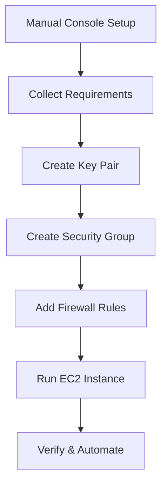

# Session 14: AWS CLI Deep Dive

## Table of Contents

- [AWS CLI Deep Dive](#aws-cli-deep-dive)
- [CLI vs Console vs API](#cli-vs-console-vs-api)
- [CLI Installation and Configuration](#cli-installation-and-configuration)
- [Profiles for Multiple Accounts and Regions](#profiles-for-multiple-accounts-and-regions)
- [Strategic Approach to Creating CLI Commands](#strategic-approach-to-creating-cli-commands)
- [Demo: Launching EC2 Instance via CLI](#demo-launching-ec2-instance-via-cli)
- [Summary](#summary)

## AWS CLI Deep Dive

### Overview
The AWS Command Line Interface (CLI) provides a programmatic way to interact with AWS services from your local machine. Unlike the web console which is suited for quick tasks or visual configurations, CLI enables automation, scripting, and efficient management for power users. This session builds on basic CLI introduction by demonstrating a step-by-step strategy to translate console-based workflows into CLI commands, focusing on EC2 instance management with key pairs, security groups, AMIs, and user data.

### CLI vs Console vs API

#### Comparison of Access Methods

| Method | Use Case | Pros | Cons |
|--------|----------|------|------|
| **Console (Web UI)** | Quick checks, basic operations, learning AWS | Beginner-friendly, visual, no setup required | Not suitable for automation, tedious for repetitive tasks |
| **CLI** | Automation, scripting, expert operations | Faster for known tasks, enables shell scripting, profile-based account switching | Requires installation and learning syntax |
| **API (e.g., boto3)** | Custom applications, mobile/web apps integrating AWS | Full programmatic control, language integration | More complex, requires programming knowledge |

### CLI Installation and Configuration

#### Installation Process
Install AWS CLI on your local machine (Windows/Mac/Linux) from the official AWS site by downloading the appropriate version and running the installer. No complex dependencies required.

```bash
# After installation, verify CLI version
aws --version
```

#### Initial Configuration
Configure authentication using access keys and secret keys obtained from IAM console (under Security Credentials → Access Keys).

```bash
# Configure AWS CLI with credentials
aws configure
```

Required inputs:
- AWS Access Key ID (username-equivalent)
- AWS Secret Access Key (password-equivalent)
- Default Region Name (e.g., ap-south-1 for Mumbai)
- Output Format (text/json/table)

**Security Notes:**
> [!WARNING]
> Store credentials securely; they are saved in plain text locally. Avoid credential exposure by managing local machine access.

> [!IMPORTANT]
> Access keys tie to specific accounts and permissions. Secret keys authenticate account access.

### Profiles for Multiple Accounts and Regions

Profiles manage multiple AWS accounts/regions from one workstation, enabling seamless switching between environments (dev, test, prod).

#### Creating and Using Profiles

```bash
# Create a profile with custom settings
aws configure --profile my-profile-name
```

Benefits:
- Switch contexts without re-entering credentials
- Isolate environments (production, development)
- Automate account-specific scripts

```bash
# Use a specific profile in commands
aws ec2 describe-instances --profile my-prod-profile
```

**Profile Storage:**
- Credentials stored in `~/.aws/credentials` (plain text; protect this file)
- Config (region, output) stored in `~/.aws/config`

**Account Management:**
Profiles differentiate accounts via embedded access key region and permission details. One access key can manage one account/context.

### Strategic Approach to Creating CLI Commands

To create CLI commands without memorization:
1. **Learn Core Concepts via Console:** Manually perform tasks in web UI to understand service parameters (AMI IDs, instance types, security rules).
2. **Collect Requirements:** Note all inputs (names, IDs, options) from manual process.
3. **Map to CLI Syntax:** Use service help for subcommands/options.
4. **Test and Refine:** Execute commands, adjust based on errors.
5. **Automate:** Script reusable commands for deployment.

**General Command Structure:**
```bash
aws <service> <subcommand> --options value [--profile profile-name]
```

This approach applies universally to any AWS service.

#### Step-by-Step Demo Process
Requirements: Launch an EC2 instance in Mumbai (ap-south-1), AZ 1B, with custom security group, key pair, and user data for automatic web server setup.

### Demo: Launching EC2 Instance via CLI

#### Prerequisites: Manual Concept Review in Console
1. **Service:** EC2
2. **AMI:** Amazon Linux 2 (ami-0abcdef1234567890 – *obtain via console or describe-images*)
3. **Instance Type:** t2.micro
4. **Key Pair:** Create new (format: PEM/PPK)
5. **Security Group:** Create with HTTP (port 80) access from 0.0.0.0/0
6. **Subnet/AZ:** Mumbai 1B (subnet-id via console)
7. **Tags:** Name: OS-100
8. **User Data:** Shell script for web server installation
9. **Count:** 1

#### CLI Commands Execution Order

**Step 1: Create Key Pair**

```bash
aws ec2 create-key-pair \
  --key-name aws-key-cli-test \
  --key-format pem \
  --query 'KeyMaterial' \
  --output text > aws-key-cli-test.pem \
  --profile my-lw-profile
```

> [!NOTE]
> Saves private key to local file for SSH access. Create-key-pair launches instance prerequisite.

**Step 2: Create Security Group**

```bash
aws ec2 create-security-group \
  --group-name linuxworld-http-allow \
  --description "Allow HTTP access for web server" \
  --profile my-lw-profile
```

**Step 3: Add Ingress Rule to Security Group**

```bash
aws ec2 authorize-security-group-ingress \
  --group-id sg-0123456789abcdef0 \
  --protocol tcp \
  --port 80 \
  --cidr 0.0.0.0/0 \
  --profile my-lw-profile
```

**Step 4: Launch EC2 Instance**

```bash
aws ec2 run-instances \
  --image-id ami-0abcdef1234567890 \
  --count 1 \
  --instance-type t2.micro \
  --key-name aws-key-cli-test \
  --security-group-ids sg-0123456789abcdef0 \
  --subnet-id subnet-06543c4e77cd9b505 \
  --associate-public-ip-address \
  --user-data file://linuxworld-test-script.sh \
  --profile my-lw-profile
```

*Mermaid Diagram: CLI Workflow Summary*



#### Verification Commands
```bash
# List instances
aws ec2 describe-instances --profile my-lw-profile --output table

# Check security group rules
aws ec2 describe-security-groups --group-ids sg-0123456789abcdef0 --profile my-lw-profile
```

**User Data Script Example (linuxworld-test-script.sh):**
```bash
#!/bin/bash
yum update -y
yum install -y httpd
echo "<h1>Welcome to Linux World</h1>" > /var/www/html/index.html
systemctl start httpd
systemctl enable httpd
```

> [!TIP]
> User data executes at boot, enabling automated instance provisioning.

### Summary

#### Key Takeaways
```diff
+ CLI enables automation and efficiency over Console for expert workflows
+ Profiles isolate accounts/regions for multi-environment management
+ Strategic approach: Console → Requirements → CLI Syntax → Script
+ Always secure private keys and credentials locally
+ Further automation possible via scripts with dynamic profiles for dev/test/prod
- Avoid direct credentials in scripts; use profiles
- Console suitable for learning but CLI for production operations
! API integrations require boto3 for application-level AWS control
```

#### Quick Reference
- **CLI Config:** `aws configure --profile <name>`
- **Key Pair Creation:** `aws ec2 create-key-pair --key-name <name>`
- **Security Group:** `aws ec2 create-security-group + authorize-security-group-ingress`
- **EC2 Launch:** `aws ec2 run-instances --image-id <ami> --instance-type <type> --key-name <key>`
- **Profiles Switch:** `--profile <name>` in any command

#### Expert Insight

**Real-world Application:**  
CLI commands form the foundation for Infrastructure as Code (IaC) tools like CloudFormation/Terraform. Organizations use scripted CLI for automated deployments, scaling, and monitoring across multiple accounts, enabling DevOps pipelines and cost optimization.

**Expert Path:**  
Master service-specific commands through iterated console-to-CLI translations. Practice automating entire stacks (instance + storage + networking) via bash scripts. Integrate with CI/CD for production deployments, and explore AWS CLI plugins for extended functionality.

**Common Pitfalls:**  
Mixing name/ID parameters (use consistent formats). Unsecured credential files lead to breaches—enforce local encryption or IAM roles. Forgetting profile contexts causes unintended account modifications. Over-rely on console for automation tasks; CLI speeds up repetitive operations.

**Lesser-Known Facts:**  
CLI commands can be piped (e.g., `aws ec2 describe-instances | grep 'running'`). Use `--dry-run` to validate commands before execution. Tab completion plugins exist for enhanced bash experience. CLI supports JSON filters for precise output parsing in scripts.
