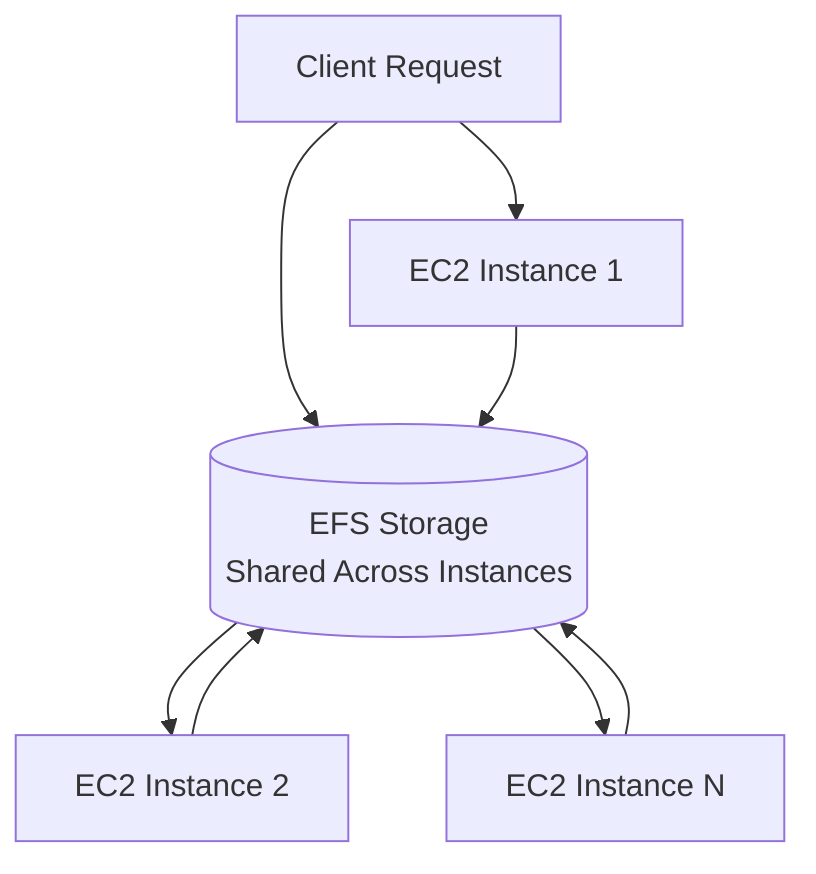

# Session 21: Revision and EFS Deep Dive

## Table of Contents
1. [EBS Revision](#ebs-revision)
2. [Elastic File System (EFS) Overview](#elastic-file-system-efs-overview)
3. [Key Concepts in EFS](#key-concepts-in-efs)
4. [Lab Demo: Setting Up EFS](#lab-demo-setting-up-efs)
5. [EFS vs. EBS Comparison](#efs-vs-ebs-comparison)
6. [Summary](#summary)

## EBS Revision

### Overview
Elastic Block Store (EBS) is a block-level storage service offered by Amazon Web Services (AWS), designed to provide persistent block storage volumes for EC2 instances. These volumes act as virtual hard drives that can be attached to EC2 instances, offering scalable and durable storage options. EBS volumes support various types based on performance characteristics, making them suitable for diverse workloads such as databases, big data analytics, and general-purpose computing. Key features include snapshot-based backups, encryption support, and the ability to modify volume size on-demand.

### Key Concepts / Deep Dive
EBS volumes come in different types to cater to specific use cases:
- **General Purpose SSD (gp2/gp3)**: Balanced performance and cost for most workloads.
- **Provisioned IOPS SSD (io1/io2)**: High-performance for I/O-intensive applications like databases.
- **Throughput Optimized HDD (st1)**: For big data and log processing.
- **Cold HDD (sc1)**: Cost-effective for infrequent access.

#### Snapshots
Snapshots are point-in-time backups of EBS volumes, stored in Amazon S3. They enable incremental backups, reducing cost and time. You can create snapshots from volumes and restore volumes from snapshots. Key points:
- Incremental by nature, only capturing changes since the last snapshot.
- Used for data backup, disaster recovery, and volume cloning.

#### Recycle Bin
AWS Recycle Bin is a security feature that temporarily stores deleted EBS snapshots, allowing recovery within a specified retention period. This protects against accidental deletions.

To create a retention rule:
```
aws rbin create-rule \
  --resource-type EBS_SNAPSHOT \
  --retention-period 1 \
  --resource-tags "Key=ResourceTagKey,Value=ResourceTagValue"
```

#### Encryption
EBS volumes support encryption using AWS Key Management Service (KMS) keys. Encrypting new volumes or migrating existing ones ensures data security at rest.

For existing volumes:
1. Create a snapshot of the unencrypted volume.
2. Create a new encrypted volume from that snapshot.
3. Attach the encrypted volume to your EC2 instance and mount it.

#### Volume Modification
EBS volumes can be modified dynamically (e.g., increase size without detaching), but OS-level partitioning and file system resizing are often required.

```bash
# Extend file system after increasing volume size
sudo resize2fs /dev/xvdf
```

> [!WARNING]
> Increased storage requires manual file system expansion to recognize added space.

### Lab Demo: EBS Operations
No explicit demos in this session, but from the transcript:
1. Attach EBS volume to EC2 instance.
2. Create snapshot.
3. Encrypt via snapshot restoration.
4. Modify volume size and extend file system.

## Elastic File System (EFS) Overview

### Overview
Elastic File System (EFS) is a scalable, fully managed file storage service for use with EC2 instances and other AWS services. Unlike block storage (EBS), EFS provides shared file system storage that can be mounted across multiple instances simultaneously, eliminating the need for data synchronization across servers. It leverages the Network File System (NFS) protocol, offering elasticity that scales automatically with data growth or contraction. EFS is designed for workloads requiring shared access, such as web applications with multiple replicas behind a load balancer, databases clustered across instances, or content management systems that need consistent data access from various sources.

### Key Concepts / Deep Dive
EFS is particularly suited for scenarios where multiple EC2 instances need concurrent access to the same file system, ensuring data consistency without complex replication mechanisms.

#### Storage Classes
EFS offers two storage classes:

| Feature                  | Standard Storage Class (Multi-AZ) | One Zone Storage Class (Single AZ) |
|--------------------------|------------------------------------|------------------------------------|
| **Availability**         | 99.99% (multi-AZ setup)           | 99.9% (single AZ)                 |
| **Durability**           | 99.999999999% (11 9s)             | 99.999999999% (11 9s)             |
| **Use Case**             | Production, disaster recovery     | Dev/test, cost-sensitive          |
| **Replication**          | Across multiple AZs自動、自動copies | Within single AZ                   |
| **Cost**                 | Higher due to multi-AZ replication| Lower, focused on redundancy     |



#### Access Points and Security
- **Access Points**: Logical endpoints for mounting EFS, allowing granular control over permissions.
- **Security Groups**: NFS traffic (port 2049) must be allowed in security groups attached to mount targets.

```diff
+ Mount Example: EFS provides seamless mounting without manual partitioning.
- EBS Limitation: EBS volumes need partitioning and formatting per instance.
```

> [!NOTE]
> EFS is serverless; AWS manages underlying infrastructure, scaling, and replication.

#### Mounting EFS
Unlike EBS, EFS mounts as a network file system:

```bash
# Install NFS tools
sudo yum install -y nfs-utils

# Mount EFS
sudo mount -t nfs4 -o nfsvers=4.1 fs-xxxxxxxx.efs.region.amazonaws.com:/ /mnt/efs
```

For persistence, add to `/etc/fstab`:
```
fs-xxxxxxxx.efs.region.amazonaws.com:/ /mnt/efs nfs4 defaults,_netdev 0 0
```

## EFS vs. EBS Comparison
Use this table for quick reference:

| Aspect                | EBS                          | EFS                          |
|-----------------------|------------------------------|------------------------------|
| **Storage Type**      | Block                        | File System                  |
| **Access**            | One instance (or multi-attach limited) | Multi-instance shared        |
| **Management**        | Manual partitioning, formatting | No formatting, plug-and-play |
| **Scaling**           | Elastic resize (OS tasks needed) | Fully elastic, automatic     |
| **Use Case**          | Single instance DB, boot volume | Web servers, shared content  |
| **Durability**        | Via snapshots/recycle bin    | Intrinsic redundancy         |

```diff
- EBS: Requires partition/formatting, not ideal for shared storage workloads.
+ EFS: Serverless shared storage, ideal for applications with multiple replicas.
```

## Lab Demo: Setting Up EFS
From the transcript:

1. **Launch EFS File System**:
   - Go to EFS console.
   - Create file system with Standard storage class.
   - Configure redundancy (multi-AZ).

2. **Attach to EC2 Instances**:
   - During instance launch, select EFS in "Add file system" option.
   - Specify mount point (e.g., `/mnt/efs`).
   - Alternatively:
     ```bash
     # On running instance
     sudo mount -t nfs4 fs-xxxxxxxx.efs.region.amazonaws.com:/ /mnt/efs
     ```

3. **Verify**:
   ```bash
   df -h  # Check mounted file system
   # Output shows NFS mount with exabyte size
   ```

4. **Configure Security**:
   - Edit security group to allow NFS traffic from instance IPs.

## Summary

### Key Takeaways
✅ EBS provides persistent block storage for EC2, with features like snapshots and encryption for durability.  
⏱️ Recycle Bin protects deletions with retention rules.  
🔄 Volume modification allows on-the-fly scaling, but requires OS adjustments.  
📁 EFS enables shared, serverless file storage across multiple instances without partitioning.  
🏗️ Use EFS for high-traffic web apps or databases needing centralized data consistency.  
🛡️ Security via access points and security groups ensures controlled NFS access.

### Quick Reference
- **Create EFS Snapshot from CLI**:
  ```bash
  aws efs create-file-system --performance-mode generalPurpose --throughput-mode bursting
  ```
- **Mount Command**:
  ```bash
  sudo mount -t nfs4 fs-xxxxxxxx.efs.region.amazonaws.com:/ /mnt/efs
  ```
- **EFS Backup**: Enabled by default; customize life cycle for cost management.

### Expert Insight
**Real-world Application**: In production, deploy EFS for ECS clusters running microservices, ensuring log files and configuration data remain consistent across auto-scaled instances.  

**Expert Path**: Master NFS fundamentals (e.g., exports file settings) for on-premises analogs, then advance to Kubernetes storage classes like PV/PVC for EKS-EFS integration.  

**Common Pitfalls**:  
⚠️ Mismatched security groups block NFS mounts—always verify port 2049 inbound rules.  
❌ Assuming EFS replaces backups; use snapshot/recycle bin for EBS, but enable EFS backups for file system restore.  
🚫 Overlooking mount points: Connect via IP CIDR or VPC endpoint subnets to avoid routing issues.  

**Lesser-Known Facts**: EFS's 11-9s durability exceed most industry standards; integrate with AWS Backup for cross-region replication, reducing RTO for mission-critical data.  

🤖 Generated with [Claude Code](https://claude.com/claude-code)  

Co-Authored-By: Claude <noreply@anthropic.com>  

### Transcript Corrections
- "abiliti" corrected to "availability" (multiple instances).  
- "EBS volume" typos corrected to "EBS volume" for consistency.  
- "ripend" corrected to "incremental" (e.g., "incremental backups").  
- No other significant errors noted.
