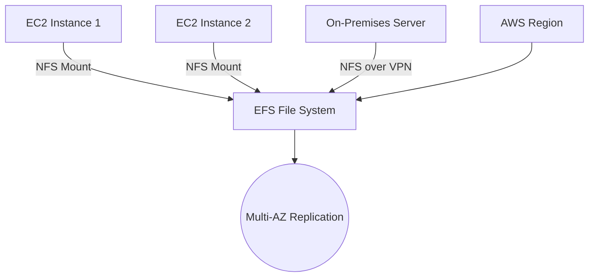

# Session 22: Revision of AWS Storage Services

## Table of Contents
- [Recycle Bin Service for EBS Snapshots](#recycle-bin-service-for-ebs-snapshots)
  - [Overview](#overview)
  - [Key Concepts](#key-concepts)
  - [Lab Demo: Encrypting Volumes and Managing Snapshots](#lab-demo-encrypting-volumes-and-managing-snapshots)
  - [Lab Demo: Creating Retention Rules and Recovering Snapshots](#lab-demo-creating-retention-rules-and-recovering-snapshots)
- [Comparison: EBS vs EFS](#comparison-ebs-vs-efs)
  - [Overview](#overview-1)
  - [Key Concepts](#key-concepts-1)
  - [Lab Demo: Creating and Mounting EFS File System](#lab-demo-creating-and-mounting-efs-file-system)
- [Summary](#summary)

### Recycle Bin Service for EBS Snapshots

#### Overview
AWS Recycle Bin is a data protection service that prevents accidental deletion of Amazon EBS snapshots and Amazon Machine Images (AMIs). When data is deleted, it can be recovered from the Recycle Bin within a specified retention period, ensuring data integrity for critical resources. This service addresses the risk of permanent data loss from accidental deletions, enhancing overall reliability for storage backups.

#### Key Concepts
- **Data Loss Prevention**: Detaching or deleting EBS volumes results in immediate data loss without protection. Recycle Bin safeguards snapshots from accidental deletion.
- **Snapshot Basics**: Snapshots are point-in-time backups of EBS volumes. They serve as templates for new volumes and are incremental for efficiency.
- **Tagging Resources**: AWS recommends tagging all resources (e.g., snapshots) for better organization and management. Tags like `team: web` and `environment: production` help identify resources.
- **Retention Rules**: Customizable rules define how long deleted snapshots are retained in Recycle Bin. Rules use tags, resources, or ARNs, with retention periods specified in days, weeks, months, or years.
- **Symmetrically Encrypted Volumes**: EBS volumes can be encrypted using a symmetric key managed by AWS KMS (Key Management Service). Encrypted volumes require an unlocked key for access, and related snapshots are automatically encrypted.
- **Volume Encryption Workflows**:
  - Create a snapshot from an existing unencrypted volume.
  - Use the snapshot to create a new encrypted volume.
  - Attach and mount the encrypted volume to instances.

#### Lab Demo: Encrypting Volumes and Managing Snapshots
1. **Create Key in KMS**: Navigate to Key Management Service and generate a symmetric key for encryption.
2. **Create Encrypted Volume**:
   ```bash
   # Example command structure (adjust as needed)
   aws ec2 create-volume --size 8 --availability-zone us-east-1a --encrypted
   ```
3. **Attach and Mount Volume**: 
   - Attach the volume to an EC2 instance via the AWS console or CLI.
   - Mount using: `mount /dev/xvdf /mnt/data`
4. **Modify Volume**: Update size, IOPS, or throughput via Actions > Modify Volume in the EC2 console.
5. **Snapshot Management**:
   - Tag snapshots with metadata (e.g., `team: web`, `env: prod`).
   - Delete snapshots to recover space, but they are retained per Recycle Bin rules.

#### Lab Demo: Creating Retention Rules and Recovering Snapshots
1. **Create Retention Rule**:
   - Go to Recycle Bin service.
   - Click "Create retention rule".
   - Name: `my-rule-only-for-prod`
   - Resource type: EBS snapshot.
   - Add tags (e.g., `env: production`).
   - Retention period: 7 days (customizable).
2. **Delete Snapshot**:
   - Select snapshot (e.g., `snap3`).
   - Actions > Delete snapshot.
3. **Recover Snapshot**:
   - Access Recycle Bin.
   - Select deleted snapshot > Recover.
   - Snapshot reappears in the Snapshots section.

### Comparison: EBS vs EFS

#### Overview
EBS (Elastic Block Storage) and EFS (Elastic File System) are key AWS storage services, each suited for different use cases. EBS offers high-performance block storage tied to individual EC2 instances, while EFS provides scalable, shared file storage across multiple instances and AZs. Understanding their differences helps in choosing the right service for reliability, scalability, and cross-environment accessibility.

#### Key Concepts
- **Storage Types**:
  - **Block Storage**: EBS - Direct-attached storage for EC2 instances, non-shared.
  - **File Storage**: EFS - Shared storage via NFS (Network File System) protocol, serverless management.
  - **Object Storage**: S3 - Not covered here but uses HTTP/HTTPS.
- **EBS Challenges**:
  - Pre-provisioned capacity planning.
  - Single-instance attachment limits scalability.
  - Manual backup (snapshots) with point-in-time recovery.
  - No built-in replication or multi-AZ support for disaster recovery.
  - Third-party tools required for replication.
- **EFS Advantages**:
  - Serverless, fully managed NFS service.
  - Elastic scaling; no pre-provisioning needed.
  - Multi-AZ and regional replication for high availability.
  - Accessible from on-premises via NFS or across VPCs.
  - Ideal for shared storage across instances, solving issues like website content sync.
- **Protocols and Architecture**:
  - **NAS (Network Attached Storage)**: Pre-formatted file system via NFS.
  - **SAN (Storage Area Network)**: Uses iSCSI or FCP (not directly in AWS simplicity).
  - EFS internally manages OS, hard disk partitioning, and NF server; users only connect via NFS clients (Linux or Windows).

EFS addresses EBS limitations by enabling:
- Shared storage across multiple AZs.
- Disaster recovery with cross-region access.
- Centralized content management for web servers or multi-instance apps.

| Feature | EBS | EFS |
|---------|-----|-----|
| Storage Type | Block | File |
| Attachment | Single EC2 instance | Multiple instances/VPCs |
| Scaling | Pre-provisioned | Elastic, serverless |
| Replication | None (use third-party) | Multi-AZ, regional |
| Protocol | Direct attachment | NFS |
| Use Case | Root volumes, databases | Shared files, web content |

#### Lab Demo: Creating and Mounting EFS File System
1. **Create EFS File System**:
   - Go to EFS service > Create file system.
   - Name: `my-shared-storage`
   - Storage class: Standard (regional, multi-AZ redundancy) or One Zone (single AZ).
   - Configure network: Select VPC and mount targets in subnets.
2. **Launch EC2 Instance with EFS**:
   - During instance launch, under "Configure storage", select "Add shared file system".
   - Choose EFS, mount point: `/var/www/html`.
3. **Manual Mount (Alternative)**:
   - Install NFS client: `sudo yum install -y nfs-utils`
   - Mount: `sudo mount -t nfs4 -o nfsvers=4.1 fs-12345678.efs.us-east-1.amazonaws.com:/ /var/www/html`
4. **Verify Mount**:
   - Check with `df -h` (shows NFS-mounted filesystem).
   - Test by creating files and verifying across instances.



> [!NOTE]
> EFS supports Windows NFS clients, enabling cross-platform file sharing.

### Summary

#### Key Takeaways
```diff
+ Recycle Bin protects EBS snapshots from accidental deletion with customizable retention rules.
- EBS is limited to single-instance attachment and lacks built-in multi-AZ replication.
+ EFS provides shared, elastic file storage via NFS across multiple AZs and regions.
! Encryption enhances security for both EBS volumes and snapshots using AWS KMS.
- Avoid deleting untagged snapshots; always implement retention rules for critical data.
+ Volume size, IOPS, and throughput can be modified post-creation in EBS.
```

#### Quick Reference
- **EBS Volume Mount**: `lsblk` to list, `mount /dev/xvdf /mnt/data` to attach.
- **Snapshot Delete/Recover**: Recycle Bin > Actions > Recover.
- **EFS Mount Command**:
  ```bash
  sudo mount -t nfs4 -o nfsvers=4.1 YOUR_EFS_ID.efs.REGION.amazonaws.com:/ /mnt/efs
  ```
- **KMS Key Creation**: Use symmetric encryption for volume encryption.
- **Retention Rule**: Specify duration, tags, and AWS regions.

#### Expert Insight
- **Real-world Application**: Use EFS for shared website assets across auto-scaling EC2 instances to ensure consistent content without manual syncing. Recycle Bin is essential for compliance in industries like healthcare, where data recovery must meet regulatory timelines.
- **Expert Path**: Master AWS storage by practicing multi-service integrations (e.g., EFS with Lambda for serverless file access). Learn KMS deeply for encryption best practices and consider costs—EFS is pricier for infrequent access.
- **Common Pitfalls**: Forgetting to tag resources leads to governance issues; always encrypt critical volumes to avoid security breaches. Over-provisioning in EBS causes unnecessary costs—monitor with CloudWatch.
- **Lesser-Known Facts**: EFS One Zone storage is 47% cheaper than Standard but lacks multi-AZ resilience; use it for development environments or temporary workloads. EBS snapshots can be copied across regions for global disaster recovery, acting as an informal replication workaround.
