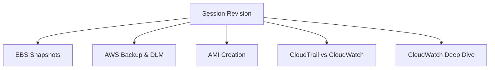

# Session 25: AWS Storage Lifecycle Management and CloudWatch Monitoring Introduction

## Table of Contents
- [Introduction and Revision](#introduction-and-revision)
- [EBS Snapshot Storage Tiers](#ebs-snapshot-storage-tiers)
- [Archiving EBS Snapshots](#archiving-ebs-snapshots)
- [Data Lifecycle Manager (DLM)](#data-lifecycle-manager-dlm)
- [AWS Backup Service](#aws-backup-service)
- [Amazon Machine Images (AMI)](#amazon-machine-images-ami)
- [CloudTrail Overview](#cloudtrail-overview)
- [CloudWatch Introduction](#cloudwatch-introduction)
- [Monitoring Concepts (Events, Logs, Metrics)](#monitoring-concepts-events-logs-metrics)
- [Custom Metrics and Monitoring Frequency](#custom-metrics-and-monitoring-frequency)
- [Conclusion and Future Plans](#conclusion-and-future-plans)

## Introduction and Revision
### Overview
Session 25 begins with a revision of previous content on AWS Elastic Block Storage (EBS), focusing on snapshot management and transitioning into new topics around backup automation and monitoring services.

- **Key Points Covered:**
  - Review of EBS snapshots storage tiers (standard and archive)
  - Demonstration of archiving and restoring EBS snapshots
  - Introduction to Data Lifecycle Manager (DLM) for automated backup management
  - Overview of AWS Backup service for centralized backups
  - Deep dive into Amazon Machine Images (AMI) creation methods
  - Differentiation between CloudTrail (account activity auditing) and CloudWatch (infrastructure monitoring)
  - Comprehensive introduction to CloudWatch capabilities: events, logs, and metrics
  - Basic concepts of monitoring frequency and custom metrics




## EBS Snapshot Storage Tiers
### Overview
AWS offers two primary storage tiers for EBS snapshots: Standard and Archive. The Standard tier is the default option optimized for cost-effective storage with low-latency access, while Archive provides the lowest-cost option suitable for infrequent retrieval scenarios.

### Key Concepts
- **Standard Tier:**
  - Default storage option for EBS snapshots
  - Ideal for most workloads requiring regular access
  - Provides low-latency data access and consistent performance
  - Designed for frequently accessed data requiring fast performance

- **Archive Tier:**
  - Lowest-cost storage option for EBS snapshots
  - Suitable for long-term archival data with infrequent access
  - Retrieval times can take several hours
  - Best for data that's rarely accessed but needs long-term preservation

### Deep Dive
```diff
+ Standard Tier Benefits:
  - Consistent performance across most use cases
  - Low storage costs for frequently accessed data
  - Immediate availability for restoration

- Archive Tier Considerations:
  - Multiple-hour retrieval time restricts immediate use
  - Significant cost savings for archival storage
  - Not suitable for time-sensitive restoration needs
  ! Decision Factor: Access frequency drives tier selection
```

## Archiving EBS Snapshots
### Overview
Archiving allows you to move EBS snapshots to a lower-cost storage tier while maintaining the ability to restore them when needed. This process is essential for optimizing storage costs for snapshots that are rarely accessed.

### Step-by-Step Lab Demo
**Archiving an EBS Snapshot:**
1. Navigate to the EC2 console
2. Select the desired EBS snapshot
3. Click "Actions" → "Archive snapshot"
4. The snapshot status will show as "Archived" with "Archived" storage state

**Restoring from Archive:**
1. Select the archived snapshot
2. Click "Actions" → "Restore snapshot from archive"
3. Choose restore type:
   - **Temporary Restore**: Allows temporary access for a specified period
   - **Permanent Restore**: Moves snapshot back to Standard tier permanently
4. Set restore parameters (retention, etc.)
5. Click "Restore snapshot"

**Important Limitations:**
- Cannot create volumes directly from archived snapshots
- Must restore to Standard tier first before volume creation
- Archive snapshots require restoration for any active use

```bash
# Example CLI commands for snapshot operations
aws ec2 describe-snapshots --snapshot-ids snap-12345678
aws ec2 archive-snapshots --snapshot-ids snap-12345678
aws ec2 restore-snapshots --snapshot-ids snap-12345678 --restore-type temporary
```
> [!NOTE]
> Archived snapshots provide significant cost savings but have retrieval time trade-offs. Plan restoration timelines carefully for business requirements.

## Data Lifecycle Manager (DLM)
### Overview
Data Lifecycle Manager (DLM) is a service that automates the creation, retention, and deletion of EBS volume backups (snapshots). It helps manage backup lifecycle policies without manual intervention.

### Key Concepts
- **Automated Backup Creation:**
  - Schedules automatic snapshot creation
  - Supports daily, weekly, monthly, and yearly intervals
  - Configurable starting times

- **Retention Policies:**
  - Delete policies for old snapshots (configurable count or age-based)
  - Age-based retention (e.g., keep snapshots for 7 days, 30 days)
  - Count-based retention (e.g., maintain last 7 snapshots)

### Lab Demo: Creating a Snapshot Lifecycle Policy
1. Navigate to EC2 → Lifecycle Manager
2. Choose "EBS snapshot policy"
3. Select target resource type: "Volume" or "Instance"
4. Configure target resource tags:
   ```yaml
   # Example tag configuration
   Key: environment
   Value: prod  # Automatically targets resources with this tag
   ```
5. Configure schedule:
   - Frequency: Daily, Weekly, Monthly
   - Starting time: Specify when to run
   - Retention type: Count (e.g., keep 4 snapshots) or Age (e.g., 7 days)

```bash
# Example DLM policy creation via CLI
aws dlm create-lifecycle-policy --execution-role-arn arn:aws:iam::123456789012:role/service-role/AWSDataLifecycleManagerDefaultRole \
  --description "Daily snapshot policy" \
  --state ENABLED \
  --policy-details '{
    "ResourceTypes": ["VOLUME"],
    "TargetTags": [
      {"Key": "environment", "Value": "prod"}
    ],
    "Schedules": [
      {
        "Name": "DailySnapshots",
        "CreateRule": {
          "Interval": 24,
          "IntervalUnit": "HOURS",
          "Times": ["23:45"]
        },
        "RetainRule": {
          "Count": 7
        }
      }
    ]
  }'
```

## AWS Backup Service
### Overview
AWS Backup is a fully managed service that centralizes and automates backup operations across multiple AWS services, including EBS, EFS, RDS, and more.

### Key Concepts
- **Centralized Management:**
  - Unified interface for backing up multiple AWS resources
  - Cross-account and cross-region backup support

- **Backup Plans:**
  - Define what to backup (resource selection)
  - Configure backup frequency (daily, weekly, etc.)
  - Set retention policies

- **Supported Services:**
  - EBS volumes
  - EFS file systems
  - RDS databases
  - Additional services integration ongoing

**Use Case Example:**
- Create a backup plan for production EBS volumes with:
  - Daily backups at 2 AM
  - 30-day retention
  - Cross-region replication for disaster recovery

## Amazon Machine Images (AMI)
### Overview
An Amazon Machine Image (AMI) is a pre-configured virtual machine template containing the software and configurations needed to launch EC2 instances. AMIs streamline instance configuration by providing standardized environments.

### Lab Demo: Creating Custom AMI
**From an Existing Instance:**
1. Launch an EC2 instance with desired configuration
2. Stop the instance (optional but recommended for consistency)
3. Right-click Actions → Image and templates → Create image
4. Configure AMI details:
   - Name and description
   - Enable "No reboot" for faster creation
5. Click "Create image"
6. Access AMI from "AMIs" section under EC2

### AMI Creation Methods
| Method | Description | Use Case |
|--------|-------------|----------|
| From Instance | Create AMI from running/stopped EC2 instance | Preserve current configuration |
| From Snapshot | Import custom OS installation into AMI | Migrate from on-premises |
| Using EC2 Image Builder | Automated pipeline for AMI creation | Standardized, secure AMIs |

**Sharing and Managing AMIs:**
- **Share with AWS Account:** Add account IDs in AMI permissions
- **Copy to Different Region:** Use "Actions" → "Copy AMI" with new region
- **Delete AMI:** Remove when no longer needed

### Code Examples
```bash
# Create AMI from instance
aws ec2 create-image --instance-id i-1234567890abcdef0 --name "my-custom-ami" --description "Custom AMI with web server"

# Share AMI with another account
aws ec2 modify-image-attribute --image-id ami-12345678 --operation-type add --user-ids 123456789012

# Copy AMI to different region
aws ec2 copy-image --source-image-id ami-12345678 --source-region us-east-1 --region us-west-2 --name "copied-ami"
```

## CloudTrail Overview
### Overview
AWS CloudTrail is a service focused on governance, compliance, and operational auditing by recording account activity across AWS services.

### Key Concepts
- **Account Activity Monitoring:**
  - Tracks all API calls and account activities
  - Records user authentication events (login/logout)
  - Captures service usage patterns

- **Event History:**
  - Centralized view of all account activities
  - Filterable by time, service, user, etc.
  - Integrated with other AWS services

### Differentiation from CloudWatch
| Feature | CloudTrail | CloudWatch |
|---------|------------|------------|
| Focus | Account activity auditing | Resource/performance monitoring |
| Tracks | What actions were taken | How resources are performing |
| Use Case | Security auditing, compliance | Performance monitoring, alerts |

```bash
# Enable CloudTrail
aws cloudtrail create-trail --name my-trail --s3-bucket-name my-bucket
aws cloudtrail start-logging --name my-trail
```

## CloudWatch Introduction
### Overview
AWS CloudWatch is a comprehensive monitoring and observability service that collects and visualizes real-time logs, metrics, and events from AWS resources and applications.

### Key Capabilities
- **Metrics Collection:** Captures performance data from AWS services
- **Logs Management:** Aggregates and analyzes log files from applications and systems
- **Events Processing:** Responds to changes in AWS resources
- **Alarms:** Triggers actions based on metric thresholds

## Monitoring Concepts (Events, Logs, Metrics)
### Overview
CloudWatch handles three fundamental monitoring types: Events, Logs, and Metrics. Each serves different aspects of infrastructure and application monitoring.

### Events
- **Definition:** Any action that results in a state change in an AWS resource
- **Examples:**
  - EC2 instance launch/termination
  - S3 bucket object upload/download
  - Lambda function execution
- **Recording:** Every API call generates an event that's automatically logged

### Logs
- **Definition:** Detailed records of application and system activity
- **Sources:** Application logs, system logs, AWS service logs
- **Management:** 
  - Aggregates logs from multiple sources
  - Supports filtering and searching
  - Integrates with monitoring and alerting

### Metrics
- **Definition:** Time-ordered series of data points representing resource performance
- **Examples:**
  - CPU utilization
  - Memory usage
  - Network throughput
  - Disk I/O operations
- **Default Captured Metrics:**
  - CPU Utilization (%)
  - Network I/O (bytes/sec)
  - Disk Read/Write Operations
  - **Note:** Memory metrics are not captured by default

```diff
+ Events: What happened (e.g., instance started)
- Logs do not typically contain this event type
+ Metrics: Performance indicators (e.g., CPU at 80%)
- Events do not include performance context
! Use Combined: Events + Logs + Metrics = Complete Observability
```

## Custom Metrics and Monitoring Frequency
### Overview
While CloudWatch provides default monitoring, custom metrics and adjustable monitoring frequencies allow deeper insights into specific application characteristics and requirements.

### Monitoring Frequency
- **Basic Monitoring:** 5-minute intervals (free)
- **Detailed Monitoring:** 1-minute intervals (additional cost)
- **Trade-off:** Higher frequency provides more granular data but increases costs

### Custom Metrics
- **Custom Applications:** Monitor application-specific metrics (e.g., request count, latency)
- **Extended Infrastructure:** Add memory monitoring, custom performance indicators
- **Integration:** Publish custom metrics via AWS SDK or API

### Lab Demo: CloudWatch Dashboard
1. Navigate to CloudWatch → Dashboards
2. Create new dashboard with custom widgets
3. Select metrics from EC2, Lambda, etc.
4. Configure graphs (line, area, bar charts)
5. Set refresh intervals and view historical data

**Example Custom Metric Publication:**
```bash
# Publish custom metric (sample Linux command)
aws cloudwatch put-metric-data --namespace "MyApp" --metric-name "RequestLatency" --value 15.0 --unit Milliseconds

# Create alarm based on metric
aws cloudwatch put-metric-alarm --alarm-name "HighCPU" --alarm-description "CPU utilization over 80%" \
  --metric-name CPUUtilization --namespace AWS/EC2 --statistic Average --period 300 \
  --threshold 80 --comparison-operator GreaterThanThreshold --dimensions Name=InstanceId,Value=i-12345678
```

### Cost Considerations
- **Free Tier:** 10 detailed monitoring metrics, 5GB logs, 3 dashboards
- **Paid Tier:** Charged per metric/custom log ingested
- **Optimization Tip:** Select appropriate monitoring frequency based on requirements

## Conclusion and Future Plans
### Overview
The session concludes the AWS Enablement program while previewing upcoming cloud architecture initiatives and providing guidance for future learning paths.

### Key Next Steps
- **Cloud First Policy Continuation:** Next phase focuses on creating custom cloud solutions using tools like EBS, EFS, etc.
- **Learning Recommendations:**
  - Linux fundamentals (free training available)
  - Docker and container technologies
  - DevOps tools (Jenkins, Kubernetes)
  - Specialized monitoring tools (Splunk, ELK stack)

### Additional Insights
- **DevOps Path:** Start with Linux → Docker → Ansible → Jenkins → Kubernetes
- **Available Trainings:** Lambda Serverless, EKS, SysOps, Big Data (upcoming)
- **Certificate Process:** Team will provide instructions for training completion documentation

## Summary
### Key Takeaways
```diff
+ EBS snapshots offer Standard (fast access) and Archive (low-cost, long retrieval) storage tiers
+ Data Lifecycle Manager automates snapshot creation, retention, and cleanup policies
+ AWS Backup provides centralized backup management across multiple AWS services
+ AMIs enable standardized EC2 instance deployment with pre-configured software
+ CloudTrail focuses on audit logging of account activities and API calls
+ CloudWatch provides comprehensive monitoring of metrics, logs, and events
+ Custom metrics extend monitoring beyond default AWS-provided data points
```

### Quick Reference
| Component | Purpose | Key Commands/Configurations |
|-----------|---------|----------------------------|
| EBS Archive | Cost-optimized long-term storage | `aws ec2 archive-snapshots` |
| DLM Policy | Automated snapshot management | Schedule: Daily, Retention: Count/Age |
| AMI Creation | Standardize instance deployment | `aws ec2 create-image --no-reboot` |
| CloudWatch Metrics | Performance monitoring | Free tier: 5-min intervals |
| CloudTrail | Audit logging | `aws cloudtrail start-logging` |

### Expert Insight
**Real-world Application:** In production environments, combine DLM policies with CloudWatch alarms to ensure automated backups while monitoring backup completion rates. This creates a resilient backup strategy that alerts when backup schedules fail.

**Expert Path:** Master CloudWatch by learning custom metrics publishing, dashboard creation with mathematical expressions, and complex alarm configurations using AND/OR conditions for sophisticated monitoring rules.

**Common Pitfalls:** Avoid relying solely on default monitoring; always configure custom memory monitoring for EC2 instances, as default metrics don't include RAM utilization. Also, carefully plan archive snapshot restoration timelines to avoid business disruption.

**Lesser-Known Facts:** CloudWatch Events can trigger Lambda functions in response to resource state changes, enabling serverless automation workflows. Additionally, CloudWatch Logs Insights supports SQL-like queries for complex log analysis patterns not available in basic text searching.
