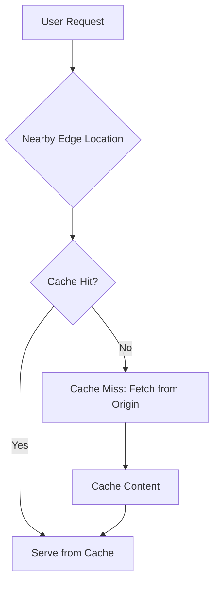

# Session 27: AWS CloudFront Introduction

## Table of Contents
- [Revision of Last Session: AWS CloudWatch](#revision-of-last-session-aws-cloudwatch)
- [Introduction to AWS CloudFront and CDN](#introduction-to-aws-cloudfront-and-cdn)
- [Comparison with AWS Global Accelerator](#comparison-with-aws-global-accelerator)
- [Static vs. Dynamic Content in Web Applications](#static-vs-dynamic-content-in-web-applications)
- [Edge Locations and Caching Mechanism](#edge-locations-and-caching-mechanism)
- [Use Cases for CloudFront](#use-cases-for-cloudfront)
- [Application Architecture and Refactoring](#application-architecture-and-refactoring)
- [Demo: Setting Up EC2 and S3 for Static Content](#demo-setting-up-ec2-and-s3-for-static-content)
- [Preparation for CloudFront Configuration](#preparation-for-cloudfront-configuration)
- [Summary](#summary)

## Revision of Last Session: AWS CloudWatch

### Overview
This section revisits the key topics from the previous session on AWS CloudWatch, focusing on monitoring metrics, alarms, and integrations with services like Lambda and EC2. It provides a foundation for understanding CloudFront by contrasting it with other AWS services.

### Key Concepts / Deep Dive
- **Metrics in CloudWatch**:
  - Metrics are measurements that track system or application aspects, such as CPU utilization, response time, or error rates.
  - Example: CPU utilization indicates the percentage of CPU used by a resource; invocations track the number of Lambda functions called; errors measure the number of errors during execution.
  - CloudWatch captures metrics from services like EC2, EBS, NAT Gateway, and Lambda.

- **Statistical Functions in CloudWatch**:
  - Functions like sum, average, minimum, and maximum are used for data analysis.
  - Visualization types include line, bar, and pie charts for monitoring metrics.

- **CloudWatch Alarms**:
  - Alarms monitor metrics and trigger actions based on conditions, such as sending notifications or enabling autoscaling.
  - Notifications can be sent to Amazon SNS topics, email addresses, or SMS.
  - Alarms enable autoscaling for groups like EC2 Auto Scaling or Application Auto Scaling targets.

- **Creating Alarms for Lambda**:
  1. Navigate to CloudWatch > Alarms > Create Alarm.
  2. Select Metric: Choose Lambda > By Function Name > Select the function.
  3. Define Conditions: Set threshold (e.g., > 3 errors in 5 minutes).
  4. Configure Actions: Create SNS topic for notifications; add email endpoint to confirm via email link.

- **Creating Alarms for EC2**:
  1. Follow similar steps as Lambda alarm creation.
  2. Specify EC2 instance metric (e.g., CPU Utilization > 10% for 2 out of 7 data points).
  3. Set Action: Stop the instance if the alarm triggers.

- **CloudWatch Logs and Integrations**:
  - CloudWatch integrates with Lambda and other services for logging and monitoring.
  - Demonstrated creation of Lambda functions with test events and error handling.

### Code/Config Blocks
```bash
# Example: Monitoring Lambda Metrics in CloudWatch
# Go to Lambda service > Function > Monitor tab to view metrics like errors or invocations.
```

### Tables
| Metric Type | Description | Example Values |
|-------------|-------------|---------------|
| CPU Utilization | Percentage of CPU in use | 80% |
| Invocations | Number of Lambda calls | 1500 |
| Errors | Number of execution errors | 5 |

### Lab Demos
- **Lambda Function Creation and Monitoring**:
  1. Go to AWS Lambda > Create Function > Author from Scratch.
  2. Name: e.g., "fun_test_one", Runtime: Python 3.9, Architecture: x86_64.
  3. Create and test with a test event (e.g., "event_one" using hello world template).
  4. Introduce errors in code, deploy, and test to observe error metrics in CloudWatch.
  5. Access CloudWatch > Metrics > Lambda to view graphs.

- **EC2 Alarm Setup**:
  1. CloudWatch > Alarms > Create Alarm > Select Metric > EC2.
  2. Choose instance (e.g., "web_1"), Metric: CPUUtilization.
  3. Threshold: Average > 10% for 5 minutes.
  4. Action: Stop instance if triggered.

```diff
! Client Request → Node → Kube Proxy → [Routing Logic] → Correct Pod
+ Alarm example: CPU > 80% for 5 minutes → Send SNS Notification
- Avoid: Overly sensitive thresholds causing false alarms
```

## Introduction to AWS CloudFront and CDN

### Overview
AWS CloudFront is a Content Delivery Network (CDN) service that delivers content with low latency and high performance using edge locations. This section introduces CDN concepts, explaining how content is delivered globally through caching.

### Key Concepts / Deep Dive
- **Content Delivery Network (CDN)**:
  - A network of servers (edge locations) that deliver content to users from nearby locations.
  - Origins: The source of content, such as web servers or storage (e.g., EC2, S3, API Gateway).
  - CloudFront reduces latency by caching static content at edge locations.

- **Edge Locations**:
  - Small data centers with caching capabilities, connected via high-speed fiber.
  - Services: PoPs (Points of Presence) globally, e.g., in India (Delhi, Mumbai, etc.).
  - CloudFront has ~33 edge locations in India alone.

- **Benefits of CloudFront**:
  - Low latency due to nearby content delivery.
  - Cost reduction: Less load on origin servers.
  - Security and reliability enhancements.

- **Integration with AWS Services**:
  - Supports origins like S3, EC2, ALB, and more.
  - Highly integrated for private access to resources.

```yaml
# Example CloudFront Distribution Configuration (Conceptual)
Distribution:
  Origins:
    - DomainName: your-s3-bucket-url
      OriginPath: /static
  CacheBehaviors:
    - TargetOriginId: S3Origin
      ViewerProtocolPolicy: redirect-to-https
  Enabled: true
```

### Tables
| Feature | Description | Benefit |
|---------|-------------|---------|
| Caching | Temporarily stores content at edge locations | Faster delivery |
| Edge Locations | Global PoPs with fiber connections | Reduced latency |
| Origins | Source systems (S3, EC2) | Flexible content sourcing |

> [!NOTE]
> CDN is essential for global applications to ensure consistent performance across regions.

## Comparison with AWS Global Accelerator

### Overview
This comparison distinguishes CloudFront from Global Accelerator, highlighting when to use each based on content type and requirements.

### Key Concepts / Deep Dive
- **Global Accelerator (GA)**:
  - Provides a global private network URL for applications.
  - Focuses on security, reliability, and private connectivity without public internet.
  - Suitable for dynamic content requiring direct origin access.
  - Always routes traffic to the origin, reducing latency via private networks but not caching.

- **CloudFront vs. Global Accelerator**:
  - Both improve performance but differ in approach.
  - GA: Focuses on private routing for dynamic/real-time content (e.g., custom code outputs).
  - CloudFront: Caches static content at edges to avoid repeated origin hits.
  - CloudFront can serve both static and dynamic content; GA emphasizes consistency with origins.
  - Common Integration: Use both for hybrid setups (e.g., CloudFront for static, GA for dynamic).

- **Architectural Flow**:
  1. GA connects users to the nearest edge, tunneling to origin.
  2. CloudFront serves cached content first; hits origin only for misses or dynamic requests.

```diff
+ CloudFront: Ideal for static content caching
- Global Accelerator: Better for dynamic content tunneling
! Hybrid: Combine for optimal performance
```

### Tables
| Service | Focus | Traffic Flow | Content Type |
|---------|-------|-------------|--------------|
| CloudFront | Caching at edges | From edge caches to users | Static/dynamic |
| Global Accelerator | Private routing | Direct to origin via tunnels | Dynamic/secure |

## Static vs. Dynamic Content in Web Applications

### Overview
Understanding content types is crucial for effective CDN implementation. Static content is fixed and cacheable, while dynamic content varies and often requires origin access.

### Key Concepts / Deep Dive
- **Static Content**:
  - Fixed files like images, videos, or PDFs that don't change.
  - Best stored in S3 and served via CloudFront for caching.
  - Examples: Company logos, videos, CSS files.

- **Dynamic Content**:
  - Variable outputs based on user input, databases, or real-time data (e.g., timestamps, search results).
  - Served directly from origins like EC2 or Lambda to ensure freshness.
  - Cannot be pre-cached fully; hits origin each time.

- **Application Architecture**:
  - Web apps consist of both: Code (often dynamic) and media (static).
  - Refactor by separating static content to S3 and keeping dynamic on compute resources.

- **Performance Implications**:
  - Static: Cacheable → Low latency, high speed.
  - Dynamic: Non-cacheable → Consistent origin access for accuracy.

```bash
# Example: Dynamic PHP Code (conceptual)
<?php
echo date('Y-m-d H:i:s');  # Output changes each refresh
?>
```

### Tables
| Content Type | Characteristics | Storage | Serving Method |
|--------------|-----------------|---------|----------------|
| Static | Fixed, e.g., images | S3 | CloudFront Cache |
| Dynamic | Variable, e.g., user data | EC2/Lambda | Origin Direct |

## Edge Locations and Caching Mechanism

### Overview
Edge locations enable caching, allowing repeated requests for static content to be served from nearby caches rather than the distant origin.

### Key Concepts / Deep Dive
- **Caching Process**:
  - Cache Miss: First request hits origin, caches content at edge.
  - Cache Hit: Subsequent requests served from cache.
  - TTL (Time to Live): Configurable expiration time for cached content.

- **Cache Hit/Miss Metrics**:
  - High hits: Good performance (content served locally).
  - High misses: Indicates issues like attacks or misconfiguration; monitored via CloudWatch.

- **Practical Examples**:
  - Websites like Amazon.com use CloudFront to cache images/videos locally, reducing load times.



> [!WARNING]
> Monitor cache miss rates; high misses may indicate security threats like DDoS attacks.

## Use Cases for CloudFront

### Overview
CloudFront optimizes performance for global, media-heavy applications by caching static content and reducing origin load.

### Key Concepts / Deep Dive
- **Global Applications**: Customers worldwide access static content from edges, improving speed.
- **Cost Savings**: Reduces EC2 usage by offloading static requests.
- **Scalability**: Handles heavy media files without overloading origins.
- **Not Suitable For**: Fully dynamic sites requiring every request to hit origin (use GA instead).

- **Integration**: Often used with S3 for static assets and origins for hybrid setups.

```diff
+ Benefit: Reduced latency for static content worldwide
- Limitation: Not ideal for real-time dynamic outputs
```

## Application Architecture and Refactoring

### Overview
Proper application design separates static and dynamic components, enabling effective CloudFront integration. Refactoring involves moving static content to S3.

### Key Concepts / Deep Dive
- **Refactoring Steps**:
  1. Identify static content (e.g., images, videos).
  2. Move to S3 bucket for storage.
  3. Update application URLs to point to S3 or CloudFront.
  4. Keep dynamic content on EC2/Lambda.

- **S3 as Storage**:
  - Best for static files; provides public URLs.
  - Create public buckets for demos; secure for production.

- **Performance Gains**:
  - S3 static URLs served via internet initially; CloudFront adds caching.

## Demo: Setting Up EC2 and S3 for Static Content

### Overview
This demo demonstrates launching an EC2 instance with a web application, serving both static and dynamic content, then refactoring by moving static content to S3.

### Lab Demos
- **Launch EC2 Instance**:
  1. Navigate to EC2 > Launch Instance.
  2. AMI: Amazon Linux 2, Type: t2.micro (Free Tier).
  3. Configure Security Group: Enable HTTP/HTTPS.
  4. User Data (install Apache/PHP):
     ```bash
     #!/bin/bash
     yum update -y
     yum install -y httpd php
     systemctl start httpd
     systemctl enable httpd
     ```
  5. Launch and access via Public IP.

- **Create Web Application**:
  1. Connect to EC2 via SSH.
  2. Navigate to `/var/www/html`.
  3. Create `index.php` with dynamic PHP code (e.g., display current time).
  4. Download static image: `curl -o mypng.png [image_url]`.
  5. Update HTML: ``.
  6. Test: Access via browser to verify content load.

- **Refactor to S3**:
  1. Navigate to S3 > Create Bucket (e.g., "web-cloudfront-test-[unique]").
  2. Enable public access; upload static image.
  3. Get Public URL from S3 object.
  4. Edit EC2 `index.php`: Update image src to S3 URL.
  5. Test: Content loads same, but image now from S3 in Virginia.

- **PHP Dynamic Example**:
  ```php
  <?php
  echo "<h1>Welcome to CloudFront Demo</h1>";
  echo "<p>Current Time: " . date('Y-m-d H:i:s') . "</p>";
  ?>
  
  ```

## Preparation for CloudFront Configuration

### Overview
Prepares for integrating CloudFront by organizing content: Static in S3, dynamic on EC2, enabling CloudFront to cache S3 content at edges.

### Key Concepts / Deep Dive
- **CloudFront Setup**:
  - Origin: S3 bucket for static content.
  - CloudFront URL replaces direct S3 URLs in application.
  - First request: CloudFront fetches from S3 and caches; subsequent requests from caches.

- **Upcoming Demo**: Continuation in next session covers CloudFront configuration, including adding EC2 as additional origin for dynamic content.

```yaml
# CloudFront Distribution Sketch (for S3 Origin)
Origins:
  - Domain: my-s3-bucket.s3.amazonaws.com
    Id: S3Origin
CacheBehaviors:
  - PathPattern: "/*"
    TargetOriginId: S3Origin
    ForwardedValues: {QueryString: false, Cookies: {Forward: none}}
    ViewerProtocolPolicy: allow-all
Enabled: true
```

> [!IMPORTANT]
> CloudFront integrates seamlessly with S3, providing cache-enabled delivery without rewriting origins.

## Summary

### Key Takeaways
```diff
+ AWS CloudFront: Delivers content via CDN with low-latency caching at edge locations
+ Cache Mechanism: Misses fetch from origin; hits serve from local cache for performance
+ Vs. Global Accelerator: CloudFront caches static; GA routes secure/direct for dynamic
! Static Content: Refactor to S3 for caching; dynamic remains on origins like EC2
```

### Quick Reference
- **Commands for EC2 Setup**:
  ```bash
  yum install httpd php -y  # Install Apache and PHP
  systemctl start httpd    # Start web server
  curl -o static.png [url] # Download static file
  ```

- **CloudWatch Metrics**: Monitor hits/misses for cache performance.
- **S3 Bucket Creation**: Public access for demos; secure policies for production.

### Expert Insight

#### Real-world Application
In production, CloudFront is used for global e-commerce sites (e.g., speeding up image loads across continents), reducing data transfer costs by up to 50% and improving user experience. Hybrid setups pair CloudFront with ELB for dynamic content load balancing.

#### Expert Path
Master CloudFront by practicing multi-origin distributions, implementing Lambda@Edge for dynamic caching logic, and monitoring via CloudWatch. Advance to architecting serverless with CloudFront + S3 + Lambda, then explore security with WAF integrations.

#### Common Pitfalls
- **Incorrect Origins**: Setting wrong S3 permissions leads to access errors; ensure properly configured CloudFront policies.
- **TTL Misconfiguration**: Short TTL increases origin hits, negating benefits; long TTL risks stale content.
- **Ignoring Compression**: Not enabling gzip reduces performance for large files.
- **Over-reliance on Default**: Customize cache behaviors for optimal hits/misses.

#### Lesser-Known Facts
- CloudFront supports real-time logs via Kinesis for advanced analytics.
- Edge locations use proprietary AWS backbone, achieving 99.9% uptime.
- Large files (>1GB) can use CloudFront's "Field-Level Encryption" for compliance.
- CloudFront's "Origin Shield" acts as a central cache, reducing redundant fetches across regions.
