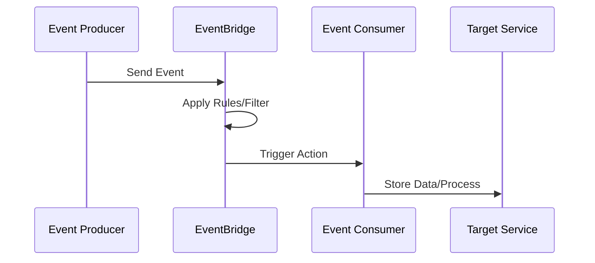

# 00_Course_Summary_Tracker.md

## Course Title: AWS Serverless and Event-Driven Architecture
**Current Status**: In Progress  
**Last Updated**: 2026-04-27  
**Total Sessions Completed**: 35  

### Session Status Overview
- [x] Session 1: Introduction to AWS  
- [x] Session 2: EC2 Fundamentals  
- [x] Session 3: AWS VPC and Networking  
- [x] Session 4: IAM and Security  
- [x] Session 5: S3 Storage Services  
- [x] Session 6: Lambda Basics  
- [x] Session 7: API Gateway  
- [x] Session 8: DynamoDB NoSQL Database  
- [x] Session 9: CloudWatch Monitoring  
- [x] Session 10: CloudFormation IaC  
- [x] Session 11: ELB and Auto Scaling  
- [x] Session 12: RDS Relational Databases  
- [x] Session 13: ECS and Container Services  
- [x] Session 14: SQS and SNS Messaging  
- [x] Session 15: Kinesis Data Streams  
- [x] Session 16: Glue and ETL  
- [x] Session 17: Redshift Data Warehousing  
- [x] Session 18: SageMaker ML Services  
- [x] Session 19: CloudFront CDN  
- [x] Session 20: Route 53 DNS  
- [x] Session 21: AWS Organizations  
- [x] Session 22: Budgets and Cost Optimization  
- [x] Session 23: Security Best Practices  
- [x] Session 24: Serverless Advanced Concepts  
- [x] Session 25: Event-Driven Patterns  
- [x] Session 26: CloudWatch Events Introduction  
- [x] Session 27: Lambda Advanced Integration  
- [x] Session 28: EventBridge Basics  
- [x] Session 29: Custom Event Sources  
- [x] Session 30: Partner Event Sources  
- [x] Session 31: EventBridge Rules Fundamentals  
- [x] Session 32: Pattern Matching Techniques  
- [x] Session 33: Lambda as Event Targets  
- [x] Session 34: CloudWatch and EventBridge Integration  
- [x] Session 35: EventBridge Custom Event Buses and Advanced Rules  

### Upcoming Sessions
- [ ] Session 36: Serverless CI/CD with CodePipeline  
- [ ] Session 37: Advanced Event Patterns  
- [ ] Session 38: EventBridge Archive and Replay  
- [ ] Session 39: Multi-Region Event Processing  
- [ ] Session 40: EventBridge Schema Discovery  

### Course Progress Stats
- Total Planned Sessions: 50  
- Percentage Completed: 70%  

*This tracker will be updated automatically with each completed session study guide.*

---

# session_35_EventBridge.md

# Session 35: AWS EventBridge Deep Dive

## Table of Contents
- [Session Revision](#session-revision)
- [Introduction to Event Bridge](#introduction-to-event-bridge)
- [Event-Driven Architecture Overview](#event-driven-architecture-overview)
- [Event Bus Fundamentals](#event-bus-fundamentals)
- [Default vs Custom Event Buses](#default-vs-custom-event-buses)
- [CloudWatch Events Integration](#cloudwatch-events-integration)
- [Event Rules and Patterns](#event-rules-and-patterns)
- [Creating Custom Rules](#creating-custom-rules)
- [Event Pattern Matching](#event-pattern-matching)
- [Lab Demo: ATM Transaction Processing](#lab-demo-atm-transaction-processing)
- [Advanced Event Patterns](#advanced-event-patterns)
- [Lambda Integration as Targets](#lambda-integration-as-targets)
- [Summary](#summary)

## Session Revision

### CloudWatch Services Recap
Yesterday's session focused on AWS CloudWatch and its core services:
- **Metrics**: Collecting and monitoring resource performance data
- **Logs**: Storing and analyzing log data in log groups and streams  
- **Events**: Capturing and managing AWS service events

### Lambda Integration
Covered integrating CloudWatch events with AWS Lambda functions for automated responses to AWS service events.

### Event Management
Explored event-driven workflows using CloudWatch Events for notifications, automated scaling, and audit logging.

## Introduction to Event Bridge

### What is AWS Event Bridge?
AWS EventBridge is a serverless event bus service that enables building event-driven architectures by routing events from AWS services, custom applications, and SaaS partners to various targets.

### Key Features
- **Serverless**: Fully managed, pay-per-use pricing
- **Scalable**: Automatically handles massive event volumes
- **Reliable**: Highly available with no single points of failure
- **Integrated**: Connects with 90+ AWS services natively

### Evolution from CloudWatch Events
EventBridge evolved from CloudWatch Events with enhanced capabilities:
- Support for custom applications and event producers
- Partner integrations (Salesforce, Zendesk, etc.)
- Archive and replay functionality
- Advanced filtering with complex patterns

## Event-Driven Architecture Overview

### Core Concept
Event-driven architecture (EDA) separates event producers from consumers, enabling loose coupling and scalability.



### Responsibility Division
- **Developers**: Define events, format data as JSON, use AWS SDKs
- **Cloud Engineers**: Create event buses, define rules, configure targets

### Producer Responsibilities
1. Identify application events (registration, payments, errors)
2. Format data in JSON structure
3. Submit to EventBridge via `PutEvent` API or SDK

### Consumer Responsibilities  
1. Design event bus architecture
2. Create filtering rules and patterns
3. Configure appropriate targets (Lambda, SNS, etc.)

## Event Bus Fundamentals

### What is an Event Bus?
An event bus is a routing mechanism that receives events and forwards them based on defined rules. It acts as a centralized hub for event distribution.

### Event Structure
Events follow a standardized JSON format:

```json
{
  "version": "0",
  "id": "12345678-1234-1234-abc",
  "detail-type": "Transaction Status",
  "source": "my.atm.app",
  "account": "123456789012",
  "time": "2026-04-27T14:30:00Z",
  "region": "us-east-1",
  "resources": [],
  "detail": {
    "customerName": "John Doe",
    "amount": 1500,
    "atmId": "IND-JPR-001",
    "status": "pass",
    "location": "Jaipur, India"
  }
}
```

## Default vs Custom Event Buses

### Default Event Bus
- Pre-created by AWS
- Receives all CloudWatch events
- Global resource (receives events from all regions)
- Used for cross-service integrations

### Custom Event Buses
- User-created for specific applications or teams
- Scoped per region
- Enable fine-grained access control
- Organize events by application domain

```bash
# Create custom event bus via AWS CLI
aws events create-event-bus --name my-custom-bus --region us-east-1
```

### When to Use Custom Buses
- **Organizational Separation**: Different apps, teams, or environments
- **Security Isolation**: Fine-grained IAM policies per bus  
- **Performance Optimization**: Custom retention and throughput
- **Cost Tracking**: Separate billing granularity

## CloudWatch Events Integration

### CloudWatch Events Legacy
CloudWatch Events was the original service for AWS service integration. It only supports AWS services as event sources.

### EventBridge Advantages
- **Custom Applications**: Accept events from any application
- **Third-Party Sources**: Partner integrations
- **Archive & Replay**: Store and replay events
- **Enhanced Filtering**: Complex pattern matching

### Migration Path
Existing CloudWatch Events rules continue to work. EventBridge provides superset functionality.

## Event Rules and Patterns

### What are Rules?
Rules define conditions that trigger actions when events match specified patterns. They act as filters on the event bus.

### Rule Components
1. **Event Pattern**: JSON structure matching incoming events
2. **Targets**: Services to invoke when rule matches
3. **Schedule**: Optional cron-based triggers

### Rule Scope
- Rules are bus-specific
- Multiple rules can exist per bus
- Rules support multiple targets

## Creating Custom Rules

### Basic Rule Creation Steps
1. Navigate to EventBridge Console > Event Buses > Rules
2. Select target event bus
3. Define rule pattern in JSON format
4. Configure targets (Lambda, SNS, SQS, etc.)

### Sample Rule Pattern
```json
{
  "detail": {
    "status": ["fail"]
  }
}
```

## Event Pattern Matching

### Basic Matching
```json
{
  "source": ["my.atm.app"],
  "detail": {
    "status": ["pass"],
    "amount": [1500]
  }
}
```

### Logical Operations
- **AND**: Multiple conditions in same object
- **OR**: Arrays of values
- **NOT**: Exclude specific values

### Advanced Functions
```json
{
  "numeric": [">=", 1000],
  "prefix": ["atmId", "IND-JPR-"]
}
```

## Lab Demo: ATM Transaction Processing

### Scenario Setup
Create an event-driven system for ATM transaction processing with the following requirements:

1. **Fail Transactions**: Send email notifications
2. **Pass + High Value (>10,000)**: Trigger marketing campaigns  
3. **Pass + Low Value (<1,000)**: Send confirmation SMS
4. **ATM Location Filtering**: Only process events from Jaipur ATMs

### Demo Steps

#### Step 1: Create Custom Event Bus
```bash
aws events create-event-bus --name atm-transaction-bus
```

#### Step 2: Create Lambda Target Functions
Create three Lambda functions:

**Fail Handler:**
```python
import json
import boto3

def lambda_handler(event, context):
    print("Failed transaction detected:", json.dumps(event))
    # Send notification via SNS
    return {'statusCode': 200}
```

**High Value Handler:**
```python
import json

def lambda_handler(event, context):
    print("High value transaction:", json.dumps(event))
    # Trigger marketing campaign
    return {'statusCode': 200}
```

**Low Value Handler:**
```python
import json

def lambda_handler(event, context):
    print("Transaction completed:", json.dumps(event))
    # Send SMS confirmation
    return {'statusCode': 200}
```

#### Step 3: Create Event Rules

**Rule 1: Fail Transactions**
```json
{
  "detail": {
    "status": ["fail"]
  }
}
```
Target: Fail Handler Lambda

**Rule 2: High Value Success**
```json
{
  "detail": {
    "status": ["pass"],
    "amount": [{"numeric": [">=", 10000]}],
    "atmId": [{"prefix": "IND-JPR-"}]
  }
}
```
Target: High Value Handler Lambda

**Rule 3: Low Value Success**
```json
{
  "detail": {
    "status": ["pass"],
    "amount": [{"numeric": ["<", 1000]}],
    "atmId": [{"prefix": "IND-JPR-"}]
  }
}
```
Target: Low Value Handler Lambda

#### Step 4: Test Event Sending
```json
{
  "source": "atm.transaction.processor",
  "detail-type": "ATM Transaction",
  "detail": {
    "customerName": "John Doe",
    "amount": 500,
    "atmId": "IND-JPR-001",
    "status": "pass",
    "location": "Jaipur, India"
  }
}
```

Send via EventBridge Console > Send Events or AWS CLI:
```bash
aws events put-events --entries file://event.json --event-bus-name atm-transaction-bus
```

#### Step 5: Verify Triggers
Check CloudWatch Logs and Lambda monitoring for invocation confirmations.

## Advanced Event Patterns

### Numeric Conditions
```json
{
  "detail": {
    "amount": [{"numeric": [">", 1000]}]
  }
}
```

### String Matching
```json
{
  "detail": {
    "customerName": [{"prefix": "John"}],
    "status": [{"anything-but": "fail"}]
  }
}
```

### Array Operations
```json
{
  "detail": {
    "tags": [{"exists": true}]
  }
}
```

### Complex Nesting
```json
{
  "source": ["aws.ec2"],
  "detail": {
    "state": ["running", "stopped"],
    "instance-type": [{"anything-but": ["t2.micro"]}]
  }
}
```

## Lambda Integration as Targets

### Target Configuration
- Lambda functions receive events as input
- Access event data via handler parameters
- Configure permissions for EventBridge invocation

### Best Practices
- Handle partial failures with DLQs
- Implement idempotency for retry scenarios
- Monitor with CloudWatch alarms
- Version lambda functions for rules

## Summary

### Key Takeaways
```diff
+ EventBridge enables decoupling producers from consumers in event-driven architectures
+ Custom event buses provide organizational separation and security isolation
+ Rules use JSON patterns for sophisticated event filtering and routing
+ Lambda functions serve as powerful targets for event processing logic
+ Advanced patterns support numeric, string, and array-based matching
+ Serverless nature ensures automatic scaling and cost-efficiency
- Rules are bus-specific and require careful event structure planning
- Complex patterns need thorough testing to avoid unintended triggers
- Multiple targets per rule enable parallel processing workflows
```

### Quick Reference
**Creating Event Bus:**
```bash
aws events create-event-bus --name custom-bus-name
```

**Sample Fail Rule Pattern:**
```json
{"detail": {"status": ["fail"]}}
```

**Numeric Greater Than Pattern:**
```json
{"detail": {"amount": [{"numeric": [">", 1000]}]}}
```

**Prefix Matching Pattern:**
```json
{"detail": {"atmId": [{"prefix": "IND-JPR-"}]}}
```

### Expert Insight

#### Real-World Application
EventBridge powers critical production systems at companies like Uber and Netflix, handling millions of events daily for real-time decision making, automated scaling, and personalized customer experiences.

#### Expert Path
- Master complex event pattern design for enterprise-scale filtering
- Understand event replay and archival for debugging and compliance  
- Implement cross-account event routing with Resource-Based Policies
- Design idempotent consumer functions for guaranteed processing

#### Common Pitfalls
- **Incorrect Pattern Syntax**: Test patterns thoroughly with sample events before deployment
- **Event Structure Mismatches**: Coordinate closely between developers and engineers on data formats
- **Rule explosion**: Use event bus hierarchies and rule organization to avoid maintenance overhead
- **Insufficient Permissions**: Ensure proper IAM roles for EventBridge to invoke targets across accounts

#### Lesser-Known Facts
EventBridge can transform event data before sending to targets using Input Transformers, enabling protocol conversion and data normalization without additional Lambda functions. This feature supports up to 128KB of transformation logic and can simplify integration with legacy systems.
