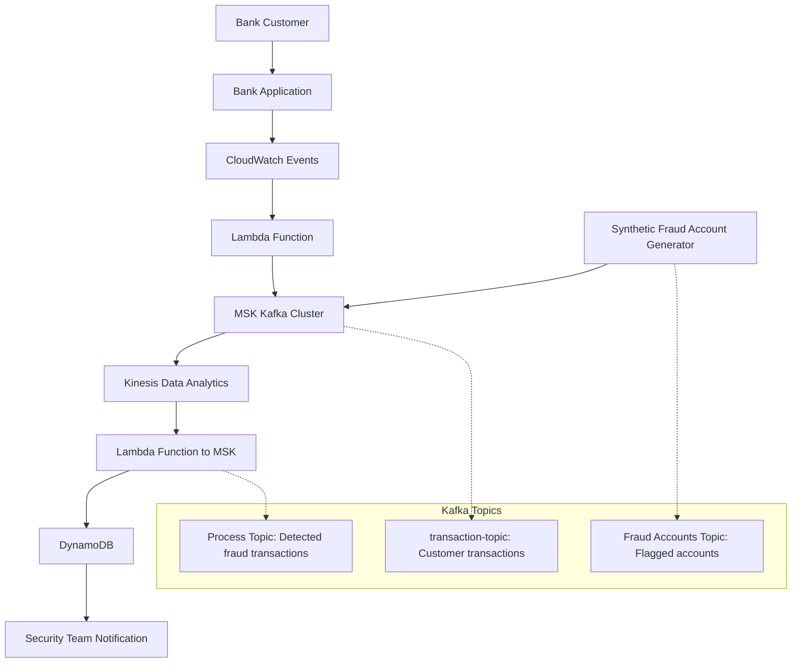

# Course Summary Tracker

| Session Number | Topic | Status | Summary |
|----------------|-------|--------|---------|
| 36 | Real-Time Fraud Detection Project | Completed | Demonstrated real-time fraud detection using AWS services including Kinesis, MSK (Kafka), DynamoDB, Lambda, and CloudWatch Events. Covered motivation behind low latency detection, architecture setup, and live demo. |

**Last Updated:** 2026-04-27  
**Total Sessions Completed:** 1

# Session 36: Real-Time Fraud Detection Project

## Table of Contents
- [Overview](#overview)
- [Key Concepts](#key-concepts)
  - [Decision Latency and Fraud Detection Challenges](#decision-latency-and-fraud-detection-challenges)
  - [Real-Time Data Analysis for Banks](#real-time-data-analysis-for-banks)
  - [AWS Kinesis and MSK Overview](#aws-kinesis-and-msk-overview)
  - [Fraud Detection Architecture](#fraud-detection-architecture)
- [Lab Demos](#lab-demos)
  - [Setting Up the Fraud Detection Project](#setting-up-the-fraud-detection-project)
  - [CloudFormation Stack Deployment](#cloudformation-stack-deployment)
  - [Kafka Front-End Setup](#kafka-front-end-setup)
  - [Real-Time Data Flow Demonstration](#real-time-data-flow-demonstration)
- [Summary](#summary)
  - [Key Takeaways](#key-takeaways)
  - [Quick Reference](#quick-reference)
  - [Expert Insight](#expert-insight)

## Overview

Session 36 focused on implementing a real-time fraud detection system for banking transactions using AWS managed services. The session began with Q&A covering quiz access, course-related queries, and transitioned into a comprehensive demonstration of a production-ready fraud detection project. The instructor explained the critical need for low-latency fraud detection in financial systems, then built and tested a complete architecture using Kinesis, Managed Streaming for Amazon Kafka (MSK), DynamoDB, Lambda functions, and CloudWatch Events. This session demonstrated how to handle high-volume real-time data streams and perform instant analytics to detect fraudulent activities in banking transactions.

## Key Concepts

### Decision Latency and Fraud Detection Challenges

Banking and financial institutions face significant challenges in fraud detection that require ultra-low latency responses:

- **Latency Impact**: More latency means more time for fraudulent transfers to proliferate before detection, making recovery difficult or impossible
- **Digital Money Reality**: With cashless economies, fraudulent transactions can spread rapidly across accounts and borders
- **Data Complexity**: Banks collect massive datasets from applications, networks, and customer interactions, creating velocity of data in terabytes per second (illustrated by Netflix's 37%+ share of global internet traffic)
- **Traditional Approaches**: Batch processing overnight can miss real-time fraud opportunities, emphasizing the need for immediate action

**Key Challenge**: Detect fraud instantly while managing massive data streams in real-time.

### Real-Time Data Analysis for Banks

Modern fraud detection requires a complete shift to real-time processing:

- **Data Sources**: Application logs, network packets, transaction data, IP addresses, and analytics correlating patterns
- **Machine Learning Integration**: Real-time analysis combining data insights with AI/ML models to identify anomalies
- **Immediate Action**: Flag suspicious transactions, block cards, reverse transfers, or notify security teams within milliseconds
- **1990s Context**: While legacy systems collected data, modern systems must analyze and respond instantly

> [!IMPORTANT]
> Real-time fraud detection can prevent financial losses estimated in billions annually, as per industry reports from major banking institutions.

### AWS Kinesis and MSK Overview

AWS provides serverless, managed services for real-time big data processing:

#### Amazon Kinesis
A family of services for real-time data streaming and analysis:
- **Kinesis Data Streams**: Captures and stores real-time data streams (events, logs, IoT data)
- **Kinesis Firehose**: ETL service for transforming data before delivery to warehouses or S3
- **Kinesis Data Analytics**: Real-time analytics using SQL or Apache Flink for processing high-volume streams

#### Amazon Managed Streaming for Apache Kafka (MSK)
Fully managed Apache Kafka service:
- Serverless Kafka without cluster management
- Standards-compliant for existing Kafka tools and applications
- Supports trillions of events per day with millisecond latency

**Netflix Use Case**: Kinesis streams serve billions of playback analytics messages daily, enabling real-time content optimization and fraud detection.

### Fraud Detection Architecture

The demonstrated architecture uses an event-driven approach:



**Architecture Components**:
- **Transaction Flow**: Customer transactions trigger CloudWatch Events → Lambda stores in Kafka
- **Fraud Management**: Security teams maintain fraud account lists in Kafka
- **Analytics Engine**: Kinesis correlates transactions against fraud lists in real-time
- **Alert System**: Detected fraud stored in DynamoDB for immediate action

This architecture handles millions of transactions per second while maintaining sub-second decision latency.

## Lab Demos

### Setting Up the Fraud Detection Project

The instructor used automation scripts hosted on GitHub to deploy the entire stack:

1. **Access the Code**:
   ```bash
   git clone [GitHub repository URL provided in session]
   ```

2. **Upload Code to S3**:
   - Create S3 bucket (e.g., `bank-fraud-demo-1234`)
   - Upload CloudFormation template (`cfn-bank-fraud.yaml`) and lambda functions

3. **Create EC2 Key Pair**:
   ```bash
   # In AWS Console EC2 service
   Create key pair: bank-fraud-demo-key (PEM format)
   Download and save locally
   ```

### CloudFormation Stack Deployment

Deployed the complete infrastructure using CloudFormation:

1. **Launch Stack**:
   - Navigate to CloudFormation service
   - Upload the CloudFormation template
   - Provide parameters:
     - S3 Bucket Name
     - EC2 Key Pair Name

2. **Stack Components Created**:
   - MSK Kafka cluster with topics (transaction-topic, fraud-accounts, process-topic)
   - Kinesis Data Analytics application
   - DynamoDB tables
   - Lambda functions for transaction processing, fraud detection, and notifications
   - EC2 instance for Kafka front-end monitoring

3. **Deployment Time**: Approximately 20-30 minutes for full cluster provisioning

### Kafka Front-End Setup

Configured monitoring interface for Kafka cluster:

1. **Connect to EC2 Instance**:
   ```bash
   chmod 400 bank-fraud-demo-key.pem
   ssh -i bank-fraud-demo-key.pem ec2-user@<EC2-INSTANCE-IP>
   ```

2. **Configure Kafka Front-End**:
   ```bash
   export BOOTSTRAP_SERVERS=<MSK-KAFKA-ENDPOINT>
   docker run -d --name kafka-ui -p 9000:8080 \
     -e KAFKA_CLUSTERS_0_NAME=local \
     -e KAFKA_CLUSTERS_0_BOOTSTRAPSERVERS=$BOOTSTRAP_SERVERS \
     provectuslabs/kafka-ui:latest
   ```

3. **Access Front-End**: Navigate to `http://<EC2-INSTANCE-IP>:9000`

### Real-Time Data Flow Demonstration

Demonstrated end-to-end fraud detection:

1. **Synthetic Transaction Generation**:
   - Lambda function generates random banking transactions
   - Stores in Kafka `transaction-topic`
   - Example transaction: Account ID, timestamp, amount, merchant, category

2. **Fraud Account Management**:
   - Security team designates flagged accounts
   - Lambda function populates `fraud-accounts-topic` in Kafka

3. **Real-Time Correlation**:
   - Kinesis Data Analytics application integrates Kafka streams
   - SQL queries correlate transactions against fraud lists
   - Matches trigger Lambda functions to store in `process-topic`

4. **Alert Storage**:
   - Final Lambda function transfers detected fraud to DynamoDB
   - Enables security team investigation and customer notifications

**Demo Results**: System successfully detected fraud transactions in real-time, demonstrating millisecond-level decision latency.

## Summary

### Key Takeaways

```diff
+ Real-time fraud detection crucial for financial security
+ AWS serverless tools (Kinesis, MSK, Lambda) enable instant analytics
+ Decision latency directly impacts fraud prevention effectiveness
+ Event-driven architectures scale for massive transaction volumes
+ Managed services eliminate infrastructure management overhead
- Traditional batch processing insufficient for modern fraud risks
- Manual fraud detection creates unrecoverable financial losses
- Self-managed streaming infrastructure complex and error-prone
```

### Quick Reference

**AWS Services Used**:
- Kinesis Data Streams: Real-time data ingestion
- Kinesis Data Analytics: Stream processing engine
- MSK (Managed Streaming for Kafka): Message queuing
- Lambda: Event processing functions
- DynamoDB: Fast NoSQL storage for alerts
- CloudFormation: Infrastructure as code

**Key Commands**:
```bash
# Clone project repository
git clone https://github.com/[repository]

# Deploy CloudFormation stack
aws cloudformation create-stack --stack-name bank-fraud-demo \
  --template-url s3://bucket/cfn-bank-fraud.yaml \
  --parameters ParameterKey=S3Bucket,ParameterValue=bucket-name

# Connect to EC2 monitoring instance
ssh -i key.pem ec2-user@instance-ip

# Launch Kafka UI container
docker run -d --name kafka-ui -p 9000:8080 provectuslabs/kafka-ui:latest
```

**Configuration Syntax**:
```yaml
# Kinesis Analytics SQL Query Example
CREATE OR REPLACE STREAM "DESTINATION_SQL_STREAM" (
    account_id VARCHAR(8),
    transaction_amount DOUBLE,
    fraud_flag INTEGER
);

CREATE OR REPLACE PUMP "STREAM_PUMP" AS INSERT INTO "DESTINATION_SQL_STREAM"
SELECT STREAM
    s.account_id,
    s.amount,
    CASE WHEN f.fraud_accounts IS NOT NULL THEN 1 ELSE 0 END AS fraud_flag
FROM "SOURCE_SQL_STREAM_001" AS s
LEFT JOIN "SOURCE_SQL_STREAM_002" AS f
    ON s.account_id = f.account_id;
```

### Expert Insight

#### Real-World Application
Deploy this architecture in enterprise banking environments where transaction volumes exceed millions per minute. Integrate with existing SIEM systems for comprehensive threat detection. Use Kinesis Firehose for data warehousing in Redshift for historical fraud pattern analysis.

#### Expert Path
- Master Apache Flink for complex stream processing beyond SQL
- Learn Kafka Connect for integrating legacy systems
- Study Apache Spark Structured Streaming for ML model integration
- Certify in AWS Data Analytics Specialty for enterprise validation
- Practice with Netflix-like streaming workloads for scale testing

#### Common Pitfalls
- Incorrect stream partitioning causing hot spots and processing delays
- Not configuring adequate shard counts in Kinesis leading to throttling
- IAM permissions gaps between services causing cross-service failures
- Insufficient monitoring of stream processing latency affecting decision-making
- Ignoring data retention policies leading to compliance violations

#### Lesser-Known Facts
- Kinesis processes game telemetry from titles like Fortnite in real-time for player experience optimization
- Netflix processes over 500 billion streaming events daily through Kinesis pipelines
- Real-time fraud detection systems can reduce false positives by 80% with ML feature engineering
- Serverless streaming eliminates traditional 99.9% uptime concerns, achieving 99.99% reliability through AWS management

🤖 Generated with [Claude Code](https://claude.com/claude-code)
Co-Authored-By: Claude <noreply@anthropic.com>
