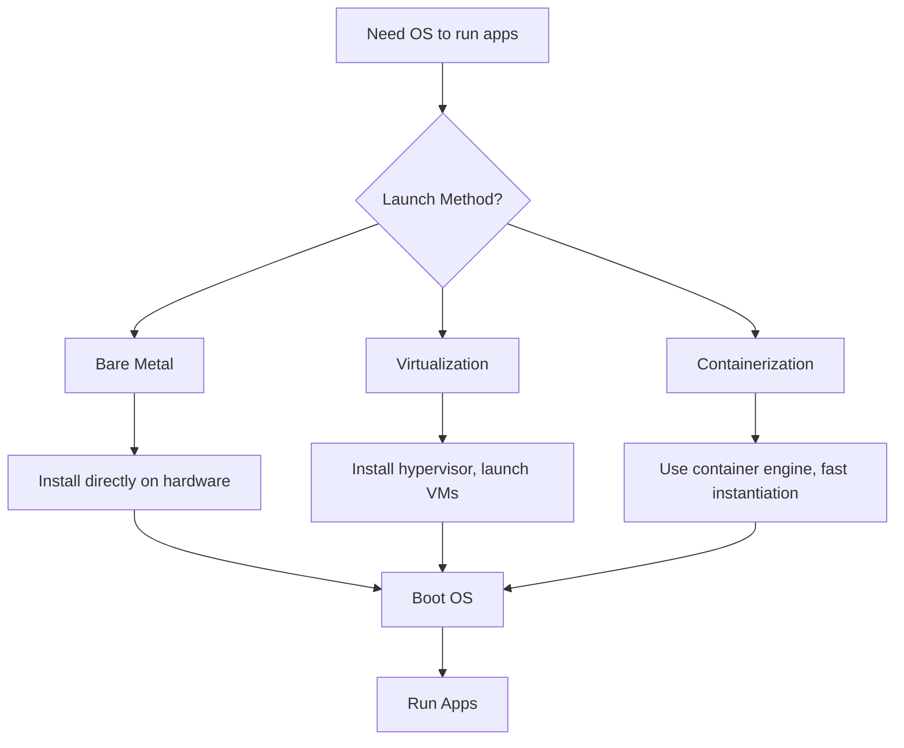
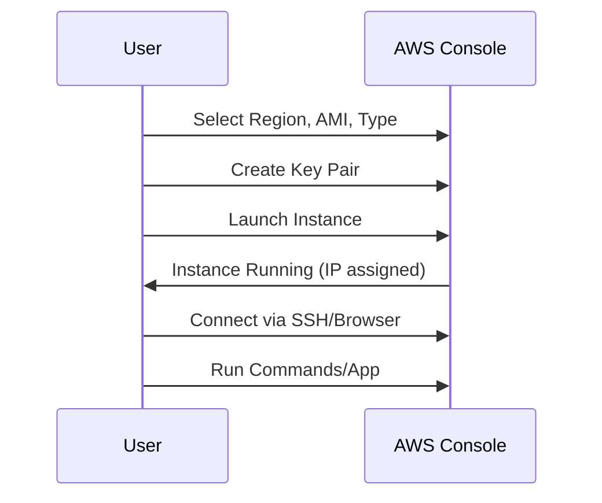

# Section 02: Session 02 16th Feb

<details open>
<summary><b>Section 02: Session 02 16th Feb (KK-CS45-V3)</b></summary>

## Table of Contents
- [Opening and Recap](#opening-and-recap)
- [Introduction to Operating Systems and Launching](#introduction-to-operating-systems-and-launching)
- [Bare Metal Setup](#bare-metal-setup)
- [Virtualization](#virtualization)
- [Containerization](#containerization)
- [Cloud Service Providers](#cloud-service-providers)
- [AWS Services Overview](#aws-services-overview)
- [EC2 Launch Demo](#ec2-launch-demo)
- [Q&A and Closing](#qa-and-closing)
- [Summary](#summary)

## Opening and Recap

### Overview
The session begins with a warm welcome to day two of the AWS training, encouraging positive feedback and addressing participant experiences. Key announcements include access to previous session recordings, shared resources like Google Drive screenshots, and expectations for live attendance. Commitment to tasks, LinkedIn posting, and potential rewards for quality work are emphasized, along with self-reflection practices for attendance and community volunteering.

### Key Concepts
- **Live Attendance Requirement**: Participants must attend sessions live without dependencies on recordings to ensure dedication and engagement. Recordings are only provided for missed sessions due to valid reasons.
- **Task Submission**: Assignments, such as writing blog posts on LinkedIn, are mandatory for progress. Form submission for portal access issues, and LinkedIn profile verification for surprises (likely certificates or goodies).
- **Self-Reflection**: Daily reflection on learned topics, including key points and unique insights, posted as LinkedIn comments for attendance tracking.
- **Resources**: Google Drive for session screenshots, Discord for technical support, and WhatsApp groups for task updates.
- **Motivation**: Emphasis on building a dedicated community, with references to future phases like private cloud and own cloud creation.

### Key Takeaways from Discussion
- Comprehensive support includes portal, drives, and volunteers.
- Dedication leads to unlocked advanced modules.
- Avoid reliance on recordings for proper engagement.

## Introduction to Operating Systems and Launching

### Overview
The core of learning AWS involves understanding operating systems (OS) as the foundation for running applications. All OS launch methods boil down to providing CPU and RAM resources. The session transitions quickly from basics to practical AWS concepts, starting from zero knowledge.

### Key Concepts
- **OS Purpose**: Programs (apps/software) require an OS to run. Launch OS → Boot OS → Run Programs.
- **Three Launch Methods**: Bare Metal, Virtualization, Containerization. Cloud providers abstract these.
- **Prerequisites**: Zero AWS, coding, or cloud knowledge needed. Focus on high-level concepts for IT professionals aiming for excellence.
- **Philosophy**: Right education emphasizes correct understanding of purposes and practical applications, not just theory.

### Deep Dive
- **OS Launching**: Installing/booting OS. Concepts apply to Windows, Linux, Unix, but AWS examples focus on Linux.
- **Performance & Cloud Context**: Fast launching enables agility (e.g., time-to-market for apps). Cloud optimizes costs, performance, and scalability.

### Code/Config Blocks
No code snippets in this segment, but future demos involve Linux commands like `ls` or `dmidecode`.

### Tables
| Launch Method | Key Characteristics | Use Case |
|---------------|---------------------|---------|
| Bare Metal | Direct on physical hardware; one OS per hardware | Traditional servers requiring full resources |
| Virtualization | Multiple OS on one hardware via hypervisor | Cost-efficient, shared environments |
| Containerization | Fast OS instantiation; process-level isolation | Agile development, microservices |

### Diagrams
Below is a Mermaid diagram illustrating OS launching methods:



💡 **Expert Insight**: Understand underlying technologies to optimize AWS usage; e.g., choose virtualization for dev/test, containers for production agility.

## Bare Metal Setup

### Overview
Bare metal involves installing OS directly on physical hardware (e.g., laptop/desktop). Limitation: Only one OS boots per hardware simultaneously. Common in data centers with servers from vendors like Lenovo or Dell.

### Key Concepts
- **Hardware Requirements**: CPU, RAM, HDD; physical cabinet size matters (rack concept for scalability).
- **Constraint**: Single OS per hardware unit; dual-booting allows multiple OS but not simultaneous booting.
- **Cloud Variant**: AWS offers dedicated hosts/bare metal as-a-service, installing OS directly with pre-configured security/firewalls.

### Deep Dive
In AWS, bare metal provides real hardware access, ideal for apps not supporting virtualization/containerization (e.g., legacy software). Charged hourly, with recovery/backup handling via EBS or snapshots (future topic).

> [!IMPORTANT]
> Bare metal ensures maximum performance but higher costs; suitable for specialized workloads.

## Virtualization

### Overview
Virtualization solves bare metal's single OS limitation by using a hypervisor software to create multiple independent OS (VMs) on shared hardware. Enables resource sharing and cost savings.

### Key Concepts
- **Hypervisor Product**: Software (e.g., Oracle VirtualBox, VMware ESXi, KVM, Xen) allowing multiple OS on one host.
- **Host vs. Guest**: Base OS (host machine) runs hypervisor; launched OS (guest machines/VMs) share host RAM/CPU.
- **Benefits**: Cost-effective, isolation, scaling; popular due to reduced hardware needs.
- **AWS Hypervisor**: Primarily Xen, now Nitro for enhanced performance/speed (details in future sessions).
- **Tenancy Model**: Shared (default, cost-effective), Dedicates Host (exclusive hardware for compliance).

### Deep Dive
Virtualization evolved for efficiency. AWS uses Nitro hypervisor for faster instant launches, critical for high-traffic services like Netflix (real-time scaling).

### Code/Config Blocks
Example hypervisor check in Linux:
```bash
dmidecode | grep -i hypervisor
# Output indicates hypervisor type (e.g., Xen)
```

### Tables
| Aspect | Description |
|--------|-------------|
| Host Machine | Base OS running hypervisor |
| Guest Machine | Virtual OS launched by hypervisor |
| Hypervisor Examples | VMware ESXi, KVM, Xen, VirtualBox |
| AWS Specific | Nitro hypervisor for optimized AWS workloads |

## Containerization

### Overview
Containerization provides ultra-fast OS launches (seconds vs. minutes) by packaging apps in isolated containers using a container engine (e.g., Docker). Addresses agility needs in modern development.

### Key Concepts
- **Container Engine**: Program (e.g., Docker, Podman) enabling multiple OS launches per second.
- **Agility Benefit**: Quick app deployment to market; essential for DevOps/microservices.
- **Difference from VMs**: Faster, lighter; no full OS per instance.
- **Purpose**: Isolate app environments, scalability, CI/CD integration.

### Deep Dive
Traditional OS installs take time; containers enable instant scaling (e.g., for traffic spikes). AWS ECS used ACS as container-as-a-service.

> [!NOTE]
> Containers optimize for speed/agility; VMs for full isolation. Choose based on app needs (future EKS topic).

### Code/Config Blocks
Docker example (future demo):
```bash
docker run -d ubuntu echo "Hello World"
# Launches Ubuntu container instantly
```

### Diagrams
Mermaid for containerization workflow:

```mermaid
flowchart LR
    A[Physical Hardware] --> B[Host OS]
    B --> C[Container Engine (Docker)]
    C --> D[Container 1: App A]
    C --> E[Container 2: App B]
    D --> F[Instant Launch/Scaling]
    E --> F
```

## Cloud Service Providers

### Overview
Cloud providers (e.g., AWS, Azure, GCP) abstract infrastructure management, offering services with click-and-launch UI. They use bare metal/data centers but hide complexities, providing abstraction for user convenience.

### Key Concepts
- **Abstraction**: Users ignore internals; launch OS without installing tools.
- **Service Models**: Compute (virtualization), Container (containers), Metal (bare metal).
- **Cost Model**: Pay-as-you-go; charged per hour for usage, stop to avoid costs.
- **AWS Edge**: Nitro hypervisor for performance; handles behind-scenes management.

### Deep Dive
Providers invest in global data centers/zones for redundancy (e.g., AZs in regions). Enables companies to focus on apps, not infra.

> [!NOTE]
> Cloud transforms capex to opex; startups avoid upfront hardware investments.

## AWS Services Overview

### Overview
AWS offers over 200 services; key ones: EC2 (compute/virtualization), ECS (containerization), Metal instances. Launched via AWS Management Console (UI).

### Key Concepts
- **AMI (Amazon Machine Image)**: OS templates (Windows, Linux, etc.); catalog for launching instances.
- **EC2**: Primary compute service for VMs; select AMIs, instance types, regions/AZs.
- **Regions/AZs**: Geographic locations with multiple zones; ensure compliance/data residency.
- **Identity/Firewalls**: IAM for access, VPC for networking (future topics).

### Deep Dive
AMI includes OS + software; customize via building new AMIs. Free tier applies to T2_micro variants (free for 750 hours).

> [!IMPORTANT]
> Specific regions have free tiers; always check availability.

### Tables
| Service | Purpose | Example Use |
|---------|---------|-------------|
| EC2 | Virtual machine launch | Web servers, databases |
| ECS | Container orchestration | Microservices |
| Bare Metal | Dedicated hardware | Legacy apps |

## EC2 Launch Demo

### Overview
Step-by-step EC2 instance launch: Select region (Mumbai/AP South 1), AMI (Amazon Linux), instance type (T2.micro free), key pair for access, and launch. Virtual machine in AWS cloud.

### Key Concepts
- **Instance Types**: Varied specs (CPU/RAM); T2.micro free, others charged hourly/secondly.
- **Configuration**: Networking (VPC security groups), storage (EBS root), tags for organization.
- **Access**: Key pairs (PEM files) for SSH; connect via browser/console or SSH client.

### Lab Demos
1. **Login to AWS Console**: Use created account, select Mumbai region.
2. **Launch Instance**:
   - Name: e.g., "My Test Linux"
   - AMI: Amazon Linux 2
   - Instance Type: t2.micro (free eligible)
   - Key Pair: Create new (PEM download)
   - Launch
3. **Monitor Status**: Dashboard shows running state; connect button for browser access.

### Code/Config Blocks
Example AMI configuration (YAML via CloudFormation, future):
```yaml
Resources:
  MyEC2Instance:
    Type: AWS::EC2::Instance
    Properties:
      ImageId: ami-12345678  # Amazon Linux AMI ID
      InstanceType: t2.micro
```

### Warnings
Terminate instances when done to avoid unexpected charges. Enable regions before launch.

### Diagrams
EC2 launch flow (use 'make png' if possible in images folder):



💡 **Real-world Application**: Netflix uses EC2 auto-scaling for traffic spikes, leveraging instant launches.
⚠️ **Common Pitfalls**: Forgetting to stop instances leads to billing; always tag for cost tracking.

## Q&A and Closing

### Overview
Q&A covers billing monitoring, data persistence, performance reasons for cloud, and future topics (e.g., Lambda, Route53).

### Key Concepts
- **Billing**: Check via dashboard; estimate with AWS TCO Calculator.
- **Data on Termination**: Lost without backups; use EBS/snapshots.
- **Hypervisor**: Xen (KVM in some), moving to Nitro.
- **Perform Instance Changes**: Instance types modifiable with planning; no direct region changes.
- **Bundles/Free Access**: Separate for CSA/system design students.

### Deep Dive
Emphasis on live attendance, self-reflection, and community building.

### Summary
Session reinforces AWS foundations, with practical EC2 demo. Future sessions cover storage, networking, security.

## Summary

### Key Takeaways
```diff
+ OS launching via bare metal, virtualization, containerization forms AWS basis
- Abstraction hides complexity, enabling pay-as-you-go model
! Nitro hypervisor optimizes for performance/speed
⚠️ Monitor billing; terminate unused instances
+ Self-reflection and LinkedIn tasks build discipline
```

### Quick Reference
- **Launch EC2**: Select AMI → Instance Type → Key Pair → Launch
- **Free Tier**: T2.micro, 750 hours free new accounts
- **Commands**: `dmidecode` for hypervisor check; Docker for containers
- **Services**: EC2 (VMs), ECS (containers), Metal (bare)
- **Coast Model**: Hourly/secondly, region-dependent; use Calculator

### Expert Insight
**Real-world Application**: Streaming services like Hotstar scale EC2 instances for live events, ensuring zero downtime via AZs and auto-scaling.
**Expert Path**: Master hypervisors/tenancy for architecture roles; experiment with free tier builds (e.g., web server deployment).
**Common Pitfalls**: Ignoring region costs/AZs can double expenses; no recordings lead to missed fundamentals; failing self-reflection impacts progress/certificates.
**Lesser-Known Facts**: AWS optimizes for 99.999% uptime via global zones; Nitro hypervisor reduces launch times to <10 seconds for critical apps.

</details>
