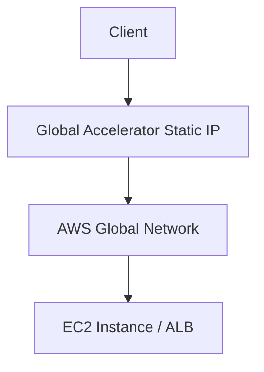

# Section 3: SSH, SOCKS5 Proxy, and AWS Global Accelerator

<details open>
<summary><b>Section 3: SSH, SOCKS5 Proxy, and AWS Global Accelerator (KK-CS45-V3)</b></summary>

## Table of Contents

- [Interactive Connection to EC2 Instances](#interactive-connection-to-ec2-instances)
- [Security Groups and Firewall Rules](#security-groups-and-firewall-rules)
- [Launching and Configuring Web Servers on EC2](#launching-and-configuring-web-servers-on-ec2)
- [SOCKS5 Proxy for Anonymity](#socks5-proxy-for-anonymity)
- [AWS Global Accelerator Overview](#aws-global-accelerator-overview)
- [AWS Global Private Network](#aws-global-private-network)
- [Summary](#summary)

## Interactive Connection to EC2 Instances

### Overview
In AWS EC2, instances are virtual machines running in the cloud. To access and manage these instances for running commands, deploying applications, or performing administrative tasks, users must connect remotely. The primary method for connecting to Linux-based EC2 instances is via SSH (Secure Shell), while certain AMI types like Amazon Linux support direct browser-based connections.

### Key Concepts/Deep Dive
- **EC2 Instance Access Mechanisms**:
  - **Direct Browser Access**: Available for AMIs like Amazon Linux using a web-based SSH client provided by AWS. Users can click the "Connect" button in the EC2 console to open a terminal in the browser.
  - **Limitations**: Direct browser access is not supported for all OS types (e.g., Red Hat Linux). For unsupported AMIs, SSH must be used from a local machine.
  - **SSH Protocol**: SSH is a protocol for secure remote access. It requires:
    - Public IP address of the instance.
    - Username (e.g., `ec2-user` for Amazon Linux).
    - Private key file (downloaded during instance launch).
  - **Key File Handling**: Private keys are typically in PEM format. They are downloaded from AWS and used for authentication instead of passwords.

- **Connection Process**:
  ```bash
  ssh -i /path/to/private-key.pem ec2-user@<public-ip>
  ```
  - **First-Time Connection**: Accept the host key fingerprint.
  - **Troubleshooting**: If connection fails in PowerShell or Command Prompt, use Git Bash or alternative tools. Windows users may need to enable OpenSSH or use third-party clients.
  - **Key Permissions**: Ensure the PEM key has restricted permissions (e.g., `chmod 400 key.pem` on Unix-like systems).
  - **Alternative Tools**: Git Bash provides a Bash-like environment on Windows for SSH commands.

- **Instance Management**:
  - Access allows running commands like `sudo su` to gain root privileges.
  - Instances can be used for web servers, databases, containers, AI models (e.g., connecting to ChatGPT), or specialized setups like SOCKS proxies.

### Lab Demo
Launch an EC2 instance:
- Choose AMI (e.g., Red Hat Linux or Amazon Linux).
- Select instance type (e.g., t2.micro for free tier).
- Configure security group to allow SSH (port 22) from your IP.
- Launch and download key pair.
- Connect via browser or SSH command.

```bash
# Example SSH command
ssh -i red-hat-key.pem ec2-user@54.123.45.67
```

### Code/Config Blocks
- **SSH Config Example**:
  ```ssh-config
  Host my-instance
      HostName 54.123.45.67
      User ec2-user
      IdentityFile ~/keys/red-hat-key.pem
  ```

## Security Groups and Firewall Rules

### Overview
AWS EC2 instances are protected by security groups, which act as virtual firewalls. These define incoming (inbound) and outgoing (outbound) traffic rules. By default, only essential traffic like SSH is allowed, blocking unauthorized access. Users must modify these rules to enable services like web servers.

### Key Concepts/Deep Dive
- **Security Group Basics**:
  - Acts as a firewall at the instance level.
  - Rules specify protocols (e.g., TCP), ports (e.g., 80 for HTTP), and sources (e.g., 0.0.0.0/0 for anywhere).
  - Default: Allows SSH (port 22) inbound.

- **Inbound Rules**:
  - Define traffic allowed into the instance.
  - For web servers: Add rule for HTTP (port 80) or HTTPS (port 443).
  - Source can be set to "Anywhere" for public access.

- **Modifying Security Groups**:
  - From EC2 console: Select instance → Security → Edit inbound rules.
  - Add rules based on requirements.
  - After changes, re-access the instance to test (e.g., HTTP request).

- **Real-World Application**: Ensures compliance and security; e.g., only allowing HTTP from specific IPs to prevent open ports.

### Tables: HTTP Methods/Protocols
| Protocol | Port | Description |
|----------|------|-------------|
| SSH      | 22   | Secure remote access |
| HTTP     | 80   | Web traffic |
| HTTPS    | 443  | Secure web traffic |

## Launching and Configuring Web Servers on EC2

### Overview
EC2 instances can host web applications by installing and configuring web servers. This involves launching an instance, installing software like Apache (httpd), creating content, and enabling services. The process demonstrates EC2 as a flexible platform for web hosting.

### Key Concepts/Deep Dive
- **Instance Launch**:
  - Select region (e.g., US West for US-based users).
  - Choose AMI supporting web servers (e.g., Amazon Linux).
  - Free tier eligible for cost-saving.

- **Web Server Installation**:
  - Use package managers like YUM for Red Hat-based systems.
  - Install httpd: `yum install httpd`.
  - Start service: `systemctl enable httpd; systemctl start httpd`.

- **Content Deployment**:
  - Web root directory: `/var/www/html`.
  - Create index.html: `vi index.html` or use `cat > index.html`.
  - Access via HTTP://<public-ip>.

- **Security Group Adjustment**:
  - Add inbound rule for port 80 to allow web traffic.

- **Testing**:
  - Use browser or curl: `curl http://<public-ip>`.

### Code/Config Blocks
- **Install and Enable httpd**:
  ```bash
  sudo yum install httpd
  sudo systemctl enable httpd
  sudo systemctl start httpd
  ```

- **Sample index.html**:
  ```html
  <html>
  <body>
  <h1>Welcome to Linux World Website</h1>
  <p>I am from California.</p>
  </body>
  </html>
  ```

### Lab Demo
- Launch EC2 in a region matching target audience.
- Install httpd and deploy content.
- Configure security group.
- Access website globally if IP is public.

## SOCKS5 Proxy for Anonymity

### Overview
SOCKS5 proxy allows anonymizing internet traffic by routing connections through an EC2 instance. This hides the user's real IP and location, useful for testing, privacy, or accessing geo-blocked content. It's set up using SSH tunneling.

### Key Concepts/Deep Dive
- **Proxy Concept**:
  - A proxy server acts as an intermediary for requests. SOCKS5 supports various protocols beyond HTTP.
  - Use case: Change apparent location (e.g., from India to US) by routing traffic through a VPN-like tunnel.

- **Setup Process**:
  - Launch EC2 in desired region (e.g., US for US IP).
  - Connect with SSH forwarding a local port (e.g., 1080).
  - Configure local applications (e.g., Chrome) to use the proxy.
  - Use extensions or commands to set proxy settings.

- **SSH Tunneling**:
  - Command: `ssh -D 1080 user@<ec2-ip>`
  - `-D`: Dynamic port forwarding for SOCKS proxy on port 1080.

- **Browser Configuration**:
  - Use Chrome extensions or command-line startup.
  - Example: Force Chrome to use SOCKS proxy: `chrome.exe --proxy-server="socks5://127.0.0.1:1080"`
  - Result: Traffic appears from EC2's location/IP.

- **Use Cases**:
  - Location masking for testing global performance.
  - Anonymity for privacy or circumvention of restrictions.

### Tables: Protocol Versions
| Version | Features |
|---------|----------|
| SOCKS4 | Basic proxy support |
| SOCKS5 | Authenticated, UDP support |

## AWS Global Accelerator Overview

### Overview
AWS Global Accelerator (GA) optimizes application performance globally by routing traffic through AWS's private network. It reduces latency, improves reliability, and provides static IPs for consistent access. Unlike running multiple instances worldwide, GA accelerates traffic to existing endpoints.

### Key Concepts/Deep Dive
- **Problems Solved**:
  - Latency in global application access due to public internet routing.
  - Inconsistent performance across regions.
  - Client application must update for endpoint changes.

- **How It Works**:
  - Uses two static IP addresses (anycast) for global entry.
  - Routes traffic via AWS global network to endpoints (EC2, load balancers).
  - Automatically selects optimal path based on health and performance.

- **Benefits**:
  - Reduces latency by 50-60%.
  - Improves availability with health checks and failover.
  - Secure: Traffic on private network, not public internet.

- **Use Cases**:
  - Low-latency apps (gaming, conferencing).
  - Global reach for apps in one region.

- **Comparison**:
  - Not a CDN (e.g., CloudFront) for content caching; GA is for direct application acceleration.

### Mermaid Diagrams


## AWS Global Private Network

### Overview
AWS maintains a global private network of high-speed fiber-optic cables for reliable, secure, low-latency connections. This provides the backbone for services like Global Accelerator, ensuring traffic avoids public internet issues.

### Key Concepts/Deep Dive
- **Network Infrastructure**:
  - Worldwide cables, submarine for intercontinental links.
  - Dedicated speeds (e.g., 10Gbps-100Gbps).
  - Resilient to failures with automatic rerouting.

- **Advantages**:
  - Higher reliability and performance vs. public internet.
  - Security: Isolated from external threats.
  - Stable speeds; no congestion.

- **Access**.
  - Used indirectly via AWS services; e.g., bridge public traffic to private network via GA.
  - Charged through services using it (e.g., GA pricing).

## Summary

### Key Takeaways
```diff
+ EC2 enables launching virtual machines for web hosting, proxies, or applications.
- Public internet for EC2 access incurs latency; use AWS private network services like GA for optimization.
! SOCKS5 proxy provides anonymity but requires proper SSH setup and browser configuration.
+ Global Accelerator accelerates global traffic without replicating infrastructure.
- Misconfigured security groups block access; always review inbound rules.
```

### Quick Reference
- SSH Connect: `ssh -i key.pem user@ip`
- Install HTTPD: `yum install httpd`
- SOCKS Proxy: `ssh -D port user@ip`
- Chrome Proxy: `chrome.exe --proxy-server="socks5://127.0.0.1:1080"`
- GA Workshop: Access detailed demos for GA setup.

### Expert Insight

#### Real-World Application
In e-commerce, launch EC2 web servers regionally (e.g., US for US customers) to reduce latency. For global reach, integrate GA to accelerate traffic without geographic replication, ideal for real-time apps like online gaming or live streaming.

#### Expert Path
Master SSH debugging (e.g., verbose logs with `-v`) and security group best practices. Experiment with multiple EC2 regions for latency benchmarking using tools like curl or ping. Integrate GA with health checks for production resilience.

#### Common Pitfalls
- Forgetting to edit security groups leads to access failures.
- Using public internet for latency-sensitive apps without GA or proxies.
- Exposing unprotected ports globally can lead to security risks.

#### Lesser-Known Facts
- AWS's global network uses anycast routing, where the nearest edge location responds, improving initial connection speed.
- SOCKS5, unlike HTTP proxies, supports any TCP/UDP traffic, making it versatile for non-web protocols.

</details>
