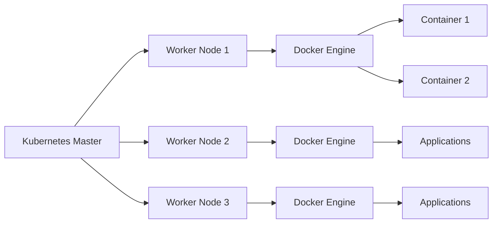

# Session 01: Kubernetes Introduction

## Table of Contents
- [Training Overview](#training-overview)
- [About Viml Daga](#about-viml-daga)
- [Training Details](#training-details)
- [Communication Channels](#communication-channels)
- [Prerequisites](#prerequisites)
- [What is Kubernetes?](#what-is-kubernetes)
- [Challenges with Containers](#challenges-with-containers)
- [Kubernetes as Container Orchestrator](#kubernetes-as-container-orchestrator)
- [Kubernetes Cluster Architecture](#kubernetes-cluster-architecture)
- [Pods: The Basic Unit](#pods-the-basic-unit)
- [Future Classes Overview](#future-classes-overview)

## Training Overview
Welcome to the Kubernetes training for Certified Kubernetes Administrator (CKA) and Certified Kubernetes Application Developer (CKAD)! This is a complete live training program led by Viml Daga.

### Key Highlights
- Training covers official CKA and CKAD curricula, plus additional real-world industry use cases
- 4 days a week (Tuesday, Wednesday, Thursday, Friday)
- Sessions: ~1.5 hours + Q&A
- Time zone: 9:15 PM IST

> [!NOTE]
> Sessions are live and instructor-led to provide hands-on practical training.

## About Viml Daga
Viml Daga is a world record holder and expert in container technologies.

### Background
- Extensive experience in Kubernetes, Docker, OpenShift, and related domains
- Associated with founders of major container tools (e.g., Docker)
- Domain expertise includes machine learning, IoT, microservices, Python, Java, Splunk, and more
- Holds numerous global certifications

### Teaching Approach
- Pronounced "Vill" (apology for pronunciation in transcript)
- Focuses on practical implementations and real-world challenges
- Tailors content based on participant needs during Q&A

> [!TIP]
> Search for "Viml Daga" on Google for detailed press coverage, TED Talks, and YouTube content.

## Training Details
### Content Structure
- Official CKA and CKAD syllabi + additional topics not covered in official docs
- 95% practical hands-on labs
- Adaptable curriculum: Topics added based on real-world participant needs
- Uses container runtime Cryo (with Docker examples)

### Learning Approach
- Start from zero knowledge level for new learners
- Slow pacing to ensure everyone understands fundamentals
- Real-world use cases discussed throughout
- Q&A addressed at session end, not during delivery

## Communication Channels
### Support Systems
- **Slack Channel**: For technical queries, available 24/7 with technical volunteers
- **WhatsApp Group**: For administrative updates, attendance, schedules, and announcements
- Announce times for active Q&A in WhatsApp

### Roles
- **LSH (Learning Success Head)**: Handles management-related queries - contact via WhatsApp
- **Technical Volunteers**: Provide ongoing technical support via Slack and WhatsApp

> [!IMPORTANT]
> Process for queries: Slack first for technical issues, then technical volunteers, then LSH.

## Prerequisites
✅ Basic knowledge of Docker/containers  
✅ Water supply during classes (instructor note)  

### Container Runtimes
- Docker, Podman, and Cryo will be used
- Training assumes familiarity with launching containers; refer to Viml's free Docker video

## What is Kubernetes?
Kubernetes (K8s) is a container management tool that automates container operations.

### Core Purpose
```diff
+ Automated container orchestration and management
+ Replaces manual monitoring and scaling
+ Handles failure recovery automatically
```

### Why Kubernetes?
- Containers are fast but lack built-in management
- Human monitoring leads to downtime
- Kubernetes acts as an intelligent program replacing humans

## Challenges with Containers
### Single Node Challenges
```
📝 OS (Base System)
    ↳ Docker Engine
        ↳ Containers (Apps: PHP, Python, Java, etc.)
```

#### Problems Identified
- Monitoring containers manually causes inefficiencies
- Downtime occurs when containers crash unexpectedly
- Scaling requires manual intervention

#### Solution
- Developer "Chris" wants automatic management
- Kubernetes programs monitor and auto-recover containers

## Kubernetes as Container Orchestrator
### Basic Architecture


### Key Features
```diff
+ Auto-recovery: Relaunches failed containers
+ Load Balancing: Distributes traffic across containers
+ Auto-Scaling: Launches more containers based on rules (CPU, RAM, requests)
```

#### Example Use Cases
- Website faces high load → Kubernetes launches copies and balances traffic
- Resources exceed thresholds → Auto-scaling triggers
- Failure recovery: New container launched in milliseconds

## Kubernetes Cluster Architecture
### Multi-Node Approach
```
🖥️ Node 1 (Master)
🖥️ Node 2 (Worker)
🖥️ Node 3 (Worker)
🖥️ Node N (Worker)
```

### Cluster Components
- **Master Node**: Central controller (Scheduler, Controllers, API Server, etcd)
- **Worker Nodes**: Run containers via kubelet agents
- **Cluster**: Master + Workers working together

### Benefits
- No single point of failure
- Scales across multiple machines/servers/cloud instances
- Fault tolerance: Apps restart on other nodes if a node fails

> [!WARNING]
> Clusters can run on-premises, cloud, or laptops - same principles apply.

## Pods: The Basic Unit
### Pod Concept
```diff
! From Docker's perspective: Container = Smallest unit
! From Kubernetes perspective: Pod = Smallest unit (wraps containers)
```

#### Pod vs Container
- Pod encapsulates containers for Kubernetes management
- Unique naming conventions and labels
- Enables complex deployments not possible with Docker alone

### Key Takeaway
- Pods abstract away container details
- Kubernetes manages pods, which contain containers

## Future Classes Overview
- Single node setup for initial labs (Minikube)
- Multi-node cluster creation from scratch
- Hands-on with commands, YAML files, and Cryo
- Topics: ReplicaSets, Deployments, Services, Networking

> [!NOTE]
> Labs covered since Day 1 with pre-built images initially, then custom setups.

## Summary

> [!IMPORTANT]
> Kubernetes is the industry-standard tool for container orchestration, enabling automated management, scaling, and recovery that manual processes can't achieve.

### Key Takeaways
```diff
+ Kubernetes replaces manual container monitoring with intelligent automation
+ Core architecture: Master controls Worker nodes running pods/containers
+ Advantages: Fault tolerance, auto-scaling, load balancing
+ Training starts practical from tomorrow, building from fundamentals
```

### Quick Reference
- **Short Forms**: K8s = Kubernetes, CKAD = Certified Kubernetes Application Developer
- **Basic Units**: Pod (K8s), Container (Docker)
- **Architectural Terms**: Master Node, Worker Node, Cluster
- **Tools Covered**: Minikube (single-node), Multi-node setup
- **Key Commands Concept**: TBD in upcoming sessions

### Expert Insight

#### Real-World Application
Kubernetes powers major platforms like Google, Netflix, and Uber for:
- Microservices deployment at scale
- Handling millions of requests with zero-downtime scaling
- Enabling GitOps workflows for rapid deployments

#### Expert Path
1. Master basic concepts and YAML syntax
2. Practice with Minikube locally before production clusters
3. Understand networking (CNI, Ingress) and security (RBAC, Network Policies)
4. Integrate with monitoring (Prometheus/Graphana) and CI/CD (Jenkins)
5. Aim for certifications while building realistic architectures

#### Common Pitfalls
```diff
- Assuming K8s handles application logic ❌ - K8s manages containers, not app code
- Ignoring resource limits → Node overloads
- Using old container runtimes instead of modern ones like Cryo
- Manual scaling human error → Always configure auto-scaling rules
- Skipping networking setup → Apps unable to communicate
```

#### Lesser-Known Facts
- Kubernetes originated from Google's Borg system
- K8s means "pilot" or "helmsman" in Greek (steering containers!)
- CNCF incubates K8s - it's open-source and community-driven
- Multi-master setup enables high availability
- Pods can run multiple containers for complex apps
- Kubernetes supports serverless via Knative integrations
- Cloud-native patterns like sidecars are Pod-first architectures

🤖 Generated with [Claude Code](https://claude.com/claude-code)

Co-Authored-By: Claude <noreply@anthropic.com>
