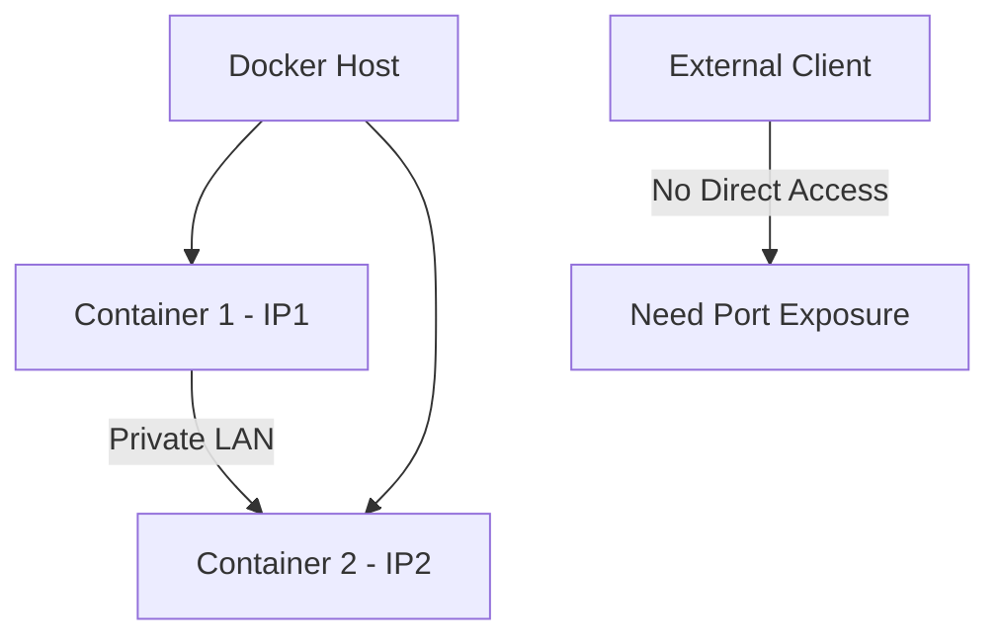

Session 04: Replication Controller

## Table of Contents
- [Overview](#overview)
- [Key Concepts](#key-concepts)
- [Lab Demos](#lab-demos)
- [Summary](#summary)

## Overview

Replication Controller (RC) is a core Kubernetes resource that ensures a specified number of pod replicas are running, providing automatic recovery and high availability for containerized applications. Unlike direct Docker container management, Kubernetes uses labels for monitoring and management instead of IP addresses.

## Key Concepts

### Docker Container Fundamentals

Docker containers provide:
- Private LAN networking for inter-container communication
- Dynamic IP assignment causing monitoring challenges
- Isolated networking requiring port exposure for external access



### Port Exposure and Services

To expose applications externally, Kubernetes uses services with NodePort type:

- Creates NAT (Network Address Translation) for external connectivity
- Assigns high-numbered ports (3xxxx) on the node IP
- Provides load balancing when multiple pods exist

```bash
kubectl expose pod <name> --type=NodePort --target-port=80
kubectl get services
# Access at NodeIP:30180
```

> [!IMPORTANT]
> NodePort services enable external access to containerized applications by mapping container ports to node ports.

### Pods vs Containers

Pods are Kubernetes resource wrappers around containers that:
- Add metadata like labels for management
- Store configuration for replication and monitoring
- Enable Kubernetes to manage container lifecycle

```diff
- Container: Basic Docker isolation unit
+ Pod: Kubernetes wrapper with container + metadata
! Pod = Container + Labels + Management Info
```

### Labels for Pod Management

Labels are key-value pairs attached to pods that:
- Enable selective management by controllers
- Survive pod restarts (unlike IP addresses)
- Allow grouping and selection of related resources

Example label in pod YAML:
```yaml
metadata:
  labels:
    app: web
```

### Replication Controller

RC consists of:
- **Selector**: Identifies pods to manage
- **Desired replicas**: Target number of running pods
- **Template**: Specification for launching new pods
- Monitors pod availability and launches replacements when needed

RC YAML structure:
```yaml
apiVersion: v1
kind: ReplicationController
metadata:
  name: my-rc1
spec:
  replicas: 3
  selector:
    app: web
  template:
    metadata:
      labels:
        app: web
    spec:
      containers:
      - image: <image>
        ports:
        - containerPort: 80
```

### Replica Management and Scaling

RC ensures:
- Specified number of replicas always running
- Automatic recovery from pod failures
- Load distribution across multiple pod instances
- Integration with services for external access

**Replica Scaling Comparison:**

| Feature | Manual Docker | Replication Controller |
|---------|---------------|------------------------|
| Replica management | Script-based | Automatic |
| Fault recovery | Manual | Automatic |
| Load balancing | External tool | Built-in service |
| Monitoring | None | Label-based |

## Lab Demos

### Creating a labelled pod
```yaml
apiVersion: v1
kind: Pod
metadata:
  name: my-port-one
  labels:
    app: web
spec:
  containers:
  - image: whimlcute/apache-webserver-php
    name: web-container
    ports:
    - containerPort: 80
```
```bash
kubectl create -f my-port-one.yaml
kubectl describe pod my-port-one
```

### Exposing port with NodePort service
```bash
kubectl expose pod my-port-one --type=NodePort --target-port=80
kubectl get services
# Access at NodeIP:30180 (example port)
kubectl describe service my-port-one
```

### Creating Replication Controller
```yaml
apiVersion: v1
kind: ReplicationController
metadata:
  name: my-rc1
spec:
  replicas: 1
  selector:
    app: web
  template:
    metadata:
      labels:
        app: web
    spec:
      containers:
      - image: whimlcute/apache-webserver-php
        name: web-container
        ports:
        - containerPort: 80
```
```bash
kubectl create -f rc.yaml
kubectl get rc
kubectl get pods --show-labels
```

### Scaling replicas
Edit spec.replicas to 5 in rc.yaml, then:
```bash
kubectl apply -f rc.yaml
kubectl get pods  # Shows 5 pods running
kubectl get services  # Shows load balanced access
```

### Demonstrating auto-healing
```bash
kubectl delete pod <pod-name>
kubectl get pods  # Automatic replacement launched
kubectl describe rc my-rc1  # Check events log
```

## Summary

**Key Takeaways**
```diff
+ Replication controllers provide high availability and automatic pod recovery
- Direct container management in Docker lacks monitoring and recovery
+ Labels enable reliable pod identification independent of IP addresses
! Services create load balancing and external access to pod applications
- IP-based monitoring fails due to container restart dynamics
+ RC maintains desired replica count for scaling and fault tolerance
```

**Quick Reference**
- Create pod: `kubectl create -f pod.yaml`
- Expose pod: `kubectl expose pod <name> --type=NodePort --target-port=<port>`
- Get services: `kubectl get services`
- Create RC: `kubectl create -f rc.yaml`
- Update RC: `kubectl apply -f rc.yaml`
- View events: `kubectl describe rc <name>`

**Expert Insight**

**Real-world Application**: Use RC for stateless applications requiring multiple instances for load balancing, such as web servers, API gateways, and worker processes in production environments.

**Expert Path**: Advance to ReplicaSets (RS) and Deployments for declarative updates, rollout strategies, and rollback capabilities. Learn about health checks and resource limits for complete container orchestration mastery.

**Common Pitfalls**:
- Forgetting to add matching labels to pods prevents RC monitoring
- Using IP addresses for selection fails on pod restarts
- Not updating replicas specification when scaling needs change
- Confusing RC with Deployment (RC lacks rolling update features)

**Lesser-Known Facts**:
- RC can manage pods created outside its template if label selectors match
- Services automatically register new pods with matching labels for load balancing
- RC events provide detailed troubleshooting logs in the events section
- Pod names get random suffixes, but labels remain consistent for management
