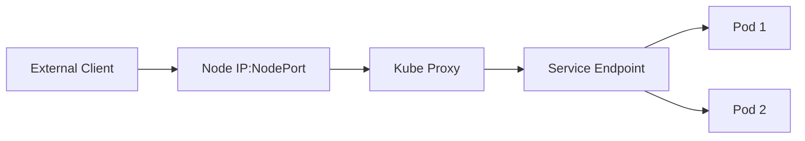

# Session 05: Services in Kubernetes

## Table of Contents
- [Overview of Kubernetes Services](#overview-of-kubernetes-services)
- [Understanding Load Balancers](#understanding-load-balancers)
- [Service Types](#service-types)
  - [ClusterIP](#clusterip)
  - [NodePort](#nodeport)
  - [LoadBalancer (External)](#loadbalancer-external)
- [Practical Demonstrations](#practical-demonstrations)
- [Lab: Creating and Configuring Services](#lab-creating-and-configuring-services)
- [Summary](#summary)
  - [Key Takeaways](#key-takeaways)
  - [Quick Reference](#quick-reference)
  - [Expert Insight](#expert-insight)

## Overview of Kubernetes Services

Kubernetes Services provide a fundamental way to expose and access applications running inside pods. While pods are ephemeral and can have dynamic IP addresses, services create stable endpoints for communication. They act as load balancers and reverse proxies within the Kubernetes cluster, enabling reliable connectivity between components and external clients.

Services are API resources in Kubernetes that define how to access pods, abstracting away the complexity of pod networking. They handle service discovery, load balancing, and provide consistent DNS names for your applications.

## Understanding Load Balancers

At their core, services in Kubernetes implement load balancing concepts similar to traditional web infrastructure. When applications scale horizontally (running multiple replicas), a mechanism is needed to distribute traffic across these instances.

### Core Load Balancing Concepts

**Reverse Proxy Pattern:**
- Services act as intermediaries between clients and backend pods
- Clients connect to a stable service endpoint instead of individual pod IPs
- The service forwards requests to available backend pods on their behalf
- Responses flow back through the same reverse proxy path

**Load Distribution:**
- Round-robin distribution across healthy pod replicas by default
- Automatic discovery of pods based on label selectors
- No manual registration required - pods auto-register with services

**Key Benefits:**
```diff
+ Single stable endpoint for clients
+ Dynamic pod IP handling
+ Automatic load distribution
+ Traffic routing through reverse proxy
```

### Key Terminology

| Term | Description | Example Value |
|------|-------------|---------------|
| **Service Port** | Port exposed by the service (frontend port) | `8080` |
| **Target Port** | Port where the application runs in pods (container port) | `80` |
| **Node Port** | Port exposed on cluster nodes for external access | `30000-32767` |
| **Endpoint** | IP:Port combination identifying a pod's service | `10.0.1.5:80` |

**Label-Based Discovery:**
Pods automatically register with services through label matching, eliminating manual configuration requirements.

## Service Types

Kubernetes provides three main service types, each designed for specific networking scenarios.

### ClusterIP

**Purpose:** Internal cluster communication only

**Key Characteristics:**
- Default service type when type is omitted
- Provides stable cluster-internal IP address
- No external connectivity
- Ideal for microservices communication

**Use Cases:**
> [!NOTE]
> Perfect for database services that shouldn't be exposed externally

**Security Benefits:**
```diff
+ Isolation from external traffic
+ Internal service-to-service communication
+ Controlled access within cluster boundary
```

**Configuration Example:**
```yaml
apiVersion: v1
kind: Service
metadata:
  name: my-load-balancer
spec:
  selector:
    app: web
  ports:
  - protocol: TCP
    port: 8080      # Service port
    targetPort: 80  # Container port
  type: ClusterIP   # Explicitly set (default)
```

### NodePort

**Purpose:** External cluster access through node IPs

**Key Characteristics:**
- Exposes service on each node's IP at a static port
- Port range: 30000-32767
- Accessible from outside cluster via `<NodeIP>:<NodePort>`
- Combines cluster connectivity with external access

**Architecture:**


**Configuration Example:**
```yaml
apiVersion: v1
kind: Service
metadata:
  name: my-load-balancer
spec:
  selector:
    app: web
  ports:
  - protocol: TCP
    port: 8080      # Service port
    targetPort: 80  # Container port
    nodePort: 30000 # Node port (optional, auto-assigned if omitted)
  type: NodePort
```

**Traffic Flow Demonstration:**
```diff
! External Client → Node IP:30000 → Kube Proxy → Service:8080 → Pod:80
```

### LoadBalancer (External)

**Purpose:** Integration with cloud-native load balancers

**Key Characteristics:**
- Provisions external load balancer (e.g., AWS ELB, GCP Load Balancer)
- Automatic IP assignment from cloud provider
- True external load balancing with cloud features
- Requires cloud provider integration

**Cloud Integration:**
> [!IMPORTANT]
> Works with managed Kubernetes services like EKS (AWS), GKE (GCP), AKS (Azure)

**Benefits:**
```diff
+ Enterprise-grade load balancing features
+ Cloud-native scaling and health checks
+ Integration with cloud monitoring
+ Automatic SSL termination support
```

**Configuration Example:**
```yaml
apiVersion: v1
kind: Service
metadata:
  name: my-external-service
spec:
  selector:
    app: web
  ports:
  - protocol: TCP
    port: 80
    targetPort: 8080
  type: LoadBalancer
```

## Practical Demonstrations

### Checking Cluster Services
```bash
# List all services in current namespace
kubectl get services
kubectl get svc

# Get detailed service information
kubectl describe service my-load-balancer
```

### Creating Services via YAML
```bash
# Apply service configuration
kubectl apply -f service.yaml

# Create service interactively
kubectl create service clusterip my-service --tcp=8080:80
```

### Service Discovery Verification
```bash
# Check service endpoints (connected pods)
kubectl get endpoints my-load-balancer

# Test service connectivity internally
curl http://<cluster-ip>:8080

# Verify load balancing (multiple requests)
for i in {1..5}; do curl http://<service-ip>:8080; done
```

## Lab: Creating and Configuring Services

### Lab Prerequisites

**Environment Requirements:**
```diff
+ Running Kubernetes cluster (minikube)
+ kubectl configured
+ Sample web application pods
```

### Lab Procedure

#### Step 1: Create Web Application Pods
```bash
# Create deployment with web application
kubectl create deployment my-web-app --image=nginx --replicas=3 --port=80

# Add appropriate labels for service discovery
kubectl label deployment my-web-app app=web
```

#### Step 2: Create ClusterIP Service
```yaml
# clusterip-service.yaml
apiVersion: v1
kind: Service
metadata:
  name: my-cluster-service
spec:
  selector:
    app: web
  ports:
  - protocol: TCP
    port: 8080
    targetPort: 80
  type: ClusterIP
```

```bash
kubectl apply -f clusterip-service.yaml
kubectl get svc my-cluster-service
```

#### Step 3: Test Internal Connectivity
```bash
# Get cluster IP
CLUSTER_IP=$(kubectl get svc my-cluster-service -o jsonpath='{.spec.clusterIP}')

# Test connectivity from within cluster
kubectl run test-pod --image=busybox --rm -it -- wget -qO- http://$CLUSTER_IP:8080
```

#### Step 4: Convert to NodePort Service
```yaml
# nodeport-service.yaml
apiVersion: v1
kind: Service
metadata:
  name: my-nodeport-service
spec:
  selector:
    app: web
  ports:
  - protocol: TCP
    port: 8080
    targetPort: 80
    nodePort: 30000
  type: NodePort
```

```bash
kubectl apply -f nodeport-service.yaml

# Get node IP
NODE_IP=$(kubectl get nodes -o jsonpath='{.items[0].status.addresses[?(@.type=="InternalIP")].address}')

# Test external connectivity
curl http://$NODE_IP:30000
```

#### Step 5: Verify Load Balancing
```bash
# Scale deployment to verify load distribution
kubectl scale deployment my-web-app --replicas=5

# Monitor load balancing across pods
for i in {1..10}; do
  echo "Request $i:"
  curl -s http://$NODE_IP:30000 | grep -o "nginx/[0-9.]*" || echo "Connection failed"
  sleep 1
done
```

### Lab Verification Commands
```bash
# Check service details
kubectl describe svc my-nodeport-service

# Monitor pod endpoints
kubectl get endpoints my-nodeport-service

# View pod labels
kubectl get pods --show-labels | grep my-web-app

# Clean up
kubectl delete svc my-nodeport-service
kubectl delete deployment my-web-app
```

## Summary

### Key Takeaways
```diff
+ Services provide stable endpoints for pod communication
+ Three service types: ClusterIP (internal), NodePort (node access), LoadBalancer (external)
+ Label selectors enable automatic pod discovery
+ Services act as reverse proxies and load balancers
+ External services integrate with cloud provider load balancers
- Manual IP management is replaced by dynamic service discovery
! Kubernetes handles load balancing automatically through services
```

### Quick Reference

#### Common Service Commands
```bash
# Create services
kubectl expose deployment my-deployment --type=ClusterIP --port=8080 --target-port=80
kubectl expose deployment my-deployment --type=NodePort --port=8080 --target-port=80 --name=my-service

# Service inspection
kubectl get svc -o wide
kubectl describe svc my-service
kubectl get endpoints my-service

# Port forwarding for testing
kubectl port-forward svc/my-service 8080:8080
```

#### Service YAML Template
```yaml
apiVersion: v1
kind: Service
metadata:
  name: my-service
spec:
  selector:
    app: my-app
  ports:
  - protocol: TCP
    port: 8080          # Service port
    targetPort: 80      # Container port
    nodePort: 30000     # Node port (NodePort/LoadBalancer types)
  type: ClusterIP        # ClusterIP, NodePort, or LoadBalancer
```

#### Port Number Reference
| Port Type | Range/Purpose | Example |
|-----------|---------------|---------|
| **Service Port** | Any available port | `8080` |
| **Target Port** | Container application port | `80`, `8080` |
| **Node Port** | 30000-32767 | `30000` |

### Expert Insight

#### Real-world Application
Services are essential for microservices architectures where applications communicate through stable APIs. In production environments, you'll commonly see:
- Database services using ClusterIP for internal access only
- Web applications using LoadBalancer type on cloud platforms
- API gateways combining multiple services behind a single external endpoint

#### Expert Path
To master Kubernetes services, focus on:
1. **Service Mesh Integration**: Learn Istio or Linkerd for advanced traffic management
2. **Ingress Controllers**: Understand how Ingress resources complement services
3. **Network Policies**: Secure service-to-service communication
4. **External Load Balancer Configuration**: Master cloud-specific service annotations

#### Common Pitfalls
```diff
- Forgetting to add matching labels to pods
- Using wrong port numbers (service vs target)
- Assuming NodePort services are secure (they expose directly to nodes)
- Not configuring proper selectors causing empty endpoints
- Mixing service types without understanding implications
```

#### Lesser-Known Facts
- Services can have multiple ports defined in a single resource
- Session affinity (stickiness) can be configured for stateful applications
- Services support UDP protocols (not just TCP)
- The `externalTrafficPolicy` setting controls how traffic enters the cluster
- Services can reference external endpoints directly without selectors

🤖 Generated with [Claude Code](https://claude.com/claude-code)

Co-Authored-By: Claude <noreply@anthropic.com>
