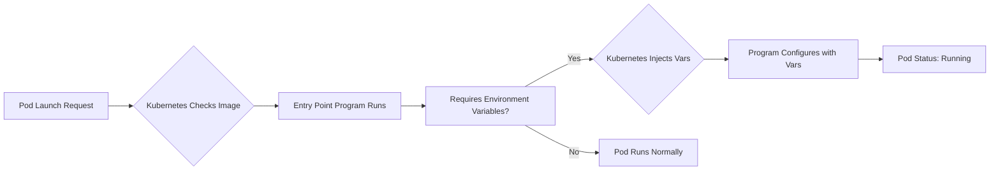

# Session 06: Deploying Multi-Tier Applications in Kubernetes

## Table of Contents
- [Overview](#overview)
- [Key Concepts](#key-concepts)
- [Multi-Tier Applications Explanation](#multi-tier-applications-explanation)
- [Kubernetes Environment Variables](#kubernetes-environment-variables)
- [Deploying MySQL Pod](#deploying-mysql-pod)
- [Troubleshooting Pod Failures](#troubleshooting-pod-failures)
- [Deploying WordPress Pod](#deploying-wordpress-pod)
- [Exposing Pods with Services](#exposing-pods-with-services)
- [Configuring WordPress](#configuring-wordpress)
- [Security Considerations](#security-considerations)
- [Future Topics Teased](#future-topics-teased)
- [Q&A Summary](#qa-summary)
- [Summary](#summary)
  - [Key Takeaways](#key-takeaways)
  - [Quick Reference](#quick-reference)
  - [Expert Insight](#expert-insight)

## Overview
This session explores deploying multi-tier applications in Kubernetes, focusing on a practical example using WordPress (PHP front-end) and MySQL (database back-end). Building on previous concepts like pods, replication controllers, and services, the instructor explains the role of Kubernetes in managing containers, introduces environment variables as a way to pass configuration data to pods, and demonstrates troubleshooting techniques for pod failures. Real-world parallels (e.g., Facebook's architecture) illustrate multi-tier setups, emphasizing network isolation, connectivity between tiers, and public exposure via services. The demo covers launching pods, using kubectl commands, logs, and basic configuration, while highlighting security and scalability challenges to be addressed in future sessions.

```mermaid
flowchart TD
    A[User/Client] --> B[WordPress Pod (PHP Front-End)]
    B --> C[MySQL Pod (Database Back-End)]
    B --> D[Service (NodePort) for Public Access]
    E[Kubernetes Master (kubectl)] --> F[Pod Deployments]
    F --> G[Environment Variables Configured]
    
    style B fill:#e1f5fe
    style C fill:#f3e5f5
    style D fill:#e8f5e8
```

## Key Concepts

### Review of Kubernetes Fundamentals for Multi-Tier Deployments
Kubernetes manages containers (e.g., Docker images) to run programs. Key roles include:
- **Deployment/Launching Apps**: Using pods or replication controllers.
- **Replication Controllers (RC)**: Ensures pods restart if they fail, maintaining availability.
- **Load Balancing and Networking**: Services handle connectivity between pods and external access.
- Containers provide isolated operating systems for apps. Multi-tier apps involve interconnected layers (e.g., front-end PHP connecting to back-end MySQL).

### Multi-Tier Applications Explanation
A multi-tier (or n-tier) application consists of multiple interconnected programs or "tiers" running separately but working together. Each tier handles specific functions.

#### Real-World Example: Facebook
- **Front-End Tier**: PHP code rendering the website and handling user interactions (e.g., posting).
- **Back-End Tier**: MySQL database storing data.
- Facebook's architecture is complex (using microservices, NoSQL, etc.), but the session simplifies it to two main tiers with PHP-MySQL interaction.

**Components**:
- **PHP/Web Server**: Runs Apache web server for serving content.
- **MySQL Database**: Stores user data via database connections.
- Connectivity via network (IP addresses), with database isolated for security.

**Key Point**: Kubernetes provides default networking between pods but requires IP-aware configurations. Public exposure is controlled via services.

```bash
# Example of a multi-tier flow (simplified)
Client Request → PHP Pod (Processes Logic) → Database Query → Data Stored/Retrieved
```

| Tier | Purpose | Example Tech |
|------|---------|--------------|
| Front-End | User Interface & Logic | PHP + Apache |
| Back-End | Data Storage & Retrieval | MySQL |

### Kubernetes Environment Variables
Environment variables pass configuration data to pods during launch, ensuring portability and customization without hardcoded values.

#### Why Environment Variables?
- Containers run programs requiring inputs (e.g., database credentials).
- Variables are set at pod creation and persist for the pod's lifecycle.
- Example: MySQL images require variables like database names, usernames, and passwords.

#### Setting Environment Variables
Use `kubectl run --env` or YAML specs:
- Temporary (per session): Set via shell (`x=value`), but volatile.
- Persistent: Use Kubernetes to inject variables at launch.
- Command: `kubectl run <pod-name> --image=<image> --env="VAR_NAME=value"`

#### Example Command for MySQL Pod
```bash
kubectl run my-db --image=mysql:5.7 \
  --env="MYSQL_ROOT_PASSWORD=redhat" \
  --env="MYSQL_DATABASE=wordpress" \
  --env="MYSQL_USER=vimmel" \
  --env="MYSQL_PASSWORD=redhat"
```

> [!NOTE]
> Case-sensitive; read image documentation for required variables.



### Deploying MySQL Pod
1. **Find Image**: Search Docker Hub for MySQL (e.g., `mysql:5.7` for version compatibility with WordPress).
2. **Launch Pod**:
   - Without env vars: Fails due to missing config.
   - With env vars: Passes vars to container's entry point program.
3. **Verify**:
   - Check status and describe pod.
   - Logs reveal failures if vars are missing.

**Code Example**:
```bash
# Run with environment variables
kubectl run my-db --image=mysql:5.7 \
  --env="MYSQL_ROOT_PASSWORD=redhat" \
  --env="MYSQL_DATABASE=wordpress" \
  --env="MYSQL_USER=vimmel" \
  --env="MYSQL_PASSWORD=redhat"

# Check status
kubectl get pods
kubectl describe pod my-db
```

> [!IMPORTANT]
> Image compatibility matters; PHP versions affect MySQL support.

### Troubleshooting Pod Failures
Common issues: Container creation failures due to missing env vars or version mismatches.

#### Steps:
1. **Describe Pod**: `kubectl describe <pod-name>` for events and status.
2. **Check Logs**: `kubectl logs <pod-name>` for program errors (e.g., "cannot initialize database").
3. **Execute into Pod**: `kubectl exec -it <pod-name> -- /bin/bash` to inspect internals.
4. **Root Cause**: Often app-level issues, not Kubernetes (e.g., app requires vars; read docs for image specs).

**Example Logs Error**:
```
Initializing database...
error: Missing required environment variables: MYSQL_DATABASE, MYSQL_USER, etc.
```

> [!WARNING]
> Save credentials securely; env vars are visible in plaintext (`kubectl describe`).

### Deploying WordPress Pod
1. **Find Compatible Image**: Choose PHP-Apache version (e.g., `wordpress:php7.3-apache`).
2. **Launch Pod**: Simple if no env vars needed.
   - Command: `kubectl run my-wordpress --image=wordpress:php7.3-apache`

**Version Tips**:
- Test compatibility (PHP ↔ MySQL versions).
- Reference: wordpress:php7.3-apache + mysql:5.7.

### Exposing Pods with Services
Pods are isolated; expose for access using services.
- **Type**: NodePort for external access.
- **Command**: `kubectl expose pod <pod-name> --type=NodePort --port=80`

**Example**:
```bash
# Expose WordPress for public access
kubectl expose pod my-wordpress --type=NodePort --port=80
```

- Access via: `http://<worker-node-IP>:<node-port>`
- Only expose necessary pods (e.g., front-end, not database) for security.

**Flow**:
```diff
- Pod Isolated → Service Routes External Traffic → Pod Accessible
+ Load Balancer (Future) Can Replace NodePort for Scalability
```

### Configuring WordPress
1. **Access via Browser**: Use service's exposed URL.
2. **Setup Wizard**: Provide MySQL details:
   - Database Name: `wordpress`
   - Username: `vimmel`
   - Password: `redhat`
   - Database Host: MySQL pod's IP (from `kubectl describe`)
3. **Internal Network**: Kubernetes enables pod-to-pod connectivity; no extra config needed.
4. **Verify**: Create blogs; check DB tables via MySQL client (`mysql -h localhost -u vimmel -p` inside pod).

**Demo Notes**:
- WordPress installs; tables created in MySQL.
- Proves integration: Front-end stores data in back-end.

### Security Considerations
- **Risks**: Env vars expose secrets (passwords); NodePort opens access.
- **Improvements**: Future sessions cover Secrets (secure storage) and ClusterIP services.
- **Best Practice**: Minimize exposure; use internal networking only where possible.

### Future Topics Teased
- **Security**: Secrets for storing credentials.
- **Storage**: PersistentVolumes/StorageClasses for data persistence.
- **Multi-Node**: Advanced clusters with Kube Proxy.
- **Load Balancing**: Services for scalability.
- **Microservices**: Extensions of multi-tier.

### Q&A Summary
- **Containers per Pod**: Multiple possible via sidecars (covered later).
- **Client Access**: Kubectl used by admins; expose services selectively.
- **IP Hardcoding**: Problematic; future: services for dynamic resolution.
- **Network Connectivity**: CNI plugins enable cross-node pod comms.
- **Tools**: Ansible for automation; Docker for custom images (not Kubernetes-specific).
- **Service Types**: ClusterIP for internal; NodePort for external.
- **Troubleshooting**: Check docs for ports/configs.

## Summary

### Key Takeaways
```diff
+ Multi-Tier Apps: Front-end (e.g., PHP) interacts with back-end (e.g., DB) via networks; Kubernetes manages isolation and connectivity.
+ Environment Variables: Pass config to pods at launch; read image docs for requirements.
+ Pod Troubleshooting: Use `describe`, `logs`, and `exec` for failures.
+ Services: Expose pods (e.g., NodePort) for external access while keeping internals secure.
+ Security: Env vars are plaintext; improve with Secrets in future sessions.
- Risks: Hardcoded IPs change on pod restarts; version mismatches cause failures.
! Kubernetes Default: Inter-pod networking; focus on app-level compatibility.
```

### Quick Reference
- **Launch MySQL with Env Vars**:
  ```bash
  kubectl run my-db --image=mysql:5.7 --env="MYSQL_ROOT_PASSWORD=redhat" --env="MYSQL_DATABASE=wordpress" --env="MYSQL_USER=vimmel" --env="MYSQL_PASSWORD=redhat"
  ```
- **Troubleshoot**: `kubectl logs my-db` or `kubectl exec -it my-db -- /bin/bash`
- **Expose Pod**: `kubectl expose pod my-wordpress --type=NodePort --port=80`
- **WordPress Config**: DB Host: `<mysql-pod-IP>`; User/Pass as per env vars.

### Expert Insight
**Real-World Application**: Deploy complex apps like web forums (e.g., using this WordPress-MySQL setup on AWS Kubernetes) to handle user traffic scalably while isolating data.

**Expert Path**: Master debugging with logs and exec; practice YAML manifests for repeatable deployments. Explore Helm for packaging multi-tier apps.

**Common Pitfalls**: 
- Ignoring version compatibility leads to crashes—always test image combos.
- Exposing back-end services bypasses security—use ClusterIP for internals.
- Env var secrets visible in logs—secure with Kubernetes Secrets ASAP.

**Lesser-Known Facts**: MySQL entry point requires exact env var names; Docker Hub docs often include pre-built configs. Kube Proxy (mentioned in Q&A) underlies service routing, enabling L4 load balancing automatically. In multi-node setups, images download to worker nodes, not just masters, ensuring efficient resource use.
