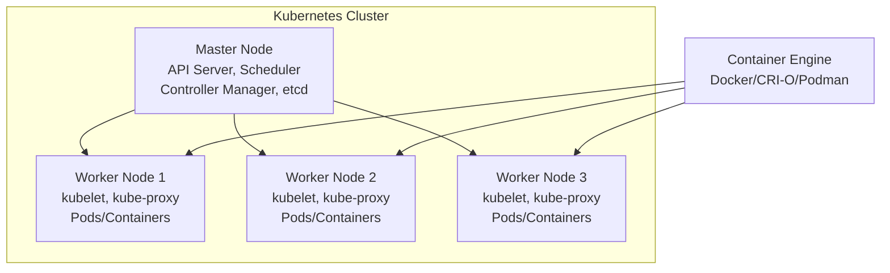

# Session 01: Introduction to Kubernetes

| Title | Content |
|-------|---------|
| **Session Number** | 01 |
| **Topic Name** | Introduction to Kubernetes |
| **Instructor** | Vimel Daga |
| **Training Program** | Certified Kubernetes Administrator (CKA) & Certified Kubernetes Application Developer (CKAD) |
| **Date** | N/A (From transcript) |

## Table of Contents
- [Course Overview and Logistics](#course-overview-and-logistics)
- [Instructor Introduction](#instructor-introduction)
- [Course Content and Teaching Approach](#course-content-and-teaching-approach)
- [Why Kubernetes? Container Management Challenges](#why-kubernetes-container-management-challenges)
- [Introduction to Kubernetes Concepts](#introduction-to-kubernetes-concepts)
- [Q&A and Session Wrap-up](#qa-and-session-wrap-up)
- [Summary](#summary)

## Course Overview and Logistics

### Overview
This session introduces the CKA and CKAD training program, covering the course structure, support resources, and instructor credibility. The training focuses on both Certified Kubernetes Administrator (CKA) and Certified Kubernetes Application Developer (CKAD) certifications with an emphasis on hands-on practical learning.

### Key Concepts/Deep Dive

**Training Structure:**
- Live instructor-led training 4 days per week (Tuesday, Wednesday, Thursday, Friday)
- Each session approximately 1.5 hours
- Q&A sessions after each class for clarification and queries
- Comprehensive live training approach with community support

**Support Resources:**
- **Slack Channel**: Technical support with ~24/7 volunteer assistance for technical queries and troubleshooting
- **WhatsApp Groups**: Administrative communications (session links, attendance, updates, task assignments)
- **Learning Success Heads (LSHs)**: Designated support personnel for each region with contact information
- **Technical Volunteers**: 4-5 volunteers per group for technical assistance

**Learning Community:**
- Participants from across the globe representing diverse companies (IBM, Red Hat, Cisco, Amazon, etc.)
- Corporate participants from IT, development, security, and operations backgrounds
- Emphasis on community-based learning with technical and administrative support

### Code/Config Blocks
```bash
# Session timing: 9:15 PM IST (approximately)
# Duration: ~1.5 hours per session
# Schedule: Tue, Wed, Thu, Fri
```

## Instructor Introduction

### Overview
Vimel Daga serves as the primary instructor, bringing extensive real-world experience with containerization technologies, Kubernetes, and cloud platforms. His background spans machine learning, DevOps tools, and direct involvement with technology founders.

### Key Concepts/Deep Dive

**Professional Background:**
- World record holder in Kubernetes domain
- Consultant, architect, integrator, and trainer roles
- Experience with major technology companies and founders (Docker ecosystem)
- Proficient in Docker, Kubernetes, microservices, Splunk, IoT, and machine learning
- Multiple global certifications across various domains

**Teaching Approach:**
- Practical implementation focus (95% hands-on)
- Real-world use case coverage beyond official curriculum
- Corporate experience integration (participants from diverse IT backgrounds)
- Support for custom use cases discovered during training
- Adapted curriculum based on participant needs and corporate scenarios

**Philosophy:**
- Makes complex technologies accessible to beginners and advanced learners
- Designed training to accommodate participants with zero to expert prior knowledge
- Comprehensive coverage of Kubernetes at administrator and developer levels

## Course Content and Teaching Approach

### Overview
The training program goes beyond official CKA/CKAD curricula by incorporating industry-relevant content and real-world implementation patterns. The approach emphasizes practical skills development through extensive hands-on exercises.

### Key Concepts/Deep Dive

**Curriculum Expansion:**
- Official CKA content: Cluster architecture, installation, configuration, networking, troubleshooting, security, maintenance
- Official CKAD content: Application design and build, services and networking, troubleshooting, security
- Additional content: Industry use cases, advanced scenarios, custom implementations not covered in official materials

**Teaching Methodology:**
- 95% practical/hands-on training with PPT only for conceptual clarification
- Single-node cluster for initial concept building (later multi-node for production scenarios)
- Lab preparation teaching using personal computers/laptops (Mac OS, Windows, Linux)
- Focus on orchestration, automation, and production-like deployments

**Prerequisites:**
- Basic Docker knowledge sufficient (image/container concepts, basic commands)
- No advanced Docker skills required for Kubernetes fundamentals
- Instructional links provided for participants needing Docker basics

### Code/Config Blocks
```bash
# Prerequisites Verification Commands:
docker version          # Check Docker installation
docker images           # List available images
docker ps              # Check running containers
docker run hello-world # Basic container launch test
```

## Why Kubernetes? Container Management Challenges

### Overview
This section explains the evolution from manual container management to orchestrated solutions. Kubernetes addresses fundamental challenges in container lifecycle management, high availability, and scalability that emerge when operating containerized applications at scale.

### Key Concepts/Deep Dive

**Container Benefits:**
- Lightweight and fast (launch in seconds vs. minutes for VMs)
- Standardized across different container engines (Docker, Podman, CRI-O)
- Mature technology with comprehensive security, networking, and storage features

**Container Management Challenges:**
- **Manual Monitoring Overhead**: Human dependency creates downtime gaps (container failures undetected for hours)
- **Scaling Limitations**: Manual intervention required for load-based scaling
- **Infrastructure Dependencies**: Single points of failure at OS/hardware level
- **Human Error**: Inconsistent management across teams and environments

**Kubernetes Solution Overview:**
- Automated container lifecycle management
- Self-healing capabilities (automatic container restart)
- Load-based auto-scaling (horizontal pod autoscaling)
- Multi-node orchestration for high availability
- Declarative configuration management

**Container Orchestration Patterns:**
- Replica management and high availability
- Rolling updates and blue-green deployments
- Resource allocation and constraint management
- Network abstraction and service discovery

### Tables

| Challenge | Manual Approach | Kubernetes Solution |
|-----------|----------------|-------------------|
| Container Failure | Human monitoring + Manual restart | Auto-detection + Immediate restart |
| Load Scaling | Manual analysis + Manual scaling | Metrics monitoring + Auto-scaling |
| Infrastructure Failure | Single point of failure | Multi-node redundancy |
| Deployment Consistency | Human-dependent + Error-prone | Declarative + Automated |

## Introduction to Kubernetes Concepts

### Overview
Kubernetes introduces fundamental orchestration concepts like pods as the smallest deployable units and master-worker architecture for distributed container management. The platform provides enterprise-grade orchestration capabilities across multi-node environments.

### Key Concepts/Deep Dive

**Kubernetes as Container Orchestrator:**
- Purpose: Manage container lifecycles beyond simple container engines (Docker, Podman, CRI-O)
- Role: Orchestration layer providing automation, scaling, and self-healing
- Architecture: Master-slave distributed systems

**Key Components:**

1. **Pods** - Smallest Kubernetes unit (wrapping containers for management)
   - Contain one or more containers
   - Share networking and storage resources
   - Managed as single deployable units

2. **Master Node (Control Plane)**:
   - Brain of the cluster
   - Contains API server, scheduler, controller manager, etcd database
   - Makes decisions on pod placement, scaling, and health

3. **Worker Nodes**:
   - Execute actual workloads
   - Run pods with application containers
   - Communicates with master node agents (kubelet)

4. **Cluster** - Complete Kubernetes deployment (master + workers)

**Deployment Scenarios:**

- **Single-Node Cluster**: Used for learning, testing, development
- **Multi-Node Cluster**: Production deployment for high availability
- **Single Node with Master-Worker**: Educational setup (master and worker on same machine)

**Networking and Connectivity:**
- Internal networking between pods
- Service discovery and load balancing
- External access management (external traffic to pods)

### Diagrams



### Code/Config Blocks
```yaml
# Basic Pod definition example
apiVersion: v1
kind: Pod
metadata:
  name: simple-pod
spec:
  containers:
  - name: app-container
    image: nginx:latest
    ports:
    - containerPort: 80
```

## Q&A and Session Wrap-up

### Overview
The session concluded with extensive Q&A covering technical and organizational aspects of Kubernetes, from setup questions to industry integration topics. This section captures key questions and responses regarding practical implementation and conceptual clarification.

### Key Concepts/Deep Dive

**Frequently Asked Topics:**
- Lab setup (single-node vs. multi-node clusters)
- Container runtimes (Docker vs. CRI-O vs. Podman)
- Integration with monitoring tools (Prometheus, Grafana, ELK)
- High availability configurations
- Certification preparation approaches

**Common Clarifications:**
- Kubernetes vs. container engines (orchestration vs. containerization)
- Multi-container pods capabilities
- Storage management (persistent volumes)
- Security and role-based access control (RBAC)

**Training Logistics:**
- Session recordings availability for later review
- Certificate objectives and assessment preparation
- Boot camp offerings for certification readiness

### Tables

| Question Category | Key Points |
|------------------|------------|
| **Setup & Environment** | Single-node setup for beginners, multi-node for production scenarios |
| **Tool Integration** | Prometheus, Grafana, ELK stack integration possible but not core curriculum |
| **High Availability** | Multi-master setups, storage replication, node redundancy |
| **Certification** | CKA exam focus, CKAD practical assessment preparation included |

## Summary

### Key Takeaways
> ### Core Concepts
> - Kubernetes is a container orchestration platform addressing manual container management challenges
> - Architecture follows master-worker pattern with pods as fundamental units
> - 95% practical focus with hands-on cluster setup and management
> - Beyond CKA/CKAD: includes industry use cases and advanced scenarios

> ### Practical Focus
> - Single-node setup for concept learning, progressing to multi-node production clusters
> - Real-world use cases covering auto-scaling, self-healing, and load balancing
> - Integration with container runtimes (Docker, CRI-O, Podman) for flexibility

> ### Career Relevance
> - Essential skill for DevOps, cloud engineering, and containerized application deployment
> - Used by major enterprises for production container orchestration
> - Certifications (CKA, CKAD) validate production-ready Kubernetes skills

```diff
+ Container management challenges solved through orchestration
+ Automated scaling, healing, and deployment capabilities
+ Multi-node architectures for production resilience
+ Hands-on learning approach for practical mastery
- Manual monitoring and management overhead eliminated
- Single points of failure addressed through clustering
- Human error reduced through declarative configurations
! Prerequisites: Basic Docker/container knowledge required
! Training approach: 95% practical, community-supported learning
```

### Expert Insight

> [!IMPORTANT]
> **Real-world Application**
>
> Kubernetes shines in microservices architectures where applications consist of dozens of interconnected services. Enterprises use it for:
>
> - Zero-downtime deployments through rolling updates
> - Auto-scaling based on traffic patterns in e-commerce platforms
> - Multi-cloud deployments for vendor lock-in avoidance
> - CI/CD pipeline integration for automated application delivery

> **Expert Path**
>
> 1. **Start Simple**: Master single-node deployments before multi-node complexity
> 2. **Understand Networking**: Focus on CNI, service mesh, and ingress controllers early
> 3. **Practice Troubleshooting**: Learn kubectl debugging commands and log analysis
> 4. **Explore Advanced Features**: Ingress, ConfigMaps, Secrets, RBAC, and custom resources

> **Common Pitfalls**
> 1. **Resource Planning**: Underestimating memory/CPU requirements for pods
> 2. **Networking Complexity**: Misconfigured load balancers and service discovery
> 3. **Storage Management**: Improper persistent volume configurations leading to data loss
> 4. **Security Oversights**: Default permissions granting excessive access privileges

> [!NOTE]
> **Common Issues**
>
> **Resolution**: Persistent volume claims stuck in pending state
> **How to Identify**: `kubectl describe pvc <name>` shows scheduling failures
> **How to Avoid**: Ensure storage classes are properly configured and nodes have sufficient resources
>
> **Resolution**: Control plane component failures in high-load scenarios
> **How to Identify**: Check control plane logs and resource utilization metrics
> **How to Avoid**: Implement proper resource limits and monitoring for control plane components

> **Lesser Known Things**
>
> - **Static Pods**: Pods managed directly by kubelet on worker nodes for critical system components
> - **Taints and Tolerations**: Advanced node scheduling controls for workload isolation
> - **Admission Controllers**: Policy enforcement mechanisms for security and governance
> - **Custom Resource Definitions (CRDs)**: Extending Kubernetes API for domain-specific resources

**Transcription Corrections Made:**
- "cubernetes" corrected to "Kubernetes"
- "uerst" corrected to "users"
- "wip" corrected to "web"
- "cub funk" corrected to appropriate context (kubeconfig implied)
- "ckadl" corrected to "CKAD"
- Various punctuation and formatting improvements for readability