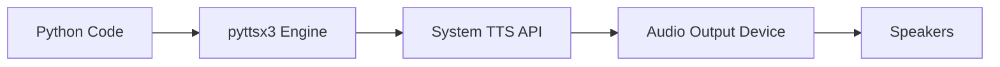

# Session 03: Python Full Course - Python 3 Basics to Expert

## Table of Contents
- [Overview](#overview)
- [Key Concepts](#key-concepts)
  - [Programming Language vs. Programmable Language](#programming-language-vs-programmable-language)
  - [Python Execution Methods](#python-execution-methods)
  - [Integrated Development Environments (IDEs)](#integrated-development-environments-ides)
  - [Modules and Libraries](#modules-and-libraries)
  - [Text-to-Speech Synthesis](#text-to-speech-synthesis)
  - [Operating System Integration](#operating-system-integration)
  - [Input Handling and User Interaction](#input-handling-and-user-interaction)
  - [Conditional Statements](#conditional-statements)
  - [Escape Sequences and String Formatting](#escape-sequences-and-string-formatting)
- [Lab Demos](#lab-demos)
  - [Installing and Using pyttsx3](#installing-and-using-pyttsx3)
  - [OS Command Execution](#os-command-execution)
  - [Jupyter Notebook IDE](#jupyter-notebook-ide)
  - [Interactive Menu Application](#interactive-menu-application)
- [Summary](#summary)

## Overview

This session introduces Python as a programming language that extends beyond traditional software development into the realm of creating custom libraries, APIs, and technical assistants. The instructor emphasizes a paradigm shift from using existing libraries to understanding their internal workings - becoming "creators" rather than mere consumers. The long-term goal is to build a voice-controlled technical assistant capable of managing cloud infrastructure, web development tasks, and system operations through natural language commands.

The session covers fundamental Python concepts through practical examples, demonstrating how Python serves as a universal interface for communicating with operating systems, web services, and hardware components. Key emphasis is placed on understanding the relationship between Python code and underlying system operations, establishing the foundation for advanced topics in data science, machine learning, and system automation.

## Key Concepts

### Programming Language vs. Programmable Language

Python transcends traditional programming language boundaries by functioning as a "universal communicator" with operating systems. The core concept revolves around Python code as intermediary instructions that enable communication between human developers and machine operations:

**Traditional Programming Languages**:
- C++, Java, .NET: Limited to specific execution environments
- Require explicit compilation and platform-specific configurations

**Python's Unique Approach**:
- Directly communicates with native operating system commands
- Seamless integration with system-level operations (sound cards, speakers, network interfaces)
- Single language for controlling hardware, networks, databases, and APIs

**Practical Implementation**:
```python
import os

# Launch browser - instruction translated to system command
os.system("chrome")

# Play audio - instruction to sound system 
engine.say("Hello World")
```

### Python Execution Methods

Three fundamental execution approaches provide flexibility for different development scenarios:

#### 1. Interactive Live Interpreter (REPL)
```bash
python3
>>> print("Hello Python")
Hello Python
>>>
```
- **Advantages**: Immediate code execution, no file management required
- **Limitations**: Code not preserved between sessions
- **Use Case**: Quick testing, algorithm validation

#### 2. Program Files (Offline Execution)
```python
# Filename: my_program.py
print("Stored program executed")
```
```bash
python3 my_program.py
```
- **Advantages**: Code persistence, shareable programs
- **Limitations**: Requires text editor, manual file management
- **Use Case**: Production applications, distributable software

#### 3. Integrated Development Environments (IDEs)
- **Advantages**: Code editing, execution, debugging in single interface
- **Use Case**: Complex applications with multiple file management

### Integrated Development Environments (IDEs)

Jupyter Notebook represents a modern IDE approach specifically designed for Python development:

#### Jupyter Notebook IDE
```bash
# Installation (if not using Anaconda)
pip install jupyter

# Launch IDE
jupyter notebook
```

**Core Features**:
- Browser-based interface accessible via `http://localhost:8888`
- Cell-based code execution (individual code blocks)
- Real-time output display below each cell
- Auto-completion using TAB key
- Shortcuts (Shift+Enter to execute cell)
- File persistence and management

```python
# In Jupyter cell
x = 5 + 2  # Execute with Shift+Enter
print(x)   # Output displays below cell
```

### Modules and Libraries

Libraries extend Python's core functionality through pre-built modules:

#### Library Architecture
```python
# Core Python + Library Relationship
Python Interpreter ←→ pyttsx3 Library ←→ Text-to-Speech Engine
                           ⊕
Operating System ←→ Hardware/Software Components
```

**Installation Pattern**:
```bash
pip install library_name
pip list  # View installed libraries
```

**Import Patterns**:
```python
import pyttsx3
import os
```

### Text-to-Speech Synthesis

pyttsx3 library enables programmatic voice output through system text-to-speech engines:

```python
import pyttsx3

# Initialize TTS engine
engine = pyttsx3.init()

# Convert text to speech
engine.say("Welcome to Python programming")
engine.runAndWait()
```

**Technical Flow**:


### Operating System Integration

Python communicates directly with operating systems through native command execution:

#### Command Execution Model
```python
import os

# Direct system command execution
os.system("chrome")      # Launch web browser
os.system("code")        # Launch VS Code editor  
os.system("wmplayer")    # Launch Windows Media Player
```

**OS Communication Pattern**:
```mermaid
graph TD
A[Python Function] --> B[os.system()]
B --> C[System Shell]
C --> D[Operating System]
D --> E[Command Execution]
E --> F[Hardware Operation]
```

### Input Handling and User Interaction

User input collection with type conversion requirements:

```python
# Input collection (always returns string)
user_input = input("Enter your choice: ")
print(f"Input type: {type(user_input)}")  # str

# String to integer conversion for numeric operations
choice = int(user_input)
```

**Input Processing Flow**:
```diff
+ Input Function: Always returns string datatype
- Direct comparison fails with numeric values  
! Solution: Explicit type conversion using int(), float()
```

### Conditional Statements

Conditional logic enables decision-based program flow using boolean evaluation:

#### If-Elif-Else Structure
```python
if condition1:
    # Code block executed if condition1 is True
    print("Condition 1 met")
elif condition2:
    # Code block executed if condition1 is False but condition2 is True
    print("Condition 2 met")
else:
    # Code block executed if all conditions are False
    print("No conditions met")
```

**Execution Rules**:
- Conditions evaluate to `True` or `False` (boolean output)
- Sequential evaluation stops at first `True` condition
- Indentation defines code block scope
- Python uses `elif` keyword (unlike `else if` in other languages)

**Boolean Evaluation Examples**:
```python
# Comparison operators return boolean
experience >= 2   # Returns True or False
user_choice == 1  # Returns True or False
```

### Escape Sequences and String Formatting

Special characters embedded within strings for formatting and control:

#### Common Escape Sequences
```python
print("Press 1:\nChrome Browser")  # \n = newline
print("Press 2:\tNotepad")         # \t = tab space
print("Press 3:\nMedia Player")
```

**Key Sequences**:
- `\n` - Newline character
- `\t` - Tab space character  
- `\r` - Carriage return
- `\b` - Backspace

#### Raw Strings and Processing Control
```python
# Normal processing
print("Path: C:\new\folder")    # Processes \n as newline

# Raw string (no processing)
print(r"Path: C:\new\folder")   # Prints literal backslashes
```

## Lab Demos

### Installing and Using pyttsx3

#### Step-by-Step Installation
1. **Verify Library Availability**:
   ```bash
   pip list
   ```
   Check for `pyttsx3` in the package list

2. **Install Text-to-Speech Library**:
   ```bash
   pip install pyttsx3
   ```

3. **Basic TTS Implementation**:
   ```python
   import pyttsx3
   
   # Initialize TTS engine
   engine = pyttsx3.init()
   
   # Speak welcome message
   engine.say("Hello from Python Live Interpreter")
   
   # Execute speech synthesis
   engine.runAndWait()
   ```

### OS Command Execution

#### System Command Integration
1. **Import OS Module**:
   ```python
   import os
   ```

2. **Launch System Programs**:
   ```python
   # Windows Media Player
   os.system("wmplayer")
   
   # Command Prompt
   os.system("cmd")
   
   # Chrome Browser
   os.system("chrome")
   ```

3. **Environment Path Setup** (when commands fail):
   ```bash
   # Check if command exists
   wmplayer
   
   # If "command not found", add to PATH
   # System Properties → Environment Variables → Path → Edit
   # Add program directory (e.g., C:\Program Files\Windows Media Player)
   ```

### Jupyter Notebook IDE

#### IDE Setup and Usage
1. **Launch Jupyter**:
   ```bash
   jupyter notebook
   ```
   Opens browser interface at `localhost:8888`

2. **Create New Notebook**:
   - Click "New" → "Python 3"
   - Rename cell by clicking title

3. **Code Execution**:
   ```python
   # In notebook cell
   x = 10
   y = x * 2
   print(f"Result: {y}")
   ```
   Execute with **Shift + Enter**

4. **Essential Shortcuts**:
   - `Shift + Enter`: Execute cell and create new cell
   - `Ctrl + S`: Save notebook
   - `Esc + DD`: Delete current cell
   - `Tab`: Auto-completion
   - `Ctrl + Shift + C`: Keyboard shortcuts reference

### Interactive Menu Application

#### Complete Application Development
```python
import pyttsx3
import os

# Initialize text-to-speech engine
engine = pyttsx3.init()

# Welcome message
engine.say("Welcome to IAC Python Technical Assistant")
engine.runAndWait()

# Display menu options
print("Press 1:\nChrome Browser")
print("Press 2:\tNotepad") 
print("Press 3:\nMedia Player")

# Get user choice
choice = input("Enter your choice: ")

# Convert string input to integer
choice = int(choice)

# Conditional program launch
if choice == 1:
    os.system("chrome")
elif choice == 2:
    os.system("notepad") 
else:
    print("Invalid choice")
```

#### Code Execution Flow
1. Run program from command line or IDE
2. TTS welcomes user
3. Menu displays with formatted options
4. User enters numeric choice
5. Choice converted to integer for comparison
6. Appropriate system command executes

## Summary

### Key Takeaways
```diff
+ Python functions as universal OS communicator through standard libraries
- Traditional programming limited to code execution; Python enables system control
! Libraries extend Python's capabilities without requiring core reimplementation  
- Conditional statements require consistent indentation for proper execution
+ Escape sequences enable formatted string output without external formatting libraries
! User input always returns string type requiring explicit type conversion
+ Jupyter IDE provides integrated development environment with cell-based execution
```

### Quick Reference

**Essential Functions**:
```python
import pyttsx3
import os

# Text-to-speech
engine = pyttsx3.init()
engine.say("message")
engine.runAndWait()

# System commands
os.system("chrome")           # Launch browser
os.system("notepad")          # Launch text editor

# User input
choice = int(input("Enter choice: "))  # Converts string to integer
```

**Configuration Commands**:
```bash
pip install pyttsx3        # Install TTS library
jupyter notebook          # Launch Jupyter IDE
pip list                   # View installed packages
```

**Jupyter Shortcuts**:
- `Shift + Enter`: Execute cell
- `Tab`: Auto-completion
- `Esc + DD`: Delete cell
- `Ctrl + S`: Save notebook

### Expert Insight

**Real-world Application**:
This session establishes the foundation for building technical automation tools. Organizations deploy Python-based assistants for DevOps automation, where natural language interfaces control infrastructure provisioning, monitoring alerts, and incident response - eliminating dependency on graphical interfaces for critical system operations.

**Expert Path**: 
Master Python's ecosystem by studying library source code rather than just their APIs. Deep dive into how pyttsx3 converts text to phonemes, how os.system() bridges Python to shell environments, and how Jupyter implements reactive programming. This approach transforms developers from tool users into system architects capable of extending and modifying existing tools.

**Common Pitfalls**:
```diff
- Forgetting input() always returns string type
- Using == comparison between incompatible data types  
- Failing to install required libraries before import
- Inconsistent indentation in conditional blocks
- Assuming system commands work without PATH configuration
```

**Lesser-Known Facts**:
- Python's "simple" command execution abstracts complex inter-process communication protocols
- Text-to-speech libraries interface directly with platform-specific voice synthesis engines
- Jupyter notebooks originated from IPython and became the de facto standard for data science due to their literate programming model

**Advantages**:
- Single language controls entire technology stack
- Extensive ecosystem of pre-built libraries
- Direct OS integration without intermediate layers
- Cross-platform compatibility maintained automatically

**Disadvantages**:
- Library dependencies increase application size
- Requires understanding of underlying system commands
- Error handling for OS operations adds complexity
- Performance overhead compared to systems-level languages

🤖 Generated with [Claude Code](https://claude.com/claude-code)

Co-Authored-By: Claude <noreply@anthropic.com>
