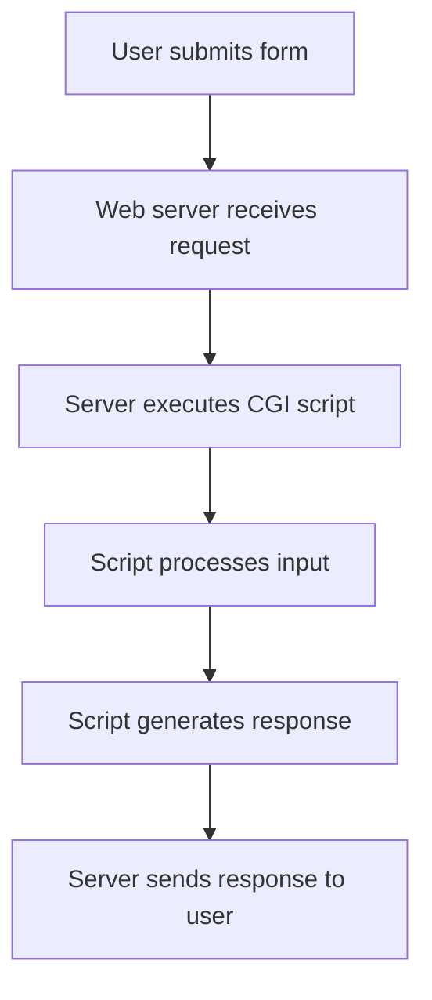

# Session 12: Python Full Course: Python 3 API and CGI

<!-- Table of Contents -->
- [Python Lists and Data Structures](#python-lists-and-data-structures)
- [Python Functions](#python-functions)
- [API Development with Python](#api-development-with-python)
- [CGI Programming](#cgi-programming)
- [Summary](#summary)

## Python Lists and Data Structures

### Overview
Python lists are fundamental data structures that allow you to store and manipulate collections of items. Lists are ordered, mutable, and can contain elements of different data types. This session introduces basic list operations essential for programming in Python 3, including adding, removing, and accessing elements.

### Key Concepts / Deep Dive
Lists in Python provide a flexible way to handle multiple values. Key operations covered include appending items, removing elements, and iterating through lists. When working with lists:
- Use append() to add new items to the end of the list
- Use remove() or pop() to delete specific elements
- Access individual items using index positions (starting from 0)

Consider this comparison table for basic list operations:

| Operation | Method | Description |
|-----------|--------|-------------|
| Add Item | `list.append(item)` | Adds item to end of list |
| Remove Item | `list.remove(item)` | Removes first occurrence of item |
| Access Item | `list[index]` | Gets item at specific position |
| List Length | `len(list)` | Returns number of elements |

### Code Examples
```python
# Creating a list
my_list = []

# Adding items
my_list.append("item1")
my_list.append("item2")

# Removing items
my_list.remove("item1")

# Accessing items
first_item = my_list[0]

# Checking length
print(len(my_list))
```

> [!IMPORTANT]
> Always handle index errors when accessing list elements to prevent runtime exceptions.

## Python Functions

### Overview
Functions are reusable blocks of code that perform specific tasks. In Python, functions help organize code, reduce repetition, and improve readability. This section covers function definition, parameters, arguments, and return values - core concepts for writing modular Python programs.

### Key Concepts / Deep Dive
Functions transform programming by allowing code reuse and logical separation. Key principles include:
- **Function Definition**: Using `def` keyword followed by function name and parameters
- **Parameters vs Arguments**: Parameters are variables in function definition; arguments are values passed when calling
- **Return Values**: Functions can return values using `return` statement
- **Scope**: Variables defined inside functions have local scope

The instructor demonstrates how functions allow:
```diff
- Repeating the same code multiple times
+ Calling a function multiple times with different inputs
```

> [!NOTE]
> Functions can have multiple parameters but should maintain single responsibility for better code organization.

### Lab Demos
**Creating and Calling Functions:**

```python
def greet_user(name):
    return f"Hello, {name}!"

# Calling the function
message = greet_user("Alice")
print(message)  # Output: Hello, Alice!
```

**Functions with Multiple Parameters:**

```python
def calculate_sum(a, b):
    return a + b

result = calculate_sum(5, 3)
print(result)  # Output: 8
```

**Functions with Default Values:**
```python
def display_info(name, age=25):
    print(f"Name: {name}, Age: {age}")

display_info("Bob")        # Uses default age
display_info("Alice", 30)  # Overrides default
```

## API Development with Python

### Overview
APIs (Application Programming Interfaces) enable communication between different software systems. Python provides excellent support for building RESTful APIs using frameworks like Flask. This section introduces basic API concepts and how to implement them in Python 3.

### Key Concepts / Deep Dive
APIs expose functionality while hiding implementation details. Key concepts include:
- **HTTP Methods**: GET (retrieve), POST (create), PUT (update), DELETE (remove)
- **Routes**: URL paths that map to specific functions
- **Request/Response**: Handling client requests and sending responses

HTTP Methods Comparison:

| Method | Purpose | Use Case |
|--------|---------|----------|
| GET | Retrieve data | Fetch user information |
| POST | Create new resources | Register new user |
| PUT | Update existing resources | Modify user profile |
| DELETE | Remove resources | Delete user account |

### Code Examples
Here's a basic Flask API example:

```python
from flask import Flask, jsonify, request

app = Flask(__name__)

@app.route('/api/users', methods=['GET'])
def get_users():
    users = [{"id": 1, "name": "John"}, {"id": 2, "name": "Jane"}]
    return jsonify(users)

@app.route('/api/users', methods=['POST'])
def create_user():
    data = request.get_json()
    # Process user creation
    return jsonify({"message": "User created"}), 201

if __name__ == '__main__':
    app.run(debug=True)
```

> [!WARNING]
> Never expose API keys or sensitive data in your code. Use environment variables for configuration.

## CGI Programming

### Overview
CGI (Common Gateway Interface) allows web servers to execute programs and generate dynamic content. Python CGI scripts can process web forms and generate HTML responses, making it possible to create interactive web applications without complex frameworks.

### Key Concepts / Deep Dive
CGI scripts bridge web servers and programming languages. Important concepts include:
- **Environment Variables**: Information about the request (method, parameters)
- **Input Processing**: Reading form data from stdin
- **Output Format**: Strict HTTP headers followed by content
- **Security**: Sanitizing user inputs to prevent vulnerabilities

CGI script flow:


### Code Examples
Basic CGI Python script:

```python
#!/usr/bin/env python3
# cgi_script.py

import cgi
import cgitb

cgitb.enable()  # Enable debugging

print("Content-Type: text/html")
print()

# Process form data
form = cgi.FieldStorage()

# Generate HTML response
print("<html><body>")
print("<h1>CGI Response</h1>")

if "name" in form:
    name = form["name"].value
    print(f"<p>Hello, {name}!</p>")
else:
    print("<p>No name provided</p>")

print("</body></html>")
```

Corresponding HTML form:
```html
<form action="cgi_script.py" method="post">
    Name: <input type="text" name="name">
    <input type="submit" value="Submit">
</form>
```

## Summary

### Key Takeaways
```diff
+ Python lists are mutable collections that support dynamic operations like append and remove
+ Functions enable code reusability through definition with def keyword and calling with arguments
+ APIs use HTTP methods (GET, POST, PUT, DELETE) to expose functionality between systems
+ CGI scripts allow web servers to execute Python programs for dynamic content generation
- Avoid direct index access without bounds checking to prevent IndexError exceptions
- Do not hardcode sensitive information like database credentials in API code
! Remember to sanitize all user inputs in web applications to prevent security vulnerabilities
```

### Quick Reference
**Common List Operations:**
```bash
# In Python REPL or script:
my_list = []
my_list.append("item")
my_list.remove("item")
len(my_list)
```

**Function Template:**
```python
def function_name(param1, param2="default"):
    """Docstring explaining function."""
    result = param1 + param2
    return result
```

**Flask API Setup:**
```bash
pip install flask
export FLASK_APP=app.py
flask run
```

### Expert Insight

#### **Real-world Application**
```diff
! Use Python lists for handling dynamic data collections in web applications, such as user session data or database query results
```
Python functions are extensively used in data science for feature engineering and ML pipelines. APIs built with Flask serve millions of requests daily on platforms like Instagram. CGI scripts, though less common today, remain relevant for lightweight server integrations in embedded systems.

#### **Expert Path**
Master Python's built-in functions like `map()`, `filter()`, and list comprehensions for advanced data manipulation. Dive into Flask extensions for JWT authentication and SQLAlchemy for database integrations. For CGI, focus on modern alternatives like WSGI or ASGI servers (gunicorn, uvicorn) for better performance and scalability.

#### **Common Pitfalls**
- **Scope Confusion**: Variables defined inside functions don't affect global scope unless explicitly declared with `global`
- **Mutation Issues**: Modifying mutable arguments (like lists) inside functions can cause unexpected side effects
- **Security Oversights**: CGI scripts are prone to injection attacks if input isn't properly sanitized with `cgi.escape()`

#### **Lesser-Known Facts**
Python's list comprehensions provide a more readable and often faster alternative to traditional for loops. The `enumerate()` function adds automatic indexing when iterating over sequences. Flask's `request` object provides access to all HTTP headers, cookies, and query parameters beyond just form data.

🤖 Generated with [Claude Code](https://claude.com/claude-code)

Co-Authored-By: Claude <noreply@anthropic.com>

KK-CS45-V3
