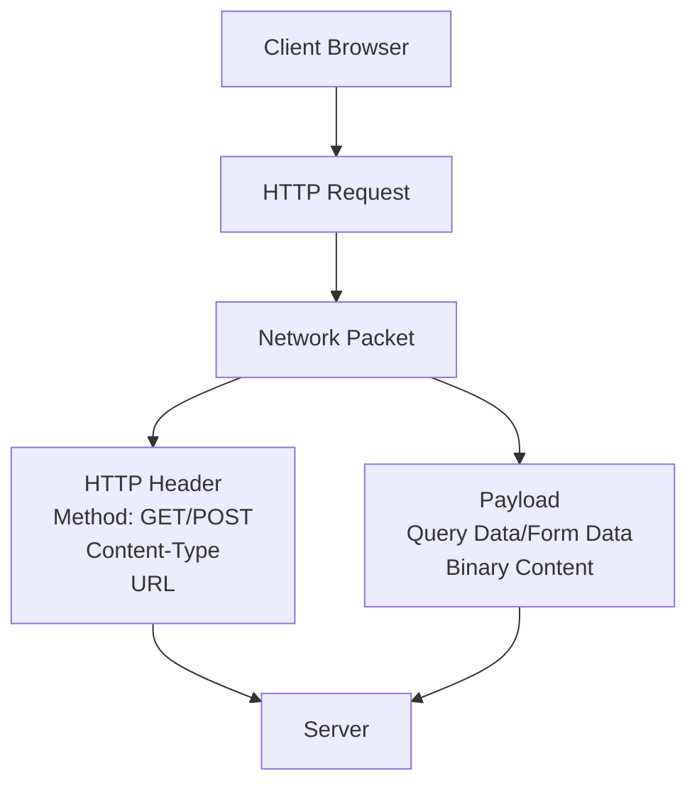

# Session 30: Instructor-led Live Training on Python - Full Stack Development using Flask

## Table of Contents

- [Overview](#overview)
- [Introduction to Flask Framework](#introduction-to-flask-framework)
- [Flask Application Structure](#flask-application-structure)
- [HTTP Methods and Web Communication](#http-methods-and-web-communication)
- [GET Method Deep Dive](#get-method-deep-dive)
- [POST Method Deep Dive](#post-method-deep-dive)
- [Packet Data and Network Layer Concepts](#packet-data-and-network-layer-concepts)
- [Form Handling in Web Applications](#form-handling-in-web-applications)
- [Dynamic Routing in Flask](#dynamic-routing-in-flask)
- [Flask Development Environment](#flask-development-environment)
- [HTTP Verbs and REST Concepts](#http-verbs-and-rest-concepts)
- [REST API Foundations](#rest-api-foundations)
- [Lab Demos](#lab-demos)
- [Summary](#summary)

## Overview

This session establishes the foundational concepts for REST API development using Flask. The instructor covers HTTP methods (GET/POST), network packet concepts, form handling, dynamic routing, and introduces REST API principles. The content bridges basic Flask web development with advanced API design patterns.

## Introduction to Flask Framework

Flask is a lightweight Python web framework used for building web applications and REST APIs. Key characteristics:

### Core Components
- **Flask Class**: Main application class imported from `flask` module
- **Routes**: URL endpoints that map to Python functions
- **Request Object**: Handles incoming HTTP requests and data extraction
- **Templates**: HTML rendering system for dynamic web pages

### Basic Flask Application Structure

Core Flask application setup with routes and basic functionality:

```python
from flask import Flask

app = Flask(__name__)

@app.route('/')
def home():
    return "Hello World"

@app.route('/data')
def get_data():
    return "My Data"

if __name__ == '__main__':
    app.run(debug=True)
```

## Flask Application Structure

### Running Flask Applications

Two primary methods for running Flask applications:

#### Method 1: Command Line with `flask run`
```bash
# In project directory containing app.py
flask run
```
- Launches Flask with default development server
- Automatically detects main application file
- Enables production-like behavior

#### Method 2: Direct Python Execution
```python
if __name__ == '__main__':
    app.run(debug=True, port=5000)
```
- Executes Python script directly
- Launches Flask app server automatically
- Enables debug mode and hot reloading

### Advanced Configuration Options
The `app.run()` method supports various parameters:
- `port`: Specify custom port number
- `debug`: Enable/disable debug mode and hot reloading
- `host`: Bind to specific host interface

## HTTP Methods and Web Communication

### Client-Server Communication Model

Web applications follow a client-server architecture where:
1. **Client** (Browser/Mobile app) sends HTTP requests
2. **Server** processes requests and returns HTTP responses
3. Communication occurs via network protocols (primarily HTTP)

### HTTP Request Components

Every HTTP request contains:
- **URL**: Target address and endpoint
- **Method**: Action type (GET, POST, PUT, DELETE, etc.)
- **Headers**: Metadata and configuration information
- **Body/Payload**: Data being sent (optional)

## GET Method Deep Dive

### GET Method Characteristics

The GET method transfers data via URL query parameters:

**Key Features:**
- Data is visible in the browser URL bar
- Data gets stored in browser history
- Limited security - not suitable for sensitive information
- URL length restrictions (typically ~2000 characters)
- Data cannot include binary files or large content

### HTTP Packet Structure for GET

```
HTTP GET Request Structure:
├── HTTP Header (Layer 7 - Application Layer)
│   ├── URL: http://server.com/data?x=value
│   ├── Method: GET
│   └── Content-Type: text/html
└── Query String: ?x=value
```

### GET Method Implementation

```python
from flask import Flask, request

app = Flask(__name__)

@app.route('/data', methods=['GET'])
def handle_data():
    if request.method == 'GET':
        data = request.args.get('x')
        return f"Received: {data.upper()}"
    return "Method not allowed"
```

### Practical GET Usage

#### Manual URL Construction
```bash
curl "http://localhost:5000/data?x=john"
# Returns: Received: JOHN
```

#### Browser Access
```
http://localhost:5000/data?x=hello
```

## POST Method Deep Dive

### POST Method Characteristics

The POST method embeds data within HTTP packet headers/payload:

**Key Advantages:**
- Data is not visible in browser URL
- No browser history storage
- No length limitations
- Supports binary data transfer (files, images)
- More secure than GET method

### HTTP Packet Structure for POST

```
HTTP POST Request Structure:
├── HTTP Header (Layer 7 - Application Layer)
│   ├── URL: http://server.com/data
│   ├── Method: POST
│   ├── Content-Type: application/x-www-form-urlencoded
│   └── Content-Length: <size>
└── Payload: x=value
```

### POST Method Implementation

```python
from flask import Flask, request

app = Flask(__name__)

@app.route('/data', methods=['POST'])
def handle_data():
    if request.method == 'POST':
        data = request.form.get('x')
        return f"Received: {data.upper()}"
    return "Method not allowed"
```

### Content Type Differences

| Method | Content-Type | Data Location |
|--------|-------------|---------------|
| GET | `text/html` | Query String (URL) |
| POST | `application/x-www-form-urlencoded` | Request Body/Payload |

## Packet Data and Network Layer Concepts

### OSI Model Context

Understanding HTTP communication requires network layer knowledge:

- **Layer 7 (Application)**: HTTP protocol, headers, content-type
- **Layer 4 (Transport)**: TCP/UDP connections, port numbers
- **Layer 3 (Network)**: IP addressing and routing

### Packet Components

#### HTTP Header Section
Contains metadata about the request:
- Content-Type: Data format specification
- Content-Length: Size of payload
- User-Agent: Client information
- Accept: Supported response formats

#### Payload Section
Contains actual data being transferred:
- **GET**: Empty or minimal payload
- **POST**: Form data, files, JSON, etc.

### Network Packet Visualization



## Form Handling in Web Applications

### HTML Form Basics

Forms provide user interface for data input:

```html
<form action="/data" method="post">
    <input type="text" name="x" placeholder="Enter value">
    <input type="submit" value="Submit">
</form>
```

### Form Data Processing

#### GET Form Processing
- Data sent via URL query parameters
- Retrieved using `request.args.get()`
- Visible in browser address bar

#### POST Form Processing
- Data sent in request body
- Retrieved using `request.form.get()`
- Hidden from URL visibility

### Security Considerations

| Aspect | GET | POST |
|--------|-----|------|
| Data Visibility | ❌ Visible in URL | ✅ Hidden |
| History Storage | ❌ Stored | ✅ Not stored |
| Length Limits | ❌ ~2000 chars | ✅ No limit |
| File Upload | ❌ Not supported | ✅ Supported |
| Bookmarks | ✅ Can be bookmarked | ❌ Cannot be bookmarked |

## Dynamic Routing in Flask

### Static vs Dynamic Routes

#### Static Route
```python
@app.route('/name')
def get_name():
    return "John"
```
- Fixed URL pattern
- No parameter flexibility

#### Dynamic Route
```python
@app.route('/name/<name>')
def dynamic_name(name):
    return f"Hello {name.upper()}"
```
- Variable URL segments
- Dynamic parameter handling
- Flexible endpoint creation

### Dynamic Route Syntax

```python
@app.route('/user/<username>')
def show_user_profile(username):
    return f'User: {username}'

@app.route('/post/<int:post_id>')
def show_post(post_id):
    return f'Post ID: {post_id}'
```

### Route Parameter Types

| Type | Usage | Example |
|------|-------|---------|
| `string` | Text data | `<name>` |
| `int` | Integer values | `<int:id>` |
| `float` | Decimal numbers | `<float:price>` |
| `path` | Full path segments | `<path:file_path>` |

## Flask Development Environment

### IDE Integration

#### Visual Studio Code Setup
1. Download VSCode from official website
2. Install free version
3. Install Python extensions for:
   - Syntax highlighting
   - IntelliSense auto-completion
   - Debug capabilities
   - Code formatting

### Terminal Integration

VSCode provides built-in terminal for:
- Running Flask applications
- Python script execution
- Git operations
- Command-line debugging

### Hot Reloading Configuration

```python
if __name__ == '__main__':
    app.run(debug=True)  # Enables auto-reload on code changes
```

## HTTP Verbs and REST Concepts

### HTTP Methods as Verbs

HTTP methods represent actions/verbs in REST architecture:

| Verb | CRUD Operation | Description |
|------|----------------|-------------|
| GET | Read | Retrieve data |
| POST | Create | Add new data |
| PUT | Update | Modify existing data |
| DELETE | Delete | Remove data |

### REST API Philosophy

REST (Representational State Transfer) principles:
- **Resources**: Data entities (users, posts, products)
- **Verbs**: HTTP methods for resource manipulation
- **Stateless**: Each request contains all necessary information
- **Uniform Interface**: Consistent API design patterns

### CRUD Operations Mapping

```python
# Example REST endpoints for a blog application
@app.route('/posts', methods=['GET'])        # Read all posts
def get_posts():
    # Retrieve posts logic

@app.route('/posts', methods=['POST'])       # Create new post
def create_post():
    # Create post logic

@app.route('/posts/<id>', methods=['PUT'])   # Update specific post
def update_post(id):
    # Update post logic

@app.route('/posts/<id>', methods=['DELETE']) # Delete specific post
def delete_post(id):
    # Delete post logic
```

## REST API Foundations

### Microservices Architecture

Modern applications use REST APIs for:
- **Service Decoupling**: Independent service development
- **Scalability**: Horizontal scaling of components
- **Flexibility**: Multiple clients (web, mobile, third-party)
- **Technology Diversity**: Different services can use different tech stacks

### API Design Benefits

- **Multi-platform Support**: Same API serves web browsers, mobile apps, IoT devices
- **Third-party Integration**: External developers can build applications
- **Resource Sharing**: Social media APIs, cloud service APIs
- **Business Logic Reuse**: Core functionality available across platforms

### Real-World Examples

- **Social Media**: Facebook Graph API, Twitter API
- **Cloud Services**: AWS API, Google Cloud API, Azure API
- **E-commerce**: Stripe API, PayPal API
- **IoT Platforms**: Smart home device management APIs

## Lab Demos

### Demo 1: Basic Flask Application

#### Create Flask App Structure
```bash
# Directory structure
workspace/
├── templates/
│   └── form.html
└── app.py
```

#### app.py - Basic Flask Setup
```python
from flask import Flask, request, render_template

app = Flask(__name__)

@app.route('/form')
def show_form():
    return render_template('form.html')

@app.route('/data', methods=['GET', 'POST'])
def handle_data():
    if request.method == 'GET':
        x = request.args.get('x')
    elif request.method == 'POST':
        x = request.form.get('x')
    
    if x:
        return f"Processed: {x.upper()}"
    return "No data received"

if __name__ == '__main__':
    app.run(debug=True, port=5555)
```

#### templates/form.html - HTML Form
```html
<!DOCTYPE html>
<html>
<body>
    <form action="/data" method="post">
        <label>Enter Text:</label>
        <input type="text" name="x" required>
        <input type="submit" value="Submit">
    </form>
</body>
</html>
```

### Demo 2: Dynamic Routing

```python
@app.route('/name/<name>')
def dynamic_greeting(name):
    return f"Hello {name.title()}!"

@app.route('/user/<username>')
def user_profile(username):
    return f"Profile for: {username}"
```

#### Testing Dynamic Routes
```bash
# Access various dynamic endpoints
curl http://localhost:5555/name/john
curl http://localhost:5555/name/sarah
curl http://localhost:5555/user/admin
```

## Summary

### Key Takeaways

```diff
+ Flask provides two main methods for running applications: `flask run` command and direct Python execution
+ GET method sends data via URL query parameters - visible, limited length, no file support
- POST method embeds data in HTTP packet payload - hidden, unlimited length, supports files
! HTTP packets consist of headers (metadata) and payload (data) sections
+ Dynamic routing allows flexible URL patterns with variable segments
+ REST APIs use HTTP verbs (GET, POST, PUT, DELETE) to represent CRUD operations
- Traditional web forms limit application flexibility compared to REST APIs
+ Modern applications require REST APIs for multi-platform support and microservices
```

### Quick Reference

#### Flask Commands
```bash
flask run                    # Start Flask development server
python app.py               # Direct Python execution
```

#### HTTP Method Handling
```python
# GET request data extraction
data = request.args.get('parameter_name')

# POST request data extraction  
data = request.form.get('parameter_name')
```

#### Dynamic Route Patterns
```python
# String parameter
@app.route('/user/<username>')

# Integer parameter
@app.route('/post/<int:post_id>')

# Multiple parameters
@app.route('/user/<username>/post/<int:post_id>')
```

#### Content Types by Method
```diff
GET:  Content-Type: text/html
POST: Content-Type: application/x-www-form-urlencoded
```

### Expert Insight

#### Real-world Application
In production environments, REST APIs enable service decoupling and scalability. Modern applications like social media platforms expose APIs allowing mobile apps, third-party integrations, and microservices to interact with core business logic. This architecture supports the complexity of today's distributed systems.

#### Expert Path
Master REST API development by studying HTTP specifications (RFC 7230-7237), implementing proper status codes (200, 201, 400, 404, 500), and understanding authentication patterns (JWT, OAuth). Focus on API versioning strategies and rate limiting implementation.

#### Common Pitfalls
- Using GET for sensitive data transmission
- Not implementing proper input validation
- Ignoring HTTP status codes in responses
- Mixing routing logic with business logic
- Not handling CORS (Cross-Origin Resource Sharing) in production

#### Lesser-Known Facts
- HTTP methods beyond GET/POST (PUT, PATCH, HEAD, OPTIONS) provide granular control
- Query parameters in GET requests have browser-specific length limits
- Flask's request object automatically parses different content types
- REST APIs can be versioned through URL paths (/api/v1/users) or headers (Accept-Version)
- Dynamic routing supports regular expressions for advanced pattern matching

**File References**: No specific corrections were made to the transcript. The content accurately reflects the session's technical explanations and code demonstrations.
