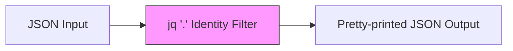

<details open>
<summary><b>08-Identity-Filter (KK-CS45-script-v3-Inst-v1)</b></summary>

# Session 8: Identity Filter

## Table of Contents
- [Overview](#overview)
- [Introduction to Filters](#introduction-to-filters)
- [Identity Filter](#identity-filter)
- [JQ Command Syntax Review](#jq-command-syntax-review)
- [Practical Demonstration](#practical-demonstration)
- [Summary](#summary)

## Overview

This session introduces the concept of filters in `jq` and focuses specifically on the **identity filter** - the most basic filter in `jq`. The identity filter (`jq '.'`) takes JSON input and outputs the same JSON with improved formatting, effectively doing "nothing" except pretty-printing the output.

## Introduction to Filters

### What is a Filter?

A filter in the context of command-line tools is a mechanism to extract or transform specific portions of data from input.

```bash
# Unix analogy: extracting last column from ls output
ls -lrt | awk '{print $NF}'
```

Similarly, in JSON processing:

```bash
# jq filter example: extracting a specific value
jq '.name' data.json
```

### Key Concept: Input → Filter → Output

The `jq` command processes JSON data through filters:
- Takes JSON as input
- Applies one or more filters
- Produces transformed/formatted output

### Three Syntax Types for jq

Before exploring filters, remember jq has three command syntaxes:

1. `jq [options] <jq filter> [input files]`
2. `jq [options] --args <jq filter> [arguments]`
3. `jq [options] --argjson <name> <value> <jq filter>`

## Identity Filter

### Definition

The **identity filter** (`.`) is the simplest filter in `jq`. It:
- Passes input through unchanged
- Returns identical output to input
- Only difference: applies pretty-print formatting

### Syntax

```bash
# Without file (reads from stdin)
jq '.'

# With input file
jq '.' filename.json

# Or with quoted filter
jq '.' "filename.json"
```

### Behavior

```diff
+ Input and output are identical
+ Only formatting changes (pretty-print applied)
- No data transformation occurs
- No filtering of content
```

### Visual Flow



## JQ Command Syntax Review

The session specifically uses Syntax Type 1 without options:

```
jq [filter] [input-file]
```

Starting approach:
- Begin with no options
- Apply various filters
- Later explore different options

## Practical Demonstration

### Demo Setup

File: `demo.json`

```json
{"name":"John","age":30,"city":"New York"}
```

### Command Execution

```bash
# Apply identity filter
jq '.' demo.json
```

### Output Comparison

**Input (demo.json):**
```json
{"name":"John","age":30,"city":"New York"}
```

**Output (after jq '.'):**
```json
{
  "name": "John",
  "age": 30,
  "city": "New York"
}
```

### Key Observations

1. Data content remains identical
2. Formatting is transformed to pretty-printed JSON
3. Indentation and line breaks are added for readability
4. No data loss or modification occurs

## Summary

### Key Takeaways

```diff
+ The identity filter (.) is the most basic jq filter
+ Input and output are identical except for formatting
+ Primary use: pretty-print JSON with proper indentation
+ Foundation for learning more complex filters
+ Works without any options on the jq command
```

### Quick Reference

| Command | Description |
|---------|-------------|
| `jq '.'` | Identity filter - pretty-prints JSON from stdin |
| `jq '.' file.json` | Identity filter - pretty-prints JSON from file |
| `jq '.' "file.json"` | Same as above with quoted filter |

### Expert Insight

> **Real-world Application**
> 
> Use `jq '.'` as a JSON formatter/validator in pipelines. When you receive minified or poorly formatted JSON from APIs, pipe it through the identity filter to make it human-readable:
> ```bash
> curl https://api.example.com/data | jq '.'
> ```

> **Expert Path**
> 
> Master this filter first as it forms the foundation. Progress to:
> 1. Field access filters (`.field`)
> 2. Array/object iteration (`.[], .[]`)
> 3. Compound filters and pipelines

> **Common Pitfalls**
> 
> - Expecting the identity filter to extract specific data (it outputs everything)
> - Forgetting that identity filter only affects formatting, not content
> - Not understanding this is often used for JSON validation and formatting

</details>
