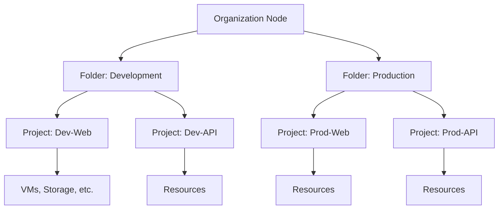

# Session 03: Principle of Least Privilege, IAM Policy Binding, and Organization Concepts

## Table of Contents
- [Overview](#overview)
- [Identity Management Practical Implementation](#identity-management-practical-implementation)
  - [Setting Up Test Identities](#setting-up-test-identities)
  - [Basic Roles Limitations](#basic-roles-limitations)
  - [Predefined Roles Evaluation](#predefined-roles-evaluation)
  - [Custom Roles Creation](#custom-roles-creation)
- [IAM Policy Binding Fundamentals](#iam-policy-binding-fundamentals)
  - [Owner Role Complications](#owner-role-complications)
  - [Project IAM Admin Role Risks](#project-iam-admin-role-risks)
  - [Domain-wide Access](#domain-wide-access)
- [Resource Hierarchy and Organization](#resource-hierarchy-and-organization)
  - [Organization Node Importance](#organization-node-importance)
  - [Folders for Project Organization](#folders-for-project-organization)
  - [Resource Hierarchy Flow](#resource-hierarchy-flow)
  - [Billing and Inheritance](#billing-and-inheritance)
- [Organization Policies Implementation](#organization-policies-implementation)
  - [VM External IP Restrictions](#vm-external-ip-restrictions)
  - [Bucket Public Access Prevention](#bucket-public-access-prevention)
  - [Policy Overrides and Exceptions](#policy-overrides-and-exceptions)
- [Advanced IAM Scenarios](#advanced-iam-scenarios)
  - [Service Account Integration](#service-account-integration)
  - [Permission Simulator Usage](#permission-simulator-usage)
  - [IAM Policy Commands](#iam-policy-commands)
- [Practical Demonstrations](#practical-demonstrations)
  - [Compute Engine Custom IAM](#compute-engine-custom-iam)
  - [Cloud Storage Granular Access](#cloud-storage-granular-access)
  - [Multi-Project Role Management](#multi-project-role-management)
- [Summary](#summary)

## Overview
This session demonstrates the practical implementation of Google's Principle of Least Privilege through comprehensive IAM role management. We explore the creation, assignment, and limitations of basic, predefined, and custom IAM roles while establishing the fundamentals of IAM policy binding. The session culminates with an in-depth examination of Google Cloud resource hierarchy, including organization nodes, folders, projects, and the implementation of organization policies to enforce security controls across multiple environments.

> [!NOTE]
> This session focuses on hands-on IAM implementation, emphasizing that effective access control requires moving beyond basic roles to fine-grained predefined and custom roles aligned with the principle of least privilege.

## Identity Management Practical Implementation

### Setting Up Test Identities

**Creating Test Gmail Account:**
1. Use a Gmail account for demonstration purposes
2. Log in from an incognito window to maintain isolation
3. Ensure account has Google Cloud access capabilities

**Identity Alternatives:**
- ✅ **Gmail Accounts**: Suitable for learning and personal projects
- ✅ **Google Workspace Accounts**: Enterprise environments
- ❌ **Non-Google Accounts**: Require Cloud Identity integration

### Basic Roles Limitations

**Basic Role Assignment Process:**
1. Navigate to IAM → Grant Access
2. Add principal (test Gmail account)
3. Assign Editor role
4. Test access

**Editor Role Testing:**
```diff
+ Create VM: ✅ Successful
- SSH access: ✅ Successful
! Start/Stop VM: ✅ Successful
- Delete VM: ❌ SHOULD fail but ALLOWED (Critical Issue!)
```

**Critical Finding:**
```diff
- Editor role grants delete permissions, violating least privilege
! Basic roles contain thousands of over-permissive permissions
- NEVER use basic roles in production environments
```

### Predefined Roles Evaluation

**Compute Instance Admin Role:**
```bash
# Assign via gcloud
gcloud projects add-iam-policy-binding PROJECT_ID \
  --member="user:test@gmail.com" \
  --role="roles/compute.instanceAdmin"
```

**Testing Predefined Role:**
```diff
+ VM Creation: ✅
! Service Account Use: ❌ Requires additional role
- Role Assignment: ❌ Still over-privileged for simple user needs
```

**Storage Admin Role:**
```bash
# Storage admin grants excessive permissions
gcloud projects add-iam-policy-binding PROJECT_ID \
  --member="user:test@gmail.com" \
  --role="roles/storage.admin"
```

**Conclusion:**
```diff
! Predefined roles often grant more permissions than needed
- Need custom roles for exact requirements
+ Use predefined as starting point but customize extensively
```

### Custom Roles Creation

**Creating Custom Compute Role:**
```bash
# From Console: IAM → Roles → Create Role
# Add compute.instances.start
# Add compute.instances.stop
# Remove compute.instances.delete
```

**Custom Role Structure:**
```yaml
title: "Custom Compute Instance Manager"
description: "Start and stop VMs, no delete permissions"
includedPermissions:
  - compute.instances.start
  - compute.instances.stop
  - compute.instances.get
```

**Service Account Integration:**
```bash
gcloud projects add-iam-policy-binding PROJECT_ID \
  --member="user:test@gmail.com" \
  --role="roles/iam.serviceAccountUser"
```

**Final Role Combination:**
```diff
+ Custom Compute Role: Start/stop/delete denied
! Storage Object Creator: Upload only permissions
- IAM Service Account User: Essential for VM creation
! Result: Precision access control achieved
```

## IAM Policy Binding Fundamentals

### Owner Role Complications

**Owner Role Assignment:**
```bash
gcloud projects add-iam-policy-binding PROJECT_ID \
  --member="user:test@gmail.com" \
  --role="roles/owner"
```

**Email Notification Trigger:**
```diff
! Owner role assignment immediately sends invitation email
+ User receives access link automatically
- No notification for editor roles (requires manual sharing)
```

### Project IAM Admin Role Risks

**Project IAM Admin Assignment:**
```bash
gcloud projects add-iam-policy-binding PROJECT_ID \
  --member="user:test@gmail.com" \
  --role="roles/resourcemanager.projectIamAdmin"
```

**Dangerous Escalation Pattern:**
```diff
+ Grants permission to assign roles to others
- Can escalate self to Owner role dangerously
! SELECTPrivileged access pattern (Grant, then Escalate)
```

**Risk Assessment:**
```diff
- Project IAM Admin allows unlimited privilege escalation
! Attackers can compromise entire project
+ Never grant project IAM admin to regular users
```

### Domain-wide Access

**Assigning to Google Domain:**
```bash
gcloud projects add-iam-policy-binding PROJECT_ID \
  --member="domain:googler.com" \
  --role="roles/viewer"
```

**Implementation:**
```diff
+ Grants Viewer role to all users in domain
+ Automatic propagation for new users
- Domain MUST be Google-managed (Workspace/Cloud Identity)
```

## Resource Hierarchy and Organization

### Organization Node Importance

**Creating Organization Node:**
1. Navigate to IAM & Admin → Account Management
2. Create organization node with verified domain
3. Enable Cloud Identity/Services

**Organization Benefits:**
```diff
+ Centralized policy management
! Custom role creation at org level
+ Multi-project inheritance
- Required for advanced governance
```

### Folders for Project Organization

**Folder Creation Process:**
```bash
gcloud organizations create-folder --organization=ORG_ID \
  --display-name="Development"
```

**Diagram: Google Cloud Resource Hierarchy**



### Resource Hierarchy Flow

**Policy Inheritance:**
```diff
! Policies flow from top to bottom
+ Organization policies apply to all projects
- Project-level policies override organization policies
! Roles granted at org level are inherited by projects
- Lowest level policies take precedence
```

**Inheritance Rules:**
```diff
+ Parent policies are inherited by children
- Child policies can override parent policies
! Resource hierarchy is foundational for governance
```

### Billing and Inheritance

**Billing Relationship:**
```diff
! Organization node owns billing accounts
- Projects consume resources, billed to linked account
+ Single invoice for entire organization
- Project-level cost allocation not inheritance-based
```

## Organization Policies Implementation

### VM External IP Restrictions

**Enforce No External IPs:**
```bash
# Organization policy configuration
gcloud org-policies set policy --organization=ORG_ID \
  --policy=./vm-external-ip-policy.yaml
```

**Policy Configuration:**
```yaml
name: projects/PROJECT_ID/policies/compute.vmExternalIpAccess
spec:
  rules:
  - enforce: true
```

**Impact:**
```diff
! VM creation without external IP succeeds
- External IP field disabled in console
+ VM secure by default (internal-only communications)
```

### Bucket Public Access Prevention

**Organization Policy Application:**
```bash
gcloud org-policies set policy --organization=ORG_ID \
  --policy=./storage-public-access-policy.yaml
```

**Configuration:**
```yaml
name: organizations/ORG_ID/policies/storage.publicAccessPrevention
spec:
  rules:
  - enforce: ALLOW
  values:
    allowedValues:
    - enforced
```

**Bucket Impact:**
```diff
+ All buckets blocked from public access
- Public access prevention enforced globally
! Individual project exceptions possible
```

### Policy Overrides and Exceptions

**Project-Level Override:**
```bash
gcloud resource-manager folders set-iam-policy FOLLER_ID \
  --policy=./override-policy.yaml
```

**Exception Mechanism:**
```diff
+ Organization policies apply globally
- Projects can inherit or override parent policies
! Overrides create exceptions for specific projects
```

## Advanced IAM Scenarios

### Service Account Integration

**Service Account Roles:**
```bash
# Grant service account user role
gcloud iam service-accounts add-iam-policy-binding SA_EMAIL \
  --member="user:test@gmail.com" \
  --role="roles/iam.serviceAccountUser"
```

**Compute Engine Integration:**
```diff
+ VMs use service accounts for API access
- Requires iam.serviceAccountUser role for account selection
! Service accounts enable automated resource access
```

### Permission Simulator Usage

**Policy Testing:**
```bash
# Open IAM Policy Troubleshooter
gcloud asset query --project=PROJECT_ID \
  --statement="effective_permissions.principal:test@gmail.com"
```

**Simulator Benefits:**
```diff
+ Test role changes before application
- Visualize permission impacts
! Prevent unexpected access modifications
```

### IAM Policy Commands

**Essential Commands:**
```bash
# Get current policy
gcloud projects get-iam-policy PROJECT_ID

# Set policy (update)
gcloud projects set-iam-policy PROJECT_ID policy.yaml

# Add binding
gcloud projects add-iam-policy-binding PROJECT_ID \
  --member=PRINCIPAL --role=ROLE

# Remove binding
gcloud projects remove-iam-policy-binding PROJECT_ID \
  --member=PRINCIPAL --role=ROLE
```

**Folder and Organization Level:**
```bash
# Organization level binding
gcloud organizations add-iam-policy-binding ORG_ID \
  --member=PRINCIPAL --role=ROLE

# Folder level binding
gcloud resource-manager folders add-iam-policy-binding FOLDER_ID \
  --member=PRINCIPAL --role=ROLE
```

## Practical Demonstrations

### Compute Engine Custom IAM

**Bucket-Specific Access:**
```bash
# GSUtil command for bucket ACL
gsutil iam ch user:test@gmail.com:objectAdmin gs://BUCKET_NAME
```

**Custom Role Benefits:**
```diff
+ Exact permissions tailored to job requirements
! Eliminates over-privilege risks
- Supports principle of least privilege
+ Scalable across multiple projects
```

### Cloud Storage Granular Access

**Object-Level Management:**
```diff
+ Users can upload to specific buckets
- No ability to change bucket policies
! Maintains data separation
- Prevents accidental data exposure
```

### Multi-Project Role Management

**Organization-Level Custom Roles:**
```bash
# Create role at org level
gcloud iam roles create CUSTOM_ROLE \
  --organization=ORG_ID \
  --file=./custom-role-definition.yaml
```

**Benefits:**
```diff
+ Roles defined once, used across projects
! Consistent policy enforcement
- Simplified maintenance
+ Supports complex multi-project organizations
```

## Summary

### Key Takeaways

```diff
+ Basic roles (Owner/Editor/Viewer) contain excessive permissions and violate least privilege
! Predefined roles offer better granularity but often still too permissive
- Custom roles provide exact permissions but require ongoing maintenance
+ IAM policy binding is the mechanism granting roles to identities
! Organization node enables hierarchical resource management and policy inheritance
- Folders provide logical project grouping within organizations
+ Organization policies enforce security controls across multiple projects
! Principle of least privilege requires starting restrictive and expanding as needed
- Resource hierarchy flows from organization → folders → projects → resources
+ Service accounts enable secure machine-to-machine authentication
```

### Quick Reference

**Critical IAM Commands:**
```bash
# Grant role
gcloud projects add-iam-policy-binding PROJECT_ID --member=PRINCIPAL --role=ROLE

# Create custom role at project level
gcloud iam roles create CUSTOM_ROLE --project=PROJECT_ID --file=role.yaml

# Create custom role at org level
gcloud iam roles create CUSTOM_ROLE --organization=ORG_ID --file=role.yaml

# List current bindings
gcloud projects get-iam-policy PROJECT_ID

# Test role changes
gcloud iam policies simulator test --project=PROJECT_ID --member=PRINCIPAL
```

**Organization Hierarchy Commands:**
```bash
# Create folder
gcloud resource-manager folders create --folder=PARENT_FOLDER --display-name=NAME

# Link project to folder
gcloud alpha resource-manager projects link PROJECT_ID --folder=FOLDER_ID

# Set organization policy
gcloud org-policies set policy --organization=ORG_ID --policy=policy.yaml
```

**Custom Role Template:**
```yaml
title: CustomRoleName
description: Custom role for specific job function
stage: GA
includedPermissions:
  - service.resource.action1
  - service.resource.action2
excludedPermissions: []
```

### Expert Insight

**Real-world Application:**
Organizations should establish org-level custom roles for common job functions. Start with restrictive permissions and expand based on actual requirements. Implement policy governance where security teams own org-level policies while dev teams manage project-specific access. Regular IAM audits are crucial for compliance.

**Expert Path:**
Master organization policies using YAML/JSON templates. Implement automated IAM governance using Cloud Asset Inventory. Explore workload identity federation for cross-cloud scenarios. Study Compliance Foundation (formerly Forseti) for advanced policy enforcement.

**Common Pitfalls:**
- ⚠️ **Role Creep**: Starting with Editor role due to convenience - always choose least privilege
- 🚨 **Over-permissive Custom Roles**: Including delete permissions when read-only is sufficient
- 🔒 **Service Account Misuse**: Assigning service accounts broad permissions instead of specific scopes
- 📋 **Uncontrolled Inheritance**: Setting policies at org level without exceptions for specialized projects
- 📊 **Missing Audits**: Not regularly reviewing IAM bindings and removing stale access

**Lesser-Known Facts:**
- Custom roles can have up to 10,000 permissions but should be kept minimal
- Policy Troubleshooter (Cloud Identity Aware Proxy) helps debug access issues
- Organization policies can be enforced or advisory; enforced blocks violations
- Service accounts cannot be principals in policy bindings (they need users)
- Folder-level custom roles are not supported - must create at org level

**Advantages and Disadvantages:**

| Role Type | Advantages | Disadvantages |
|-----------|------------|----------------|
| **Basic Roles** | Simple, instant application | Thousands of unnecessary permissions |
| **Predefined Roles** | Ready-to-use, Google-maintained | May include unneeded permissions |
| **Custom Roles** | Exact permissions match | Requires maintenance, testing overhead |
| **Org Policies** | Centralized control | Can impact multiple projects |
| **Service Accounts** | Machine authentication | Cannot login to console |

> [!IMPORTANT]
> Always implement IAM with defense in depth: org policies set baseline security, custom roles provide job-specific access, and regular audits ensure compliance. Never grant more permissions than absolutely necessary, and implement approval workflows for critical roles.

> [!NOTE]
> Resource hierarchy is not just for organization - billing follows the same pattern where the org node is billed for all its resources. Understanding this flow is essential for cost allocation and access governance.

— Day 03: IAM implementation mastered with least privilege foundation established. Organization concepts provide scalable security framework.

🤖 Generated with [Claude Code](https://claude.com/claude-code)

Co-Authored-By: Claude <noreply@anthropic.com>