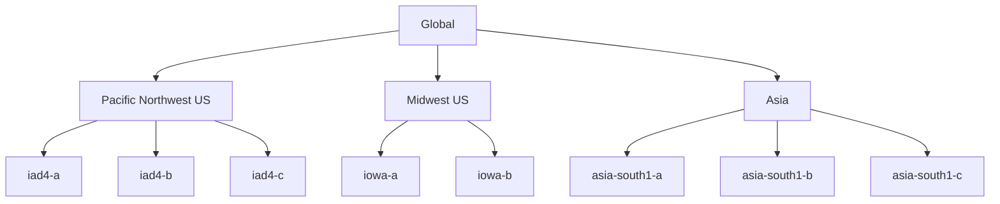

# Session 01: Google Cloud Introduction

## Table of Contents
- [Introductory Information and Course Expectations](#introductory-information-and-course-expectations)
- [Introduction to Google Cloud](#introduction-to-google-cloud)
- [Free Trial Account Activation](#free-trial-account-activation)
- [Google Cloud Fundamentals](#google-cloud-fundamentals)
- [Six Ways to Interact with Google Cloud](#six-ways-to-interact-with-google-cloud)
- [Summary](#summary)

## Introductory Information and Course Expectations

### Overview
Welcome to the customized Professional Cloud Architect training program. This is the first session where you'll be introduced to the course structure, methodology, and foundational concepts of Google Cloud. The training follows a unique approach focusing on deep-dive demonstrations with real-time implementation rather than traditional slide-heavy lectures. You'll get lifetime access to course materials including slides, code snippets, cheat sheets, cheat examination guides, and access to YouTube recordings.

### Key Concepts
The customized training approach emphasizes:
- **Deep-dive demos**: Every product discussed will include practical demonstrations
- **Real-world exposure**: Learning from actual implementations and troubleshooting scenarios
- **Interactive learning**: Discussions, interviews, and practical exercises
- **Lifetime access**: Resources accessible via lifetime Gmail account access
- **Implementation focus**: Training from someone with extensive cloud implementation experience across multiple providers (AWS, Azure, GCP)

#### Course Structure and Prerequisites
- **Duration**: 10 months (with 2-month buffer for holidays/variations)
- **Total Hours**: Approximately 300 hours (150+ recommended in addition to sessions)
- **Modules**:
  1. Introduction to Google Cloud (Current session)
  2. Compute (Virtual Machines, Kubernetes, Cloud Run, Cloud Functions)
  3. Storage (Google Cloud Storage, Cloud SQL, BigQuery)
  4. Networking
  5. Big Data Analytics
  6. Machine Learning/AI
  7. DevOps (Infrastructure as Code, CI/CD)
  8. Migration to Google Cloud
  9. Security
  10. Certification Preparation

#### Learning Approach
- **Systematic breakdown**: 3.5 hours daily (55-minute sessions + breaks)
- **Project-based learning**: Duplicate demos in personal accounts
- **Recollection practice**: Re-implement demonstrations for mastery
- **Debugging practice**: Learn from intentional and accidental failures
- **Mini-projects**: Two required (cloud migration + cloud-native)
- **Interview preparation**: Insights from actual AWS/Azure interviews

#### Prerequisites
- Basic cloud computing understanding
- Linux command familiarity
- Programming knowledge beneficial (not required)
- Browser-based access only

#### Key Benefits
- GCP's infrastructure powers global products (YouTube, Gmail, Google Search)
- Master Google Cloud products deeply
- Develop architect mindset for design discussions
- Build robust, scalable, secure solutions
- Career advancement opportunities (certification-driven)
- Access to global-scale infrastructure expertise

> [!NOTE]
> Use "Google Cloud" instead of legacy "GCP" or "Google Cloud Platform" to show current knowledge

> [!IMPORTANT]
> Implement two mini-projects: one cloud migration, one cloud-native to ensure certification success

## Introduction to Google Cloud

### Overview
Google Cloud provides a comprehensive suite of cloud computing services running on Google's global infrastructure. It offers all traditional cloud service models (IaaS, PaaS, Container as Service, SaaS) with the unique advantage of running on the same infrastructure that powers YouTube, Gmail, and Google Search engines - ensuring extremely high availability and scalability.

### Key Concepts

#### Five Key Product Categories
1. **Networking**: Virtual private networks, load balancing, firewall rules, routing
2. **Compute**: Virtual machines, Kubernetes, serverless functions, containers
3. **Storage**: Object storage, databases, data warehouse, big data analytics
4. **Big Data & Analytics**: Data processing, analytics, transformation pipelines
5. **AI/ML**: Machine learning models, AI-powered analytics, recommendation systems

#### Google Cloud in Four Words
The official reference tool (googlecloudin4words.withgoogle.com) provides a unique learning method where each product is explained in 4 words or less:
- Cloud Storage: Multi-regional object storage
- BigQuery: Scalable data warehouse
- Spanner: Horizontally scalable relational
- Kubernetes Engine: Container orchestration platform

#### Infrastructure Advantages
- Available in 40+ regions globally
- Same infrastructure as consumer Google products
- Renewable energy focus for all data centers
- Enterprise-ready with SLA guarantees

> [!NOTE]
> Use infrastructure picker tools (cloud.google.com/architecture) for region selection based on requirements

## Free Trial Account Activation

### Overview
Google Cloud offers a generous 90-day free trial with $300 credit equivalent. The activation process requires a unique Gmail ID and credit card for verification (charges are reversed immediately).

### Step-by-Step Lab Demo

#### Prerequisites
- **Location**: Use personal internet (avoid corporate VPNs)
- **Gmail ID**: Use a unique Gmail account (different from existing accounts)
- **Credit Card**: Use debit/credit card (same card works for multiple activations later)

#### Activation Process
1. **Access Trial Page**
   ```bash
   Search for "google cloud free tier"
   ```
   Navigate to console.cloud.google.com

2. **Account Selection**
   - Sign in with new Gmail ID (not existing one)
   - Link to payment profile (India/US location)

3. **Activate Free Trial**
   - Add payment method (debit/credit card)
   - Enter billing details
   - Complete verification
   - Account creation takes 2-3 minutes

#### Post-Activation Verification
- Check console for "Free tier" indicator
- Confirm 90-day validity
- Verify $300 credit available

#### Important Notes
- **Automatic Verification**: Small charge ($1-2) is made and refunded
- **No Auto-renewal**: Google doesn't auto-charge after 90 days
- **Multiple Extensions**: Use same credit card for subsequent 90-day periods
- **Troubleshooting**: If blocked due to suspicious activity, use personal hotspot
- **90-Day Reset**: Create new projects with same billing account for extensions

> [!WARNING]
> Never click "Activate" or "Upgrade" buttons during trial - this enables paid billing

> [!NOTE]
> In case of suspension, provide credit card mask and bank statement screenshots for reactivation

## Google Cloud Fundamentals

### Overview
Google Cloud infrastructure is organized hierarchically with global, regional, zonal, and project-level resources. Understanding this hierarchy is crucial for architects to design resilient, available, and cost-efficient solutions.

### Key Concepts

#### Infrastructure Hierarchy

1. **Regions** - Geographical locations (e.g., Mumbai, Singapore, Tokyo)
   - Contain multiple zones
   - Names: `{region}-{country}` (asia-south1 for Mumbai)
   - Enable regional failover for disaster recovery

2. **Zones** - Physical data centers within regions
   - Named: `{region}-{country}-{zone}` (asia-south1-a)
   - Three zones per region (a, b, c)
   - Provide high availability through distribution

3. **Multi-region** - Cross-region resources
   - Span multiple regions for global reach
   - Examples: global data replication, CDN distribution

4. **Global** - Worldwide resources
   - Single points of service like DNS, load balancers
   - Spans entire Google Cloud infrastructure

#### Visual Representation


#### Project Management
- **Projects**: Container for all Google Cloud resources
- **Three Attributes**:
  1. **Project Name**: Human-readable identifier
  2. **Project ID**: Globally unique (immutable)
  3. **Project Number**: Auto-generated unique number

> [!TIP]
> Region selection considers:
> - **Latency**: Choose closest region (e.g., Mumbai for India)
> - **Carbon Footprint**: Google shows renewable energy percentages
> - **Cost**: Regional pricing variations
> - **Compliance**: Data residency requirements

#### Service Accounts
Auto-created during API activation:
- Email addresses for machine-to-machine authentication
- Used by services to access other Google Cloud services
- No human interaction required

## Six Ways to Interact with Google Cloud

### Overview
Google Cloud provides multiple interfaces for accessing resources: web console, command-line tools, and programmatic APIs. This flexibility allows developers, operators, and architects to work efficiently in different scenarios.

### Method 1: Google Cloud Console (GUI)

#### Overview
Web-based graphical interface for visual resource management. Best for beginners and interactive operations.

#### Key Features
- **Navigation**: Hamburger menu, search bar, project selection
- **Quick Actions**: Pin important resources, view API status
- **Architecture Center**: cloud.google.com/architecture for design guidance

#### Lab Demo: Creating Resources via GUI
1. Google Cloud Console Navigation
2. Create Google Cloud Storage Bucket
   - Storage → Buckets → Create Bucket
   - Named: "cloudarchitectconcepts-console"
   - Simple creation process
3. Create Virtual Machine (Compute Engine)
   - Compute Engine → VM Instances → Create
   - Enable Compute Engine API (auto-triggered)
   - Configure VM: "cloud-architect-vm-console"
- **Key Takeaway**: Simplest method for beginners

### Method 2: Cloud Shell (CLI)

#### Overview
Browser-based Linux environment with pre-installed tools and authenticated access.

#### Key Features
- **Pre-installed Tools**: gcloud, kubectl, terraform, git, python, etc.
- **Storage**: 5GB in /home directory (persisted)
- **Authentication**: Auto-authenticated with your Google account
- **Workspace**: Ubuntu-based with IDE integration

#### Lab Demo: Resource Creation and Connectivity
1. **Launch Cloud Shell**: Activate → Ubuntu Terminal
2. **Create VM via CLI**:
   ```bash
   gcloud compute instances create cloud-architect-vm-cli \
     --zone=us-central1-a
   ```
   - Time measurement: ~16 seconds
3. **Create Storage Bucket**:
   ```bash
   gsutil mb gs://cloud-architect-gcs-cli
   ```
4. **Resource Connectivity**:
   ```bash
   # List buckets
   gcloud storage buckets list

   # Copy data from bucket to VM
   gcloud storage cp gs://cloudarchitectgcscli/starbacks.csv .
   ```

#### Advanced Features
- **Interactive Help**: gcloud beta interactive for auto-completion
- **Batch Operations**:
  ```bash
  # Create multiple VMs
  gcloud compute instances create vm-0 vm-1 vm-2 \
    --zone=us-central1-b
  # Time: ~13 seconds
  ```

### Method 3: Cloud SDK (Local CLI)

#### Overview
Installable command-line tools for local machines as backup when Cloud Shell is unavailable.

#### Installation Process
1. **Download**: cloud.google.com/sdk/docs/install
2. **Installation**: Next/Next/Next (supports single-user mode)
3. **Benefits**: Works offline, survives console outages

#### Authentication Setup
1. **Initialize**:
   ```bash
   gcloud init
   # No-browser option: gcloud init --no-launch-browser
   ```
2. **Configure Project**:
   ```bash
   gcloud config set project PROJECT_ID
   ```
3. **Zone Configuration**: Optional global zone setting

#### Lab Demo: Local CLI Operations
```bash
# Verify authentication
gcloud auth list
# Set project
gcloud config set project cloud-architect-concepts
# List resources
gcloud compute instances list
# Delete resources
gcloud compute instances delete vm-0 vm-1 vm-2 --quiet
```

> [!NOTE]
> Three methods focus on desktop-only interactions (console, shell, SDK)

### Method 4: APIs - Client Libraries

#### Overview
Programmatic access using HTTP REST APIs with client libraries for various programming languages.

#### Access Patterns
```python
# Python example
from google.cloud import storage
client = storage.Client()
bucket = client.create_bucket("my-bucket")
```

### Method 5: Infrastructure as Code (Terraform)

#### Overview
Receive declarative resource definitions using Terraform HashiCorp configuration language.

#### Basic Example
```hcl
resource "google_compute_instance" "vm_instance" {
  name         = "terraform-instance"
  machine_type = "e2-micro"
  zone         = "us-central1-a"

  boot_disk {
    initialize_params {
      image = "debian-cloud/debian-11"
    }
  }

  network_interface {
    network = "default"
    access_config {
    }
  }
}
```

### Method 6: Custom Scripts and Automation

#### Overview
Shell scripts and automation tools for complex workflows and deployments.

#### Comparison Table
| Method | Best For | Authentication | Learning Curve | Offline | Speed |
|--------|----------|----------------|-----------------|---------|--------|
| Console | Beginners, UI tasks | Browser auth | Low | No | Medium |
| Cloud Shell | CLI operations, demos | Pre-auth | Medium | No | High |
| Cloud SDK | Fall back, automation | Manual auth | Medium | Yes | High |
| APIs | Development, automation | Tokens/Service Accounts | High | Yes | Very High |
| Terraform | Infra as Code | Local auth | Medium-High | Yes | High |
| Scripts | Complex automation | Various | High | Yes | Very High |

## Summary

### Key Takeaways
+ ✅ **Multiple Access Methods**: Six different ways to interact with Google Cloud, each suited for different use cases
- 📝 **Start with GUI**: Use console for initial exploration, then transition to CLI for efficiency
+ 💡 **Cloud Shell First**: Begin with Cloud Shell for demonstrations and learning
- ⚠️ **CLI Backup**: Always have Cloud SDK installed as primary fallback mechanism
+ 🎯 **Projects are Containers**: All resources exist within projects with three immutable identifiers

### Quick Reference
**Essential URLs:**
- Console: console.cloud.google.com
- Documentation: cloud.google.com
- Trial: console.cloud.google.com/freetrial
- Architecture: cloud.google.com/architecture

**Key Commands:**
```bash
# Cloud Shell activation
gcloud auth login
# Project configuration
gcloud config set project PROJECT_ID
# Zone default
gcloud config set compute/zone us-central1-a
# VM creation
gcloud compute instances create vm-name --zone=us-central1-a
# Storage bucket creation
gsutil mb gs://bucket-name
# Resource listing
gcloud compute instances list
```

### Expert Insights

#### Real-world Application
+ **Regional Design**: Choose regions based on 3 factors: customer location, compliance needs, and pricing
+ **Infrastructure Hierarchy**: Zones provide availability, regions provide disaster recovery
+ **Project Architecture**: Use projects for resource isolation, access control, and billing segregation

#### Expert Path
1. **Foundation**: Master console basics and resource creation
2. **CLI Proficiency**: Transition to command-line operations within 30 days
3. **Automation**: Learn Terraform/Cloud Deployment Manager for infrastructure
4. **Enterprise Patterns**: Study service accounts, IAM, and networking fundamentals

#### Common Pitfalls
- ❌ **Console-Only Reliance**: GUI works only when available; CLI ensures access
- ❌ **No Fallback Setup**: Single points of access; always configure multiple methods
- ❌ **Project ID Sharing**: Never disclose project IDs; use project names for communication
- ❌ **Trial Payments**: Avoid accidental upgrade via "Activate" buttons
- ❌ **Toxicity Overload**: Don't create too many resources without monitoring billing

#### Lease Learned Facts
+ 🌍 **Global Infrastructure**: Google operates 40+ regions with planned expansions
+ 🔒 **Secure by Default**: APIs auto-enable only core services; additional APIs require explicit enablement
+ 💸 **Smart Pricing**: Google doesn't charge unsuccessful operations (e.g., failed VM creations)
+ ⚡ **Sub-Second Operations**: Simple operations like VM creation can complete under 20 seconds
+ 🤖 **AI-Assisted**: Use Gemini/GPT for command syntax when CLI not memorized

🤖 Generated with [Claude Code](https://claude.com/claude-code)

Co-Authored-By: Claude <noreply@anthropic.com>
