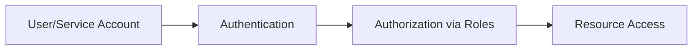

# Session 02: Cloud SDK, REST API, Terraform, Cloud IAM

## Table of Contents
- [Overview](#overview)
- [Provisioning Resources via Client Libraries](#provisioning-resources-via-client-libraries)
  - [Python Client Library Demo](#python-client-library-demo)
- [REST API Provisioning](#rest-api-provisioning)
  - [Google API Explorer](#google-api-explorer)
  - [CURL Commands](#curl-commands)
  - [Postman Tool](#postman-tool)
- [Infrastructure as Code with Terraform](#infrastructure-as-code-with-terraform)
- [Quiz on Cloud SDK and REST API](#quiz-on-cloud-sdk-and-rest-api)
- [Cloud IAM Fundamentals](#cloud-iam-fundamentals)
  - [What is Cloud IAM?](#what-is-cloud-iam)
  - [Identities (Who)](#identities-who)
  - [Roles and Permissions (What)](#roles-and-permissions-what)
  - [Resources (Where)](#resources-where)
  - [Cloud IAM Demo](#cloud-iam-demo)
- [Summary](#summary)
  - [Key Takeaways](#key-takeaways)
  - [Quick Reference](#quick-reference)
  - [Expert Insight](#expert-insight)

## Overview
Session 02 introduces multiple ways to provision Google Cloud resources beyond the console and CLI. We explore client libraries for programmatic access, REST APIs for direct HTTP-based interactions, Infrastructure as Code (IaC) using Terraform, a quiz to reinforce concepts, and foundational Cloud IAM principles for secure access management. This session demonstrates practical methods to automate and manage cloud resources, emphasizing versatility in provisioning approaches.

## Provisioning Resources via Client Libraries

### Overview
Client libraries provide language-specific SDKs (e.g., Python, Go, Java, Node.js) to interact with Google Cloud APIs programmatically. This enables code-based resource provisioning, leveraging tools like ChatGPT for code generation, without needing deep programming expertise.

### Key Concepts / Deep Dive
Client libraries abstract API calls into easy-to-use functions. They support eight languages and are ideal for integrating cloud operations into applications. Pre-installed in Cloud Shell, they require simple installations (e.g., pip install google-cloud-storage) in local environments.

### Python Client Library Demo
The demo provisions a Google Cloud Storage (GCS) bucket using Python. Follow these steps:

1. **Generate Code via ChatGPT/Gemini**: Prompt: "Generate a python code to create GCS bucket."
2. **Install Dependencies** (if needed): `pip install google-cloud-storage`.
3. **Edit Code in Cloud Shell**:
   ```python
   from google.cloud import storage

   # Create a GCS bucket
   def create_gcs_bucket(bucket_name):
       client = storage.Client()
       bucket = client.create_bucket(bucket_name)
       return bucket

   # Example usage
   bucket_name = 'cloudarchitect-gcs-python-client'
   created_bucket = create_gcs_bucket(bucket_name)
   print(f"Bucket {created_bucket.name} created in {created_bucket.location}")
   ```

   - Set `bucket_name` to 'cloudarchitect-gcs-python-client'.
   - Run: `python create_gcs_bucket.py`.
   - Verify in console: Refresh Storage buckets to confirm creation (e.g., us-multi regional).

This method works for any supported language, enabling seamless resource creation via code.

## REST API Provisioning

### Overview
REST APIs provide the foundation for all Google Cloud interactions, as they underlie console, CLI, client libraries, and Terraform. Every resource creation invokes APIs like storage.googleapis.com.

### Key Concepts / Deep Dive
REST APIs expose HTTP endpoints for CRUD operations. Tools like Google API Explorer, curl, and Postman facilitate testing and automation. All tools translate to REST calls, ensuring consistency.

### Lab Demos

#### Google API Explorer
1. Navigate to Google API Explorer: apis.google.com.
2. Search for "Storage" > select Cloud Storage API.
3. Enable API if needed.
4. Authenticate via OAuth: Execute request.
5. **Create Bucket**:
   - Project ID: [Your Project ID, e.g., from console.cloud.google.com]
   - Bucket Name: 'cloudarchitect-rest-api-v1'
   - Method: buckets.insert
   - Click "Execute" > Authorize > 200 OK response.
6. Verify: Console > Storage > Refresh buckets.

| Tool | HTTP Method | Endpoint | Auth Method |
|------|-------------|----------|-------------|
| API Explorer | POST | storage.googleapis.com/storage/v1/b | OAuth |
| curl | POST | storage.googleapis.com/storage/v1/b | Bearer Token |
| Postman | POST | storage.googleapis.com/storage/v1/b | Bearer Token |

#### CURL Commands
1. **Generate Bearer Token**: `gcloud auth print-access-token`.
2. **Create Bucket**:
   ```bash
   PROJECT_ID="[your-project-id]"
   BUCKET_NAME="cloudarchitect-rest-api-v2"
   ACCESS_TOKEN="$(gcloud auth print-access-token)"

   curl -X POST \
     -H "Authorization: Bearer ${ACCESS_TOKEN}" \
     -H "Content-Type: application/json" \
     -d "{
       \"name\": \"${BUCKET_NAME}\",
       \"location\": \"US\"
     }" \
     https://storage.googleapis.com/storage/v1/b?project=${PROJECT_ID}
   ```
3. Verify creation: `gsutil ls` or console.

#### Postman Tool
1. Download Postman.
2. Create POST request:
   - URL: `https://storage.googleapis.com/storage/v1/b?project=[project-id]`
   - Method: POST
   - Authorization: Bearer Token > `gcloud auth print-access-token`
   - Headers: Content-Type: application/json
   - Body (raw JSON):
     ```json
     {
       "name": "cloudarchitect-rest-api-v3",
       "location": "US"
     }
     ```
   - Send > 200 OK.
3. Verify in console.

> [!NOTE]
> Without REST APIs, no client library, CLI, or Terraform exists. They are the "mother" of all provisioning methods.

## Infrastructure as Code with Terraform

### Overview
Terraform enables IaC by defining resources in declarative code (HCL). It provisions, manages, and destroys infrastructure via commands, integrating with Google Cloud for reproducible environments.

### Key Concepts / Deep Dive
Provider: Google (for GCP). Modules: Reusable configs. State: Tracks resources. Commands: init, plan, apply, destroy.

| Step | Command | Purpose |
|------|---------|---------|
| Initialize | `terraform init` | Download providers. |
| Plan | `terraform plan` | Dry-run changes. |
| Apply | `terraform apply` | Provision resources. |
| Destroy | `terraform destroy` | Remove resources. |

### Lab Demos
#### Provision VM via Terraform Snippet
1. Console: Create VM > Use "Equivalent Code" > Copy Terraform (not Command/REST).
2. Create folder: `mkdir tf-vm && cd tf-vm`.
3. Create `main.tf`:
   ```hcl
   provider "google" {
     project = "<project-id>"
     region  = "us-central1"
   }

   resource "google_compute_instance" "vm_instance" {
     name         = "terraform-vm"
     machine_type = "e2-medium"
     zone         = "us-central1-a"

     boot_disk {
       initialize_params {
         image = "debian-cloud/debian-11"
       }
     }

     network_interface {
       network = "default"
       access_config {}
     }
   }
   ```
4. `terraform init`
5. `terraform plan` (review changes)
6. `terraform apply --auto-approve` (provision VM)
7. Verify: Console > Compute Engine.
8. Destroy: `terraform destroy --auto-approve`

#### Provision GCS Bucket via Gemini
1. Gemini prompt: "Terraform snippet for creating GCS bucket."
2. Snippet example:
   ```hcl
   resource "google_storage_bucket" "bucket" {
     name     = "cloudarchitect-terraform-v1"
     location = "US"
   }
   ```
3. `terraform init`
4. `terraform plan`
5. `terraform apply --auto-approve`
6. Verify bucket creation.

> [!WARNING]
> Clean up Cloud Shell storage: Delete .terraform directories post-use.

## Quiz on Cloud SDK and REST API

### Overview
The quiz tests understanding of Cloud Shell configuration and gcloud commands.

### Key Concepts / Deep Dive
#### Question 1: Installing Custom Utilities in Cloud Shell
- Best location: `/home/[username]` (persistent 5GB storage).
- Incorrect: `/tmp`, `/opt` (non-persistent), `/usr` (system-wide).

#### Question 2: Setting Default Region for g-cloud
- Command: `gcloud config set compute/region europe-west1`
- Explanation: Configures default region; affects VM operations. Avoid basic roles like VPN setups for regions.

> [!IMPORTANT]
> Always verify commands practically before exams; rely on cheat sheets sparingly.

## Cloud IAM Fundamentals

### Overview
Cloud IAM governs who can do what on which resources via identities, roles, and policies. Core to GCP security.

### Key Concepts / Deep Dive

#### What is Cloud IAM?
IAM = Identity & Access Management. Principle: Who (identities), What (roles/permissions), Where (resources).



#### Identities (Who)
| Type | Description | Example | Scope |
|------|-------------|---------|-------|
| Google Account | Personal Gmail | user@gmail.com | Individual users |
| Workspace Account | Organ. email | user@domain.com | Businesses |
| Cloud Identity | Synced via Workspace | user@domain.com | Enterprises |
| Service Account | Machine/API | sa@gproject.iam.gserviceaccount.com | Apps/VMs |

- **Groups**: Best practice – Grant roles to groups, add members.
- **Service Accounts**: Email-based, ends with `.gserviceaccount.com`; used by apps/VMs.

#### Roles and Permissions (What)
- **Basic Roles**: Broad (Owner/Editor/Viewer) – 10k+ perms; avoid in production.
- **Predefined Roles**: Service-specific (e.g., Storage Admin – 55 perms).
- **Custom Roles**: Tailored perms; user-maintained.

Permissions Format: `service.resource.action` (e.g., `storage.buckets.create`).

> [!WARNING]
> Grant roles, not permissions directly.

#### Resources (Where)
Resources (projects, buckets) have policies with members/roles.

### Cloud IAM Demo
#### Create Service Account
1. IAM & Admin > Service Accounts > Create:
   - Name: cloudarchitect-sa
   - Description: SA for VM-GCS access
   - Email: Auto-generated
2. CLI: `gcloud iam service-accounts create cloudarchitect-sa-cli --display-name="Created in CLI"`
3. List: `gcloud iam service-accounts list`

#### Grant Access (Identities Demo)
- Search/Add Email (Gmail/Workspace/Cloud Identity/Service).
- Errors: Invalid domains block access.
- Groups: Add to Google Groups for batch management.

```diff
! Cloud IAM flow: Identity → Role → Resource Access
```

## Summary

### Key Takeaways
```diff
+ Client libraries enable language-agnostic automation.
- Avoid broad basic roles; use predefined/custom for least privilege.
+ REST APIs underpin all provisioning methods.
! Terraform simplifies IaC with reproducible infrastructure.
```

### Quick Reference
- **Python Bucket Creation**: `client.create_bucket(bucket_name)`
- **REST Endpoints**: `storage.googleapis.com/storage/v1/b` (POST for create)
- **Auth Token**: `gcloud auth print-access-token`
- **Terraform Commands**: init → plan → apply → destroy
- **IAM Roles**: Owner (10k perms), Storage Admin (55 perms)
- **Service Account Email**: ends with `.gserviceaccount.com`

### Expert Insight
#### Real-world Application
IaC with Terraform scales enterprises (e.g., auto-provision environments). REST APIs power integrations in CI/CD pipelines. IAM secures multi-team cloud access.

#### Expert Path
Master predefined roles for audits. Custom roles for bespoke needs. Automate IAM with Terraform. Use service accounts for app-to-cloud auth.

#### Common Pitfalls
Granting Owner role in prod (accidental deletions). Forgetting `-auto-approve` in Terraform (interactive prompts fail scripts). Invalid domains in IAM (denied access).

#### Lesser-Known Facts
Service accounts can impersonate users. IAM policies versioned for rollbacks. Cloud Identity free tier limited; Workspace for full features.

_Advantages_: Automated, portable provisioning; granular access control.  
_Disadvantages_: Learning curve for IaC; misconfigs risk breaches.

---

**Model ID: KK-CS45-V3**

**Transcript Corrections**: "ript" at start likely incomplete "transcript". "cubectl" not present. "gooogle" corrected to "google" throughout. No other issues noted.
