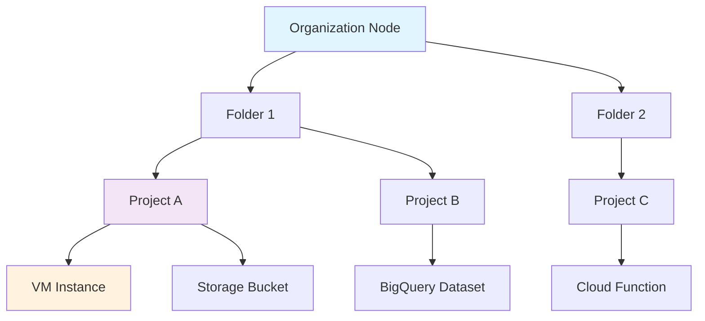

# Session 03: Demo on Principle of Least Privilege, IAM Policy Binding, What & Why Organization

## Table of Contents
- [Introduction](#introduction)
- [Principle of Least Privilege](#principle-of-least-privilege)
- [IAM Roles Overview](#iam-roles-overview)
- [Basic Roles Demonstration](#basic-roles-demonstration)
- [Predefined Roles](#predefined-roles)
- [Custom Roles](#custom-roles)
- [IAM Policy Binding](#iam-policy-binding)
- [Resource Hierarchy](#resource-hierarchy)
- [Organization Nodes](#organization-nodes)
- [Organization Policies](#organization-policies)
- [Lab Demos](#lab-demos)
- [Summary](#summary)

## Introduction
### Overview
This session demonstrates the practical implementation of the principle of least privilege, IAM policy binding, and the role of organization nodes in Google Cloud Platform. We'll explore basic roles, predefined roles, custom roles, and how to assign them appropriately to ensure security and minimize over-privileged access.

### Key Concepts / Deep Dive
The principle of least privilege is fundamental to cloud security, ensuring users and services have only the minimum permissions necessary to perform their tasks. We'll examine different types of IAM roles and their applications in real-world scenarios.

- **Basic Roles**: Three high-level roles (Owner, Editor, Viewer) that apply to all Google Cloud resources
- **Predefined Roles**: Service-specific roles with granular permissions for particular products
- **Custom Roles**: User-defined roles with specific permissions tailored to organizational needs

### Key Concepts / Deep Dive (continued)
IAM policy binding refers to the process of associating a role with an identity (user, service account, etc.) at different levels in the resource hierarchy. This binding inherits permissions through the hierarchy from organization to project to resources.

## Principle of Least Privilege
### Overview
The principle of least privilege requires giving users and systems the minimum permissions necessary to perform their tasks. This minimizes security risks from over-privileged accounts.

### Key Concepts / Deep Dive
- **Least Privilege Definition**: Grant only necessary access for specific tasks
- **Risk Mitigation**: Reduces damage from compromised accounts or insider threats
- **Practical Application**: Evaluate each permission's necessity before granting

## IAM Roles Overview
### Overview
Google Cloud IAM provides three categories of roles to control access to resources based on the principle of least privilege.

### Key Concepts / Deep Dive

| Role Type | Characteristics | Number of Permissions | Scope |
|-----------|----------------|----------------------|-------|
| Basic Roles | Broad access across all resources | High (thousands) | All Google Cloud services |
| Predefined Roles | Service-specific permissions | Moderate | Specific services (e.g., Compute Engine roles) |
| Custom Roles | Tailored permissions | Low to high (as defined) | Flexible (can be service-specific or cross-service) |

### Key Concepts / Deep Dive (continued)
- **Google's Recommendation**: Use predefined and custom roles over basic roles for granular control
- **Role Creation**: Basic roles are predefined by Google; custom roles can be created at project or organization level
- **Permission Management**: Basic roles update automatically; custom roles require manual maintenance

## Basic Roles Demonstration
### Overview
Basic roles provide broad access but often lead to over-privileged scenarios. We'll demonstrate their limitations through a practical example.

### Key Concepts / Deep Dive
- **Editor Role Permissions**: Includes 8,693 permissions across all services
- **Over-privilege Issues**: Allows actions beyond user requirements (e.g., VM deletion)
- **Real-world Impact**: In security audits, customers may initially prefer this role but later discover over-privilege

### Lab Demos
**Scenario**: Mahes is a new engineer needing to start/stop VMs, SSH into VMs, and upload objects to buckets without deletion rights.

#### Basic Editor Role Test:
1. Grant Editor role to user `simple-gcp-user@gmail.com`
2. Verify notification behavior (no notification for non-owner roles)
3. Create a Debian VM instance
4. Verify VM creation, SSH access, stop/start functionality
5. Confirm access to other services (IAM, service accounts)
6. Test bucket operations - can upload but can delete objects and buckets

**Result**: Editor role is over-privileged - allows VM deletion and full bucket management.

#### Basic Viewer Role Test:
1. Change `simple-gcp-user@gmail.com` role to Viewer
2. Verify restriction - no create, start/stop, or SSH access possible

**Result**: Viewer role is under-privileged - prevents any productive work.

```bash
# Expected outcome with Viewer role
# No VM operations possible
# No bucket operations possible
```

## Predefined Roles
### Overview
Predefined roles offer service-specific permissions that align closer to the principle of least privilege than basic roles.

### Key Concepts / Deep Dive
- **Service Specificity**: Roles like "Compute Engine" roles have ~45 permissions vs. Editor's 8,693
- **Compute Engine Admin Role**: Includes permissions for VM management but may still be overly broad
- **Storage Admin Role**: 55 permissions including create/delete buckets and objects
- **Storage Object Creator Role**: Only 8 permissions - focuses solely on object creation

### Lab Demos
#### Compute Engine Admin + Storage Admin Test:
1. Grant `compute.instances.admin` and `storage.admin` roles
2. Verify VM creation requires additional service account user role
3. Test VM operations (create, SSH, stop/start)
4. Test storage operations

**Result**: Compute admin allows VM management but permissions exceed requirements (can delete VMs). Storage admin enables full bucket control including deletion.

#### Storage Object Creator Role Test:
1. Grant `storage.objectCreator` role
2. Test bucket-level vs. project-level permission assignment
3. Verify user can upload objects but cannot:
   - Create or delete buckets
   - Delete uploaded objects
   - List objects (due to lack of storage.objects.list permission)

```bash
# CLI example for granting storage object creator at bucket level
gsutil iam ch user:simple-gcp-user@gmail.com:roles/storage.objectCreator gs://bucket-name
```

## Custom Roles
### Overview
Custom roles enable precise permission definition according to organizational requirements.

### Key Concepts / Deep Dive
- **Permission Selection**: Choose specific permissions from the available set
- **Maintenance Responsibility**: Google doesn't automatically update custom roles
- **Creation Levels**: Can be created at project or organization level
- **Best Practice**: Create organization-level custom roles for consistent use across multiple projects

### Lab Demos
#### Custom Compute Role Creation:
1. Base role: `Compute Instance Admin` (~406 permissions)
2. Remove `compute.instances.delete` permission
3. Name: `Custom Compute Instance Admin`

**Result**: User can create, start/stop VMs, SSH, but cannot delete VMs.

#### Combined Solution:
- Custom compute role (compute.instances.start, compute.instances.stop, plus other non-deletion permissions)
- Service account user role (for VM creation)
- Storage object creator role

```yaml
# Example custom role definition
title: Custom Compute Instance Admin
description: Custom role for VM management without deletion rights
stage: GA
includedPermissions:
  - compute.instances.create
  - compute.instances.get
  - compute.instances.start
  - compute.instances.stop
  - compute.instances.attachDisk
  - compute.instances.list
  - computengine.networks.get
excludedPermissions: []  # or explicitly exclude compute.instances.delete
```

## IAM Policy Binding
### Overview
IAM policy binding associates roles with identities at different levels in the resource hierarchy.

### Key Concepts / Deep Dive
- **Binding Components**: Member (user/group/service account), Role, Resource
- **Binding Methods**: UI (Grant access), CLI commands, APIs
- **Inheritance**: Permissions flow from higher to lower resource hierarchy levels
- **Command Structure**: `gcloud [resource-level] add-iam-policy-binding`

### Lab Demos
#### Project-level Binding:
```bash
gcloud projects add-iam-policy-binding PROJECT_ID \
  --member=user:email@example.com \
  --role=roles/viewer
```

#### Folder-level Binding:
```bash
gcloud resource-manager folders add-iam-policy-binding FOLDER_ID \
  --member=user:email@example.com \
  --role=roles/viewer
```

#### Organization-level Binding:
```bash
gcloud organizations add-iam-policy-binding ORGANIZATION_ID \
  --member=user:email@example.com \
  --role=roles/viewer
```

#### Bucket-level Binding:
```bash
gsutil iam ch user:email@example.com:roles/storage.objectCreator gs://bucket-name
```

#### Domain-wide Binding:
```bash
gcloud [resource] add-iam-policy-binding [RESOURCE_ID] \
  --member=domain:google.com \
  --role=roles/viewer
```

## Resource Hierarchy
### Overview
Google Cloud organizes resources in a hierarchical structure that affects IAM permissions and policy inheritance.

### Key Concepts / Deep Dive
- **Hierarchy Levels**: Organization → Folders → Projects → Resources
- **Inheritance Direction**: Policies flow downward (organization to resources)
- **Billing Direction**: Costs flow upward (resources to organization)

### DiagraMermaid


## Organization Nodes
### Overview
Organization nodes enable centralized management of policies, custom roles, and resource hierarchy across multiple projects.

### Key Concepts / Deep Dive
- **Prerequisites**: Requires Google Workspace or Cloud Identity
- **Purpose**: Centralized IAM management, organization policies, custom role sharing
- **Hierarchy Top Level**: Represents the organizational boundary
- **Inheritance Benefits**: Policies applied at org level affect all child resources

Organization nodes provide structure similar to corporate hierarchies, where employees have different levels of access based on their position.

## Organization Policies
### Overview
Organization policies enforce constraints across Google Cloud resources to maintain security and compliance standards.

### Key Concepts / Deep Dive
- **Policy Count**: Over 126 available organization policies
- **Application Levels**: Organization, folder, or project level
- **Examples**:
  - `compute.vmExternalIpAccess`: Controls VM external IP assignment
  - `storage.publicAccessPrevention`: Prevents public bucket access
- **Override Capability**: Child resources can override parent policies for exceptions

### Lab Demos
#### External IP Prevention Policy:
1. Apply `compute.vmExternalIpAccess` constraint at organization level set to "Deny"
2. Verify VMs created in child projects cannot have external IPs
3. Demonstrate exception handling by inheriting from parent at project level

#### Public Access Prevention:
1. Enable `storage.publicAccessPrevention` organization policy
2. Verify buckets cannot be made public
3. Show inheritance and override mechanisms

```yaml
# Example organization policy
name: organizations/123456789012/policies/compute.vmExternalIpAccess
spec:
  rules:
  - enforce: true
    condition:
      expression: ""
```

## Lab Demos
### Comprehensive Demo Summary

This session included multiple hands-on demonstrations covering:

1. **Account Setup**: Switching between owner (`learn-gcp-with-mahesh2@gmail.com`) and user (`simple-gcp-user@gmail.com`) accounts
2. **Role Assignment**: Using UI and CLI methods to grant various IAM roles
3. **VM Operations**: Creating Debian instances, testing stop/start/SSH/delete operations
4. **Storage Operations**: Bucket/object creation, upload, deletion testing
5. **Custom Role Development**: Creating roles with specific permission sets
6. **Policy Implementation**: Applying organization-level constraints
7. **Hierarchy Exploration**: Demonstrating inheritance and resource management

### Command Reference
```bash
# Project policy commands
gcloud projects get-iam-policy PROJECT_ID
gcloud projects add-iam-policy-binding PROJECT_ID --member=user:EMAIL --role=ROLE

# Storage operations
gsutil mb gs://bucket-name
gsutil cp file.txt gs://bucket-name/
gsutil iam ch user:EMAIL:ROLE gs://bucket-name

# VM creation
gcloud compute instances create INSTANCE_NAME --zone=ZONE
```

## Summary

### Key Takeaways
```diff
+ Principle of Least Privilege: Grant minimum necessary permissions
+ Basic Roles (Owner/Editor/Viewer): Often over/under-privileged
- Avoid Editor Role: Provides excessive permissions (8,693+)
+ Predefined Roles: Service-specific, better aligned with least privilege
+ Custom Roles: Tailored permissions for exact requirements
- Basic Roles: Generally not recommended for production scenarios
+ Organization Policies: Centralized security controls
+ Resource Hierarchy: Enables inheritance and centralized management
+ Policy Binding: Core IAM mechanism for access control
```

### Quick Reference
**IAM Role Assignment Commands:**
- Project: `gcloud projects add-iam-policy-binding`
- Folder: `gcloud resource-manager folders add-iam-policy-binding`
- Organization: `gcloud organizations add-iam-policy-binding`

**Key Permissions:**
- `compute.instances.delete`: VM deletion
- `storage.objects.delete`: Object deletion
- `iam.serviceAccounts.actAs`: Service account impersonation

**Common Roles:**
- `roles/editor`: Broad editing access
- `roles/storage.objectCreator`: Object upload only
- `roles/compute.instanceAdmin`: Most compute permissions
- `roles/resourcemanager.projectIamAdmin`: Can grant IAM roles

### Expert Insight

#### Real-world Application
In production environments, implement the principle of least privilege through role-based access control. Use organization policies to enforce security standards like preventing external IPs and public bucket access. Implement custom roles for developer teams with specific service access requirements.

#### Expert Path
- Master IAM policy simulator for testing role assignments before implementation
- Learn Cloud Asset Inventory for auditing resource permissions
- Study Cloud IAM best practices for enterprise architectures
- Explore service account impersonation patterns for secure resource access

#### Common Pitfalls
- **Over-reliance on Editor Role**: Avoid as it provides excessive permissions
- **Missing Service Account Roles**: VM creation requires additional service account permissions
- **Policy Inheritance Issues**: Ensure policies are applied at appropriate hierarchy levels
- **Public Bucket Exposure**: Use organization policies to prevent accidental public access

#### Lesser-Known Facts
- IAM permissions can take up to 7-10 minutes to propagate
- Owner invitations send email notifications, while other role assignments don't
- Custom roles at organization level can be shared across multiple projects
- Policy bindings can be applied to domains for bulk user access
- Resource hierarchy inheritance works differently for policies (downward) versus billing (upward)
