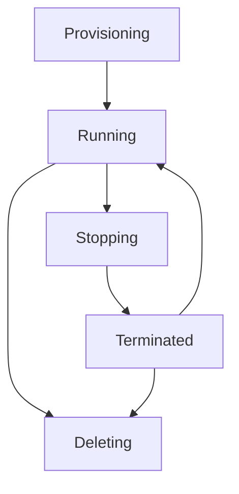

# Session 10: Deep Dive into Compute Engine - Labels, Tags, Region, Zone, Sustained Use Discount, Shielded VM

## Table of Contents
- [Overview](#overview)
- [Instance Name and Naming Conventions](#instance-name-and-naming-conventions)
- [Labels](#labels)
- [Tags](#tags)
- [Regions and Zones](#regions-and-zones)
- [Machine Types and Pricing](#machine-types-and-pricing)
- [Sustained Use Discount](#sustained-use-discount)
- [Virtual Machine Provisioning Models](#virtual-machine-provisioning-models)
- [Advanced Configuration](#advanced-configuration)
- [Boot Disk Configuration](#boot-disk-configuration)
- [Availability Policy and Host Maintenance](#availability-policy-and-host-maintenance)
- [Shielded VM Features](#shielded-vm-features)
- [Storage Options](#storage-options)
- [Network and Firewall Configuration](#network-and-firewall-configuration)
- [Observability and Monitoring](#observability-and-monitoring)
- [Identity and Access Management](#identity-and-access-management)
- [Management Options](#management-options)
- [Security Features](#security-features)
- [Metadata and Startup Scripts](#metadata-and-startup-scripts)
- [VM Lifecycle Management](#vm-lifecycle-management)
- [Summary](#summary)

## Overview

This session provides an in-depth exploration of Google Cloud Compute Engine virtual machines, focusing on advanced configuration options, naming conventions, organizational tags, regional considerations, pricing optimizations, and security features. The session emphasizes practical implementation through demonstrations and covers concepts critical for the Professional Cloud Architect certification.

## Instance Name and Naming Conventions

### Instance Naming Rules
- **Character Limit**: 63 characters maximum
- **Validation**: Must start with lowercase letter, can contain lowercase letters, numbers, and hyphens
- **Restrictions**: Cannot end with a hyphen

### Naming Strategy Consideration
- **Single Instance**: Complete custom name when creating one VM (e.g., `my-sql-client`)
- **Multiple Instances**: Prefixed naming pattern (e.g., `web-app-vm-`) with system-generated suffix

### Terraform Considerations
```bash
# Name validation in Terraform
resource "google_compute_instance" "vm_instance" {
  name = "pca-gce-${var.environment}"
  # Must ensure total length ≤ 63 characters
}
```

**Example Valid Names**:
- `pca-gce-linux-dev-01`
- `web-server-prod-us-central1-a`

> [!WARNING]
> Names exceeding 63 characters will cause deployment failures in automated tools like Terraform.

## Labels

Labels are key-value pairs used for resource organization and metadata management.

### Label Use Cases
- **Environment Identification**: `environment = "dev/prod/qa"`
- **Component Categorization**: `component = "web-server"`
- **Owner/Contact Information**: `owner = "user@company.com"`
- **Cost Center Allocation**: `cost-center = "987123"`
- **Team Assignment**: `team = "backend"`

### Label Structure
```yaml
labels = {
  environment = "production"
  component   = "mysql-client"
  owner       = "user@domain.com"
  cost-center = "CC-001"
}
```

### Billing Integration
Labels propagate to billing reports, enabling:

```diff
+ Fine-grained cost analysis by:
  - Environment (dev/prod/qa)
  - Component type
  - Owner/Team
  - Cost center
```

> [!IMPORTANT]
> Labels are free metadata that don't incur costs but provide critical organizational value.

### Billing Filter Examples

**Before Labels**:
- Only project-level cost visibility
- Difficult to identify specific resource costs

**After Labels**:
- Filter costs by `component = mysql-client`
- Identify exact VM usage costs
- Cross-charge by cost center

## Tags

Tags are organizational resources at the project or organization level for access control and cost tracking.

### Tag Structure
- **Project-level Scoping**: Apply tags within a project boundary
- **Grant/Deny Policies**: Use conditional access policies

```yaml
# Tag Example
key: "pca-tag-01"
value: "gce"
description: "Tag for compute engine resources"
```

### Tag vs Network Tags Comparison
- **Tags**: Organization/project-level access control
- **Network Tags**: VPC and subnet-specific targeting

### IAM Conditional Access Example
```json
{
  "condition": {
    "title": "ResourceTagCondition",
    "expression": "resource.matchTag('project-id/tag-key', 'tag-value')"
  }
}
```

> [!NOTE]
> Tags provide enterprise-grade access control beyond basic IAM roles.

## Regions and Zones

### Regional Selection Criteria

**Primary Factors**:
- **Data Residency Requirements**: GDPR, privacy regulations
- **Latency Optimization**: Closest region to users
- **Compliance**: Local data sovereignty laws
- **Cost Optimization**: Regional pricing differences

### Regional Considerations

**Example: Customer Requirements**
- Presence in Sweden, Dubai, USA
- Data residency restrictions
- Compliance challenges when region unavailable

**Alternative Solutions**:
- Netherlands instead of Sweden
- Saudi Arabia instead of UAE
- Multiple US regions available

### Zone Selection
- **"Any" Zone**: GCP auto-selects optimal zone
- **Specific Zone**: Required for specialized resources (GPU availability)

### Regional Resource Picker Tool

**Selection Criteria**:
```diff
+ Latency: Critical for user experience
+ Price: Cost optimization
+ Carbon Footprint: Environmental considerations
+ Compliance: Legal requirements
```

**Common Region Decisions**:
- Production: Multi-region HA
- Development: Cost-optimized regions (Taiwan, South Africa)
- Compliance: Local presence required

> [!WARNING]
> Zone selection impacts resource availability and GPU access.

## Machine Types and Pricing

### Machine Series Overview

| Series | Use Case | Processor | Notable Features |
|--------|----------|-----------|------------------|
| E2 | General Purpose | Intel/AMD | Balanced, cost-effective |
| N2 | General Purpose | Intel/AMD | High performance |
| N2D | General Purpose | AMD | Cost-optimized |
| C2 | Compute Optimized | Intel | CPU-intensive workloads |
| M2 | Memory Optimized | Intel | Large memory requirements |

### Custom vs Predefined Machine Types
- **Predefined**: Fixed vCPU/memory ratios
- **Custom**: Flexible sizing (minimum 1 vCPU, 0.9 GB RAM per vCPU)

### Pricing Considerations
```bash
# Cost Calculation Example
E2-medium: ~$25/month (2 vCPU, 4 GB RAM)
N1-standard-8: Higher baseline cost
N2-standard-8: Improved performance/cost ratio
```

## Sustained Use Discount

Automatic discount for long-running instances.

### Eligibility Criteria
- **Minimum Usage**: 25% of month (7-8 days)
- **Applicable Series**: N1, N2, C2, M1, M2
- **Not Eligible**: E2, N2D

### Discount Structure
```diff
+ Up to 20-30% discount based on usage duration
- N1 series: Up to 30%
- N2 series: Up to 20%
- Cumulative: Not stackable with spot discounts
```

### Usage Calculation
- **Billing Cycle**: Monthly assessment
- **Threshold**: 25% usage minimum
- **Discount Escalation**: Increases with usage percentage

> [!NOTE]
> Sustained use discounts require minimum 15 days of runtime per month.

## Virtual Machine Provisioning Models

### Standard VMs
- **Default Option**: Always-on availability
- **Termination**: User-initiated only
- **Cost**: Regular pricing, eligible for sustained use discount

### Spot/Preemptible VMs
- **Cost Optimization**: 60-90% discount
- **Interruption Risk**: GCP can terminate anytime
- **Use Cases**: Fault-tolerant workloads, batch processing

#### Spot VM Configuration
```yaml
scheduling:
  provisioningModel: SPOT
  instanceTerminationAction: DELETE  # Recommended for cost control
```

#### Termination Management
- **Default**: Stop VM (continues incurring storage costs)
- **Recommended**: Delete VM (eliminates all costs)

> [!WARNING]
> Spot VMs unsuitable for production workloads requiring 99.9% uptime.

## Advanced Configuration

### CPU Platform Selection
- **Automatic**: GCP optimization (recommended)
- **Manual**: Intel Cascade Lake, AMD Rome (for specific requirements)

### vCPU-to-Core Ratio
- **Default**: 1 core = 2 vCPUs (hyperthreading)
- **Custom**: 1 core = 1 vCPU (migrations, licensing)

### Visible Cores
Controls CPU visibility for licensing compliance:
- **Oracle Licensing**: Based on vCPU count
- **Migrated Workloads**: Match on-premise configurations

## Boot Disk Configuration

### Operating System Selection
**Critical Considerations**:
- **Cost Impact**: Windows Server costs ~$50-100/month
- **Change Limitations**: OS cannot be modified post-creation
- **Minimum Sizes**: Windows (50GB), Red Hat (20GB), Ubuntu/Debian (10GB)

### Disk Types
```diff
+ Standard HDD: Cost-effective, adequate for most workloads
+ Balanced SSD: Performance/cost balance
+ SSD: High performance, higher cost
+ Extreme SSD: Ultra-high performance (limited use cases)
```

### Performance Comparison (500GB disk)

| Disk Type | Read IOPS | Write IOPS | Read Throughput | Cost/Month |
|-----------|-----------|------------|-----------------|------------|
| Standard | 3,000 | 3,000 | 240 MB/s | ~$5 |
| Balanced | 12,000 | 12,000 | 550 MB/s | ~$25 |
| SSD | 30,000 | 30,000 | 1,400 MB/s | ~$50 |
| Extreme | 170,000 | 170,000 | 6,200 MB/s | ~$200+ |

### Encryption Options
- **Google Managed**: Free, default
- **Customer Managed**: KMS integration
- **Customer Supplied**: External key management

> [!IMPORTANT]
> Boot disk OS selection is permanent and costly to change.

## Availability Policy and Host Maintenance

### Host Maintenance Migration
```diff
+ Automatic VM migration during maintenance
+ Zero downtime migration
+ Live migration capability
```

### Host Maintenance Behavior
- **Standard VMs**: Automatic live migration
- **Spot VMs**: Termination (no migration)
- **Custom Maintenance Windows**: Configurable scheduling

### Host Error Handling
- **Automatic Restart**: Enabled by default for unplanned terminations
- **Termination Timeout**: Configurable (default: unspecified)

## Shielded VM Features

Hardware-based security features enabled by default.

### Core Security Components
- **Secure Boot**: Prevents unauthorized OS modifications
- **Virtual TPM**: Cryptographic key generation and protection
- **Integrity Monitoring**: Real-time system state validation

### Security Benefits
```diff
+ Protection against rootkits and boot-level attacks
+ Hardware-backed security
+ Zero configuration overhead
```

> [!WARNING]
> Disabling shielded VM features reduces security posture significantly.

## Storage Options

### Local SSD vs Persistent Disk

| Feature | Local SSD | Persistent Disk |
|---------|-----------|------------------|
| Latency | Ultra-low | Higher |
| Throughput | 170k IOPS | Variable |
| Durability | Instance-bound | Highly durable |
| Cost | Higher per GB | Lower per GB |

### Additional Disk Attachment
- **Supported Types**: HDD, SSD, Balanced
- **Hot-attach**: Attach while VM running
- **Formatting Required**: Raw disks need filesystem creation

## Network and Firewall Configuration

### External IP Assignment
- **Ephemeral**: Dynamic, changes on stop/start
- **Static**: Reserved, persistent across VM lifecycle

### Firewall Rules
```diff
- UI-based firewall creation (not recommended)
+ VPC Firewall Rules (proper approach)
+ Default: Deny all inbound except explicitly allowed
```

> [!NOTE]
> External IPs should be avoided in production for security.

## Observability and Monitoring

### Ops Agent Installation
Enables comprehensive monitoring and logging.

### Service Account Permissions
```yaml
roles:
  - roles/logging.logWriter
  - roles/monitoring.metricWriter
```

### Automatic Metrics Collection
- CPU utilization
- Memory usage
- Network I/O
- Disk I/O

## Identity and Access Management

### Service Account Configuration
- **Avoid Default**: Never use compute engine default service account
- **Principle**: Least privilege access
- **Scopes**: Use full API access (managed via IAM)

### SSH Key Management
- **Instance-level**: Specific key per VM
- **Project-level**: Shared keys across VMs
- **OS Login**: Centralized SSH key management

## Management Options

### VM Deletion Protection
```diff
+ Prevent accidental VM termination
- Requires explicit disable before deletion
```

### Description Field Usage
```markdown
Description: "PCA Training VM - Nginx web server for compute engine demos"
```

### Reservation Options
Advanced resource reservation for capacity assurance (future topic).

### Startup Scripts
```bash
#!/bin/bash
apt update
apt install -y nginx
systemctl enable nginx
systemctl start nginx
```

## Security Features

### Confidential Computing
- **Memory Encryption**: RAM content protection
- **AMD SEV**: Hardware-based encryption
- **Processor Requirement**: AMD processors only

> [!NOTE]
> Confidential VMs prevent memory-based attacks and side-channel exploits.

## Metadata and Startup Scripts

### Metadata Types
- **Project Metadata**: Shared across all project VMs
- **Instance Metadata**: VM-specific configuration
- **Startup Scripts**: Automatic software installation and configuration

### Use Cases
- **Software Deployment**: Automated installation
- **Configuration Management**: Initial VM setup
- **Application Initialization**: Service startup

## VM Lifecycle Management

### State Transitions



### Cost Implications
- **Running**: Full vCPU/memory/disk costs
- **Terminated**: Disk storage costs only
- **Deleted**: No costs (except retained static IPs)

### IP Address Management
- **Ephemeral IPs**: Released immediately on termination
- **Static IPs**: Retained until manually released
- **Billing**: Static IPs incur costs if unassigned

## Summary

## Key Takeaways
```diff
+ Labels provide free organizational metadata and enable billing granularity
+ Tags enable advanced IAM conditional access policies
+ Regional selection impacts latency, compliance, and availability
+ Sustained use discounts reward long-running instances
+ Spot VMs offer massive cost savings for fault-tolerant workloads
+ Shielded VMs provide hardware-level security at no extra cost
+ OS selection is permanent and impacts both functionality and cost
+ Startup scripts enable automated VM configuration
```

## Quick Reference

### Instance Naming
- Max 63 characters
- Lowercase letters, numbers, hyphens
- Cannot end with hyphen

### Label Structure
```yaml
labels = {
  environment = "prod"
  component   = "web-server"
  owner       = "team@company.com"
}
```

### Common Machine Types
- **E2-medium**: $25/month, 2 vCPU, 4GB RAM
- **N1-standard-8**: Balanced performance (with sustained use discount)
- **Custom**: Flexible ratios for specific needs

### Startup Script Template
```bash
#!/bin/bash
apt update
apt install -y nginx
echo "Welcome to PCA Training" > /var/www/html/index.html
```

## Expert Insight

### Real-world Application
In enterprise environments, use labels extensively for:
- Cost allocation across departments
- Resource lifecycle management
- Automated cleanup scripts based on labels
- Compliance reporting by environment/component

### Expert Path
Master the following advanced concepts:
- Zone selection based on GPU availability
- Custom machine sizing for workload optimization
- Automated VM provisioning with Terraform
- Cost optimization strategies combining multiple discount types

### Common Pitfalls
```diff
- Forgetting OS cost implications (Windows Server licensing)
- Not enabling delete protection on production VMs
- Using external IPs in production (security risk)
- Ignoring regional compliance requirements
- Overprovisioning storage without performance baseline
- Failing to implement proper IAM controls
```

### Lesser-Known Facts
- Shielded VMs are enabled by default with no performance impact
- Ephemeral external IPs can be recovered within the same region
- Sustained use discounts reset monthly, not cumulative
- Local SSDs provide database-like performance within VMs
- Custom machine types can use decimal vCPU counts

---

🤖 Generated with [Claude Code](https://claude.com/claude-code)

Co-Authored-By: Claude &lt;noreply@anthropic.com&gt;  
KK-CS45-V3
