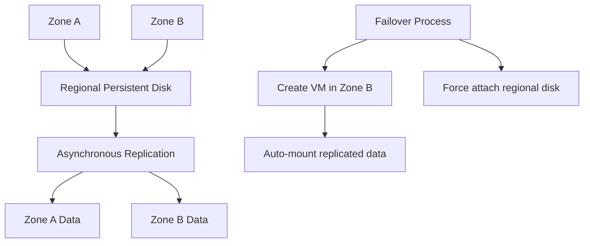
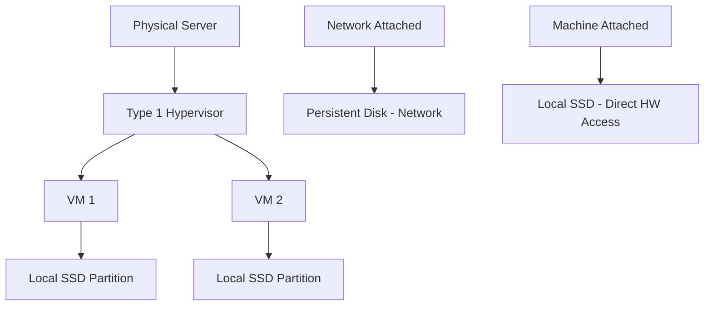

# Session 12: Persistent Disk Concepts - Expansion of Boot & Non Boot Disk, Formatting, Local SSD

## Table of Contents
- [Overview](#overview)
- [Preemptable vs Spot VM Termination Behavior](#preemptable-vs-spot-vm-termination-behavior)
- [Disk Resizing Concepts](#disk-resizing-concepts)
- [Disk Formatting and Mounting Procedures](#disk-formatting-and-mounting-procedures)
- [Types of Persistent Disks](#types-of-persistent-disks)
- [Regional Persistent Disks for High Availability](#regional-persistent-disks-for-high-availability)
- [Local SSD Concepts](#local-ssd-concepts)
- [Lab Demonstrations](#lab-demonstrations)
- [Summary](#summary)

## Overview

Persistent disks in Google Cloud Platform provide block storage for virtual machine instances. This session covers advanced concepts including disk expansion (boot and non-boot disks), formatting procedures, and different disk types including regional persistent disks for high availability and local SSDs for high-performance workloads. The session demonstrates VM termination persistence, disk resizing limitations, and practical mounting procedures.

## Preemptable vs Spot VM Termination Behavior

### Key Concepts
- **Preemptable VMs**: Use `--preemptive` flag for maximum 24-hour runtime
- **Spot VMs**: Created via UI with no upper runtime limit but highly unpredictable termination
- **Termination State**: VMs go to TERMINATED (not STOPPED) when preempted
- **Data Persistence**: All installed software and data persists in terminal state
- **System Actor**: Preemption performed by system@google.com account

### VM State Differences
```bash
# Check VM status - shows TERMINATED, not stopped
gcloud compute instances list

# Enable accessibility format for better readability
gcloud config set accessibility/screen_reader true
```

### Log Analysis
Preemption events appear in Cloud Logging with "Preempted" message and actor as "System at google.com". Use these filters:
- Service: Compute Engine
- Resource: Instance
- Operation: Preempted

## Disk Resizing Concepts

### Fundamental Rules
- **Unidirectional Only**: Can only increase disk size, never decrease
- **Service Continuity**: VM remains running during resize (no downtime)
- **Partition Expansion Required**: File system expansion needed after physical resize

### Boot Disk Expansion vs Non-Boot Disk Expansion

| Aspect | Boot Disk Expansion | Non-Boot Disk Expansion |
|--------|-------------------|----------------------|
| Commands | `growpart` + `resize2fs` | `resize2fs` only |
| Complexity | Higher (partition resizing) | Lower (file system only) |
| Downtime | Zero | Zero |
| Partition Table | Requires modification | No modification needed |

### Resize Commands
```bash
# Resize disk size (infrastructure level)
gcloud compute disks resize DISK_NAME --size=50GB --zone=ZONE

# Expand file system for non-boot disks
sudo resize2fs /dev/DEVICE

# Boot disk requires additional partition expansion
sudo growpart /dev/sda 1
sudo resize2fs /dev/sda1
```

## Disk Formatting and Mounting Procedures

### Device Identification
```bash
# List all block devices
lsblk

# Detailed disk information
lsblk -o NAME,SIZE,TYPE,MOUNTPOINT

# Alternative device listing
ls /dev/ | grep sd
```

### Formatting Procedure
```bash
# Format disk with ext4 file system
sudo mkfs.ext4 /dev/DEVICE

# Example for SDA device
sudo mkfs.ext4 /dev/sda
```

### Mounting Procedure
```bash
# Create mount directory
sudo mkdir /mnt/data-disk

# Mount the disk
sudo mount /dev/sda /mnt/data-disk

# Set permissions for write access
sudo chmod 777 /mnt/data-disk
```

### Persistent Mounting (Survives Reboots)
Add entry to `/etc/fstab`:
```
UUID=YOUR_DEVICE_UUID /mnt/data-disk ext4 defaults 0 2
```

## Types of Persistent Disks

### Overview
GCP offers multiple persistent disk types for different performance and availability needs:

- **Standard Persistent Disk**: Balanced cost/performance, HDD-backed
- **Balanced Persistent Disk**: SSD-backed, balanced performance
- **SSD Persistent Disk**: Highest performance, SSD-backed
- **Extreme Persistent Disk**: Ultra-high performance (min 5000 IOPS)

### Regional vs Zonal Disks

| Characteristic | Zonal Disk | Regional Disk |
|----------------|------------|---------------|
| Availability Zones | Single zone | Two zones in same region |
| Cost | Standard | Double (for redundancy) |
| Use Case | Standard HA | High availability with failover |
| Replication | None | Asynchronous between zones |
| Attach Limit | One VM | One VM (detail-overreplica for failover) |

## Regional Persistent Disks for High Availability

### Architecture


### Key Features
- **Auto-replication**: Asynchronous data replication between 2 zones
- **Failover Time**: ~3 minutes initial, then faster once synced
- **Cost**: Double the zonal disk pricing
- **Supported Types**: Balanced, SSD, Extreme (but not Standard)
- **Series Support**: Limited to specific VM families (not all series)

### Creation Commands
```bash
# Create regional balanced persistent disk
gcloud compute disks create REGIONAL_DISK \
  --region=us-central1 \
  --replica-zones=us-central1-a,us-central1-b \
  --size=100GB \
  --type=pd-balanced

# Attach to VM with force (for failover scenarios)
gcloud compute instances attach-disk INSTANCE_NAME \
  --disk=REGIONAL_DISK \
  --disk-scope=regional \
  --force-attach
```

### Series Limitations
Regional disks can only be attached to:
- N2 series VMs
- C3 series VMs
- And specific other supported series

## Local SSD Concepts

### Architecture Overview


### Key Characteristics
- **Machine-Attached**: Physically connected to host server, not network-attached
- **Zero Latency**: Lowest possible latency for I/O operations
- **Ephemeral**: Data lost when VM terminates (no persistence)
- **Series Dependency**: Only available on N1, N2, C3 series
- **Size**: Fixed 375GB per SSD unit
- **Maximum**: Up to 24 SSDs (9TB) per VM

### Performance Metrics
- **Extreme IOPS**: Thousands of IOPS (vs hundreds for network disks)
- **Low Latency**: Sub-millisecond response times
- **Local Access**: Bypasses network entirely

### Creation Constraints
- **Only at VM Creation**: Cannot add to existing running VMs
- **No Runtime Modification**: Cannot resize after creation
- **Host Dependency**: VM placement determines SSD availability

## Lab Demonstrations

### Demo 1: Preemptable VM Termination and Data Persistence
```bash
# Create preemptable VM with preemptive flag
gcloud compute instances create preempt-vm \
  --preemptible \
  --zone=us-central1-a \
  --machine-type=e2-medium

# Install software and create data
# VM gets preempted by Google
# Check status shows TERMINATED
gcloud compute instances list

# Start VM - data persists
gcloud compute instances start preempt-vm
ssh preempt-vm
ls # Shows persisted files
```

### Demo 2: Disk Expansion and File System Resize
```bash
# Increase disk size in UI or CLI
gcloud compute disks resize existing-disk --size=30GB --zone=us-central1-a

# Resize file system
sudo resize2fs /dev/sdb

# Verify new size
df -h
```

### Demo 3: Regional Disk Failover Simulation
```bash
# Create regional disk
gcloud compute disks create regional-disk \
  --region=us-central1 \
  --replica-zones=us-central1-a,us-central1-b \
  --size=20GB \
  --type=pd-ssd

# Simulate zone failure by terminating original VM
# Force attach to VM in secondary zone
gcloud compute instances attach-disk failover-vm \
  --disk=regional-disk \
  --disk-scope=regional \
  --force-attach

# Mount and access replicated data
sudo mount /dev/sdc /mnt/data
ls /mnt/data # Shows all files
```

### Demo 4: Local SSD Characteristics
```bash
# Create VM with local SSD (only at creation time)
gcloud compute instances create local-ssd-vm \
  --machine-type=n2-standard-4 \
  --local-ssd=interface=NVME \
  --zone=us-central1-a

# Verify local SSD presence
lsblk  # Shows nvme0n1 (375GB)
# Performance significantly higher than network disks
```

## Summary

### Key Takeaways
```diff
+ Persistent disks retain data during VM termination, incurring only storage costs
+ Disk resizing is unidirectional (increase only) with zero downtime
+ File system expansion required after disk resize operations
+ Regional disks provide cross-zone replication for high availability
+ Local SSDs deliver extreme performance but are ephemeral and machine-attached
! Boot disk expansion requires partition resizing before file system expansion
- Never try to decrease disk size - operation not supported
- Local SSDs cannot be added to running VMs - only at creation time
- Regional disks double storage costs for redundancy benefits
```

### Quick Reference
- **Check disk devices**: `lsblk`
- **Format new disk**: `sudo mkfs.ext4 /dev/DEVICE`
- **Mount disk**: `sudo mount /dev/DEVICE /mnt/point`
- **Resize disk**: `gcloud compute disks resize DISK --size=NEW_SIZE`
- **Expand file system**: `sudo resize2fs /dev/DEVICE`
- **Boot disk expand**: `sudo growpart /dev/sda 1 && sudo resize2fs /dev/sda1`
- **Regional disk create**: Use `--replica-zones=zone1,zone2`
- **Attach regional disk**: Use `--disk-scope=regional --force-attach`

### Expert Insight

#### Real-world Application
Regional persistent disks are ideal for database workloads requiring cross-zone high availability, such as Cloud SQL. The automatic asynchronous replication ensures data durability across zone failures, providing an RTO of approximately 3 minutes for initial failover.

#### Expert Path
- Master disk I/O performance tuning by understanding your application's IOPS and latency requirements
- Design storage architectures considering the trade-offs between cost, performance, and availability
- Implement automated failover procedures for regional disk scenarios using infrastructure-as-code
- Learn to analyze Cloud Logging for storage-related operational insights

#### Common Pitfalls
- Underestimating regional disk costs (2x zonal pricing) when planning HA architectures
- Attempting local SSD additions to existing VMs (impossible - requires recreation)
- Forgetting file system expansion after disk resize, wasting allocated storage
- Not understanding that preempted VMs enter TERMINATED state, not STOPPED

#### Lesser-Known Facts
- Regional persistent disks currently support only Balanced and SSD types, not Standard HDD
- Local SSD NVMe interfaces provide significantly higher IOPS than SCSI interfaces on same series
- VM snapshots preserve disk state but cannot be used for size reduction
- The "expansion only" rule helps prevent accidental data loss but requires careful capacity planning

---

🤖 Generated with [Claude Code](https://claude.com/claude-code)

Co-Authored-By: Claude <noreply@anthropic.com>
