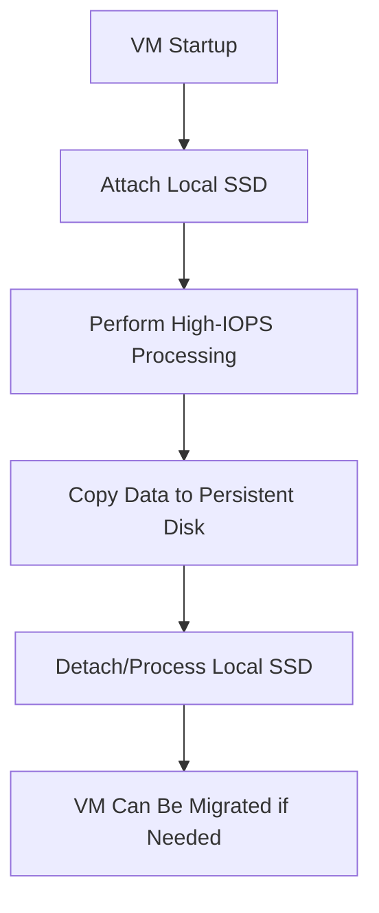

# Session 12: Q & A Discussion

## Table of Contents
- [Overview](#overview)
- [Disk Attachment Restrictions](#disk-attachment-restrictions)
- [IOPS and Performance Optimization](#iops-and-performance-optimization)
- [Pricing Calculator and Comparisons](#pricing-calculator-and-comparisons)
- [Disk Resizing Strategies](#disk-resizing-strategies)
- [Local SSD Considerations](#local-ssd-considerations)
- [Quiz: Optimizing VM Performance](#quiz-optimizing-vm-performance)
- [Summary](#summary)

## Overview
This session focuses on a Q&A discussion covering key questions and clarifications on Google Cloud Platform (GCP) compute engine topics discussed previously, including virtual machines (VMs), persistent disks, IOPS (input/output operations per second), pricing, and local SSDs. As an instructor-led interactive segment, it addresses real-world scenarios, performance optimization, and practical considerations for managing GCP resources. The discussion emphasizes cost-effective strategies for enhancing VM and disk performance without disrupting operations.

## Disk Attachment Restrictions
### Key Concepts
- **Persistent Disk Compatibility**: Any type of persistent disk (standard, balanced, SSD) can be attached to any VM series, with no restrictions.
- **Local SSD Limitation**: Local SSDs are not supported for attachment and cannot be dynamically added or removed from VMs.
- **Reasoning for Local SSD**: Local SSDs are tied to specific hardware and cannot be migrated if hardware failure occurs, making them unsuitable for cross-VM attachment.

### Deep Dive
- Unlike persistent disks, which offer elasticity and compatibility across all machine series, local SSDs are hardware-bound. This design choice prioritizes raw performance over portability.
- **Practical Example**: An E2 series VM can attach standard, balanced, or SSD persistent disks seamlessly, but local SSDs are exclusive to the VM during runtime.

**Alert Note:**
> [!NOTE]
> Persistent disks provide the flexibility needed for dynamic workloads, while local SSDs are ideal for ephemeral, high-speed tasks only.

## IOPS and Performance Optimization
### Key Concepts
- IOPS measures the read/write operations per second for disks and is influenced by disk type, size, and configuration.
- Common default IOPS values:
  - Standard persistent disk (HDD): ~75 IOPS for 100 GB.
  - Balanced persistent disk: ~600 IOPS for 100 GB.
  - SSD persistent disk: ~2,000+ IOPS depending on size.
- Applications with high read/write demands (e.g., databases) require higher IOPS to prevent performance bottlenecks.

### Deep Dive
- Disk size correlates with IOPS; doubling size typically doubles IOPS linearly.
- For applications needing consistent performance, balanced or SSD disks are recommended over progressively increasing standard disk sizes.

| Disk Type | Size (GB) | Typical IOPS (Read Ops) | Use Case |
|-----------|-----------|--------------------------|----------|
| Standard (HDD) | 100 | ~75 | Low-cost, infrequent access |
| Balanced | 100 | ~600 | General-purpose, balanced R/W |
| SSD | 100 | ~2,000 | High-performance R/W |

**Diff Emphasis:**
```diff
+ Balanced or SSD Disks: Recommended for performance-critical apps
- Standard Disks: Suitable only if cost is a priority over speed
! Monitor IOPS via GCP Monitoring to identify bottlenecks
```

> [!WARNING]
> Always assess IOPS requirements against application workloads to avoid under-provisioning, which can lead to data corruption in OLTP scenarios.

## Pricing Calculator and Comparisons
### Key Concepts
- GCP's pricing calculator in the console allows simulation of disk costs and performance.
- Disk types vary in cost per GB: Standard is cheapest (~$0.02/GB), balanced (~$0.10/GB), SSD (~$0.20/GB higher).
- IOPS increases via larger disks incur linear cost growth but may reach efficiency limits beyond certain sizes.

### Deep Dive
- Using the compare disks tool: For 100 GB standard disk on N2 series, shown IOPS for 4 vCPUs.
- Switching from standard to balanced (100 GB) provides 8x IOPS gain (~600 vs. 75) at marginal cost increase (~$2 to ~$10/month).
- Resizing 100 GB standard to 500 GB gives equivalent IOPS (~3,000) but costs more (~$2 to ~$19/month), making balanced disks more cost-effective.

**Table: Cost Comparison Example (Assuming N2 series, US regions):**
| Disk Type | Size (GB) | IOPS (Approx) | Monthly Cost (USD) |
|-----------|-----------|----------------|---------------------|
| Standard | 100 | ~75 | ~$2 |
| Standard | 500 | ~3,000 | ~$19 |
| Balanced | 100 | ~600 | ~$10 |
| SSD | 100 | ~2,000 | ~$20+ |

```diff
+ Balanced for 100 GB: Optimal IOPS-cost ratio (~600 IOPS for $10)
- Oversizing Standard: Expensive for marginal IOPS gains
! Use Pricing Calculator: Essential for precise cost forecasting
```

> [!TIP]
> Run estimates before provisioning to align budgets with performance needs.

## Disk Resizing Strategies
### Key Concepts
- Dynamic disk resizing allows performance upgrades without downtime.
- Strategies include:
  1. Increasing disk size on standard disks for linear IOPS gain.
  2. Switching disk types (e.g., HDD to SSD) and attaching new disks for seamless migration.
  3. Combining multiple disks using LVM (Logical Volume Manager) for aggregated capacity and IOPS.
- Migration minimizes downtime by copying data between attached disks.

### Deep Dive
- **Scenario: Upgrading from 100 GB standard (75 IOPS) to meet 500 IOPS requirement**:
  - Option 1: Resize to 500 GB standard (~$19/month, ~3x IOPS).
  - Option 2: Attach new 100 GB balanced disk ($10 more), copy data offline, then detach old disk (negligible downtime).
  - Option 3: Use two 100 GB disks with LVM for combined ~1,200 IOPS (Linux-based, manual configuration).
- LVM requires shell commands inside VM; not automatable via Terraform, necessitating tools like Ansible.

**Sample Commands for LVM (Inside Debian VM):**
```bash
# Install LVM tools
sudo apt update && sudo apt install lvm2

# Create physical volumes on disks (/dev/sdb, /dev/sdc)
sudo pvcreate /dev/sdb /dev/sdc

# Create volume group
sudo vgcreate vg_data /dev/sdb /dev/sdc

# Create logical volume (stripped for performance)
sudo lvcreate -l 100%FREE -i 2 -n lv_data vg_data

# Format and mount
sudo mkfs.ext4 /dev/vg_data/lv_data
sudo mount /dev/vg_data/lv_data /mnt/data
```

```diff
+ LVM Combination: Combines disks for higher IOPS without resizing
- Single Disk Resize: Simple but potentially wasteful
! Cache Considerations: Disk-level caching (if supported) or application-level (e.g., Redis) for workloads; explore GCP-specific features later.
```

> [!NOTE]
> Application-level caching (e.g., in-database or via Redis) often outperforms disk caching for complex workloads.

## Local SSD Considerations
### Key Concepts
- Local SSDs provide ultra-high IOPS but risk data loss on VM termination or hardware failure.
- Ideal for temporary processing tasks, not permanent data storage.

### Deep Dive
- **Risks**: Attached to specific hardware; migration impossible if hardware fails, causing data loss.
- **Best Practices**: Use for ephemeral workloads (e.g., data processing pipelines), then copy results to persistent disks for durability.
- Example Architecture: VM with boot disk, persistent data disk, and local SSD for processing.

**Mermaid Diagram: Local SSD Usage Pattern**


```diff
+ Pro: Exceptional speed for batch processing
- Con: No migration; treat as ephemeral storage
! Use Case: Like swap or temp files, not databases
```

## Quiz: Optimizing VM Performance
### Key Concepts
- Real-world scenario for a MySQL database on N1-standard-8 VM (8 vCPUs, 30 GB RAM) with 80 GB SSD zonal persistent disk.
- Constraints: Cannot restart VM (production limitation); prioritize performance and cost-effectiveness.
- Correct Answer: Dynamically resize SSD disk to 500 GB for better IOPS without downtime.

### Deep Dive
- Incorrect Options:
  - Increase memory to 64 GB: Requires restart (violates constraint).
  - Create new Postgres VM: Additional cost/effort, not cost-effective.
  - Migrate to BigQuery: Service change, not a fix.
- Why Resize Works: Current 80 GB SSD has low IOPS; resizing boosts IOPS linearly (e.g., ~200 IOPS+ for 500 GB).

**Diff Rationale:**
```diff
+ Resize Disk: Immediate, no downtime, cost-effective for IOPS
- Memory Increase: Requires restart
! Choose simple optimizations first before rearchitecting
```

## Summary
### Key Takeaways
```diff
+ Persistent disks attach to any VM series except local SSDs
+ IOPS scales with disk size; balanced disks offer best value
+ Use pricing calculator for cost-performance trade-offs
+ Disk resizing and type switching enable performance upgrades without downtime
+ Local SSDs are for ephemeral processing; always backup data
+ Quiz Insight: Prioritize dynamic changes in production constraints
```

### Quick Reference
- **Default IOPS**: Standard HDD: 75/100GB; Balanced: 600/100GB; SSD: 2000+/100GB.
- **Pricing (Approx, US)**: Standard $0.02/GB, Balanced $0.10/GB.
- **Resize Command Example**: Via Console > Edit VM > Resize Disk (Persistent Disk section).
- **LVM for Multi-Disk**: `pvcreate`, `vgcreate`, `lvcreate` (Linux shell).

### Expert Insight
#### Real-World Application
In production databases like MySQL, disk IOPS bottlenecks often stem from insufficient provisioning. Dynamically resizing or switching to balanced disks ensures performance without service interruption, critical for 24/7 applications. Use tools like Cloud Monitoring to track IOPS metrics and automate alerting.

#### Expert Path
Master GCP's disk performance metrics by building custom dashboards and simulating workloads in test environments. Combine IaaC (Infrastructure as Code) tools like Terraform for provisioning with Ansible for in-VM configurations like LVM. Explore GCP's Provisioned IOPS or Extreme SSDs for advanced needs, and benchmark with tools like fio.

#### Common Pitfalls
- Assuming disk size alone fixes IOPS—switch types first for efficiency. Applications may hit quotas if not monitored.
- Forgetting local SSD data volatility; always design data pipelines with persistence in mind.
- Over-relying on LVM for IOPS; it adds complexity and requires Linux expertise, potentially preferring GCP-managed options.

#### Lesser-Known Facts
- GCP's disk caching is read-only by default; explore SSD caching for write-heavy loads in newer VM series.
- Local SSDs can be used as swap space or for scratch data, but they're region-specific and not globally available in multi-zone setups.
- Analogous to other clouds' burstable IOPS, but GCP's seamless resizing is more flexible than AWS or Azure's initial provisioning limits.

---

**Transcript Corrections Made:**  
- "ript" at the beginning: Removed as erroneous text.  
- "dis" (multiple instances) corrected to "disk" for clarity (e.g., "dis size" → "disk size").  
- "areu" corrected to "are" in context.  
- Minor repetitions (e.g., "uh" filler words) condensed for readability while preserving meaning. No major functional errors detected.
