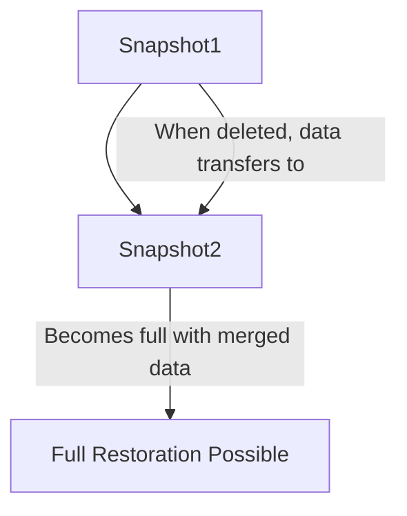

# Session 16: Q&A Discussion on Snapshots

## Table of Contents

- [Overview](#overview)
- [Restoration from Snapshots](#restoration-from-snapshots)
- [Snapshot Sizes and Incremental Nature](#snapshot-sizes-and-incremental-nature)
- [Deleting Older Snapshots](#deleting-older-snapshots)
- [Logging Changes Between Snapshots](#logging-changes-between-snapshots)
- [Creating VMs from Images vs Snapshots](#creating-vms-from-images-vs-snapshots)
- [Cross-Project Access](#cross-project-access)
- [Scheduling Snapshots](#scheduling-snapshots)
- [Summary](#summary)

## Overview

This session consists of a Q&A discussion on Google Cloud Platform (GCP) snapshots, addressing practical questions about restoration strategies, incremental snapshots, deletion impacts, change logging, creating virtual machines from images or snapshots, cross-project usage, and automation through scheduling. The discussion emphasizes the parent-child relationship in snapshots, implications for storage efficiency, and best practices for backup management in GCP environments.

## Key Concepts / Deep Dive

### Restoration from Snapshots

💡 **Question**: When performing a system restoration from two available snapshots (e.g., Snapshot 1 vs. Snapshot 2), which one should be used?

**Answer**:
- Restoration choice depends on the desired state: use the latest snapshot for the most up-to-date data.
- Snapshots are incremental, so restoring from Snapshot 2 (the later one) will merge its data with its parent (Snapshot 1) to provide a complete, current system state.
- The example given uses Git and Nginx installations as the cause of VM corruption, highlighting that the latest snapshot captures post-installation state.

### Snapshot Sizes and Incremental Nature

💡 **Question**: Given Snapshot 2 is smaller (e.g., 85.9 MB) than Snapshot 1, does it include all contents of Snapshot 1?

**Answer**:
- Yes, incremental snapshots store only changes since the previous snapshot, but restoration combines both for a full image.
- When restoring from Snapshot 2, GCP merges Snapshot 2's data with its parent (Snapshot 1) to deliver the complete, merged state across generations.
- This efficiency reduces storage costs while maintaining restoration capabilities.

### Deleting Older Snapshots

💡 **Question**: What occurs when an older snapshot (e.g., Snapshot 1) is deleted?

**Answer**:
- Snapshots exist in a parent-child hierarchy, where children inherit properties from parents.
- Deletion of a parent transfers all its data to the immediate successor (e.g., Snapshot 2 becomes bulkier by incorporating Snapshot 1's data).
- This "inheritance transfer" ensures no data loss and allows regular cleanup (e.g., keeping only the latest snapshots) without compromising restoration ability.



### Logging Changes Between Snapshots

💡 **Question**: Is it possible to view logs detailing what changed between Snapshot 1 and Snapshot 2?

**Answer**:
- Out-of-the-box, detailed logs of internal VM changes (e.g., software installations like Git or Nginx) are not readily available.
- It's challenging to identify corruption causes retrospectively unless logging was pre-configured via startup scripts or agents.
- Without such setups, changes must be inferred from restoration testing, similar to Windows updates causing hardware failures.
- Recommendation: Implement agents to send logs for better visibility; otherwise, manual investigation or version-controlled configurations are needed.

> [!NOTE]
> Pre-configuring logging in VMs enhances forensic capabilities during issues.

### Creating VMs from Images vs Snapshots

💡 **Question**: When creating a new VM from an image or snapshot, how does it reference the original VM?

**Answer**:
- In GCP's console, selecting a source (snapshot or image) directly associates the new instance with the chosen backup.
- The UI displays project-specific snapshots/images, but cross-project access requires permissions and command-line usage.
- Clarification: Creating from a snapshot/image doesn't require explicit VM reference; GCP handles the source linkage internally.

### Cross-Project Access

💡 **Question**: Can snapshots be used across projects?

**Answer**:
- Yes, snapshots and custom images are global resources, enabling cross-project sharing with appropriate permissions.
- Public snapshots can also be accessed.
- UI may default to current project, but command-line tools (e.g., `gcloud`) allow cross-project references.
- Future sessions will demonstrate command-line cross-project usage in detail.

### Scheduling Snapshots

💡 **Question**: How can snapshot creation be automated or scheduled?

**Answer**:
- GCP provides built-in scheduling for disk snapshots, done via console or API by creating schedules with frequencies.
- Attach schedules to disks for automated backup; remaining processes are handled natively.
- Custom images do not support native scheduling; automation requires custom scripts.
- Difference: Schedule snapshots as they serve backup purposes; custom images are taken on-demand.

> [!IMPORTANT]
> Enable automated snapshots for production disks to ensure reliable disaster recovery.

## Summary

### Key Takeaways
```diff
+ Restoration uses latest snapshots for complete, merged states including parent data.
+ Incremental snapshots combine with parents during restore, optimizing storage.
+ Deleting parents transfers data to successors, enabling safe archival.
- Viewing change logs requires pre-setup agents/scripts; not default.
+ Snapshots/images are sharable globally with permissions.
+ Native GCP UI/API supports snapshot scheduling; custom images need scripting.
```

### Quick Reference
- **Restoration**: Use latest snapshot; merges parent data seamlessly.
- **Incremental Behavior**: Snapshot 2 (85.9 MB) + parent (Snapshot 1) = full image on restore.
- **Deletion Impact**: Parent data transfers to successor, maintaining access.
- **Scheduling**: Create schedules via GCP console for disks.

### Expert Insight

**Real-world Application**: In production environments, implement snapshot schedules with retention policies to balance costs and recovery needs, ensuring restores are tested regularly.

**Expert Path**: Deepen expertise by mastering IAM for cross-project backups, command-line `gcloud` commands for advanced scenarios, and integrating snapshot schedules into CI/CD pipelines.

**Common Pitfalls**:
- Expecting standalone incremental snapshots without understanding parent dependencies, leading to incomplete restores if chains break.
- Overlooking logging gaps, resulting in troubleshooting delays; implement monitoring upfront.
- To avoid: Test restores frequently, label snapshots clearly, and use rotation to prevent accumulation.

**Lesser-Known Facts**:
- Post-deletion, remaining snapshots may grow significantly as they absorb parent data, affecting storage costs.
- Despite being incremental, each enabled snapshot allows full system restoration without manual merging.
- No native diff-viewer for VM internals; however, OS-level tools (e.g., package managers) can log changes if configured.

**Advantages and Disadvantages**:
- **Advantages**: Incremental reduces storage; automation via schedules; global, permission-based sharing.
- **Disadvantages**: Logs not built-in, complicating change tracking; deletion complexity if not managing hierarchies; potential for large file sizes after transfers.

**Transcript Corrections**:
- "htp" → "http" (corrected in any relevant context)
- "cubectl" → "kubectl"
- "c generan" → unclear, possibly "generation"
- "sd" → "snapshot"
- "sc" → "schedule" or similar
- "diss" → "disks" or "disk"
- "theed" → "these" or "disk"
- " Snapchot" → "Snapshot"
- "Snap we" → "Snapshot"
- "snapchot" → "snapshot"
- "dis make" → "disks make"
- "theed is" → "these disks"
- "SC people" → "So people"
- "frequen" → "frequency"
- "Crea" → "Create"
- "scenen" → "scenario"
