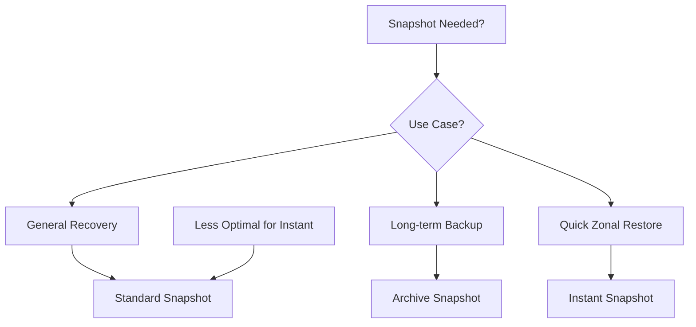
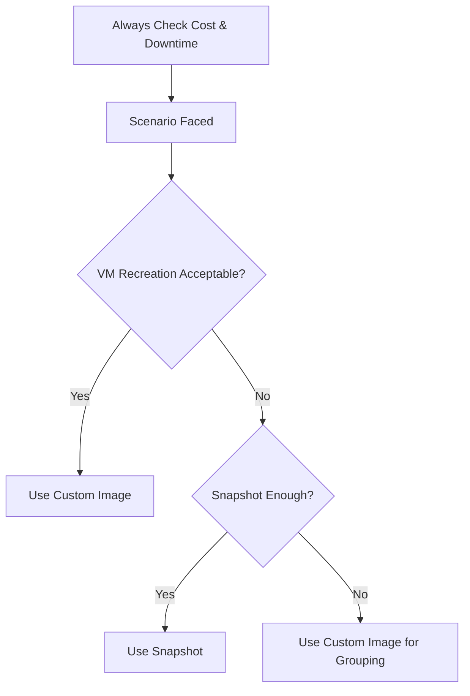

# Session 17: Restore Data Disk, Snapshot, Custom Image via Cross Project, Archive & Instant Snapshot

- [Overview](#overview)
- [Key Concepts / Deep Dive](#key-concepts--deep-dive)
  - [Snapshot vs Custom Image Comparison](#snapshot-vs-custom-image-comparison)
  - [Restoring Non-Boot Disks](#restoring-non-boot-disks)
  - [Cross-Project Usage](#cross-project-usage)
  - [Snapshot Types: Standard, Archive, and Instant](#snapshot-types-standard-archive-and-instant)
  - [Cost Comparison and Selection](#cost-comparison-and-selection)
  - [Real-World Use Cases and Scenarios](#real-world-use-cases-and-scenarios)
  - [Import and Migration Examples](#import-and-migration-examples)
- [Summary](#summary)

## Overview

Session 17 explores advanced snapshot and custom image management in Google Cloud Platform (GCP) Compute Engine. Building on previous sessions, it demonstrates practical restoration techniques for data disks, contrasts snapshots and custom images, and introduces cross-project sharing. The session covers different snapshot types (standard, archive, instant), cost considerations, and realistic scenarios for choosing the right tool. Key demonstrations include restoring disks from snapshots for performance upgrades (e.g., magnetic to SSD) and sharing resources across projects with minimal permissions. Emphasis is on global resources, least-privilege access, and avoiding downtime where possible.

## Key Concepts / Deep Dive

### Snapshot vs Custom Image Comparison

Snapshots and custom images are both backbone tools for VM management, but they serve different primary use cases:

- **Snapshots**: Designed for **restoration and recovery**. They capture the state of persistent disks at a point in time, enabling quick rollback without recreating VMs. Primary for data disks or full VM recovery when downtime is unavoidable (e.g., boot disk corruption).
- **Custom Images**: Aimed at creating **new VMs**. They encapsulate the entire VM (OS, software, configurations) into a reusable template. Ideal for scaling, cloning VMs for new deployments, or in managed instance groups.

Comparison highlights differences in features and best use cases:

| Aspect | Snapshot | Custom Image |
|--------|----------|--------------|
| Primary Use Case | Restoration/Recovery | VM Deployment |
| Disk Types Supported | Boot and data disks | Primarily boot disks (can include data disks) |
| Downtime Required | Yes for boot disks; no for data disks | No (when used for VM creation) |
| Resource Scope | Can be zonal or regional | Reinforced/multi-regional |
| Global Resource | Yes (sharable across projects) | Yes (sharable across projects) |
| Storage Cost | Incremental (compressed) | Base image size |
| Scheduling | Possible with automation | Manual creation |
| Encryption | Inherits from source disk | Inherits from source VM |

> [!NOTE]
> Both are global resources, not project-bound, allowing cross-project sharing with appropriate roles.

### Restoring Non-Boot Disks

For data disks (non-boot), snapshots enable restoration without shutting down the VM, avoiding downtime. This is crucial for production environments where continuity is essential.

#### Use Case: Data Disk Performance Upgrade (Magnetic to SSD)

In scenarios with degraded performance (e.g., high IOPS needs), migrate data from a magnetic disk to SSD using snapshots instead of direct copying to minimize impact.

1. Create a VM with both boot and data disks (e.g., use N2 series, standard persistent disk for boot, magnetic for data).
   ```bash
   gcloud compute instances create vm1 \
     --machine-type=n2-standard-2 \
     --boot-disk-size=20GB \
     --boot-disk-type=pd-balanced \
     --zone=us-central1-a \
     --create-disk=name=hdd,size=17GB,type=pd-standard \
     --project=your-project
   ```

2. Format and mount the data disk (assuming SD B as device):
   ```bash
   sudo mkfs.ext4 /dev/sdb
   sudo mkdir /mnt/data-hdd
   sudo mount /dev/sdb /mnt/data-hdd
   sudo chmod 777 /mnt/data-hdd
   df -h  # Verify mount
   ```

3. Install software and populate data (e.g., Git and Tree):
   ```bash
   sudo apt update && sudo apt install -y git tree
   export PATH=$PATH:/mnt/data-hdd/usr/bin  # Add to PATH for access
   # Clone repositories or add data to change disk state
   git clone https://github.com/apache/beam /mnt/data-hdd/apache-beam
   ```

4. Take an initial snapshot of the data disk:
   ```bash
   gcloud compute disks snapshot hdd --snapshot-names=snapshot-1 --zone=us-central1-a
   ```

5. Simulate corruption by cloning more data to change state, then take a second snapshot.

6. Restore to an SSD disk for performance upgrade:
   - Attach a new SSD disk created from the first snapshot (downtime-free for data disk):
     ```bash
     gcloud compute disks create disk-ssd \
       --source-snapshot=snapshot-1 \
       --type=pd-ssd \
       --size=17GB \
       --zone=us-central1-a
     gcloud compute instances attach-disk vm1 --disk=disk-ssd --device-name=disk-ssd
     ```
   - In VM, format and mount the new SSD (assuming SD C):
     ```bash
     sudo mkfs.ext4 /dev/sdc
     sudo mkdir /mnt/data-ssd
     sudo mount /dev/sdc /mnt/data-ssd
     sudo chmod 777 /mnt/data-ssd
     ```
   - Copy data from old disk (if needed, but snapshot restoration avoids this step) or directly use via mount.
   - Verify SSD performance: `cat /sys/block/sdc/queue/rotational` (should be 0).

> [!IMPORTANT]
> Direct copying impacts performance; snapshots minimize load on degraded disks.

Detaching old disks:
```bash
gcloud compute instances detach-disk vm1 --disk=hdd
gcloud compute disks delete hdd --zone=us-central1-a
```

### Cross-Project Usage

Snapshots and images are global, enabling sharing across projects/zones/regions with minimal permissions. Use cases include debugging in dev environments or sharing golden images.

#### Sharing Custom Images

1. Create a custom image from a VM (shut down VM first):
   ```bash
   gcloud compute images create golden-image --source-disk=boot-disk --source-disk-zone=us-central1-a
   ```

2. Grant access at the image level (least privilege):
   - Go to IAM or use GCP console.
   - Add role: `compute.images.user` to user/service account (e.g., dev account).
   
3. Use in another project:
   ```bash
   gcloud compute instances create dev-vm \
     --machine-type=n2-standard-2 \
     --image-project=production-project \
     --image=golden-image \
     --zone=europe-west2-a \
     --no-external-ip \
     --project=dev-project
   ```
   - Data egress costs apply across regions.

#### Sharing Snapshots

Snapshots require a custom role for read access:

1. Create custom IAM role with permission: `compute.snapshots.useReadOnly`.

2. Grant role to disk level.

3. Create disk in target project:
   ```bash
   gcloud compute disks create cross-disk \
     --source-snapshot-project=production-project \
     --source-snapshot=snapshot-name \
     --zone=europe-west2-a \
     --project=dev-project
   ```

4. Attach to VM and mount as data disk.

> [!WARNING]
> Ensure source and target zones are compatible; global access reduces errors from UI-only assumptions.

### Snapshot Types: Standard, Archive, and Instant

GCP offers three snapshot types with varying costs and features:

| Type | Use Case | Cost | Features | Billing |
|------|----------|------|----------|---------|
| **Standard** | General backup/recovery | ~$0.065/GB/month (incremental) | Full features, scheduling, multi-regional | Hourly minimum |
| **Archive** | Long-term, rarely accessed | ~$0.027/GB/month | Same as standard, but for data retained >90 days | 90-day minimum, data access fees |
| **Instant** | Quick recovery from user errors/app issues | Higher than standard | Zonal, disks-on-demand, simpler | Tied to disk lifecycle |

- **Archive**: Cost-effective for compliance/backups. Not schedulable; manual only.
- **Instant**: On-disk backups; deleted with disk. No scheduling/cross-project sharing easily.
- **Standard**: Versatile, most used.

Mermaid diagram for snapshot selection:



### Cost Comparison and Selection

Pricing example (US multi-regional):
- Standard: $0.065/GB/month + $0.02/GB for data access.
- Archive: $0.027/GB/month + access fees; 90-day lock-in.
- Instant: Slightly higher than standard.

Choose based on retention: Archive for >90 days, standard otherwise.

> [!TIP]
> Always check pricing documentation for updates; access costs add up for archive.

### Real-World Use Cases and Scenarios

| Scenario | Solution | Advantage |
|----------|----------|-----------|
| Boot disk corruption | Snapshot + VM shutdown | Full recovery |
| Data disk restore (no downtime) | Snapshot to new disk | Minimal impact |
| Machine type change (F1 to G1) | Stop VM, change config, restart | Simple, avoids recreation |
| Zone change (e.g., Singapore A to B) | Shut down, edit VM (zone change), restart | Avoids recreation (but data may egress) |
| Cross-project debugging | Share image/snapshot with dev | Least privileged access |
| Performance upgrades (magnetic to SSD) | Snapshot restore to SSD | Error-trial without full copy |

Scenario Decision Flow:



### Import and Migration Examples

For AWS-to-GCP migrations:
- Use `gcloud compute images import` from AWS AMI (tar.gz format).
- Limitations: Custom encryption may fail; access costs for transfers.

1. Export AWS AMI to S3, download to GCS.
2. Import:
   ```bash
   gcloud compute images import image-name --source-file=gs://bucket/ami.tar.gz --project=target-project
   ```

Real use case: Time-sensitive projects (e.g., Olympics AI translation) required zonal specificity due to resource availability.

## Summary

### Key Takeaways
```diff
+ Snapshots enable downtime-free data disk restoration with no VM shutdown.
- Custom images require experimentation to choose optimal disk types (e.g., magnetic to SSD).
! Cross-project sharing uses global resources with minimal roles (e.g., compute.images.user).
+ Archive snapshots suit long-term, low-access needs; standard for flexible recovery.
- Instant snapshots are zonal and deleted with disk deletion.
+ Stop/Start VMs suffices for machine type changes; recreation not required.
! UI may mislead—command lines reveal global capabilities.
```

### Quick Reference
- **Restore data disk from snapshot (no downtime)**: `gcloud compute disks create --source-snapshot=...`
- **Create custom image**: `gcloud compute images create --source-disk=...` (VM offline)
- **Cross-project image usage**: Add `--image-project=source-project --image=image-name`
- **Snapshot types comparison**: Standard (flexible), Archive (cheap long-term), Instant (local quick-restore)
- **Mount disk in VM**: `mount /dev/sdb /mnt/path; chmod 777 /mnt/path`
- **Cost avoidance**: Use archive for >90 days; standard otherwise

### Expert Insight
#### Real-world Application
In production, use snapshots for nightly data backups and custom images for auto-scaling in managed instance groups. Cross-project sharing aids dev-prod isolation, enabling safe debugging without production access—common in compliance-heavy industries like finance.

#### Expert Path
Master advanced automation with Cloud Scheduler for snapshots. Explore Terraform for IaC-based image/snapshot management. Certifications emphasize these for architect roles—practice with multi-region setups and cost monitoring via Billing APIs.

#### Common Pitfalls
- Assuming snapshots/images are project-restricted (they're global; UI confuses).
- Overusing standard snapshots vs. archive, leading to costs.
- Failing to verify disk types post-restoration (check rotational status).
- Ignoring egress costs in cross-region cross-project operations.
- Not testing snapshot restores regularly, risking corruption.

Avoid by: Always simulate restores; use project labels for global resources; monitor costs via BigQuery exports.

#### Lesser-Known Facts
- Snapshots support incremental compression down to ~50%, saving storage.
- Instant snapshots are "time-travel" for disks, useful for app-level errors.
- GCP's global nature allows snapshots/images in one region to create resources elsewhere seamlessly.
- Kubernetes Persistent Volumes use similar concepts, with snapshots enabling volume cloning.

🤖 Generated with [Claude Code](https://claude.com/claude-code)

Co-Authored-By: Claude <noreply@anthropic.com>
