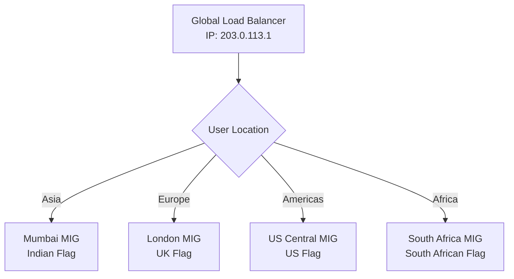

# Session 18: Custom Script for VM Movement, GMI Instance Group Basics

## Table of Contents
- [Overview](#overview)
- [Key Concepts / Deep Dive](#key-concepts--deep-dive)
  - [1. Introduction to Regional Managed Instance Groups](#1-introduction-to-regional-managed-instance-groups)
  - [2. Setting Up the Development Environment](#2-setting-up-the-development-environment)
  - [3. Understanding the Flag Application](#3-understanding-the-flag-application)
  - [4. Manual Deployment to Test VMs](#4-manual-deployment-to-test-vms)
  - [5. Service Account Configuration and Access Management](#5-service-account-configuration-and-access-management)
  - [6. Code Updates and Development Workflow](#6-code-updates-and-development-workflow)
  - [7. Creating Golden Custom Images](#7-creating-golden-custom-images)
  - [8. Instance Template Creation](#8-instance-template-creation)
  - [9. Managed Instance Group Setup](#9-managed-instance-group-setup)
  - [10. Auto Scaling Configuration](#10-auto-scaling-configuration)
  - [11. Health Checks and Auto Healing](#11-health-checks-and-auto-healing)
  - [12. Load Balancer Creation](#12-load-balancer-creation)
  - [13. Testing and Geographic Load Balancing](#13-testing-and-geographic-load-balancing)
- [Lab Demos](#lab-demos)
- [Summary](#summary)
  - [Key Takeaways](#key-takeaways)
  - [Quick Reference](#quick-reference)
  - [Expert Insight](#expert-insight)

## Overview

This session demonstrates the implementation of regional managed instance groups (MIGs) in Google Cloud Platform, focusing on a practical approach to building resilient, autoscaling web applications. We'll work through the complete development lifecycle from code deployment to production-ready infrastructure, using a Go-based geographic flag application that serves different content based on user location.

The session emphasizes real-world practices including custom image creation, service account management, auto scaling, and geographic load balancing. We'll learn how to deploy stateless applications that automatically scale based on HTTP traffic and maintain high availability across multiple zones.

## Key Concepts / Deep Dive

### 1. Introduction to Regional Managed Instance Groups

Regional MIGs provide cross-zone high availability within a single region. Unlike zonal MIGs that operate in a single zone, regional MIGs distribute instances across multiple zones, ensuring continuity during zone-level outages.

#### Key Benefits:
- **High Availability**: Resources run in multiple zones simultaneously
- **Automatic Failover**: Traffic automatically redistributed during zone failures
- **Resilient Architecture**: Survives significant regional disruptions
- **Latency Optimization**: Serves requests with lowest possible latency

#### Use Case Example:
The session demonstrates serving content to users regardless of geographic location, optimizing for low-latency delivery. For location-specific content (like GDPR-restricted services), a regional approach with GeoDNS routing would be more appropriate than simple regional redundancy.

### 2. Setting Up the Development Environment

We'll use Cloud Shell as our development environment due to its pre-installed tools and integration with GCP:

```bash
# Cloud Shell provides:
- Pre-installed Go language
- GSUtil for GCS operations
- Access to all GCP APIs
- Built-in authentication
```

### 3. Understanding the Flag Application

The demonstration uses a legacy Go application that:
- Runs as compiled binary (no runtime dependencies)
- Queries GCP metadata to determine instance zone
- Displays region-specific flag based on geographic location
- Listens on port 8081
- Provides both web interface and textual output

#### Application Architecture:
```go
// Basic flow:
Get Zone Info ← Query Metadata API
Extract Region ← Parse zone metadata
Determine Flag ← Map region to flag image
Serve Content ← Display flag on web page
```

### 4. Manual Deployment to Test VMs

Initial testing involves manual deployment across multiple regions:

#### VM Configuration:
- OS: Debian (default)
- Network: Default VPC
- External IP: Enabled for testing
- Firewall: Open port 8081 globally

#### Deployment Steps:
1. Create VMs in Mumbai, London, South Africa regions
2. Copy application binary using GCS
3. Configure executable permissions
4. Test geographic routing

### 5. Service Account Configuration and Access Management

Service accounts provide secure, automated access between GCP services:

#### Service Account Setup:
```bash
# Create service account
gcloud iam service-accounts create sa-mig-gcs-to-gce \
    --description="Service account for MIG GCS to GCE operations"

# Grant storage bucket access at bucket level (not project level)
gsutil iam ch -r OBJECT_VIEWER \
    serviceAccount:sa-mig-gcs-to-gce@PROJECT_ID.iam.gserviceaccount.com \
    gs://zone-printer-mig
```

#### Access Design Principles:
- **Minimal Permissions**: Grant only necessary access
- **Bucket-Level Grants**: Avoid project-wide access
- **Identity Propagation**: Same service account works across regions

### 6. Code Updates and Development Workflow

The session demonstrates agile development practices:

#### Development Process:
1. **Code Changes**: Update application for new regions
2. **Compilation**: Build optimized binary
3. **Upload**: Store artifact in GCS bucket
4. **Update Mechanism**: Use startup scripts or VM reset for updates

#### Distribution Methods:
- **SCP for Development**: Direct file transfer between Cloud Shell and VMs
- **GCS for Production**: Bucket-based artifact distribution

```bash
# Development deployment
gcloud compute scp main user@vm-instance:/opt/zone-printer/

# Production distribution via GCS
gsutil cp gs://bucket/main /opt/zone-printer/
```

### 7. Creating Golden Custom Images

Golden images capture fully-configured VM state:

#### Image Creation Process:
1. **Configure Source VM**: Install application, dependencies, configurations
2. **Terminate VM**: Preparation for imaging
3. **Create Image**: Capture VM disk state
4. **Regional Strategy**: Optimize placement for performance

#### Best Practices:
- **Minimize Image Size**: Include only necessary components
- **Service Accounts**: Baked into image
- **Startup Scripts**: Optimized for quick boot
- **Dependencies**: Pre-installed and configured

### 8. Instance Template Creation

Instance templates define VM specifications for bulk operations:

#### Template Components:
- **Machine Type**: Resource allocation (CPU, memory)
- **Disk Configuration**: Boot disk, additional disks
- **Network Settings**: Internal IPs, service accounts
- **Startup Scripts**: Post-boot automation

#### Template Advantages:
- **Consistency**: Identical VM configurations
- **Rapid Deployment**: Quick instance provisioning
- **Update Management**: Template versioning support

```yaml
# Instance template structure
machineType: n2-standard-2
disks:
  - boot: true
    sourceImage: projects/PROJECT_ID/global/images/golden-image-v1
serviceAccounts:
  - email: sa-mig-gcs-to-gce@PROJECT_ID.iam.gserviceaccount.com
    scopes: [https://www.googleapis.com/auth/cloud-platform]
metadata:
  startup-script: |
    #!/bin/bash
    mkdir -p /opt/zone-printer
    /opt/zone-printer/main &
```

### 9. Managed Instance Group Setup

MIGs provide automation layer over instance templates:

#### MIG Configuration:
- **Regional Distribution**: Multi-zone deployment
- **Auto Scaling**: Dynamic instance management
- **Auto Healing**: Fault detection and recovery
- **Load Balancing**: Integration with LBs

#### Distribution Modes:
| Mode | Description | Use Case |
|------|-------------|----------|
| **Balanced** | Even distribution with zone optimization | General workloads |
| **Any** | No specific distribution guarantees | Testing/development |

### 10. Auto Scaling Configuration

Auto scaling automatically adjusts instance count based on metrics:

#### Scaling Parameters:
- **Minimum Instances**: Base capacity (avoid 0 for availability)
- **Maximum Instances**: Resource limits
- **Scaling Signals**: Metrics triggering scale decisions

#### HTTP-Based Auto Scaling:
```yaml
autoscaling:
  mode: on  # Add/remove instances
  minInstances: 1
  maxInstances: 4
  cpu: 70  # Scale when CPU > 70%
```

#### Scaling Modes Comparison:
| Mode | Behavior | Use Case |
|------|----------|----------|
| **On** | Add on load, remove on low usage | Production applications |
| **Off** | Fixed instance count | Testing, development |
| **Only Up** | Add instances, never remove | Load testing, analytics |

### 11. Health Checks and Auto Healing

Health checks ensure only healthy instances receive traffic:

#### Health Check Configuration:
```yaml
healthChecks:
  - httpHealthCheck:
      port: 8081
      requestPath: /
      interval: 10s
      timeout: 5s
      healthyThreshold: 2
      unhealthyThreshold: 3
      initialDelay: 300s  # Allow startup time
```

#### Auto Healing Process:
1. **Regular Checks**: Probe instance health
2. **Failure Detection**: Mark unhealthy instances
3. **Automatic Recovery**: Recreate failed instances
4. **Traffic Redistribution**: Route away from unhealthy instances

### 12. Load Balancer Creation

Load balancers distribute traffic across MIG backends:

#### Global Load Balancer Benefits:
- **Global IP**: Single entry point
- **Geographic Routing**: Direct to nearest region
- **Auto Scaling Integration**: Seamless capacity adjustment

#### Backend Service Configuration:
```yaml
backendServices:
  - name: backend-service
    backends:
      - group: regions/us-central1/instanceGroups/us-mig
        balancingMode: UTILIZATION
        maxUtilization: 80
```

### 13. Testing and Geographic Load Balancing

End-to-end validation ensures proper geographic distribution:

#### Testing Strategy:
1. **Regional Verification**: Confirm correct flags per region
2. **Load Generation**: Simulate traffic patterns
3. **Scale Testing**: Validate auto scaling behavior
4. **Failure Scenarios**: Test zone outage resilience

#### Geographic Routing Example:


## Lab Demos

### Demo 1: Manual VM Deployment and Testing

```bash
# Create test VMs in different regions
gcloud compute instances create india-vm \
    --zone=asia-south1-a \
    --service-account=sa-mig-gcs-to-gce@PROJECT_ID.iam.gserviceaccount.com

# Copy application binary
gsutil cp gs://zone-printer-mig/main /tmp/
gcloud compute scp /tmp/main india-vm:/opt/zone-printer/

# Make executable and run
gcloud compute ssh india-vm --zone=asia-south1-a -- \
    'sudo chmod +x /opt/zone-printer/main && /opt/zone-printer/main'
```

### Demo 2: Golden Image Creation

```bash
# Terminate configured VM (retains disk)
gcloud compute instances delete uk-machine --zone=europe-west2-a --keep-disks=boot

# Create custom image from disk
gcloud compute images create golden-image-v1 \
    --source-disk=uk-machine \
    --source-disk-zone=europe-west2-a \
    --storage-location=us-central1
```

### Demo 3: Instance Template Creation

```bash
gcloud compute instance-templates create template-01 \
    --machine-type=n2-standard-2 \
    --image=projects/PROJECT_ID/global/images/golden-image-v1 \
    --service-account=sa-demo@PROJECT_ID.iam.gserviceaccount.com \
    --scopes=https://www.googleapis.com/auth/cloud-platform \
    --metadata=startup-script='#!/bin/bash
mkdir -p /opt/zone-printer
/opt/zone-printer/main &'
```

### Demo 4: MIG with Auto Scaling

```bash
gcloud compute instance-groups managed create mig-mumbai \
    --template=template-01 \
    --size=0 \
    --region=asia-south1

# Set autoscaling
gcloud compute instance-groups managed set-autoscaling mig-mumbai \
    --region=asia-south1 \
    --min-num-replicas=1 \
    --max-num-replicas=4 \
    --target-load-balancing-utilization=0.8
```

### Demo 5: Load Testing and Auto Scaling

```bash
# Install Siege load testing tool
sudo apt-get update && sudo apt-get install siege

# Generate load to trigger scaling
siege -c 100 -t 300s http://LOAD_BALANCER_IP/

# Monitor scaling events
gcloud compute instance-groups managed list-instances mig-mumbai --region=asia-south1
```

## Summary

### Key Takeaways
```diff
+ Regional MIGs ensure cross-zone high availability and automatic failover
+ Custom golden images enable rapid, consistent deployments
+ Auto scaling based on HTTP metrics provides cost-effective capacity management
+ Health checks and load balancers maintain service reliability
+ Geographic routing optimizes latency for global applications
```

### Quick Reference

#### Important Commands:
```bash
# Create service account
gcloud iam service-accounts create sa-mig-gcs-to-gce

# Create custom image
gcloud compute images create golden-image-v1 --source-disk=disk-name

# Create instance template
gcloud compute instance-templates create template-01 --image=golden-image-v1

# Create regional MIG
gcloud compute instance-groups managed create mig-name --template=template-01 --region=region

# Set autoscaling
gcloud compute instance-groups managed set-autoscaling mig-name --max-num-replicas=4
```

#### Firewall Rules:
```bash
gcloud compute firewall-rules create allow-8081 \
    --allow=tcp:8081 \
    --source-ranges=0.0.0.0/0
```

#### Health Check Configuration:
```bash
gcloud compute health-checks create http hc-mig \
    --port=8081 \
    --request-path=/ \
    --check-interval=10 \
    --timeout=5 \
    --unhealthy-threshold=3 \
    --healthy-threshold=2
```

### Expert Insight

#### Real-world Application
> [!IMPORTANT]
> **Global Content Delivery**: Use regional MIGs with geographic load balancing for content that must be delivered with minimal latency worldwide, such as media streaming, gaming platforms, or e-commerce sites with global user bases.

> [!NOTE]
> **Cost Optimization**: Auto scaling prevents over-provisioning while maintaining SLA compliance. Monitor scaling patterns to identify optimal maximum instance limits.

#### Expert Path
> [!IMPORTANT]
> **Multi-Regional Strategy**: Design applications with regional independence - each region should be self-sufficient for critical functionality while geographic routing handles optimization.

> [!TIP]
> **Monitoring Excellence**: Implement comprehensive monitoring beyond basic health checks. Track application-level metrics, client-side latency, and regional performance patterns.

#### Lesser-Known Facts
- **Template Updates**: Instance templates cannot be modified directly; create new versions and update MIGs incrementally
- **Image Caching**: GCS caches custom images across regions, improving deployment speed for subsequent instances
- **Service Account Scoping**: Use dedicated service accounts per application component rather than broad permissions

#### Common Pitfalls
> [!WARNING]
> **Quota Management**: Always calculate and request quotas before deployment. Auto scaling failures often result from hitting compute or IP quotas unexpectedly.

> [!DANGER]
> **External IPs**: Avoid external IPs on production MIG instances. Use load balancers for ingress and maintain internal-only architectures.

> [!CAUTION]
> **Startup Script Timing**: Health checks begin after initial delay expires. Ensure applications fully initialize before this period ends to avoid unnecessary recreations.

#### Advantages and Disadvantages

| Aspect | Advantages | Disadvantages |
|--------|------------|---------------|
| **Regional MIGs** | Cross-zone HA, simplified management | Regional disaster impact |
| **Auto Scaling** | Cost optimization, automatic capacity | Scaling lag time, configuration complexity |
| **Custom Images** | Fast deployments, consistency | Storage costs, update management |
| **Geographic LB** | Low latency routing, global reach | Configuration complexity |
| **Health Checks** | Proactive failure handling | False positive failures, testing complexity |

---

🤖 Generated with [Claude Code](https://claude.com/claude-code)

Co-Authored-By: Claude &lt;noreply@anthropic.com&gt;
