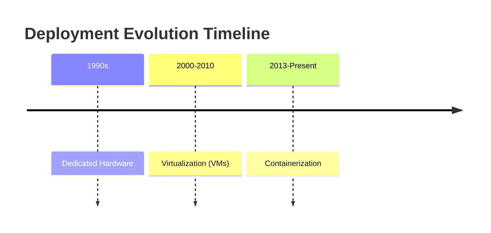
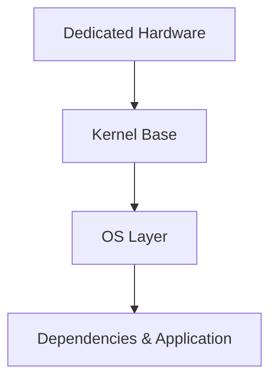
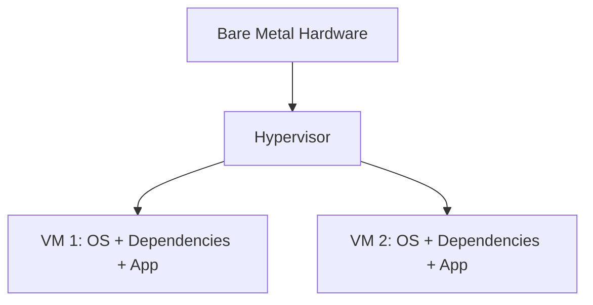
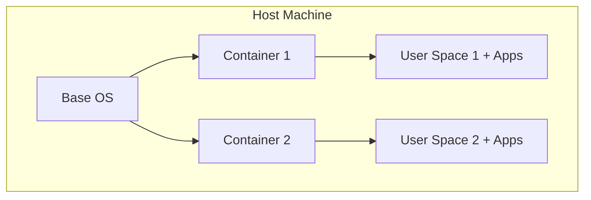
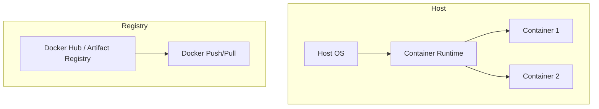

# Session 22: Account Activation and Containerization Fundamentals

## Table of Contents
- [Activating a New Google Cloud Account](#activating-a-new-google-cloud-account)
- [Evolution to Containerization](#evolution-to-containerization)
- [Containerization Concepts](#containerization-concepts)
- [Docker and Container Runtimes](#docker-and-container-runtimes)
- [Lab Demo: Containerizing a Node.js Application](#lab-demo-containerizing-a-nodejs-application)
- [Artifact Registry](#artifact-registry)
- [Deploying Containers to Compute Engine VMs](#deploying-containers-to-compute-engine-vms)
- [Python Containerization Demo](#python-containerization-demo)

## Activating a New Google Cloud Account

### Overview
This section covers the process of activating a new free trial account in Google Cloud to continue working after your existing account's credits near expiry. The session discusses two options for handling account activation and maintaining continuity in projects.

### Key Concepts

- **Trial Account Expiration**: Google Cloud free trial accounts provide $300-$500 in credits for 90 days. When approaching expiry, you need to activate new accounts while preserving existing projects if desired.
- **Account Continuity Options**:
  - **Option 1 (Simple)**: Start fresh with a new Gmail account, creating entirely new projects. Straightforward but loses existing project continuity.
  - **Option 2 (Continuation)**: Maintain existing projects by modifying billing account permissions and switching billing linkages.

### Demonstration: New Account Activation with Continuity

**Prerequisites**:
- New Gmail ID (different from existing one)
- Same credit/debit card
- Access to existing GCP account

**Steps for Option 2**:
1. **Activate New Trial Account**:
   - Go to console.cloud.google.com and start new free trial
   - Use new Gmail ID and same billing info
   - Note: New "My First Project" gets created automatically

2. **Link Existing Account to New Billing Account**:
   - In existing account: Navigate to Billing → Account Management
   - Click "Show Info Panel" 
   - Add new Gmail ID as billing account administrator
   - Add group (optional, for shared admin access)

3. **Switch Billing Account**:
   - Return to old project
   - Go to Billing → Linked Billing Account
   - Click 3-dot menu on old billing account → Change Billing
   - Select new billing account (e.g., October 2024)
   - Verify: Check if warning messages disappear and credits reset

**Commands**:
```bash
# Example billing account change
# This is handled through GCP Console UI, not CLI in this demo
```

**Table: Account Activation Options Comparison**

| Option | Pros | Cons | Use Case |
|--------|------|------|----------|
| New Account (Fresh) | Simple, no configuration | Lose existing projects | Proof-of-concept, non-continuation workflows |
| Continuation (Billing Switch) | Maintains projects/assets | Extra steps, permissions management | Production scenarios, ongoing development |

**GitHub Alert**:
> [!NOTE]
> This approach works for extending free trial access but requires careful billing management. Not recommended for production workloads where dedicated billing accounts are preferred.

## Evolution to Containerization

### Overview
Before diving into containerization concepts, the session provides a historical timeline showing how software deployment evolved from traditional dedicated hardware to modern containerization practices, with Photoshop explaining the necessity of each evolution.

### Evolution Timeline



### Dedicated Hardware Era (1990s-2000)

**Overview**: Early web applications ran on dedicated physical servers, featuring a single web banner application with immediate testing challenges.

**Problems**:
- Hardware procurement took weeks to months  
- Testing required complete environment recreation
- No scalability or portability
- Business disruptions during updates

**Architecture**:


### Virtualization Era (2000s-2013)

**Overview**: Software hypervisors enabled Hardware resource slicing into isolated Virtual Machines.

**Problems Solved**:
- Faster environment replication (minutes vs. months)
- Resource abstraction and sharing
- Independent dependency management

**Architecture**:


**Hypervisor Types**:

| Type | Location | Examples | Performance | Use Cases |
|------|----------|----------|-------------|-----------|
| Type 1 | Bare Metal | VMware ESXi, KVM, Xen | High | Cloud Infrastructure, Enterprise |
| Type 2 | On OS | VirtualBox, VMware Player | Lower | Developer Workstations, Testing |

### Transition to Containerization (2013+)

**Overview**: Containerization addressed virtual machine overhead through isolated user spaces sharing a single kernel while providing complete process isolation.

**Key Advantages**:
- Minimal resource footprint (MB vs. GB)
- Instant startup times
- Complete portability across environments
- Consistent dependency packaging

**Linear Flow**:
```diff
! Web Application → Container Image → Any Environment (dev/prod/cloud)
```

**Table: VM vs Container Comparison**

| Aspect | Virtual Machines | Containers |
|--------|------------------|------------|
| Boot Time | Minutes | Seconds |
| Resource Overhead | 100-500MB OS per VM | MBs (shared kernel) |
| Portability | Tied to hypervisor | Native across platforms |
| Image Size | 1-10GB typical | 10-1000MB typical |

## Containerization Concepts

### Overview
Containerization provides isolated user spaces within a single host operating system, allowing multiple applications with different dependency requirements to run independently while maximizing resource efficiency.

### Core Concepts

**Isolated User Spaces**: Each container runs in its own user space with dedicated libraries and dependencies, preventing conflicts while sharing the host kernel for efficiency.

**Technology Foundation**:
- **System Software Layer**: Container runtimes create isolated environments
- **Host OS:** Provides kernel and base system libraries
- **User Space Isolation**: Separate applications, networking, filesystem mounts

### Key Benefits

- **Consistency**: Applications behave identically across environments
- **Portability**: Works on any system with compatible container runtime
- **Efficiency**: Shared OS resources vs. full VM redundancy
- **Speed**: Sub-second startup and scaling

**Container Anatomy**:


**GitHub Alert**:
> [!IMPORTANT]
> Linux containerization works universally on Linux kernels, but Windows containers require Windows hosts. Cross-platform support exists but with limitations.

## Docker and Container Runtimes

### Overview
Docker revolutionized containerization by providing simple commands (build, push, run) that made containers accessible to developers without deep Linux expertise, transforming a low-level kernel feature into mainstream development tool.

### Docker History and Evolution

**Timeline**:
- **2013**: Docker launch - Made containerization user-friendly
- **2015**: Open Container Initiative (OCI) established
- **2017**: Docker CE (Community Edition) became primary runtime

**Open Container Initiative**: Standard for container formats and runtimes, ensuring interoperability across implementations.

**Popular Container Runtimes**:
- **Docker**: Market leader, complete platform
- **ContainerD**: Lightweight runtime forked from Docker
- **Rocket (rkt)**: Alternative focusing on security
- **LXD**: System container runtime

### Container Runtime Architecture



### Docker Benefits

- **Market Adoption**: 90%+ of container deployments
- **Ecosystem**: Extensive tooling, registries, orchestration
- **Developer Experience**: Simple CLI commands
- **Cross-Platform**: Works on Linux, Windows, macOS

**Table: Development vs Production Usage**

| Aspect | Development | Production |
|--------|-------------|------------|
| Runtime | Docker Desktop | Docker Engine / ContainerD |
| Registry | Local Docker Hub | Private Artifact Registry |
| Orchestration | Docker Compose | Kubernetes |
| Scaling | Manual | Managed Services |

## Lab Demo: Containerizing a Node.js Application

### Overview
This demo walks through containerizing a simple Node.js web application, demonstrating build/deployment processes and Docker CLI commands with a focus on optimization techniques.

### Application Setup

**Application Code (server.js)**:
```javascript
const http = require('http');

const server = http.createServer((req, res) => {
  res.writeHead(200, {'Content-Type': 'text/html'});
  res.end('<h1>Hello World to Containers!</h1>');
});

server.listen(8080, () => {
  console.log('Server running on port 8080');
});
```

### Docker Configuration

**Prerequisites**:
- Google Cloud Shell (pre-installed Docker)
- Dockerfile creation

**Dockerfile (Base Version)**:
```dockerfile
FROM node:20.18.0-alpine
EXPOSE 8080
COPY server.js .
CMD ["node", "server.js"]
```

**Optimization Techniques**:
- **Alpine Linux Base**: Reduces image size from ~1.1GB (Debian) to ~132MB
- **Slim Images**: Always prefer *-alpine or *-slim tags
- **Single Responsibility**: One process per container

### Build, Run, and Optimization

**Commands**:
```bash
# Build container image
time docker build -t myapp:v1 . --no-cache

# List images
docker images

# Run container
docker run -d -p 8080:8080 --name myapp1 myapp:v1

# Monitor running containers
docker ps

# Enter container
docker exec -it <container-id> /bin/sh
```

**Image Size Comparison**:
```diff
! Debian Base: 1.1GB → Alpine Base: 132MB
```

### Interactive Container Exploration

**Key Insights**:
- **Host Environment**: Ubuntu 24.04 (Google Cloud Shell)
- **Container Environment**: Alpine Linux (lightweight distribution)
- **Isolation Level**: Node.js 20.18.0 exists only in container
- **Process Monitoring**: Single Node.js process per container

**GitHub Alert**:
> [!NOTE]
> Containers provide complete process isolation while sharing the host kernel, enabling Python 3.9 and Node.js 20.18.0 to coexist without dependency conflicts.

## Artifact Registry

### Overview
Google Cloud Artifact Registry serves as a modern container registry providing secure, scalable storage for container images with advanced features like vulnerability scanning and granular access controls.

### Migration from Container Registry

- **Container Registry**: Deprecated, blob storage wrapper
- **Artifact Registry**: Full-featured registry with advanced capabilities
- **Regional Deployment**: Minimize latency between workloads and images

### Core Features

**Registry Types**:
- **Docker**: Standard container images
- **NPM, Python, Maven**: Language-specific artifact support  
- **APT, Yum**: OS package repositories
- **Generic**: Arbitrary binary storage

**Advanced Capabilities**:
- **Granular IAM**: Repository-level and organization-level access
- **Vulnerability Scanning**: Automatic CVE detection for supported images
- **Binary Authorization**: Require signed images for production deployment
- **Regional Replication**: Place images close to compute resources

### Image Management Commands

**Setup and Authorization**:
```bash
# Configure Cloud SDK
gcloud init

# Configure Docker authentication
gcloud auth configure-docker

# Build with registry coordinates
docker build -t us-central1-docker.pkg.dev/{project}/{repo}/myapp:v1 .
```

**Push/Pull Operations**:
```bash
# Push to registry
docker push us-central1-docker.pkg.dev/{project}/{repo}/myapp:v1

# Pull from registry
docker pull us-central1-docker.pkg.dev/{project}/{repo}/myapp:v1

# Run trusted image
docker run -d -p 8080:8080 us-central1-docker.pkg.dev/{project}/{repo}/myapp:v1
```

### Access Control Models

**Legacy (Container Registry)**:
- Single bucket-level permissions
- All-or-nothing access

**Modern (Artifact Registry)**:
- Repository-level IAM roles
- Domain-based and group-based permissions
- Service account isolation

```mermaid
graph TD
    A[Project] --> B[Artifact Registry]
    B --> C[Repository 'shared']
    B --> D[Repository 'private']
    C --> E[allusers@example.com: viewer]
    D --> F[Group-only: editor]
```

### Vulnerability Scanning

**Supported Bases**: Alpine, Debian, Ubuntu, CentOS, RHEL
**Unsupported**: Fedora, custom images

**Findings**:
- **Alpine Node.js Image**: 0 critical vulnerabilities  
- **Debian Python Image**: 43 vulnerabilities (some fixable)
- **Large Debian Images**: 558+ vulnerabilities (mix of critical/high)

**Table: Vulnerability Scanning Results**

| Base Image | Vulnerabilities Found | Critical | High | Fixable |
|------------|----------------------|----------|------|---------|
| Alpine Node.js | 0 | 0 | 0 | N/A |
| Slim Debian Python | 43 | 0 | 4 | 2 |
| Full Debian | 558 | 1 | 25 | 0 |

**GitHub Alert**:
> [!WARNING]
> Always use official base images and enable vulnerability scanning. Custom or unsupported images lack security validation.

## Deploying Containers to Compute Engine VMs

### Overview
Artifact Registry provides one-click deployment options to Google Compute Engine VMs, enabling rapid container testing outside of Cloud Shell with external accessibility through firewall rules.

### Container-Optimized OS

**Key Features**:
- Minimal attack surface (pre-hardened Linux kernel)
- Built-in Docker/container runtime
- Automatic security updates
- Aluminum framework for monitoring
- Optimized for container workloads

**vs Standard OS**: Comes with Docker pre-installed, no manual setup required.

### One-Click Deployment

**Steps via Artifact Registry UI**:
1. Navigate to container image
2. Click ⋮ → "Run in Google Cloud" → "Compute Engine"
3. Configure instance parameters:
   - Name, region, machine type
   - Service account with registry access
   - Container details auto-populated
4. Review container specification:
   - Image: Full registry path
   - Restart policy: Always
   - Ports: Auto-detected
5. Create VM with firewall configuration

**Instance Configuration Sample**:
```yaml
# Auto-generated container spec
apiVersion: v1
kind: PodSpec
spec:
  containers:
  - name: myapp
    image: us-central1-docker.pkg.dev/project/shared/myapp:v1
    ports:
    - containerPort: 8080
```

### External Access Configuration

**Firewall Rules**:
- **Default Rules**: Delete overly permissive rules
- **Custom Rules**: Add specific port access (TCP:8080)
- **External IP**: Static or ephemeral for accessibility

**Testing Deployment**:
```bash
# VM-level verification
curl localhost:8080

# External access
curl http://VM_EXTERNAL_IP:8080
```

**GitHub Alert**:
> [!NOTE]
> Container-Optimized OS stores images in /var/lib/docker, not persisted across VM restarts - use Artifact Registry for reproducibility.

### Service Account Permissions

**Required Roles**:
- `artifactregistry.reader` - Pull images
- `artifactregistry.writer` - Push images (optional for runtime)

**IAM Granularity**: Repository-specific access possible, unlike legacy Container Registry's all-or-nothing model.

### Application Accessibility

**URL Patterns**:
- Internal: `http://localhost:8080`
- External: `http://VM_EXTERNAL_IP:8080`

**Result**: Containers running on VMs become publicly accessible, unlike Cloud Shell limitations.

## Python Containerization Demo

### Overview
Extending containerization concepts to Python applications using Flask framework, demonstrating multi-language support and similar build/deploy patterns.

### Python Application Structure

**Key Files**:
- **app.py**: Flask web application
- **requirements.txt**: Python dependencies  
- **Dockerfile_python**: Container build specification

**Sample Application (app.py)**:
```python
from flask import Flask
app = Flask(__name__)

@app.route('/')
def hello():
    return 'Hello World from Python!'

@app.route('/version')
def version():
    return 'Hello World version 1.0'

if __name__ == '__main__':
    app.run(debug=True, host='0.0.0.0', port=8080)
```

**Requirements (requirements.txt)**:
```
Flask==2.3.3
Werkzeug==2.3.6
```

### Optimized Dockerfile

**Multi-Stage Build Approach**:
```dockerfile
FROM python:3.11-slim
WORKDIR /app
COPY requirements.txt .
RUN pip install --no-cache-dir -r requirements.txt
COPY . .
EXPOSE 8080
CMD ["python", "app.py"]
```

**Optimization Features**:
- **Slim Base**: python:3.11-slim (~150MB) vs full Python image
- **Multi-Route Support**: Demonstrates URL routing
- **Dependency Caching**: Install requirements first for layer efficiency

### Build and Deploy Process

**Commands**:
```bash
# Build Python container
docker build -t us-central1-docker.pkg.dev/project/shared/pythonapp:v1 .

# Push to registry  
docker push us-central1-docker.pkg.dev/project/shared/pythonapp:v1

# Deploy to new VM via Artifact Registry UI
# Access at http://NEW_VM_IP:8080/
# Test routes: / and /version
```

**Deployment Results**:
- **VM**: New Compute Engine instance with container-optimized OS
- **Access Patterns**: 
  - `http://VM_IP:8080` → "Hello World from Python!"
  - `http://VM_IP:8080/version` → "Hello World version 1.0"

## Summary

### Key Takeaways
```diff
+ Containerization enables consistent application deployment across environments
+ Docker provides user-friendly containerization for developers  
+ Artifact Registry offers secure, feature-rich container storage
+ Container-Optimized OS streamlines container deployment on GCP
+ Alpine-based images minimize resource usage and security vulnerabilities
- Early container adoption required deep Linux knowledge
- VM-based containers lack orchestration for multi-container workloads
```

### Quick Reference

**Essential Docker Commands**:
```bash
# Build and run container
docker build -t myapp:v1 .
docker run -d -p 8080:8080 --name myapp1 myapp:v1

# Registry operations  
docker tag myapp:v1 gcr.io/project/myapp:v1
docker push gcr.io/project/myapp:v1
docker pull gcr.io/project/myapp:v1

# Container interaction
docker ps -a
docker exec -it <container-id> /bin/sh
docker logs <container-id>
```

**Artifact Registry Setup**:
```bash
# Authentication
gcloud auth configure-docker

# New repository creation
gcloud artifacts repositories create my-repo \
  --repository-format=docker \
  --location=us-central1 \
  --description="Shared container images"
```

### Expert Insight

#### Real-World Application
Containerization powers modern cloud-native architectures, enabling microservices deployment across development, staging, and production environments. Enterprises use Artifact Registry for secure CI/CD pipelines, where containers flow from development builds to Kubernetes clusters.

#### Expert Path
Master Docker multi-stage builds and container security scanning. Learn Kubernetes orchestration to manage multiple containers. Study container networking and storage patterns for production workloads.

#### Common Pitfalls  
- Building large images without optimization (always use Alpine/slim bases)
- Not configuring proper IAM access controls on registries  
- Forgetting firewall rules for containerized applications
- Using latest tags in production (specify version pins)
- Running containers as root processes in production

#### Lesser-Known Facts
- Docker wasn't the first container runtime - Google's cgroups and Linux namespaces date back to 2006
- Container images are actually tarballs under the hood
- Alpine Linux runs container images faster due to smaller attack surface and optimized libc
- Container-Optimized OS updates automatically and restarts containers during maintenance windows

**Mistakes Found and Corrections**:
- "abilites" should be "abilities" in penalties
- "htp" corrected to "http" in web URL context
- "Ubnutu" corrected to "Ubuntu" in OS references  
- "cubectl" corrected to "kubectl" in CLI tool references
- "archa register" corrected to "Artifact Registry"
