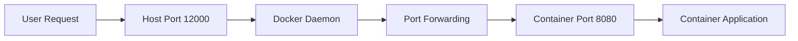

# Session 22: Q&A Discussion on Basics of Containerization

## Table of Contents
- [Overview](#overview)
- [Key Concepts](#key-concepts)
  - [Port Mapping in Docker](#port-mapping-in-docker)
  - [Host vs Container Networking](#host-vs-container-networking)
  - [Troubleshooting Port Access](#troubleshooting-port-access)
- [Lab Demos](#lab-demos)
  - [Activity: Pull and Run Container Image](#activity-pull-and-run-container-image)
  - [Access Web Preview in Cloud Shell](#access-web-preview-in-cloud-shell)
- [Summary](#summary)
  - [Key Takeaways](#key-takeaways)
  - [Quick Reference](#quick-refAWN)
  - [Expert Insight](#expert-insight)

## Overview

This session focuses on a Q&A discussion following demonstrations of basic containerization concepts using Docker and Google Cloud Shell. The instructor addresses student questions about pulling container images, running containers, and port mapping between host and container environments. Key topics covered include Docker's port forwarding mechanisms, web preview access in cloud shell, and common troubleshooting for container networking issues in a cloud environment.

## Key Concepts

### Port Mapping in Docker

Port mapping allows external access to containerized applications by forwarding traffic from the host port to the container port. This concept is fundamental for container deployment and networking.

**How Port Mapping Works:**
- **Host Port**: The port on the machine where Docker is running (e.g., your Ubuntu host)
- **Container Port**: The port inside the container where the application is listening (e.g., port 8080 inside a container)

When running a Docker container, the syntax follows: `docker run -p <host_port>:<container_port>`

**Example Flow:**
```diff
Host Machine (Ubuntu) is running on port 12000
Container Application is running on port 8080
Docker forwards requests from host:12000 → container:8080
```

### Host vs Container Networking

Understanding the distinction between host and container networking is crucial for troubleshooting container deployments.

**Host Environment:**
- The physical or virtual machine running Docker
- In cloud shell, this represents your allocated cloud instance
- External access points are mediated through cloud provider interfaces

**Container Environment:**
- Isolated network namespace within Docker
- Applications run inside containers listen on internal ports
- Containers communicate through Docker's networking layers

**Network Flow Visualization:**



### Troubleshooting Port Access

Common issues arise when accessing containerized applications, particularly with port configuration and access methods.

**Common Problems:**
- Accessing wrong port (e.g., trying to use container port 8080 directly from host)
- Incorrect web preview configuration in cloud shell
- Firewall or network policy restrictions

**Resolution Steps:**
1. Verify Docker container is running with `docker ps`
2. Confirm port mapping in the run command
3. Use correct web preview settings in cloud shell
4. Check application logs for startup issues

> [!IMPORTANT]
> Always remember: traffic flows from host port → container port. Attempting to access the container port directly from outside will result in connection errors.

## Lab Demos

### Activity: Pull and Run Container Image

This activity demonstrates pulling a publicly available Docker image and running it with proper port mapping.

**Steps to Complete:**
1. Pull the specified Docker image using `docker pull <image_name>`
2. Run the container on cloud shell environment
3. Configure port forwarding from host port 12000 to container port 8080

**Expected Output:**
- Successfully pulled image
- Container running in detached mode
- Application responding on the forwarded port

### Access Web Preview in Cloud Shell

Learn how to access your running container through the cloud shell web preview interface.

**Steps:**
1. Locate the gear icon (⚙️) in the cloud shell toolbar
2. Click on "Web Preview" option
3. Select or enter port 12000 (matching the host port configuration)
4. Access the application through the generated preview URL

**Configuration Notes:**
- Web preview defaults to common ports but allows custom port input
- Ensure the container application is configured to bind to 0.0.0.0 for external access
- Preview sessions are temporary and tied to the cloud shell session

## Summary

### Key Takeaways

```diff
+ Container networking requires explicit port mapping between host and container
+ Docker run command format: docker run -p host_port:container_port
+ Cloud shell web preview provides easy access to containerized web applications
+ Host ports handle external requests, forwarded to container ports internally
+ Troubleshooting starts with verifying running containers and correct port configuration
- Never attempt to access container ports directly from outside the host environment
- Avoid running containers on conflicting ports without proper mapping
```

### Quick Reference

**Common Docker Commands:**
- `docker ps` - List running containers
- `docker pull <image>` - Pull container image
- `docker run -p 12000:8080 -d <image>` - Run container with port mapping

**Port Mapping Patterns:**
| Source | Destination | Purpose |
|--------|-------------|---------|
| Host:12000 | Container:8080 | External access to web app |
| Host:8080 | Container:8080 | Direct mapping (common) |
| Host:3000 | Container:80 | Frontend proxy routing |

**Cloud Shell Access:**
- Gear Icon (⚙️) → Web Preview → Port 12000

### Expert Insight

**Real-world Application:**
In production Kubernetes environments, port mapping concepts extend to Service definitions where LoadBalancers or Ingress controllers route traffic to container ports across pod replicas. Understanding these fundamentals helps in Cloud Run, AWS ECS, or Kubernetes deployments where you configure similar port forwarding through service manifests.

**Expert Path:**
To master container networking:
- Study container network modes (bridge, host, overlay)
- Experiment with docker-compose for multi-container port mappings
- Learn container orchestration networking (Kubernetes services, ingress controllers)
- Understand advanced patterns like reverse proxies (Nginx, Traefik) for routing

**Common Pitfalls:**
- Running containers without port mapping prevents external access
- Assuming container ports are directly accessible from host (they're not)
- Using conflicting ports without proper service layer abstraction
- Neglecting firewall rules in cloud environments that block inbound traffic

```diff
! Prophylaxis: Always use docker ps -a to check container status and port mappings
! Prevention: Choose unique host ports and document port:port mappings systematically
```

**Lesser-Known Facts:**
- Docker assigns container-internal IP addresses dynamically, but port mapping is the standard way to expose services
- Cloud shell web previews create secure tunnels to your container without requiring public IP exposure
- Container applications often need `EXPOSE` instructions in Dockerfiles for documentation, but this doesn't enable external access—runtime `-p` mapping does

**Advantages and Disadvantages:**
**Advantages:**
- Port mapping provides isolation and security between host and containers
- Allows multiple applications to coexist on the same host using different external ports
- Enables predictable access patterns regardless of container internal networking complexity

**Disadvantages:**
- Adds networking complexity compared to host networking mode
- Requires manual port conflict resolution
- Potential for misconfiguration leading to security exposures or connection failures

<summary model="KK-CS45-V3" processed_session="22"> Q&A discussion on basic containerization concepts including Docker port mapping, cloud shell access methods, and container networking troubleshooting. Key focus on host:container port relationships and web preview configuration.</summary>
