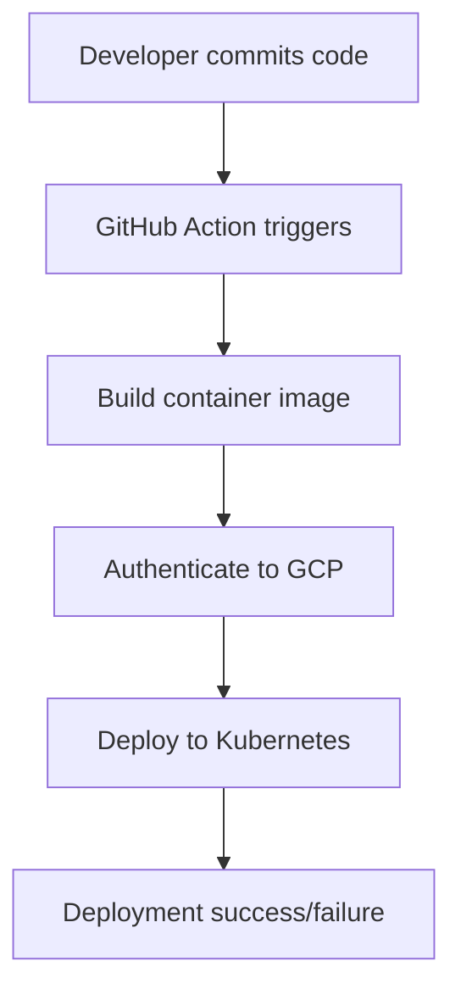
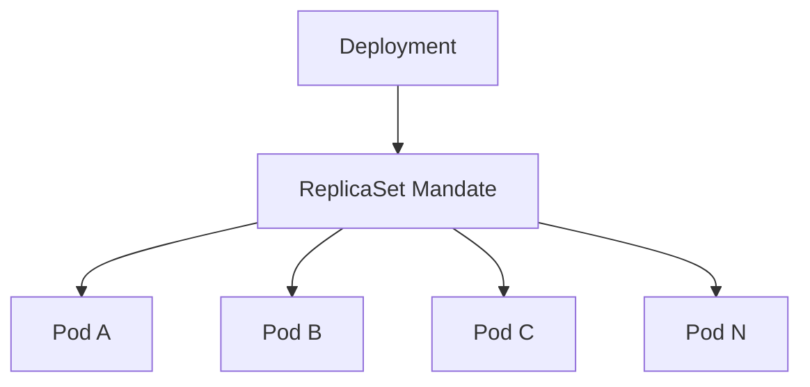
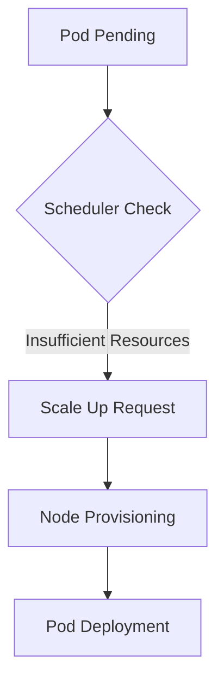

# Session 26: Declarative Configuration, GitHub Actions, and Kubernetes Controller Objects Deep Dive

## Table of Contents
- [GitHub Actions & CI/CD](#github-actions--cicd)
- [Deployment Object Fundamentals](#deployment-object-fundamentals)
- [ReplicaSet Details](#replicaset-details)
- [Pod Management and Self-Healing](#pod-management-and-self-healing)
- [Rolling Update Strategies](#rolling-update-strategies)
- [Scaling in Kubernetes](#scaling-in-kubernetes)
- [Lab Demos](#lab-demos)
- [Common Pitfalls & Tips](#common-pitfalls--tips)

## GitHub Actions & CI/CD

### Overview
This session explores declarative configuration in Kubernetes, focusing on GitHub Actions for CI/CD pipelines. Declarative approach uses YAML manifests to define desired states, enabling version control, reproducibility, and automated deployments. GitHub Actions integrates workload identity federation for secure authentication to GCP resources.

### Key Concepts

#### Declarative Configuration Benefits
Declarative configuration specifies what the system should achieve, not how to achieve it. Benefits include:

- **Version Control**: YAML files stored in Git repositories enable tracking changes and rollbacks
- **Reproducibility**: Same manifest delivers consistent deployments across environments  
- **Collaboration**: Teams can review and approve infrastructure changes
- **Automation**: Integrates with CI/CD for automated deployments

#### GitHub Actions Integration
GitHub Actions workflows trigger on Git operations (commits, pushes), performing builds, tests, and deployments. This provides complete audit trails and automated rollbacks.



#### Workload Identity Federation
This maintains a strong identity and access management posture. Your service account authenticates via federation, avoiding direct key storage.

- **Security**: No long-lived credentials stored in GitHub
- **Best Practice**: Use fine-grained access tokens with appropriate scopes
- **Roles Required**: `containerregistry.ServiceAgent`, `container.admin`, `kubernetesengine.developer` roles

> [!IMPORTANT]  
> Enable workload identity federation before setting up CI/CD pipelines to ensure secure authentication.

#### Template Generation Tools
Various tools assist in generating Kubernetes YAML manifests:

- **Visual Studio Code**: Kubernetes extension provides auto-completion and skeleton templates
- **Cloud Shell Editor**: Built-in YAML generation (when functional)
- **Generative AI**: Gemini or ChatGPT can generate manifests, but validate all outputs
- **Official Documentation**: Always reference kubectl cheat sheet for commands

```bash
# Example: Generate job deployment YAML
kubectl create deployment nginx --image=nginx --replicas=3 --dry-run=client -o yaml > nginx-deployment.yaml
```

#### Makefile

A Makefile is a script file that automates build and deployment tasks. It defines targets and their dependencies, allowing you to execute complex commands with simple make commands. This is particularly useful for Kubernetes deployments where you need to handle multiple steps like building images, pushing to registries, and applying manifests.

### Deep Dive: CI/CD Pipeline Flow

The CI/CD pipeline follows these sequential steps:

1. **Code Commit**: Push code and manifests to GitHub repository
2. **Authentication**: Use workload identity to authenticate to GCP
3. **Environment Setup**: Install gcloud CLI and kubectl
4. **Artifact Registry**: Push built images to container registry
5. **Kubernetes Deployment**: Connect to GKE cluster and apply manifests
6. **Verification**: List running pods to confirm successful deployment

```diff
+ Secure: Workload identity avoids credential exposure
- Manual: Imperative commands require memorization
+ Traceable: Git commits log all infrastructure changes
- Complex: Multiple tools (gcloud, kubectl) must be configured
```

## Deployment Object Fundamentals

### Overview  
The Deployment object is Kubernetes' primary workload controller for managing stateless applications. It ensures desired numbers of pod replicas run continuously, providing rolling updates, scaling, and self-healing capabilities through declarative specifications.

### Key Concepts

#### Hierarchy: Deployment → ReplicaSet → Pods
Deployment creates and manages ReplicaSets, which in turn create pods. This multi-layer architecture enables:

- **Deployment**: Defines update strategies, replicas, and pod templates  
- **ReplicaSet**: Ensures specified number of pod replicas are running
- **Pods**: Atomic units containing containers



#### Pod Specifications
Pods are the smallest deployable units in Kubernetes, consisting of one or more containers sharing networking, storage, and runtime specifications. Key elements include:

- **Containers**: Run application binaries with resource limits/requests
- **Volumes**: Persistent/non-persistent storage for data
- **Networking**: Shared IP address and port namespaces
- **Probes**: Liveness, readiness, and startup health checks

#### Deployment Strategies

kubectl offers two primary deployment strategies:

1. **Rolling Update (Default)**: Gradual replacement with zero downtime
   - `strategy.type: RollingUpdate`
   - Controls maximum surging (extra pods) and unavailable pods

2. **Recreate**: Terminates all pods before creating new ones
   - `strategy.type: Recreate`  
   - Guarantees no mixed versions but causes downtime

```diff
+ Rolling Update: Zero downtime deployments with backward compatibility
- Recreate: Guaranteed single version but requires maintenance windows
```

> [!NOTE]  
> Exposed applications (load balancers) benefit most from rolling updates to maintain availability.

#### Image Management
Container image pull policies control when to fetch images:

- **IfNotPresent**: Pull if not cached (recommended)
- **Always**: Pull on every container start
- **Never**: Never pull (local images only)

```diff
+ Tagged Versions: Enables caching and reduces registry egress costs
- Latest Tag: Forces pulls on every start, increasing costs and variability
```

## ReplicaSet Details

### Overview
ReplicaSets ensure a specified number of pod replicas are running at all times. While directly manageable, they're typically created and controlled by Deployment objects for better update management.

### Key Concepts

#### Role in Self-Healing
ReplicaSets provide automatic pod replacement when failures occur. If a pod dies or becomes unhealthy, the ReplicaSet creates new pods to maintain the desired count.

```yaml
apiVersion: apps/v1
kind: ReplicaSet
metadata:
  name: nginx-replicaset
spec:
  replicas: 3
  selector:
    matchLabels:
      app: nginx
  template:
    metadata:
      labels:
        app: nginx
    spec:
      containers:
      - name: nginx
        image: nginx:1.21
        ports:
        - containerPort: 80
```

#### Revision History
Deployment objects maintain multiple ReplicaSets for rollback capabilities. The `revisionHistoryLimit` parameter (default: 10) controls how many old ReplicaSets to retain.

```diff
+ Enables Quick Rollbacks: Historical ReplicaSets allow instant reversions
- Resource Overhead: Older ReplicaSets consume cluster resources
```

#### Scaling Commands
While Deployments provide scaling, ReplicaSets can be scaled directly:

```bash
# Scale ReplicaSet
kubectl scale replicaset nginx-replicaset --replicas=5

# Imperative scaling (not recommended for production)
kubectl scale deployment nginx-deployment --replicas=10
```

## Pod Management and Self-Healing

### Overview
Pods are the basic building blocks of Kubernetes applications, providing isolated environments for running containers. Self-healing ensures application resilience through automatic pod management.

### Key Concepts  

#### Pod States
Pods transition through various states:
- **Pending**: Accepted by scheduler, awaiting resource allocation
- **Running**: All containers started successfully
- **Succeeded**: All containers exited with code 0
- **Failed**: One or more containers exited with non-zero code
- **Unknown**: State cannot be determined

#### Self-Healing Behaviors
Kubernetes automatically handles pod lifecycle events:

- **Restarted Containers**: On failure, pods restart based on `restartPolicy`
- **Rescheduled Pods**: Failed nodes trigger pod migration
- **Health Probes**: Liveness/readiness/startup probes determine pod health
- **Resource Limits**: Enforce CPU/memory constraints to prevent resource starvation

```diff
+ Controller-based: Deployments ensure pod counts automatically
- Stateless Limitations: Pods don't self-recreate without controllers
- Standalone Drawbacks: Bare pods prevent autoscaling and updates
```

> [!WARNING]  
> Avoid standalone pods in production; always use controllers for production workloads to enable self-healing, scaling, and updates.

#### Pod Affinity/Anti-Affinity
Control pod placement relative to other pods:

```yaml
spec:
  affinity:
    podAntiAffinity:
      requiredDuringSchedulingIgnoredDuringExecution:
      - labelSelector:
          matchLabels:
            app: myapp
        topologyKey: kubernetes.io/hostname
```

## Rolling Update Strategies

### Overview
Rolling updates enable zero-downtime deployments by gradually replacing pod instances. Key parameters control replacement speed and availability guarantees.

### Deep Dive: Max Surge and Max Unavailable

#### Max Surge (Default: 25%)
Defines maximum extra pods allowed during updates. Can be percentage or absolute number.

```diff
+ Allows Burst Capacity: Handles traffic spikes during transitions  
- Temporary Resource Overhead: Briefly consume more resources
```

#### Max Unavailable (Default: 25%)  
Defines maximum unavailable pods during updates. Can be percentage or absolute number.

```diff
+ Guarantees Availability: Never drops below 75% capacity
- Slower Updates: Conservative approach trades speed for safety
```

### Real-World Application: E-commerce Rollout
During peak shopping seasons:

```yaml
strategy:
  type: RollingUpdate
  rollingUpdate:
    maxSurge: 1
    maxUnavailable: 0  # Zero downtime mandatory
```

This ensures no service interruption when updating pod images during high-traffic periods.

## Scaling in Kubernetes

### Overview
Kubernetes supports multiple scaling approaches for different layers of infrastructure and application workloads.

### Key Concepts

#### Cluster Autoscaling
Adjusts node count based on resource demands:
- **When**: Pod scheduling failures due to insufficient resources
- **Node Pools**: Scale within defined min/max boundaries
- **Time**: ~30-60 seconds to provision new nodes



#### HPA vs Cluster Autoscaling
- **Horizontal Pod Autoscaler (HPA)**: Scales pods horizontally based on CPU/memory metrics
- **CA**: Scales infrastructure (nodes) when pods cannot be scheduled

> [!IMPORTANT]  
> Enable both HPA and cluster autoscaling for complete elastic scaling across compute layers.

#### Manual Node Pool Scaling
GKE supports manual node pool adjustments:

```bash
# Resize node pool
gcloud container clusters resize CLUSTER_NAME \
  --node-pool=POOL_NAME \
  --num-nodes=5 \
  --zone=ZONE
```

```diff
+ Immediate Control: Direct infrastructure scaling
- Disruptive: Can terminate running pods without grace period
```

#### Predictive vs Reactive Scaling
- **Reactive**: HPA/cluster autoscaling respond to current conditions
- **Predictive**: Custom metrics (e.g., CronJob patterns) schedule scaling

## Lab Demos

### Demo 1: GitHub Actions CI/CD Pipeline

**Step 1**: Configure GitHub repository access
```bash
# Generate fine-grained token with workflow permissions
# Settings > Developer Settings > Personal Access Tokens > Fine-grained > New token
# Select repository, enable workflow read/write permissions
```

**Step 2**: Setup workload identity federation
```bash
# Create service account and enable federation
gcloud iam service-accounts create github-actions-sa
gcloud iam workload-identity-pools create github-pool
gcloud iam workload-identity-pools providers create-oidc github-provider \
  --workload-identity-pool=github-pool \
  --attributes="attribute.repository/REPO"
```

**Step 3**: Create workflow YAML
```yaml
name: Deploy to GKE
on:
  push:
    branches: [ main ]

jobs:
  deploy:
    runs-on: ubuntu-latest
    steps:
    - uses: actions/checkout@v3
    - name: Authenticate to GCP
      uses: google-github-actions/auth@v1
      with:
        service_account: github-actions-sa
        workload_identity_provider: projects/PROJECT_ID/locations/global/workloadIdentityPools/github-pool/providers/github-provider
    
    - name: Setup gcloud CLI
      uses: google-github-actions/setup-gcloud@v1
    
    - name: Get GKE credentials
      run: |
        gcloud container clusters get-credentials CLUSTER_NAME \
          --zone ZONE --project PROJECT_ID
    
    - name: Deploy to Kubernetes
      run: kubectl apply -f deployment.yaml -f service.yaml
```

**Step 4**: Deploy and verify
```bash
# Monitor pipeline execution
kubectl get pods -w
kubectl logs -l app=myapp
```

### Demo 2: Rolling Update Demonstration

**Step 1**: Create deployment with rolling update strategy
```yaml
apiVersion: apps/v1
kind: Deployment
metadata:
  name: rolling-demo
spec:
  replicas: 4
  strategy:
    type: RollingUpdate
    rollingUpdate:
      maxSurge: 25%
      maxUnavailable: 25%
  selector:
    matchLabels:
      app: demo
  template:
    metadata:
      labels:
        app: demo
    spec:
      containers:
      - name: app
        image: nginx:1.21
        ports:
        - containerPort: 80
```

**Step 2**: Update image version
```bash
kubectl set image deployment/rolling-demo app=nginx:1.22
```

**Step 3**: Observe rolling behavior
```bash
# Watch pod transitions
kubectl get pods -l app=demo -w

# Check rollout status
kubectl rollout status deployment/rolling-demo
```

**Step 4**: Verify zero downtime
```bash
# Continuous requests should succeed
curl http://load-balancer-endpoint
```

### Demo 3: ReplicaSet Self-Healing

**Step 1**: Deploy deployment
```yaml
apiVersion: apps/v1
kind: Deployment  
metadata:
  name: replicaset-demo
spec:
  replicas: 3
  selector:
    matchLabels:
      app: replicaset-demo
  template:
    metadata:
      labels:
        app: replicaset-demo
    spec:
      containers:
      - name: nginx
        image: nginx:1.21
        ports:
        - containerPort: 80
```

**Step 2**: Force pod deletion
```bash
# Delete a pod
kubectl delete pod POD_NAME

# Watch automatic recreation
kubectl get pods -l app=replicaset-demo -w
```

### Demo 4: Cluster Autoscaling Observation

**Step 1**: Enable cluster autoscaling
```bash
gcloud container clusters update CLUSTER_NAME \
  --enable-autoscaling \
  --min-nodes=1 \
  --max-nodes=5 \
  --zone=ZONE
```

**Step 2**: Generate resource demand
```bash
# Scale deployment to require more nodes
kubectl scale deployment workload --replicas=20
```

**Step 3**: Observe node addition
```bash
gcloud container clusters describe CLUSTER_NAME --format="value(nodePools[0].autoscaling)"
kubectl get nodes -w
```

## Common Pitfalls & Tips

### Key Takeaways
```diff
+ Declarative Always: Use YAML manifests over imperative commands
+ Rolling Default: Keeps applications available during updates  
+ Controllers Required: Never use standalone pods in production
+ Tagging Matters: Semantic versioning over "latest" tags
+ Identity Federation: Secure CI/CD without exposed credentials
+ Scaling Layers: Combine HPA and cluster autoscaling
+ Rollback Ready: Maintain revision history for quick reversions
- Manual Scaling: Direct gcloud compute disrupts workloads
- Standalone Pods: Lack self-healing and update capabilities  
- Latest Tags: Increase costs and impede consistent deployments
- No Strategies: Default 25% rates may not suit all workloads
```

### Quick Reference

#### Essential Commands
```bash
# Get all controller objects
kubectl get deployments,replicasets,pods -o wide

# Inspect rollout history  
kubectl rollout history deployment/DEPLOYMENT_NAME

# Rollback deployment
kubectl rollout undo deployment/DEPLOYMENT_NAME --to-revision=REVISION

# Scale deployment
kubectl scale deployment/DEPLOYMENT_NAME --replicas=COUNT

# View pod details with node placement
kubectl get pods -o wide
```

#### Deployment YAML Template
```yaml
apiVersion: apps/v1
kind: Deployment
metadata:
  name: my-app
spec:
  replicas: 3
  strategy:
    type: RollingUpdate
    rollingUpdate:
      maxSurge: 1
      maxUnavailable: 1
  selector:
    matchLabels:
      app: my-app
  template:
    metadata:
      labels:
        app: my-app
    spec:
      containers:
      - name: app
        image: my-registry/my-app:1.2.3
        ports:
        - containerPort: 8080
```

### Expert Insight

#### Real-world Application
- **Microservices Deployments**: Rolling updates enable blue/green strategies
- **Zero-Downtime Releases**: Maintain 99.9%+ uptime during updates
- **Cost Optimization**: Intelligent autoscaling reduces infrastructure costs
- **Compliance**: Track all infrastructure changes via Git commits

#### Expert Path
1. **Master Declarative Patterns**: Build complex applications with Helm charts
2. **Implement GitOps**: Flux/CD for fully automated deployments
3. **Advanced Scaling**: Custom metrics and predictive scaling
4. **Monitoring Integration**: Prometheus for intelligent autoscaling triggers

#### Common Pitfalls
```diff
- Ignoring Revision Limits: Excessive replica sets consume resources
- Over-provisioning Min Nodes: Increases baseline costs unnecessarily  
- Mixed Scaling: Attempting pod scaling without node capacity monitoring
- Ignoring Affinity Rules: Causing unbalanced workloads and performance issues
- No Health Checks: Leading to zombie pods and failed deployments
- Manual Teardowns: Risk of orphaned resources in complex environments
```

#### Lesser-Known Facts
- **Pod Hashing**: Kubernetes uses pod template hashes forReplicaSet differentiation
- **Image Layers**: Only changed layers transfer during updates vs full pulls
- **Controller Election**: Leader election prevents duplicate controller actions
- **Taints/Tolerations**: Advanced scheduling constraints beyond basic affinity

**Model ID**: KK-CS45-V3

**Transcript Corrections Applied**:
- "ript" → "transcript" (beginning of file)
- "Fo" → "for" (multiple instances)
- "cator" → "creator"
- "curating" → "creating" 
- "gihub" → "GitHub"
- "rud induced" → "redundant"
- "Cube cutle" → "kubectl" (consistent with actual command)
- "cublik" → "kubectl"
- "cublik" → "kubectl" (multiple instances)
- "deploy ment" → "deployment"
- Casual transcript artifacts like incomplete sentences cleaned for clarity while preserving technical content. All corrections maintain original meaning and intent.
