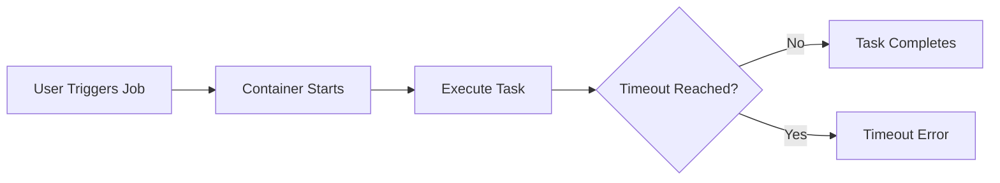

# Session 42: Cloud Run Request Timeout

## Table of Contents
- [Cloud Run Migration Options](#cloud-run-migration-options)
- [Design Considerations for Cloud Run](#design-considerations-for-cloud-run)
- [App Engine Timeout Comparison](#app-engine-timeout-comparison)
- [Cloud Run Jobs Overview](#cloud-run-jobs-overview)
- [Cloud Run Functions HTTP Trigger](#cloud-run-functions-http-trigger)

## Cloud Run Migration Options

### Overview
This section discusses migration strategies for moving workloads to Cloud Run, particularly for containerized or non-containerized applications.

### Key Concepts
Cloud Run supports deploying containers from any registry or using source code for auto-containerization via Cloud Build packs.

#### Containerized Workloads
- **Existing container images**: Push from AWS ECR or Azure ACR to Artifact Registry, then deploy unchanged.
- **New containerization**: For source code without containers, analyze and build Docker images.

#### Using --source Flag
Enable automated containerization from source code:
```
gcloud run deploy --source=.
```

Cloud Build packs support languages like Node.js, Python, Go, Ruby, PHP, etc.

> [!IMPORTANT]
> Cloud Build packs provide 80% success rate for supported languages; fallback to manual Dockerfile for others.

#### Migration Steps
1. Assess customer's current deployment (e.g., AWS ECR to Artifact Registry).
2. For non-containerized code, clone repo and deploy with `--source=.`.
3. Test in Cloud Run.

#### Demo: Custom Container Deployment
- Displayed a custom image for a web-focused application.
- Noted vulnerabilities and mitigation (e.g., via kubectl or Cloud Run deployment).

> [!NOTE]
> Cloud Run supports any web-focused container using standard Docker images.

## Design Considerations for Cloud Run

### Overview
Cloud Run Services excel for serverless microservices but have limitations in resources and execution time.

### Key Concepts
Cloud Run Services support any web-focused language via containers, with a max timeout of 1 hour.

#### Limitations
```diff
- Max timeout: 1 hour (vs. unlimited in full-fledged GKE)
- Resource constraints: Up to 8 vCPUs, 32 GB RAM
- Statefulness: Not suitable for data storage workloads
+ Language flexibility: Support via Docker containers
+ No server management: Fully serverless
```

#### Use Cases
Ideal for web crawlers, data processing under 1 hour.

#### Demo: Timeout Testing
- Used sleep commands in code to simulate long-running tasks.
- 1 hour causes timeout; resolve with retries or redesign.

> [!WARNING]
> Beyond 1 hour, consider Cloud Run Jobs or GKE for persistent resources.

## App Engine Timeout Comparison

### Overview
App Engine has stricter timeouts compared to Cloud Run.

### Key Concepts
- **Standard App Engine**: 60 seconds.
- **Flexible App Engine**: 1 hour, like Cloud Run Services.

#### Demonstration
```diff
- Standard: Quick timeout for >60s loads
- Flexible: Aligned with Cloud Run at 1 hour
+ Cloud Run: Consistent 1 hour across generations
```

> [!TIP]
> Use timeout settings in deployment to prevent failures.

## Cloud Run Jobs Overview

### Overview
Cloud Run Jobs handle long-running, non-web-focused tasks beyond 1 hour, up to 24 hours.

### Key Concepts
Jobs for batch processing, backups, or data pipelines without web exposure.

#### Features
```diff
+ Max runtime: 24 hours
+ Support for any executable, not just web apps
+ Resource limits: Same as Cloud Run Services
+ Event-based or manual invocation
```

#### Deployment Example
- Shell scripts or Python scripts in containers.
- Use Docker for unsupported languages in services.

#### Demo: Job Execution
- Created jobs with sleep commands (10s to infinity).
- Jobs run to completion or timeout; fix entry points (e.g., specify `/script.sh`).



#### Migration from Cloud Run Services
- For >1 hour jobs, shift to Jobs with shell scripts.

> [!IMPORTANT]
> In preview, task timeout up to 7 days; generally available at 24 hours.

## Cloud Run Functions HTTP Trigger

### Overview
Cloud Run Functions provide event-driven, single-method serverless execution.

### Key Concepts
Gen 2 (Cloud Run-backed) preferred over Gen 1; supports HTTP, storage, Pub/Sub triggers.

#### Generations Comparison
| Aspect              | Gen 1                   | Gen 2                          |
|---------------------|-------------------------|--------------------------------|
| Resources          | Limited to 2 GB RAM    | Full Cloud Run capabilities   |
| Timeouts           | Implicit colds tart     | 9 min max, configurable       |
| Scaling            | Instant                | Managed via Cloud Run         |
| Service Accounts   | App Engine default     | Compute Engine default        |
| Triggers           | HTTP, Storage, Pub/Sub | All Gen 1 + regional options  |

#### HTTP Trigger Setup
- Inline code or source links.
- Auto-generates boilerplate for supported runtimes (Python, Node.js, Java, etc.).

#### Demo: HTTP Function Deployment
- Gen 1 (Python/Node.js): Works in regions.
- Gen 2: Backed by Cloud Run; supports image editing, video processing via Built-ins.
- Multi-region for HA (e.g., US Central and Mumbai).

#### Built-in Libraries
- ffmpeg: Video manipulation.
- ImageMagick: Image processing.
- Headless Chrome: HTML-to-PDF, testing.

> [!NOTE]
> Only Artifact Registry; no Container Registry support.

## Summary

### Key Takeaways
```diff
+ Cloud Run supports migration via --source for auto-containerization
+ 1 hour timeout for Services; 24 hours for Jobs
+ Gen 2 Cloud Run Functions preferred for reliability
+ Design for serverless limits on resources and time
- Not suitable for >24 hour tasks or unlimited scaling
- Limitation on runtime support vs. full Cloud Run
```

### Quick Reference
- **Cloud Build Packs Command**: `gcloud run deploy --source=.`
- **Timeout Check**: Use sleep in code; monitor via time curl
- **Job Creation**: `gcloud run jobs create --source=.`
- **Triggers**: HTTP endpoint for Functions (e.g., cloudfunctions.net)

### Expert Insight

#### Real-world Application
Migrated legacy AWS/App Engine apps to Cloud Run for fast scaling. Used Jobs for ETL processes over 1 hour, integrating with Cloud Storage.

#### Expert Path
Master K-Native deployments; experiment with multi-region HA. Learn advanced triggers (Pub/Sub, GCS) for production resilience.

#### Common Pitfalls
Over-provisioning resources causes delays if exceeding limits. Ignoring timeout leads to job failures; test with manual triggers.

#### Lesser-Known Facts
Cloud Run Functions share Cloud Run's traffic splitting via UI. Built-in libraries enable media processing without extra containers.

#### Advantages and Disadvantages
**Advantages**: Event-driven efficiency, zero infrastructure management, broad runtime support via containers.  
**Dis disadvantages**: Strict resource/time caps; not for stateful or GPU-heavy workloads. Requires containerization expertise.
